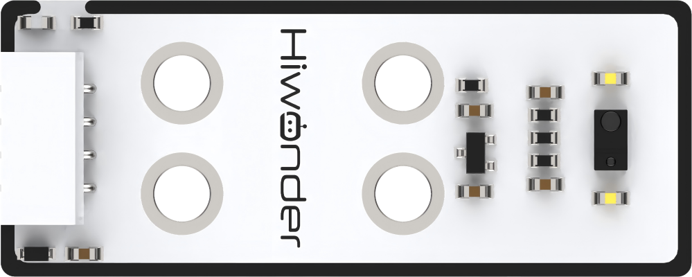
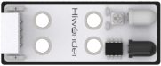
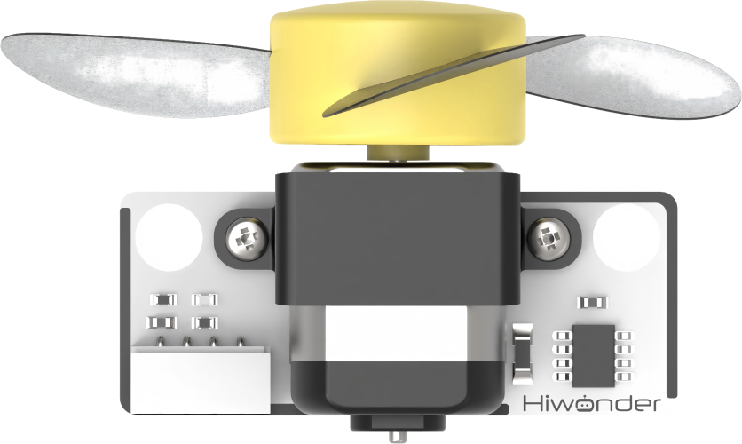
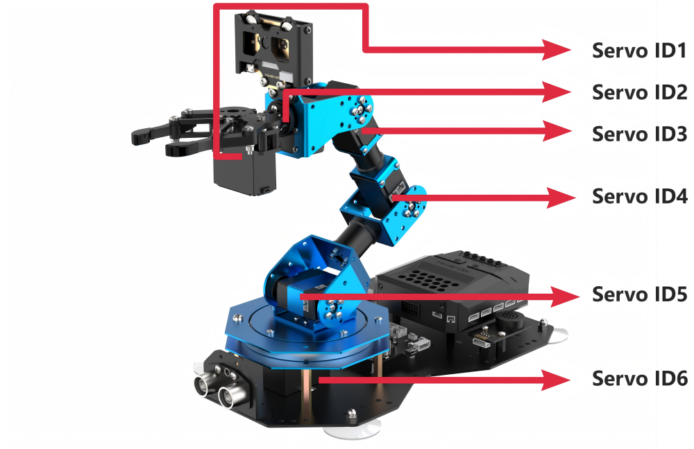

# 1. Get Started

## 1.1 Get to Know xArm AI

**1.1.1 xArm AI Introduction**

The xArm AI robot arm is a 6DOF robotic arm that supports multiple programming methods, including Python, Scratch, and Arduino. Its body integrates six bus servos, which provides temperature and voltage feedback, ensuring strong power and enhanced durability. It comes with a built-in inverse kinematics algorithm, enabling precise

It is also equipped with an ultrasonic sensor, WonderCam vision module and sensor expansion interfaces, enabling creative functionalities such as app control, color sorting and face tracking.

**1.1.2 Usage Notes**

Special attention for using and storing this product:

(1) This product contains small parts and sharp parts, making it unsuitable for children under 12 years old.

(2) Minors should use this product under the supervision and guidance of an adult.

(3) The product contains small and sharp components. Please avoid swallowing or pressing them to prevent injury.

(4) The product contains conductive components. Do not touch them with metal objects when powered on.

(5) Do not forcefully move the robotic arm after power-on to avoid damaging the servos or causing malfunction.

(6) When the product is not in use for an extended period, store it in a cool, dry place.

(7) If the servo's output shaft cannot rotate smoothly due to external resistance while the robot is powered and running, immediately stop the operation! Continued operation may cause stalling, resulting in a sharp increase in current, which could severely damage or burn out the servo.

(8) Damages to the servo caused by stalling, overload, or improper installation due to user error are not covered under warranty. Therefore, please follow proper operational guidelines, avoid overloading, and ensure the safe operation of both the robot and the servos.

**1.1.3 Copyright Statement**

This manual is the property of Shenzhen Hiwonder Technology Co., Ltd. Unauthorized reproduction, copying, translation, or distribution of any content from this manual is prohibited without permission.

If any individual or organization is found to be infringing on the copyright of this reference material, our company reserves the right to pursue legal action.

**1.1.4 Declaimer**

The products described in this manual (including hardware, software, etc.) are provided based on the current state of the robot. Our company strives to ensure the accuracy of the content during the writing process. The material will be periodically reviewed, and we welcome any feedback for improvements from users.

As the product evolves, the content may change accordingly. If you have any problem or require further assistance, please feel fee to contact us at support@hiwonder.com

Additionally, our company will not be held responsible for any damage or malfunction caused by using the product in extreme conditions, unless explicitly stated by us for such purposes.

## 1.2 Packing List

(1) Starter Kit

| **No.** |      **Components**       | **Quantity** |                                   **Picture**                                   |
|:-------:| :-----------------------: | :----------: |:-------------------------------------------------------------------------------:|
|    1    |          xArm AI          |      1       |  |
|    2    | 7.5V 6A DC power adapter  |      1       |  |
|    3    |  100 cm micro-USB cable   |      1       |  |
|    4    |    Wireless controller    |      1       |  |
|    5    |  Glowy ultrasonic sensor  |      1       |  |
|    6    | Ultrasonic sensor bracket |      1       |  |
|    7    |       Color sensor        |      1       |  |
|    8    |    Dot matrix  module     |      1       |  |
|    9    |     4*4 cm EVA blocks     |      4       |                        |
|   10    |            Map            |      1       |                       |
|   11    |        4Pin wires         |      3       |                       |
|   12    |        Suction cup        |      4       |                       |
|   13    |       Accessory bag       |      1       |                       |
|   14    |        User Manual        |      1       |                       |

(2) Standard Kit

| **No.** |             **Components**             | **Quantity** |                                              **Picture**                                              |
|:-------:| :------------------------------------: | :----------: |:-----------------------------------------------------------------------------------------------------:|
|    1    |          xArm AI          |      1       |                        |
|    2    | 7.5V 6A DC power adapter  |      1       |                        |
|    3    |  100 cm micro-USB cable   |      1       |                        |
|    4    |    Wireless controller    |      1       |                        |
|    5    |  Glowy ultrasonic sensor  |      1       |                        |
|    6    | Ultrasonic sensor bracket |      1       |                        |
|    7    |       Color sensor        |      1       |                        |
|    8    |    Dot matrix  module     |      1       |                        |
|    9    |     4*4 cm EVA blocks     |      4       |  |
|   10    |            Map            |      1       |                       |
|   11    |        4Pin wires         |      3       |                                           |
|   12    |        Suction cup        |      4       |                       |
|   13    |       Accessory bag       |      1       |                                             |
|   14    |        WonderCam vision module         |      1       |                        |
|   15    |           100cm Type C Cable           |      1       |                        |
|   16    |           4*4 cm Waste cards           |      1       |                        |
|   17    |              4*4 cm Tags               |      4       |                        |
|   18    | WonderEcho AI vioce interaction module |      1       |                        |
|   19    |                  Tape                  |      1       |                                             |
|   20    |              User Manual               |      1       |                       |

(3) Advanced Kit

| **No.** |         **Components**          | **Quantity** |                                              **Picture**                                              |
| :-----: | :-----------------------------: | :----------: |:-----------------------------------------------------------------------------------------------------:|
| 1       |          xArm AI          |      1       |                        |
| 2       | 7.5V 6A DC power adapter  |      1       |                        |
| 3       |  100 cm micro-USB cable   |      1       |                        |
| 4       |    Wireless controller    |      1       |                        |
| 5       |  Glowy ultrasonic sensor  |      1       |                        |
| 6       | Ultrasonic sensor bracket |      1       |                        |
| 7       |       Color sensor        |      1       |                        |
| 8       |    Dot matrix  module     |      1       |                        |
| 9       |     4*4 cm EVA blocks     |      4       |  |
| 10      |            Map            |      1       |                       |
| 11      |        4Pin wires         |      3       |                                           |
| 12      |        Suction cup        |      4       |                       |
| 13      |       Accessory bag       |      1       |                     |
|   14    |        WonderCam vision module         |      1       |                        |
|   15    |           100cm Type C Cable           |      1       |                        |
|   16    |           4*4 cm Waste cards           |      1       |                        |
|   17    |              4*4 cm Tags               |      4       |                        |
|   18    | WonderEcho AI vioce interaction module |      1       |                        |
|   19   |                  Tape                  |      1       |                        |
|   20    |          Touch Sensor           |      1       |                        |
|   21    |   Obstacle avoidance sensors    |      1       |                        |
|   22    |          Light sensor           |      1       |                        |
|   23    |       Acceleration sensor       |      1       |                        |
|   24    | Temperature and humidity sensor |      1       |                        |
|   25    |           Fan module            |      1       |                        |
|   26    |         sensor bracket          |      1       |                        |
|   27   |           User manual           |      1       |                       |

## 1.3 Introduction to Servo and Controller

**1.3.1 Bus Servo Introduction**

The bus servo is a derivative of the digital servo, but unlike traditional PWM digital servos, it communicates through an asynchronous serial bus. Control is achieved by the sending and receiving of the command packets, making it a closed-loop control system. Based on this characteristic, bus servos can be connected in series, simplifying the wiring and reducing the use of serial ports.

For this reason, when connecting bus servos, each servo needs to have its ID set in advance. Otherwise, it will be impossible to differentiate between them during control. In this way, when communicating, we can send instructions to the bus servos, such as: **"Rotate ID1 servo by 30 degrees,"** or **"Rotate ID2 servo by 40 degrees,"** etc.

The bus servos use high-precision potentiometers internally. Compared to PWM servos, they not only provide feedback on position, temperature, voltage, and other information but also have excellent precision and linearity. This results in more stable robot operations and significantly extends the lifespan of the servos.

Additionally, it is required to adjust the servo to the neutral position before assembly.

The neutral position of the servo refers to its initial position of the servo, which is regarded as **"zero point"** for both positive and negative angle rotations. Hence, the above step must be performed.

This is because when the servo rotates, the rotating components drive the potentiometer, and the software assumes the neural position as **"zero point".** If this is not done, the potentiometer may enter a **"blind zone,"** causing the entire system to malfunction. As a result, the robot may experience issues such as failing to reach the specified angles or inconsistencies in the corresponding action groups.

:::{Note}

* All servos on xArm AI have been been pre-configured with corresponding IDs and set to their neutral position while assembling, so no further adjustments are needed. 

* The communication protocol for the bus servos can also be found in "[**7. Serial Communication Practical Course**](https://docs.hiwonder.com/projects/xArm-Ai/en/latest/docs/7.Serial_Communication_Course.html)".

:::

**1.3.2 Servo ID Distribution**

The distribution of servos on the xArm AI body is as follow:

The key specifications for the servo models used on robot arm are outlined below.

<table  class="docutils-nobg" border="1" style="width:100%">
<tbody>
<tr>
<td style="text-align: center;"><strong>Servo model</strong></td>
<td style="text-align: center;"><strong>Rotate speed</strong></td>
<td style="text-align: center;"><strong>Torque</strong></td>
<td style="text-align: center;"><strong>Data Feedback</strong></td>
</tr>
<tr>
<td style="text-align: center;">LX-15D</td>
<td style="text-align: center;">
0.23sec/60°

7.4v
</td>
<td style="text-align: center;">
15kg.cm 6v

17kg.cm 7.4v
</td>
<td rowspan="4" style="text-align: center;">Temperature, current voltage, position</td>
</tr>
<tr>
<td style="text-align: center;">LX-225</td>
<td style="text-align: center;">
0.23sec/60°

7.4v
</td>
<td style="text-align: center;">25kg.cm 7.4v</td>
</tr>
<tr>
<td style="text-align: center;">HTS-16L</td>
<td style="text-align: center;">
0.23sec/60°

7.4v
</td>
<td style="text-align: center;">16kg.cm 7.4v</td>
</tr>
<tr>
<td style="text-align: center;">HX-06L</td>
<td style="text-align: center;">
0.23sec/60°

7.4v
</td>
<td style="text-align: center;">6kg.cm 7.4v</td>
</tr>
</tbody>
</table>

* **Controller Introduction**

(1) Servo Controller

The xArm AI servo controller adopts the MM32F103CBT6 as its main controller, responsible for driving the servos. It can store action group files and supports offline execution of action groups (Action group No.100 is specially designated for downloading action groups for offline execution). Collaborating with the ESP32 multifunctional expansion board (CoreX controller), it forms a dual-brain architecture, enabling easy and efficient secondary development and function expansion.

<table  class="docutils-nobg" style="margin:0 auto" border="1">
<colgroup>
<col style="width: 26%" />
<col style="width: 24%" />
<col style="width: 24%" />
<col style="width: 24%" />
</colgroup>
<tbody>
<tr>
<td style="text-align: center;"><strong>No.</strong></td>
<td style="text-align: center;"><strong>Component Name</strong></td>
<td style="text-align: center;"><strong>No.</strong></td>
<td style="text-align: center;"><strong>Component Name</strong></td>
</tr>
<tr>
<td style="text-align: center;">1</td>
<td style="text-align: center;">USB port(for connecting PS2 wireless controller receiver)</td>
<td style="text-align: center;">7</td>
<td style="text-align: center;">Bluetooth control (for app control)</td>
</tr>
<tr>
<td style="text-align: center;">2</td>
<td style="text-align: center;">Buzzer</td>
<td style="text-align: center;">8</td>
<td style="text-align: center;">7.5V 6A power adapter port</td>
</tr>
<tr>
<td style="text-align: center;">3</td>
<td style="text-align: center;">Micro USB port (connecting to PC)</td>
<td style="text-align: center;">9</td>
<td style="text-align: center;">Battery port (support 7.4V lithium battery)</td>
</tr>
<tr>
<td style="text-align: center;">4</td>
<td style="text-align: center;">Serial port (for communication with ESP32 multifunctional expansion board)</td>
<td style="text-align: center;">10</td>
<td style="text-align: center;">Power switch</td>
</tr>
<tr>
<td style="text-align: center;">5</td>
<td style="text-align: center;">
Program button

Used for offline action group program)
</td>
<td style="text-align: center;">11</td>
<td style="text-align: center;">Bus servo port</td>
</tr>
<tr>
<td style="text-align: center;">6</td>
<td style="text-align: center;">Run button (for executing action group offline)</td>
<td style="text-align: center;"></td>
<td style="text-align: center;"></td>
</tr>
</tbody>
</table>
(2) CoreX Controller

The combination of CoreX controller and servo controller is primarily used for secondary development projects. It features onboard PWM servo interfaces, motor interfaces, and programmable buttons. Additionally, it includes built-in RGB lights, a sound sensor, infrared transmitter/receiver, a buzzer, and other electronic modules. Multiple sensor interfaces are reserved, utilizing a unified 4-PIN anti-reverse connector, ensuring strong expandability.

<table  class="docutils-nobg" style="margin:0 auto" border="1">
<colgroup>
<col style="width: 36%" />
<col style="width: 63%" />
</colgroup>
<tbody>
<tr>
<td style="text-align: center;"><strong>No.</strong></td>
<td style="text-align: center;"><strong>Function</strong></td>
</tr>
<tr>
<td style="text-align: center;">1、2、6</td>
<td style="text-align: center;">Analog signal sensor port</td>
</tr>
<tr>
<td style="text-align: center;">3、4、5、9</td>
<td style="text-align: center;">IIC communication port</td>
</tr>
<tr>
<td style="text-align: center;">8</td>
<td style="text-align: center;">Digital signal sensor port</td>
</tr>
<tr>
<td style="text-align: center;">7</td>
<td style="text-align: center;">Serial communication port</td>
</tr>
<tr>
<td style="text-align: center;">10</td>
<td style="text-align: center;">Serial servo port</td>
</tr>
<tr>
<td style="text-align: center;">11、17</td>
<td style="text-align: center;">DC motor port</td>
</tr>
<tr>
<td style="text-align: center;">12</td>
<td style="text-align: center;">Infrared receiving component</td>
</tr>
<tr>
<td style="text-align: center;">13、15</td>
<td style="text-align: center;">Motor port with speed encoder</td>
</tr>
<tr>
<td style="text-align: center;">16</td>
<td style="text-align: left;">Infrared emitting component</td>
</tr>
<tr>
<td style="text-align: center;">14</td>
<td style="text-align: left;">
PWM servo port (from top to bottom,

corresponding to "-", " +" and " S")

("S" represents the signal cable, and "-" represents the power negative terminal.)

("+" on servo ports 1 and 2 provides 5V output.)

("+" on servo ports 3, 4, and 5 provides power supply output.)
</td>
</tr>
<tr>
<td style="text-align: center;">18</td>
<td style="text-align: center;">Power port</td>
</tr>
<tr>
<td style="text-align: center;">19</td>
<td style="text-align: center;">Switch</td>
</tr>
<tr>
<td style="text-align: center;">20</td>
<td style="text-align: left;">Micro USB port (for uploading code)</td>
</tr>
</tbody>
</table>
## 1.4 Accessory Assembly & Notices

**1.4.1 Assembly & Wiring**

(1) Align the suction cups with the holes on bottom plate, and tighten them clockwise using nuts.

(2) Attach the sensor bracket to the bottom plate using M4-8 screws and M4 nuts, then mount the ultrasonic sensor onto the bracket using M4\*6 screws.

(3) Last, use a 300mm 4PIN cable to connect the ultrasonic sensor to the port 4 on CoreX controller.

**1.4.2 Power-on Instruction**

Connect the 7.5V 6A power adapter to the PC port of the servo controller, and plug the other end to external power. Then, switch the power buttons on both the servo controller and CoreX controller to the **"ON"** position, and wait for the robotic arm to restore its initial posture.

**1.4.3 Usage Guidelines**

(1) Please use the provided power adapter for power supply, as using an incompatible adapter may cause the controller to burn out.

(2) While the robotic arm is in operation, please keep your face, eyes, and other body parts at a safe distance. Do not place your fingers within the moving range of the device's joints to avoid injury. Also, be cautious of the arm falling from high places or edges.

(3) If the robotic arm operates for an extended period, the servos may heat up. Allow the robotic arm to remain idle until the servos cool down before resuming operation.

**Disclaimer**: Our company will not be held responsible for any product damage, economic loss, or safety incidents caused by failure to follow the **"Usage Guidelines"** outlined in this manual.
