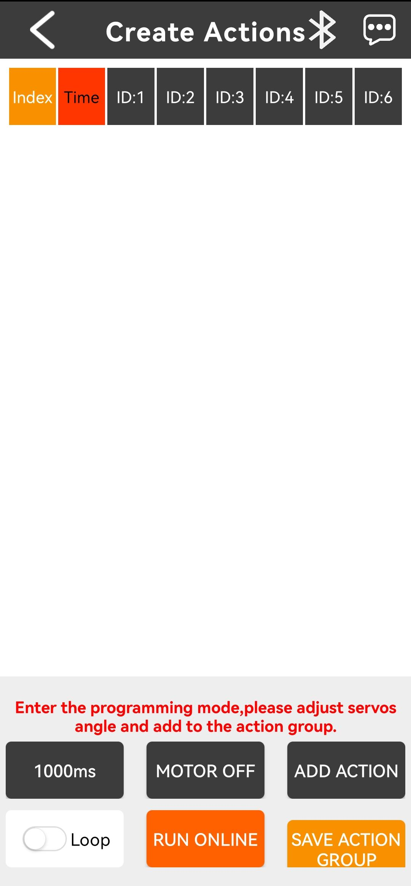
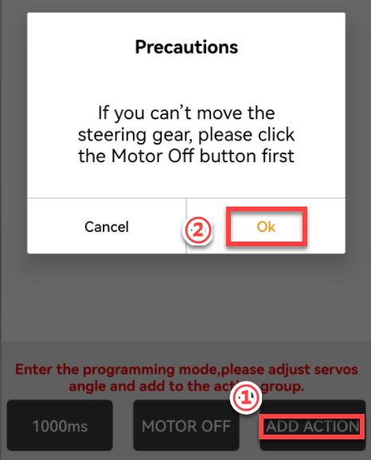

# 2. Remote Control

## 2.1 PS2 Wireless Controller Control

### 2.1.1 Preparations

**Step 1:** Connect the wireless controller receiver to the control board as pictured:

:::{Note}

the received is pre-installed on the servo control board. Users only need to check and confirm whether it is connected properly, as shown in the picture below.

:::

**Step 2:** Prepare two AAA batteries. Take off the back cover of the handle and install the batteries into the battery slot.

### 2.1.2 Device Connection

**Step 1:** Switch on xArm AI robotic arm.

**Step 2:** Turn on the PS2 wireless controller. At this time, two LED lights (red and green) of the controller will flash simultaneously.

**Step 3:** Wait for a few seconds. xArm AI will automatically pair with it. Two LED lights will keep on after pairing . If only the green light or the red light lights up after switching on, you can press “MODE” button.

**Step 4:** If fail to connect, please turn off the robotic arm and PS2 wireless controller first, and then repeat the previous steps to operate.

Sleep mode: If do not connect the PS2 wireless controller to the robotic arm in 30 seconds after switching on it, or have no operation within 5 minutes after connection, the controller will enter sleep mode. To restart the handle, you can press “START” button.

### 2.1.3 Mode Introduction

There are two modes for PS2 wireless controller control: action group mode and single servo mode. The controller defaults to action group mode after connection.

Action Group Mode: Press buttons to call corresponding action groups

Single Servo Mode: Press the corresponding button to control the rotation of each servo on robotic arm.

Two modes switching method: Press **“SELECT”** button first without releasing, and then press **“START”** button. You can release your hand until hearing the prompt sound, which means the robotic arm has been switched from **“action group mode”** to **“single servo mode”**.

### 2.1.4 Button Instruction

The instruction for action group mode is outlined in the table below:

|                          **Button**                          |          **Function**           |
| :----------------------------------------------------------: | :-----------------------------: |
|                            START                             | Execute No.0 action group once. |
|                              ↑                               | Execute No.1 action group once  |
|                              ↓                               | Execute No.2 action group once  |
|                              ←                               | Execute No.3 action group once  |
|                              →                               | Execute No.4 action group once  |
|  | Execute No.5 action group once  |
|                              ×                               | Execute No.6 action group once  |
|  | Execute No.7 action group once  |
|                              ○                               | Execute No.8 action group once  |
|                              L1                              | Execute No.9 action group once  |

The instruction for single servo mode is outlined in the table below:

<table  class="docutils-nobg" style="margin:0 auto" border="1">
  <tr>
    <th style="text-align: center">Button</th>
    <th style="text-align: center">Function</th>
    <th style="text-align: center">Servo</th>
  </tr>
  <tr>
    <td style="text-align: center">START</td>
    <td>All servos reset to the initial position and the robotic arm stands straightly.</td>
    <td style="text-align: center">No.1-No.6 servo</td>
  </tr>
  <tr>
    <td style="text-align: center">L2</td>
    <td>Gripper close</td>
    <td rowspan="2" style="text-align: center">No.1 servo</td>
  </tr>
  <tr>
    <td style="text-align: center">R2</td>
    <td>Gripper open</td>
  </tr>
  <tr>
    <td style="text-align: center">R1</td>
    <td>Turn left</td>
    <td rowspan="2" style="text-align: center">No.2 servo</td>
  </tr>
  <tr>
    <td style="text-align: center">L1</td>
    <td>Turn right</td>
  </tr>
  <tr>
    <td style="text-align: center"></td>
    <td>Turn forward</td>
    <td rowspan="2" style="text-align: center">No.3 servo</td>
  </tr>
  <tr>
    <td style="text-align: center">○</td>
    <td>Turn backward</td>
  </tr>
  <tr>
    <td style="text-align: center"></td>
    <td>Turn forward</td>
    <td rowspan="2" style="text-align: center">No.4 servo</td>
  </tr>
  <tr>
    <td style="text-align: center">×</td>
    <td>Turn backward</td>
  </tr>
  <tr>
    <td style="text-align: center">↑</td>
    <td>Turn forward</td>
    <td rowspan="2" style="text-align: center">No.5 servo</td>
  </tr>
  <tr>
    <td style="text-align: center">↓</td>
    <td>Turn backward</td>
  </tr>
  <tr>
    <td style="text-align: center">←</td>
    <td>Turn left</td>
    <td rowspan="2" style="text-align: center">No.6 servo</td>
  </tr>
  <tr>
    <td style="text-align: center">→</td>
    <td>Turn right</td>
  </tr>
</table>

## 2.2 APP Control

### 2.2.1 APP Installation and Connection

:::{Note}

The xArm AI comes with a pre-installed program for App control, allowed for direct use.

:::

* **APP Installation**

**iOS user:** search for [Wonderbot]() in the App Store to download.

**Android user:** transfer [Wonderbot]() to your smart phone to install.

* **Device Connection**

:::{Note}

* Please enable the Bluetooth and GPS service before opening the APP.

* Please pair and connect the device using the Bluetooth button within the app interface. Do not pair it through your phone's settings using a passkey.

:::

(1) Turn on xArm AI.

(2) Open **“Wonderbot”** on your mobile. Tap on to select **“xArm AI.”**

(3) After selecting the robot model, users enter the **“Mode Selection”** interface and tap **“Robot control”** function. Click the flashing Bluetooth icon , locate **“xArm”** in the Bluetooth list for connection.

:::{Note}

If “xArm AI” isn’t found in the Bluetooth list at first, please click “research” to search for the device.

:::

(4) Once connected, the Bluetooth icon in the top right corner will stay on.

### 2.2.2 APP Control

The APP supports three modes, including **“Robot remote control”,** **“Create actions”,** and **“My actions.”** This section will illustrate the use of three modes.

|                           **Icon**                           |                         **Function**                         |
| :----------------------------------------------------------: | :----------------------------------------------------------: |
|  |       Go back to the robot model selection interface.        |
|  | Robot remote control: users can control each servo or execute the preset action groups. |
|  | Action Creation Mode: In this mode, users can program action groups within the app. |
|  | My action mode: Used to store the custom action group files for reviewing and invoking. |
|  | Used for Bluetooth connection.The icon flashes while Bluetooth is not connected, and stays on once connected. |
|  |                     For more information                     |

* **Remote Robot Control** 

:::{Note}

Action groups NO.0 to 9 have been pre-downloaded at factory.

:::

In robot remote control mode, the buttons and sliders can be used to execute the movements of the robotic arm's joints. The interface is divided into two parts, as shown in the image below:

(1) Menu bar

|                           **Icon**                           |                         **Function**                         |
| :----------------------------------------------------------: | :----------------------------------------------------------: |
|  |       Go back to the robot model selection interface.        |
|  | Used for Bluetooth connection.The icon flashes while Bluetooth is not connected, and stays on once connected. |
|  |                    For more information.                     |
|  |              Display the current working mode.               |

(2) Control Area

<table  class="docutils-nobg" style="margin:0 auto" border="1">
<colgroup>
<col style="width: 50%" />
<col style="width: 50%" />
</colgroup>
<tbody>
<tr>
<td style="text-align: center;"><strong>Icon</strong></td>
<td style="text-align: center;"><strong>Function</strong></td>
</tr>
<tr>
<td style="text-align: center;"></td>
<td style="text-align: center;">Reflect the current real-time posture of the robotic arm, allowing users to adjust and compare the effects.</td>
</tr>
<tr>
<td style="text-align: center;"></td>
<td style="text-align: left;">
Servo Control Area: users can control the position value of a single servo. Following methods are for your reference:

Drag the central slider to either side to change the servo position value.

Click or press and hold  to increase or decrease the servo position value.
</td>
</tr>
<tr>
<td style="text-align: center;"></td>
<td style="text-align: left;">User can click this button to enter the preset action group invocation interface.</td>
</tr>
<tr>
<td style="text-align: center;"></td>
<td style="text-align: left;">After clicking, the robotic arm moves vertically upward, and all servo position values are reset to 500.</td>
</tr>
</tbody>
</table>

(3) Preset Action Group Invocation Interface

① This interface displays custom action groups. Users can click the "Add" button to create a new custom action group.

:::{Note}

The **“custom action groups”** mentioned here are action groups downloaded into the servo control board. These are not interchangeable with the action groups created by the user through the app in the **"My Actions"** mode.

:::

② For example, in the image above, assign a new name to the pre-downloaded No.0 action group on the servo control board. Then, click **"OK."**

③ Afterward, invoke the No.0 action group in the "Preset Action Group Invocation Interface" using the assigned action group action name.

* **Create Action**

In “Create Acton” Mode, users can create actions by manually rotating the robotic arm, moving each joint to any angle and saving it. Multiple actions can be created and then combined into a sequence, which can be saved as an action group within the app.

:::{Note}

* After saving the action group, users can view it in"My Actions" mode.

* The action group files saved in this mode are stored within the app, but are not downloaded into the servo control board.

  :::

<table  class="docutils-nobg" style="margin:0 auto" border="1">
<colgroup>
<col style="width: 49%" />
<col style="width: 50%" />
</colgroup>
<tbody>
<tr>
<td style="text-align: center;">Icon</td>
<td style="text-align: center;">Function</td>
</tr>
<tr>
<td style="text-align: center;"></td>
<td style="text-align: left;">
The action group data table is shown on the left. The table header includes:

<strong>"Sequence"</strong>: The action number within the action group.

<strong>"Time"</strong>: The running time of the action.

<strong>"ID:X"</strong>: The corresponding servo position value.
</td>
</tr>
<tr>
<td style="text-align: center;"></td>
<td style="text-align: center;">The running time of the next action.</td>
</tr>
<tr>
<td style="text-align: center;"></td>
<td style="text-align: center;">After clicking, the servos lose power and become idle. Only at this point can users manually move the joints of the servos to program the action group.</td>
</tr>
<tr>
<td style="text-align: center;"></td>
<td style="text-align: center;">After clicking, the current posture of the robotic arm (the position values of each servo) will be recorded as a new action.</td>
</tr>
<tr>
<td style="text-align: center;"></td>
<td style="text-align: center;">After clicking, if you click "Run Online," the robotic arm will repeatedly execute the action group (all the actions in the list).</td>
</tr>
<tr>
<td style="text-align: center;"></td>
<td style="text-align: left;">Click it to run the action group once.If the "<strong>Loop</strong>" switch is turned on, the action group will repeatedly execute the actions in the list.</td>
</tr>
<tr>
<td style="text-align: center;"></td>
<td style="text-align: left;">Combine the actions in the current list into a single action group file and save it locally within the app.</td>
</tr>
</tbody>
</table>
Action Group Creation Steps:

(1) Click **“Motor Off,”** then click **"OK"** to power off the servos.

:::{Note}

The robotic arm cannot be manually moved for action group programming until this step is completed.

:::

(2) Click the icon next to "1000ms" to confirm the execution time (in ms) for the new action. Enter the time in the pop-up window, then click "OK."

(3) Users can move the robotic arm to any desired posture. After positioning, click "**Add Action**." The software will read the current position values of each servo and save them as a new action. The new action will automatically be added to the last row of the current list.

(4) **(Optional)** If the user wants to modify a previously created action in the action group list, simply long-press on the action in the list. A modification options pop-up will appear automatically, as shown in the image below:

|                           **Icon**                           |                         **Function**                         |
| :----------------------------------------------------------: | :----------------------------------------------------------: |
|  | Copy the position values of each servo and the execution time of the selected action to the clipboard. |
|  | Overwrite the position values of each servo and the execution time in the selected action with the values copied from other actions in the clipboard. |
|  |      Redefine the running time of the selected action.       |
|  | After clicking, follow the instructions in the pop-up window. Move the robotic arm to the desired posture manually, then click "**OK**." The software will read the current position values of each servo and overwrite the selected action with these values. |
|  |    Remove the current action from the action group list.     |

(5) **(Optional)** After all the actions in the action group are created, users can have the robotic arm execute the actions again to evaluate the results.

Step1 : Execute a specific action in the action group: Click on the action in the list, and the servos on the robotic arm will move to the specified positions within the time defined for that action.

Step2 : Execute the entire action group: Click "**Run Online**" (see the image below at position ①), and the robotic arm will run the entire action group once. To loop the action group, first turn on the "Loop" switch (see position ② in the image below), then click "**Loop**" again, and the robotic arm will repeatedly execute the action group.

During the execution of the action group, as shown in the image below, the action highlighted in the yellow box within the arrow indicates the current action being executed by the robotic arm. You can click "**Stop**" to interrupt the execution of the action group.

(6) Click the "**Save Action Group**" icon. In the pop-up window, name the action group and click "OK" to complete the entire process of creating the action group.

:::{Note}

The saved action group can be viewed in the **"My Actions"** mode, as explained below.

:::

* **My Action**

In "**My Actions**" mode, users can find the action groups previously created in "**Create Action**" mode and edit them accordingly.

For example, using the **"Create Action Group 1"** icon:

(1) **"Duration"** refers to the total time required for the action group to execute all actions. Click to execute the action group once; click to delete the current action group.

(2) Long press the action group icon to bring up the following pop-up window:

(3) In the pop-up window, you can modify the name of the action group.

(4) A short press on the action group icon will redirect you to the "**Create Action**" mode, where the action group file will open. In this mode, users can perform further editing on the action group file.