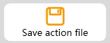
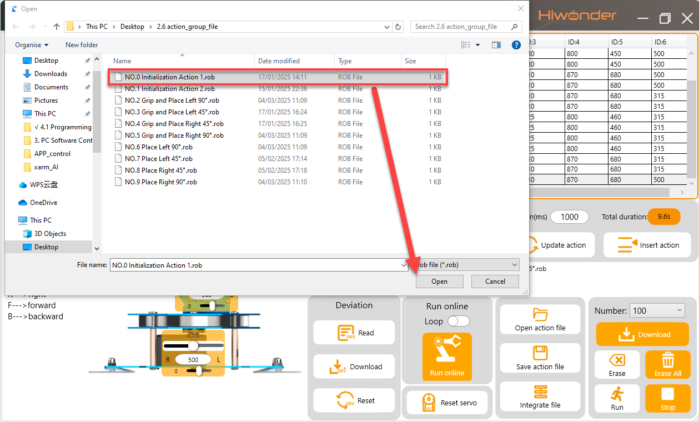
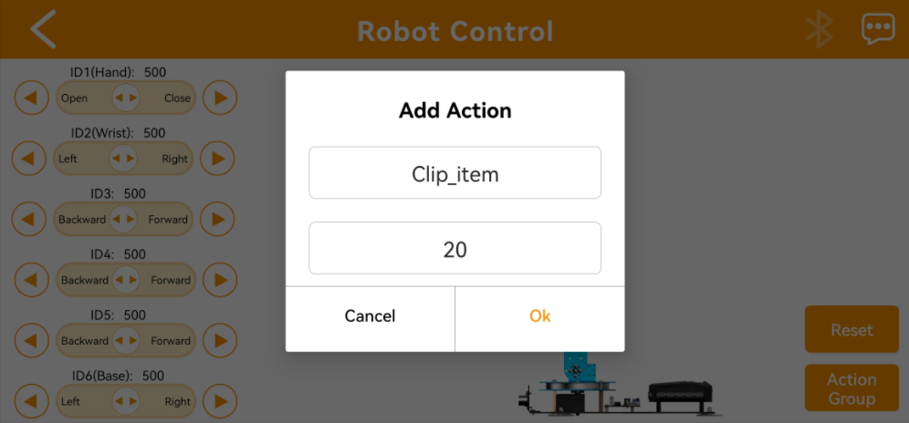

# 3. PC Software Control

## 3.1 Introduction to PC Software

### 3.1.1 Software Installation

(1) Open the program file in [PC Software Installation Package](https://docs.hiwonder.com/projects/xArm-Ai/en/latest/docs/resources_download.html).

(2) Select **"English"** for the software language, and click **"OK".**

(3) By default, the option "**Create Desktop Shortcut"** will be automatically checked. Then, click **"Next".**

(4) After the installation begins, wait for a moment until you see the prompt indicating that the software has been successfully installed. At this point, click "**Finish**" to complete the process.

### 3.1.2 Device Connection

(1) Connect the adapter to the robotic arm and turn on the switch. Use a micro-USB cable to connect the control board, then double-click to open the software. **Once the device is connected, the system will automatically detect it and install the drivers.**

(2) After a successful connection, the red icon on the main interface will change to green.

###  3.1.3 Function Instruction

① Device Connection Status:

|                           **Icon**                           |                         **Function**                         |
| :----------------------------------------------------------: | :----------------------------------------------------------: |
|  | It is used to display the device connection status. When connected successfully, it will show green; when not connected or disconnected, it will show red. |

**② Servo Control Area:** The servo control area displays the icon of the selected servo. By adjusting the corresponding slider value, users can adjust the servo's position.

|                           **Icon**                           |                         **Function**                         |
| :----------------------------------------------------------: | :----------------------------------------------------------: |
|  |              Servo ID number. Here is ID2 servo              |
|  | Adjust servo position. The minimum value is 0 and the maximum value is 1000. |
|  | Adjust servo deviation. The minimum value is -100 and the maximum value is 100. |

③ **Action data list:** It displays the running time and the value of each servo of each action.

 

|                           **Icon**                           |                         **Function**                         |
| :----------------------------------------------------------: | :----------------------------------------------------------: |
|  | Action group number. There are 230 action groups in total, and each action group can hold up to 1020 actions. If it exceeds, it will be prompted that it can only be run online and cannot be downloaded. |
|  | The duration of the action, which refers to the time required to execute the action. |
|  | Servo ID number. The value below is the action value of the corresponding servo. Double click  to modify the value. |

④ Action group setting area:

<table  class="docutils-nobg" border="1">
<colgroup>
<col  />
<col  />
</colgroup>
<tbody>
<tr>
<td ><strong>Icon</strong></td>
<td ><strong>Function</strong></td>
</tr>
<tr>
<td ></td>
<td >
Select action group number from 0-230. No.0 is

set as "<strong>Attention</strong>" action by default.
</td>
</tr>
<tr>
<td ></td>
<td >Download the actions in the current list to the controller. The original actions will be replaced after downloading.</td>
</tr>
<tr>
<td ></td>
<td >(Be careful) Click to delete all the data of action groups from 0 to 230.</td>
</tr>
<tr>
<td ></td>
<td >Run the selected action once.</td>
</tr>
<tr>
<td ></td>
<td >Stop the running action group.</td>
</tr>
<tr>
<td ></td>
<td >Add the action after adjusting the servo value.</td>
</tr>
<tr>
<td ></td>
<td >Delete the selected action in the action data list.</td>
</tr>
<tr>
<td ></td>
<td >Update the servo data in servo control area to the selected action in the action data list.</td>
</tr>
<tr>
<td ></td>
<td >Insert the new action in front of the selected action.</td>
</tr>
<tr>
<td ></td>
<td >After clicking, select the action group you want to open, and the action group data will be loaded into the action details list. (The path for the action group files we provide is "<strong>2. Software &amp; Program Collection/2.6 Action Group Files</strong>")</td>
</tr>
<tr>
<td ></td>
<td >Save the actions in the action list to the specified location.</td>
</tr>
<tr>
<td ></td>
<td >When opening an action group, users can choose this function and continue opening another action group to combine two action groups into a new action group.</td>
</tr>
<tr>
<td ></td>
<td >Click to execute the action group in the current action list（Choose the "<strong>Loop</strong>" to repeat the actions.)</td>
</tr>
<tr>
<td ></td>
<td >Click it to reset all the servos to the initial position.</td>
</tr>
<tr>
<td ></td>
<td >Click to loosen the joints of the robotic arm, and then change the stance of robotic arm manually.</td>
</tr>
<tr>
<td ></td>
<td >Read the angle data from the manual programming. (This function needs to use with manual coding)</td>
</tr>
</tbody>
</table>

⑤ Servo setting area :

|                           **Icon**                           |                         **Function**                         |
| :----------------------------------------------------------: | :----------------------------------------------------------: |
|  |                         Set language                         |
|  |  Read the deviation saved in the controller automatically.   |
|  | After clicking, the deviation adjusted by the PC software can be downloaded to the robotic arm. |
|  | Click to delete the deviation on the PC software but the data saved by the control board will not change. |

## 3.2 Execute Action

### 3.2.1 Project Outcome

Use the PC software to control the robotic arm to run the preloaded action group "**No. 2 – Grab and Move to Left 90**°" once, which has been written to the servo control board in advance.

### 3.2.2 Project Process 

* **Method 1**

(1) Turn on the xArm AI robotic arm and connect it to the computer. Then open the PC software.

(2) Click the "**Open Action File**" button, and select the action file named **"No. 2 – Grab and Move to Left 90°"** under [Appendix -> 2.6 Action Group Files](https://docs.hiwonder.com/projects/xArm-Ai/en/latest/docs/resources_download.html).

(3) Click **"Run,"** and the xArm AI will immediately begin executing Action Group NO. 2 once.

:::{Note}

If the "**Loop**" switch is turned on, the robotic arm will continuously repeat the action.

:::

* **Method 2**

(1) Turn on the xArm AI robotic arm and connect it to the computer. Then open the PC software. In the "**Action**" drop-down menu, select No. 2.

(2) Click the "**Run**" button, and the xArm AI robotic arm will immediately begin executing Action Group No. 2 once.

:::{Note}

When using this method to execute an action group, please ensure that the action group has already been downloaded to the servo control board in advance. Action Groups NO. 0–9 are preloaded before shipment.

:::

* **Others**

xArm AI also supports other methods for executing action group files, such as:  

① Offline execution of action groups (see [3.5 Execute Offline Running](#anchor_3_5))  

② Executing action groups via the app (see [3.6 APP Custom Control](#anchor_3_6))  

③ Executing action groups via serial commands (see [7. Serial Communication Lesson](https://docs.hiwonder.com/projects/xArm-Ai/en/latest/docs/7.Serial_Communication_Course.html))

## 3.3 Action Programming

### 3.3.1 Project Outcome

Program an action group consisting of 7 action s to allow xArm AI to **"Forward Grasp"**.

:::{Note}

All action parameters in this lesson is only for reference, please operate according to the actual situation.

:::

### 3.3.2 Project Process

* **Edit Action**

(1) Step 1: Switch on the robotic arm. Then connect it to the computer and open PC software.

(2) Click **"Open action file"** and select the action group NO.0. Then click **"online running"** to update the servo value on the left side. Now, we get the first action.

(3) Program the robotic arm to bend forward and slightly open the gripper. In servo control area, drag the sliders of ID1, ID3, ID4, ID5 servos to the corresponding value, as the figure shown below.

:::{Note}

Users can hold down the left mouse button and quickly click the slider for fine adjustments.

:::

(4) Click **"Add action"** to add the second action to the action data list.

(5) Program to lower the robotic arm slightly and make a fine adjustment of the gripper. This will create a transition for the next step of closing the gripper. Slide the sliders for servos 1, 3, and 4 according to the image below, then add the actions.

(6) Next, let the gripper close to grasp the object. Using the same method as before, follow the image below to complete the addition of the 4th action.

(7) Keep the object gripped and stationary, then rotate the robotic arm. In this case, mainly adjust servo 6. Follow the image below to complete the addition of the 5th action:

(8) After reaching the specified position, the robotic arm slightly lowers, opens the gripper, and places the object down. Add the 6th action:

(9) Finally, reset the robotic arm return to its initial position. Right-click to copy the first action in the action list, then select the 6th action group. Right-click in the blank area and select **"Paste Down"** to successfully copy the action.

*  **Download Action**

(1) After editing the actions, users need to save them locally for later debugging. Click the **"Save File"** button, enter the file name and number in the pop-up window, and then save.

(2) After saving the file, download the action to the corresponding action group. On the right side of the interface, select action group number 20, then click the **"Download"** button.

(3) Once the download is complete, a **"Download Complete"** prompt will appear on the interface. Click **"OK"** to close the prompt.

## 3.4 Integrate Action Groups

### 3.4.1 Project Outcome

Integrate the two different action groups to become a new action group.

### 3.4.2 Project Process 

Step 1: Open the PC software, and connect the serial port. Click "**Integrate file**", and open the action group NO.0 located in "**Appendix -\>Action Group Files**".

Step 2: At this moment, the action list displays the data of NO.0 action group.

Step 4: Click **"Integrate file"** again and choose action group NO.2 for integration.

Step 5: Click "**Run**" to execute the new integrated actions online.

Step 6: Click **"Save action file"** to save the new integrated action group for the future debugging.

Reminder: If the action list exceeds 1020 actions, the software will prompt that the limit has been exceeded. In this case, the actions cannot be downloaded to the control board and can only be run online for viewing.

## 3.5 Execute Offline Running

### 3.5.1 Project Outcome

Control the robotic arm to execute action by pressing offline running button instead of PC software control.

### 3.5.2 Project Process 

(1) Connect robotic arm to your computer with USB cable, and then open PC software.

(2) Open an action group file in folder "[**Appendix-\>Action Group Files**](https://docs.hiwonder.com/projects/xArm-Ai/en/latest/docs/resources_download.html)" . For example, **"04"** action group.

(3) Select the action group number "**NO.100**", and then click **"download".** 

:::{Note}

The robotic arm set No.100 action group as offline action group by default before delivery. Other action group numbers can not be the starting number of offline action group.

:::

(4) After the download is complete, **"Download successful"** will be prompted. Click **"OK"** to close it.

(5) Switch on robotic arm, and then press 【Run】button on the control board to run the No.100 action group offline.

(6) Long press【Run】button for 3 seconds, the action group will be executed repeatedly.

## 3.6 APP Custom Control

### 3.6.1 Project Outcome

Perform the action group file **"20"** programmed in [3.3 Action Programming](#anchor_3_3) by the custom function of the APP.

### 3.6.2 Project Process 

* **Preparation**

(1) Enable the Bluetooth and GPS services on your mobile

(2) Download Action Group NO.20 to the robotic arm. (Once downloaded, the PC software will be prompted)

* **Operation Steps**

(1) Turn on the xArm AI robot and then open the **"Wonderbot"** app. The connect the robot in app.

(2) Enter the remote robot control function, tap the **"Action group"** button and tap **"Add"** in the pop-up interface.

(3) In the pop-up interface, fill in the action group name and action group number. The action name can be entered freely, but the action group number must be entered correctly; otherwise, it will not work.

(4) After adding, click the action name button to execute it once.

(5) To modify or delete, long press the action name button and click **"Delete".**

