# 4. Scratch Programming Project

## 4.1 Programming Tool Installation and Introduction

### 4.1.1 WonderCode Introduction & Installation

* **WonderCode Introduction & Installation**

WonderCode is a Scratch programming tool specifically designed for Hiwonder products. The software supports automatic conversion between graphical command blocks and Python code, allowing users to create programs by simply dragging and dropping command blocks. It's ideal for beginners learning programming!

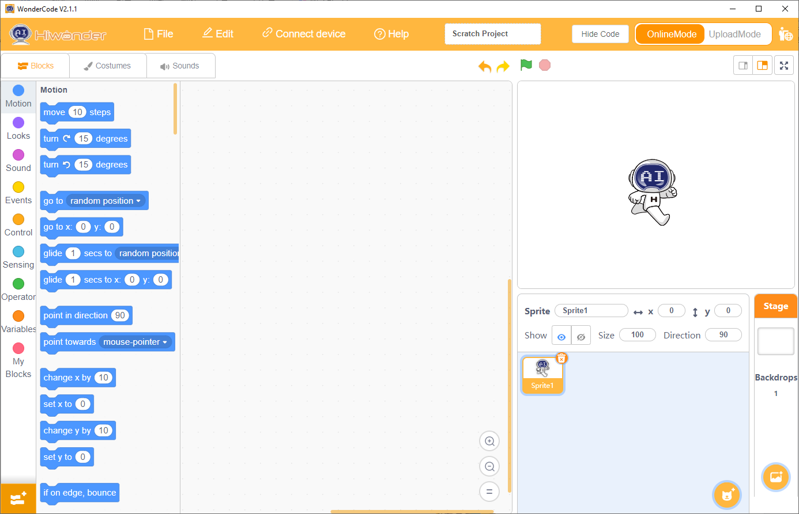

(1) Locate and open the installation package [WonderCode setup.exe]() which is saved in the same directory and Appendix folder.

(2) Choose "**English**" and click **"OK."**

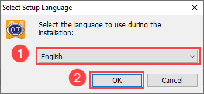

(3) Select the installation location. You can keep the default path or choose a different one. Click "**Next**" to proceed.

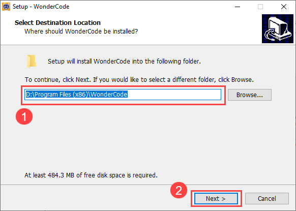

(4) In the additional tasks window, the "**Create desktop shortcut**" option is selected by default. You can keep this setting and click **"Next."**

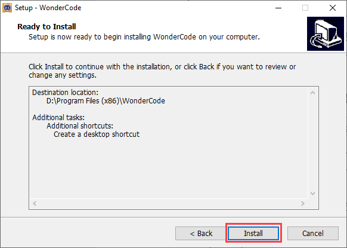

(4) The installation process will start, and a progress bar will be displayed.

(5) Once the installation is complete, click "**Finish**."

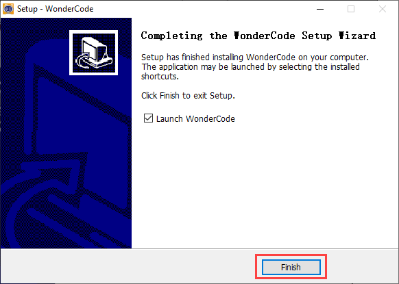

(6) After installation, a "**WonderCode**" software icon will appear on your desktop.

* **Device Connection**

(1) Connect the device and double-click to open the **"WonderCode"** software.

(2) Before connecting, you need to add the device extension package; otherwise, the connection will fail. Click the "**Add Extension**" button  in the lower-left corner of the main interface, then select "**Robot**" and choose "xArm" from the pop-up menu.

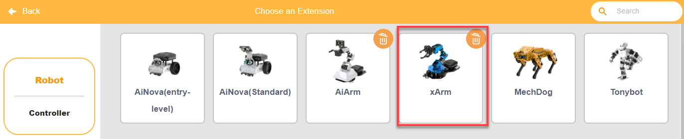

(3) Click the **"Connect"** button and connect to the corresponding port.

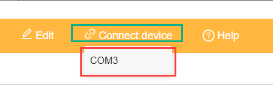

:::{Note}

The port number is not fixed and depends on the computer's connection setup. For example, the port number used in this section is **"COM4."** Avoid connecting to **"COM1,"** as it is typically a system communication interface. If you have multiple USB devices and are unsure of the port number, open **"This PC"** on your desktop, click **"Properties"** and then **"Device Manager"** to find the port number for the MechDog controller (look for the CH340 identifier).

:::

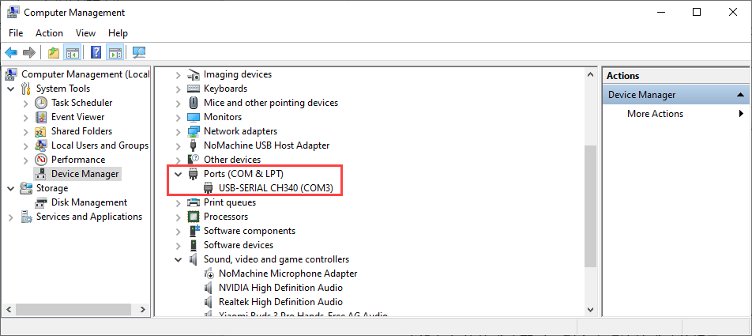

(4) Once the device and software are successfully paired, a connection success message will appear.

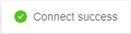

### 4.1.2 Programming Interface Introduction & Program Download

* **Function Description**

The following image illustrates the functional areas of the **"WonderCode"** software:  

① Menu Bar 

② Command Area

③ Script Area 

④ Code Display and Upload Area

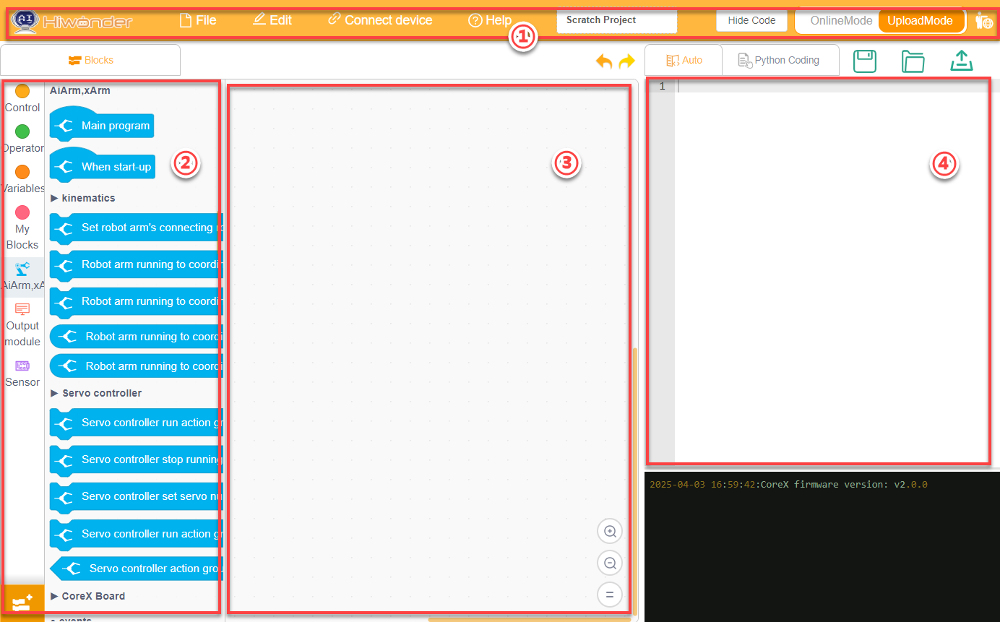

The corresponding functions are as shown in the table below:

<table  class="docutils-nobg" style="margin:0 auto" border="1">
<colgroup>
<col  />
<col  />
</colgroup>
<tbody>
<tr>
<td ><strong>Icon</strong></td>
<td ><strong>Function</strong></td>
</tr>
<tr>
<td ></td>
<td >Create, save, and open program files</td>
</tr>
<tr>
<td ></td>
<td >Used for online mode; for reference only, no need to master</td>
</tr>
<tr>
<td ></td>
<td >Determines whether to connect the device and software and specifies the connection port</td>
</tr>
<tr>
<td ></td>
<td >Used to find help resources, check for updates, and install drivers</td>
</tr>
<tr>
<td ></td>
<td >Displays the program file name. If programming has not started or the file is unsaved, it will show "Scratch Project"</td>
</tr>
<tr>
<td ></td>
<td >Interface switch button for toggling between "Online Mode" and "Upload Mode." Remember to save edited program files before switching, as unsaved changes may lead to file loss. (Note: Online Mode is used for animation and game creation, which are part of Scratch's native functions. Upload Mode is used with our devices to enable various functionalities.)</td>
</tr>
<tr>
<td ></td>
<td >
Choose the interface language; options include English, Simplified Chinese, and Traditional Chinese.

Undo or redo actions while programming.
</td>
</tr>
<tr>
<td ></td>
<td >Undo or redo actions while programming</td>
</tr>
<tr>
<td >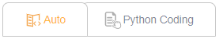</td>
<td >Edit mode switch button: "Auto Transcode" converts command block programs to Python code; switch to "Python Programming" to edit programs directly in Python</td>
</tr>
<tr>
<td ></td>
<td >Save the program in Python code format</td>
</tr>
<tr>
<td ></td>
<td >Create, save, and open program files</td>
</tr>
<tr>
<td ></td>
<td >Used for online mode; for reference only, no need to master</td>
</tr>
<tr>
<td ></td>
<td >Determines whether to connect the device and software and specifies the connection port</td>
</tr>
<tr>
<td ></td>
<td >Used to find help resources, check for updates, and install drivers</td>
</tr>
</tbody>
</table>

* **Programming Instructions**

Taking the example of lighting up an ultrasonic RGB module, follow these steps:

(1) Drag the **'main program'** block from the xArm AI instruction set to the code editing area.

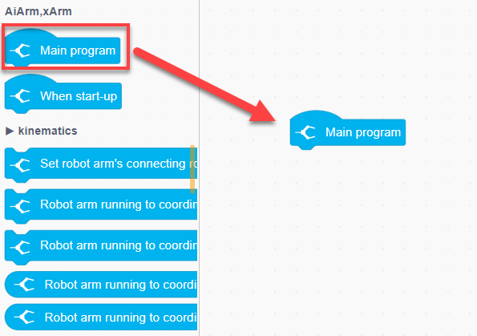

:::{Note}

To delete a block, drag it back from the code editing area to the instruction set collection.

:::

(2) Connect the '**Repeat Execution**' control block below the previous instruction block.

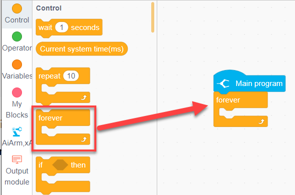

(3) Next, from the xArm AI instruction set, drag out the instruction block to set LED color, place it inside the '**Repeat Execution**', and choose to set all LEDs to red.

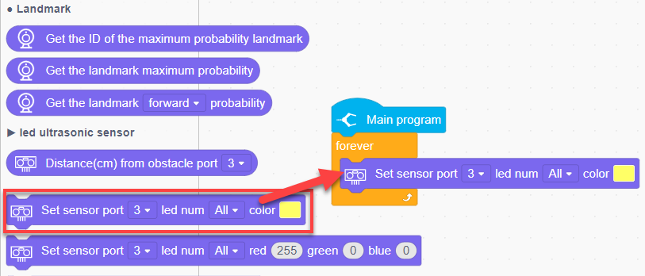

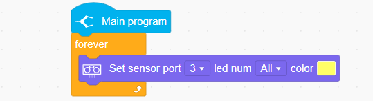

(4) Click **'Upload'** to download the program to the main controller.

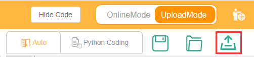

(5) To save the program, Click '**File**' in the top left corner of the page, then '**Save to Computer**' to save the program to your computer.

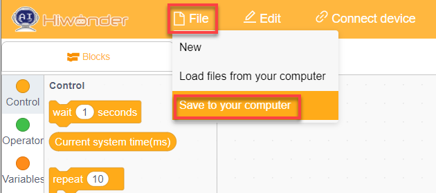

## 4.2 Motion Control Course

### 4.2.1 Inverse Kinematics Introduction

* **Introduction**

Inverse kinematics is the process of determining the parameters of the joint movable object to be set to achieve the required posture.

The inverse kinematics of the robotic arm is an important foundation for its trajectory planning and control. Whether the inverse kinematics solution is fast and accurate will directly affect the accuracy of the robotic arm's trajectory planning and control. so it is important to design a fast and accurate inverse kinematics solution method for a six-degree-of-freedom robotic arm.

* **Brief Analysis of Inverse Kinematics**

For the robotic arm, the position and orientation of the gripper are given to obtain the rotation angle of each joint. The three-dimensional motion of the robotic arm is complicated. In order to simplify the model, we remove the rotation joint of the pan-tilt so that the kinematics analysis can be performed on a two-dimensional plane.

Inverse kinematics analysis generally requires a large number of matrix operations, and the process is complex and computationally expensive, so it is difficult to implement. In order to better meet our needs, we use geometric methods to analyze the robotic arm.

We simplify the model of the robotic arm, remove the pan-tilt at the base, and the actuator part to get the main body of the robotic arm. From the figure above, you can see the coordinates (x, y) of the end point P of the robotic arm, which ultimately consists of three parts (x1+x2+x3, y1+y2+y3).

Among them θ1, θ2,θ3 in the above figure are the angles of the servo that we need to solve, and α is the angle between the paw and the horizontal plane. From the figure, it is obvious that the top angle of the claw α=θ1+θ2+θ3, based on which we can formulate the following formula:

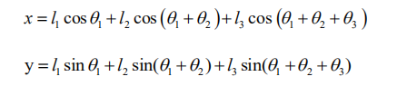

Among them, x and y are given by the user, and l1, l2, and l3 are the inherent properties of the mechanical structure of the robotic arm.

In order to facilitate the calculation, we will deal with the known part and consider the whole:

Substituting m and n into the existing equation, and then simplifying can get:

Through calculation:

We see that the above formula is the root-finding formula of a quadratic equation in one variable:

Based on this, we can find the angle of θ1, and similarly we can also find θ2. From this we can obtain the angles of the three steering gears, and then control the steering gears according to the angles to realize the control of the coordinate position.

### 4.2.2 Establish Robotic Arm Coordinate System

* **Establishing Coordinate System**

We typically control the robotic arm's movement through action groups. The prerequisite for this implementation is the use of a PC to edit the actions. However, after editing and downloading the actions to the robotic arm, it becomes less flexible if fine adjustments are needed, or if action editing is required without a PC. Therefore, the following introduces the xArm AI's coordinate system and how to control the robotic arm's movement using coordinates.

Since we're dealing with a coordinate system, the first thing to know is the origin of the coordinate system and what the coordinates represent. The origin of xArm AI's coordinate system is based on the bottom of the servo in its base platform, as shown in the diagram below. 

From the robot's first-person perspective, the positive direction of the X-axis is to the right of the robotic arm, the positive direction of the Y-axis is in front of the robotic arm, and the Z-axis is directed upwards.

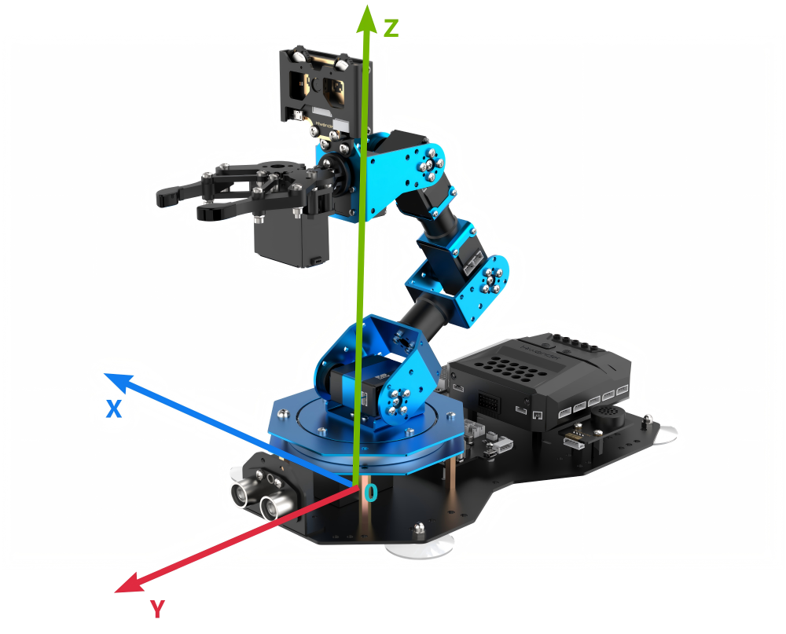

After defining the X, Y, and Z axes, we can now define the distance for each unit on the coordinate axes, which allows us to calculate the position of a specific point on the robotic arm within this coordinate system. In this case, we define the unit distance for the coordinate axes as centimeters (cm).

* **Coordinate System Parameter**

After understanding the coordinate system of the robotic arm, let's now discuss some related parameters. First is the coordinate information. The X, Y, and Z coordinates actually refer to the position of the robotic arm's end effector. Here, the end effector refers to the position reached when the end gripper is fully closed.

We will use a coordinate example that will be used in subsequent lessons, as shown in the diagram below:

This is a coordinate instruction for setting the robotic arm's initial position. As you can see, the coordinates (x, y, z) are filled in as (0, 17, 20.5), which means the position of the robotic arm's end effector is 17 cm directly in front of the origin and 20.5 cm high. The pitch angle is set to 0°, meaning the gripper's angle is level with the horizontal plane.

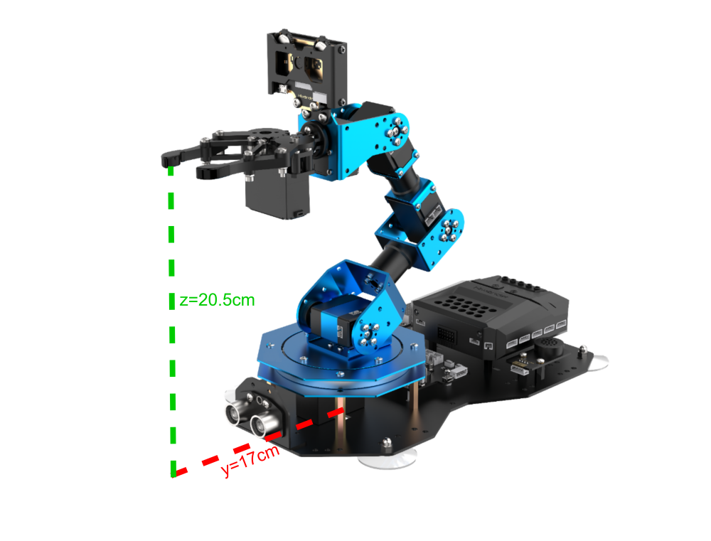

Now that we know the origin, the three axes, and the description of the coordinates of the robotic arm, it is still not enough to determine or control the arm's position. We need to find another standard to determine the specific position and configuration of the robotic arm. The standard we use here is the arm's **link length**.

In most cases, the link length refers to the distance between two servos. However, since the servo for the gripper is somewhat special, the final link length (Link 4) refers to the distance from the servo to the end effector of the robotic arm.

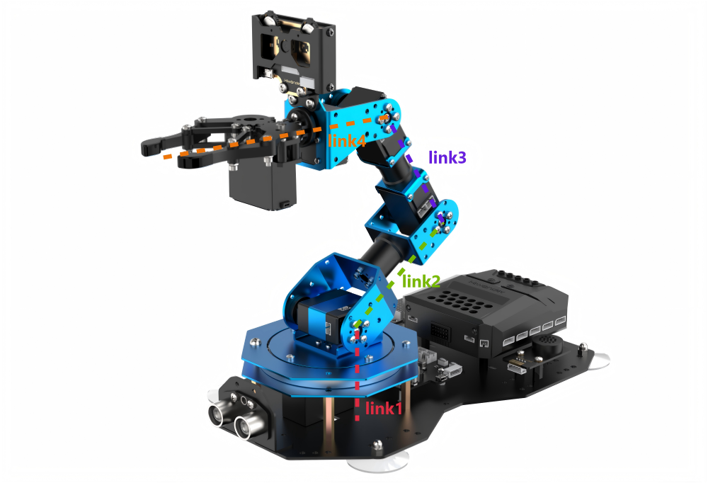

If the link lengths are not defined with the same number of links, then the position and orientation of the robotic arm cannot be determined solely based on the end effector's coordinates and pitch angle. Using the following two diagrams as examples, the end effector's coordinates and pitch angle are the same, but the arm's shape and position can result in different outcomes: (where each colored line corresponds to a different link).

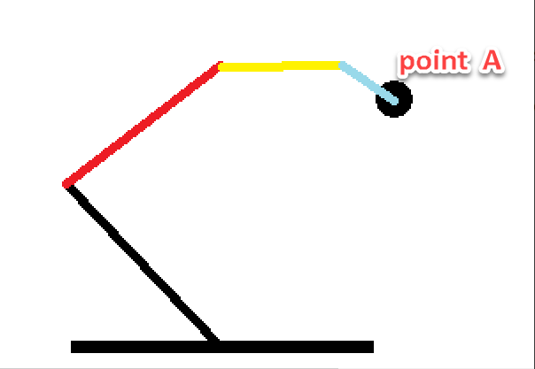
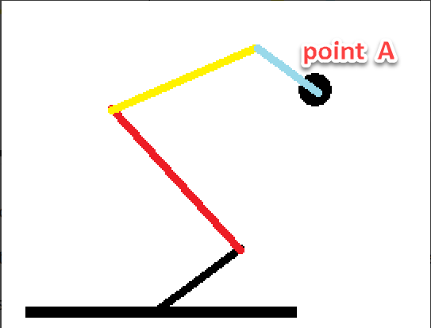

As seen from the above diagram, to determine the exact position and configuration of the robotic arm, it is necessary to define the link lengths. This is also related to controlling the robotic arm's movement, because once the link lengths are defined, along with the position parameters of the end effector, the solution for the position will be unique.

Having discussed the above parameters, let's now think in reverse: Is it true that once we have the three-axis coordinates of the end effector, the pitch angle of the gripper, and the link lengths, we can obtain a unique solution for the robotic arm's position? The answer is yes.

* **Coordinate Control**

The above content has explained the link lengths and the coordinate information of the robotic arm. Next, we can combine these two to control the robotic arm's movement. Here, we will illustrate this through a few actions, as shown in the diagram below:

First, we need to close the gripper, which is controlled by Servo 1. Then, define the link lengths of the robotic arm.  

The first position represents the robotic arm's initial position. After 1 second, it will move to the position we set for the end effector and the pitch angle of the gripper. Since the pitch angle is 0, the gripper will be in a level position.  

After another second, the arm will move to the position with X=0, Y=11, Z=3.7, and a pitch angle of -68°.  

At this point, our action is considered edited and completed. Of course, we can also try modifying the values to other numbers, but due to the mechanical arm's built-in limit switches, some positions may be unreachable.  

Therefore, when editing the robotic arm's movements using coordinates, we also need to consider whether the link lengths and angular positions are reasonable.

### 4.2.3 Motion Control Library File Introduction

* **Kinematics Code Block Introduction**

(1) Link Length Setting

This code block is used to set the link lengths of the robotic arm. The xArm AI has a total of four links, with the link distances from the base to the gripper being 6.9 cm, 9.5 cm, 9.5 cm, and 16.9 cm, respectively. Once the link lengths are determined, accurate target positions can be calculated during kinematic calculations.

(2) Coordinate Movement within Pitch Angle Range

This code block allows the robotic arm to move to the corresponding coordinates within the set pitch angle range. The kinematics will iterate through each value within the specified pitch angle range and calculate if a solution exists. If a solution is found, the arm will move to the corresponding coordinates.

(3) Move to Coordinates with Specified Pitch Angle

This code block allows the robotic arm to move to the corresponding coordinates with a specified pitch angle. The kinematics will calculate if a solution exists, and if so, the arm will move to the corresponding coordinates.

(4) Coordinate Movement within Pitch Angle Range

The principle of this code block is the same as in 1.2. This code block will return a bool value to determine if a solution exists within the set range based on the kinematic calculations.

(5) Move to Coordinates with Specified Pitch Angle (With Return Value)

The principle of this code block is the same as in 1.3. This code block will also return a bool value to determine if a solution exists based on the kinematic calculations.

### 4.2.4 Robotic Arm Vertical Motion

* **Project Introduction**

This project will achieve vertical upward and downward movement for the xArm AI robot.

* **Project Process**

* **Program Download**

(1) Open the WonderCode software.

(2) Drag the program file **"Robotic Arm Vertical Movement Program.sb3"** located in the same path into WonderCode.

(2) Click on the "**Connect device**" option in the menu bar and select the COM port. In this case, COM5 is used as an example. Once connected successfully, a "**Connect Successful**" message will pop up.

(3) Click on thebutton on the right to download the program to the controller. Wait for the "**Upload Completed**" prompt to appear.

* **Project Outcome**

The robotic arm will repeatedly perform vertical up and down movements.

* **Program Analysis**

(1) First, set the lengths of the four links of the robotic arm. Then, control the ID1 and ID2 servos to move to positions 100 and 500, respectively. Finally, control the robotic arm to move to the coordinates (x=0, y=17, z=20.5) and wait for 1.5 seconds.

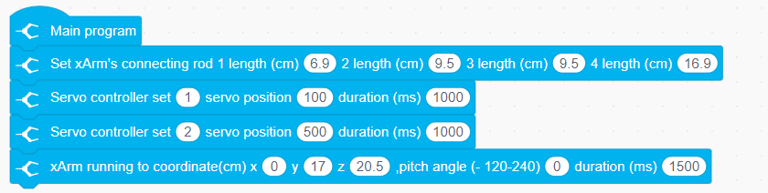

(2) Next, in the program, continuously control the robotic arm to move to the coordinates (x=0, y=17, z=16.4) with a pitch angle of 0 within 1.5 seconds. After waiting for 1.5 seconds, control the robotic arm to move to the coordinates (x=0, y=17, z=25.8). This will loop to control the robotic arm to perform vertical movement.

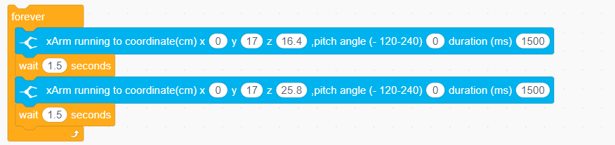

### 4.2.5 Robotic Arm Fixed-Point Motion 

* **Project Introduction**

In this section, the robotic arm performs object grasping by calling kinematics functions. It sequentially places the object in four positions: 90 degrees to the left, 45 degrees to the left, 45 degrees to the right, and 90 degrees to the right.

* **Project Logic**

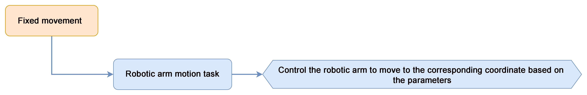

* **Download Program**

(1) Open the WonderCode software.

(2) Drag the program file "02 Robotic Arm Fixed-point Movement Program.sb3" located in the same path into WonderCode.

(3) Click on the "**Connect device**" option in the menu bar and select the COM port. In this case, COM5 is used as an example. Once connected successfully, a "**Connect successful**" message will pop up.

(4) Click on thebutton on the right to download the program to the controller. Wait for the "**Upload Completed**" prompt to appear.

* **Project Outcome**

The robotic arm will repeatedly grasp the object and move to the positions of 90° to the left, 45° to the left, 45° to the right, and 90° to the right.

* **Program Analysis**

(1) First, set the lengths of the four links of the robotic arm, then control Servo 1 to rotate to position 100, and open the gripper. Next, control Servo 2 to rotate to position 500, and then move the robotic arm to the coordinates (x=0, y=17, z=20.5), and wait for 2 seconds.

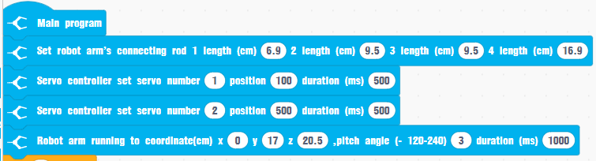

(2) In the following program, four functions are run in a loop, each corresponding to the placement of the object at four different angles.

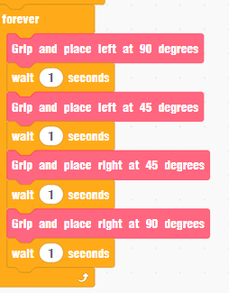

(3) Taking placing the object at 90° to the left as an example: The robotic arm first moves to the coordinates (x=0, y=17, z=1.8) with a pitch angle of -69 to enter the grasping state. Then, Servo 1 is controlled to rotate and grasp the object. After grasping the object, it returns to the initial coordinates (x=0, y=17, z=20.5) and waits for 0.6 seconds. Then, move to the 90° position to the left. According to the robot's coordinate system, when x is negative, it will rotate to the left. Since the y-value is 0, it will move to the 90° position to the left. The robotic arm then moves to the coordinates (x=-19.5, y=0, z=2.8) to place the object, and finally, return to its initial posture."

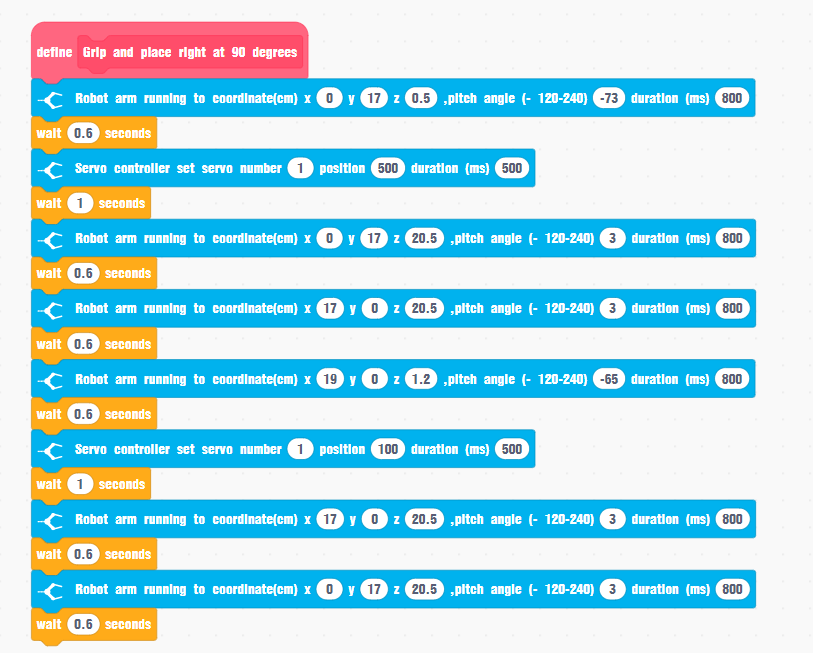

## 4.3 Basic Function Course

### 4.3.1 Dot Matrix Display

* **Project Introduction**

The LED dot matrix module is used to display the set text.

* **Project Logic**

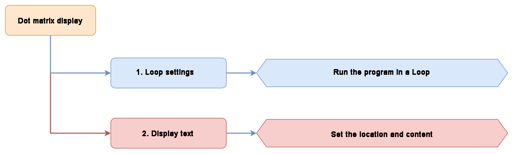

* **Module Instruction**

The LED dot matrix display module features high display brightness, no flickering during display, easy wiring, and can display numbers, text, patterns, and other content.

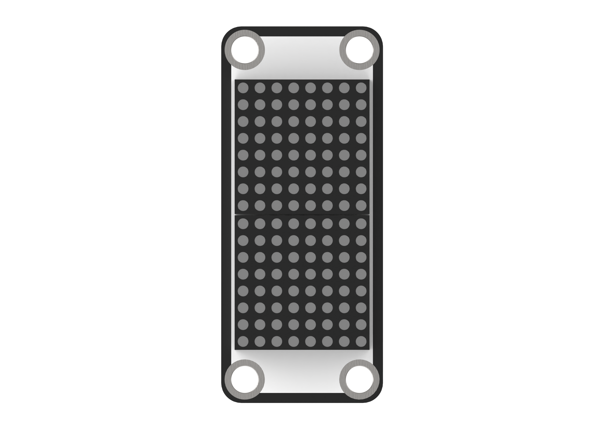

The module consists of two red 8x8 LED lights and is controlled by the TM640B driver chip, enabling control of the dot matrix display.  

**Module Wiring: Connect the dot matrix module to the port No.6 on the CoreX controller.**

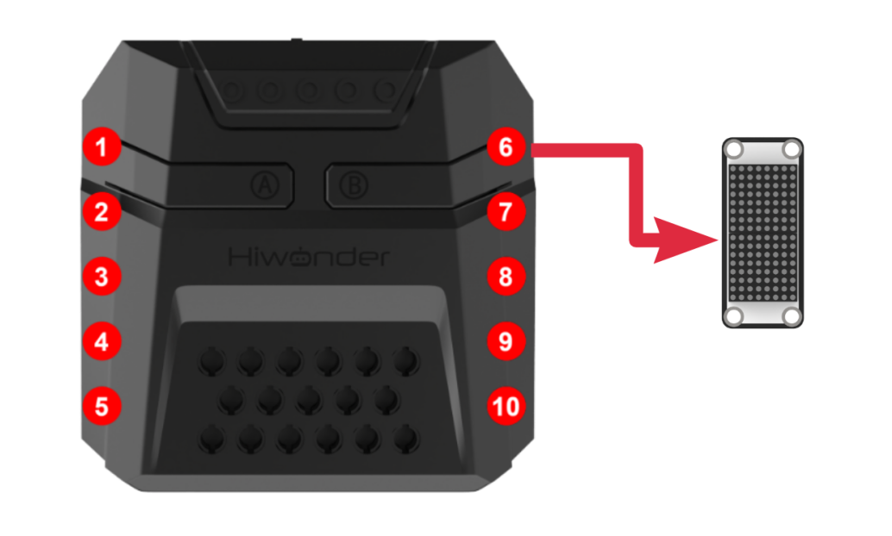

* **Download Program**

(1) Open the WonderCode software.

(2) Drag the program file "Dot Matrix Display Program.sb3" located in the same path into WonderCode.

(3) Click on the "**Connect device**" option in the menu bar and select the COM port. In this case, COM7 is used as an example. Once connected successfully, a "**Connection Successful**" message will pop up.

(4) Click on thebutton on the right to download the program to the controller. Wait for the "**Upload Completed**" prompt to appear.

* **Project Outcome**

The LED dot matrix module displays "Hi I AM xArm"

* **Program Analysis**

In the main program, repeatedly execute and set the text to be displayed based on the LED dot matrix position.

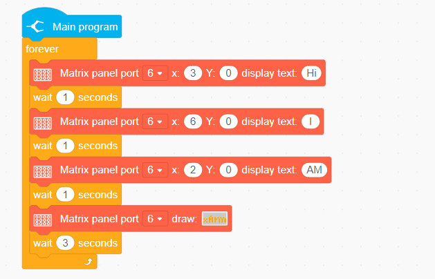

### 4.3.2 RGB Light Flashing

* **Project Introduction**

The RGB light on CoreX controller will present running light effect.

* **Project Logic**

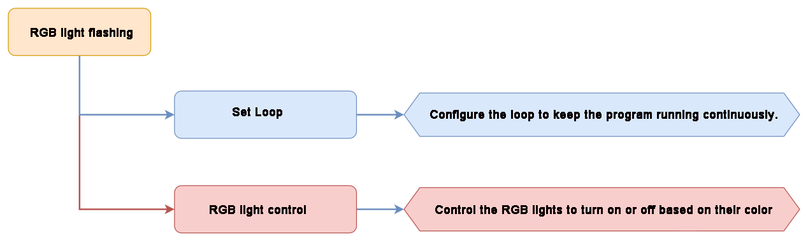

* **Module Instruction**

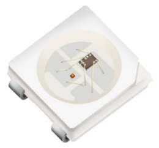

Based on the principle of red, green, and blue colors, the RGB lights can be mixed to create various colors of light. The CoreX controller has 6 built-in RGB LEDs.

* **Download Program**

(1) Open the WonderCode software.

(2) Drag the program file "RGB Light Flashing Pro.sb3" located in the same path into WonderCode.

(3) Click on the "**Connect device**" option in the menu bar and select the COM port. In this case, COM7 is used as an example. Once connected successfully, a "**Connection Successful**" message will pop up.

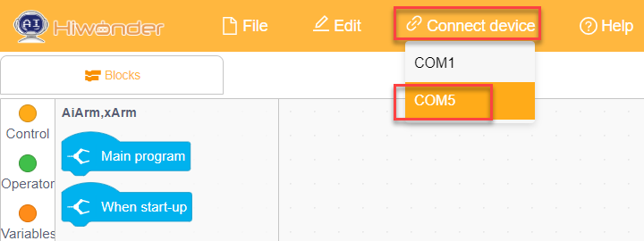

(4) Click on thebutton on the right to download the program to the controller. Wait for the "**Upload Completed**" prompt to appear.

* **Project Outcome**

The LEDs on the CoreX controller will light up and turn off sequentially in red, green, and blue.

* **Program fAnalysis**

(1) Initially, the robotic arm will execute the action group No.0.

(2) In the main program, the RGB LEDs will light up in a loop, setting the red, green, and blue colors according to the sequence of the RGB LEDs.

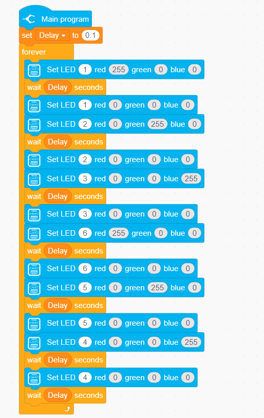

### 4.3.3 **Ultrasonic Distance Measurement**

* **Project Introduction**

The dot matrix module displays the distance value detected by the ultrasonic sensor, while the RGB LEDs indicate the proximity by changing colors.

* **Project Logic**

* **Module Instruction**

(1) Ultrasonic Module

The module uses an I2C communication interface, allowing the distance measured by the ultrasonic sensor to be read via I2C communication.

Additionally, the ultrasonic probe position integrates two RGB LEDs, which not only allow adjustment of the light brightness but also enable the creation of a variety of colors through changes in the red (R), green (G), and blue (B) color channels, as well as their combinations.

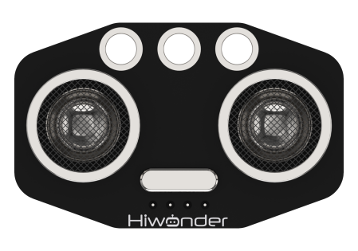

During distance measurement, the module will automatically send 8 pulses of 40kHz square waves and then detect if a signal is returned. If a signal is received, a high-level output will be generated. The duration of the high level corresponds to the time it takes for the ultrasonic wave to travel from the transmitter to the receiver.  

**Module wiring: Connect the ultrasonic module to Port No.4 on the CoreX controller.**

(2) Dot Matrix Module

The LED dot matrix module uses an LED display screen that features high brightness, flicker-free display, and easy wiring. It can display numbers, text, patterns, and other content.

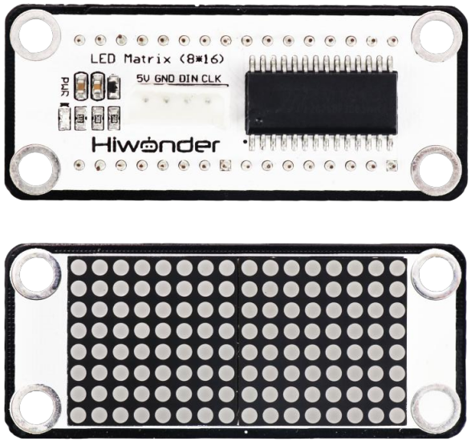

The module consists of two red 8x8 LED lights and is controlled by the TM640B driver chip, enabling control of the dot matrix display.  
**Module Wiring: Connect the dot matrix module to the port No.6 of the CoreX controller.**

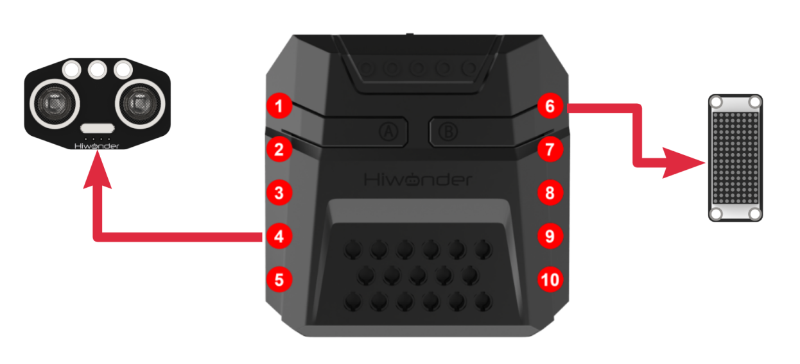

* **Download Program**

(1) Open the WonderCode software.

(2) Drag the program file "Ultrasonic Distance Measurement Program.sb3" located in the same path into WonderCode.

(3) Click on the "**Connect device**" option in the menu bar and select the COM port. In this case, COM7 is used as an example. Once connected successfully, a "**Upload Completed**" message will pop up.

(4) Click on thebutton on the right to download the program to the controller. Wait for the "**Download Successful**" prompt to appear.

* **Project Outcome**

The distance detected by the ultrasonic sensor is displayed through the dot matrix module.  
When the distance is greater than 10cm, the ultrasonic RGB LEDs will light up green. Otherwise, the ultrasonic module will display red, and a sound will be played.

* **Program Analysis**

In the main program, repeatedly execute and set the text to be displayed based on the LED dot matrix position.

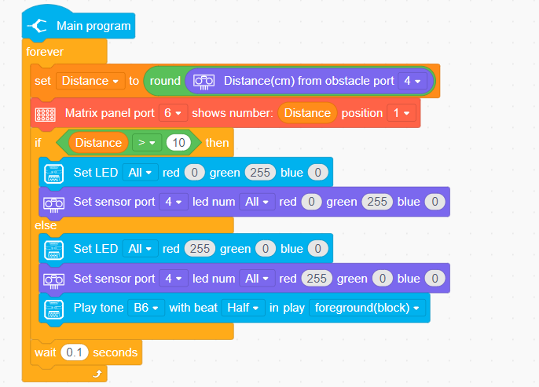

### 4.3.4 Button Control

* **Project Introduction**

Control the robotic arm to execute action groups using a button on controller.

* **Project Logic**

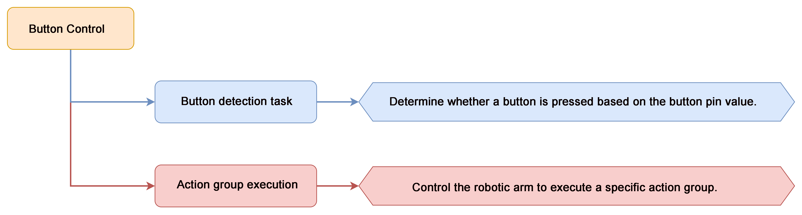

* **Module Instruction**

Onboard buttons are common input components on embedded systems or development boards, used to implement user interaction and control functions. They are typically used to start, reset, or execute specific functions.

* **Download Program**

(1) Open the WonderCode software.

(2) Drag the program file "Button Control Program.sb3" located in the same path into WonderCode.

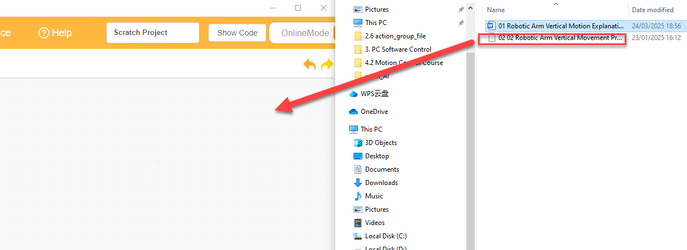

(3) Click on the "**Connect device**" option in the menu bar and select the COM port. In this case, COM7 is used as an example. Once connected successfully, a "**Connection Successful**" message will pop up.

(4) Click on thebutton on the right to download the program to the controller. Wait for the "**Upload Completed**" prompt to appear.

* **Project Outcome**

Pressing button A will make the robotic arm perform action group No. 5 once (grasping to the right at a 90° angle). Pressing button B will make the robotic arm perform action group No. 2 once (grasping to the left at a 90° angle).

* **Program Analysis**

(1) In the main program, control the robotic arm to execute action group No. 0, positioning the robotic arm to its initial position.

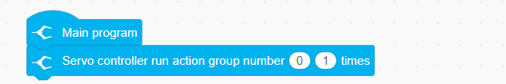

(2) When button A is pressed, execute action group No. 5 once.

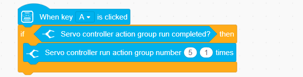

(3) When button B is pressed, execute action group No. 2 once.

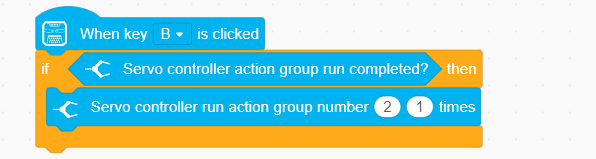

### 4.3.5 Sound Control

* **Project Introduction**

Control the robotic arm's up and down movement based on the detected sound level.

* **Project Logic**

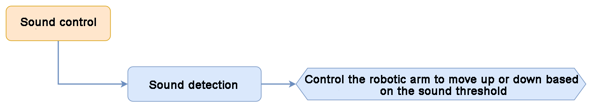

* **Module Instruction**

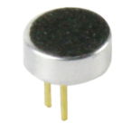

The onboard sound sensor is a device used to detect the intensity of external sounds. It can read the pin values through the ADC pins to measure the sound level. The main working principle involves the vibration of the microphone diaphragm due to sound, which causes the electrostatic film inside the microphone to vibrate. This results in a change in capacitance, generating a small voltage corresponding to the change, which is then converted into an electrical signal output.

* **Download Program**

(1) Open the WonderCode software.

(2) Drag the program file "Sound Control Program.sb3" located in the same path into WonderCode.

(3) Click on the "**Connect device**" option in the menu bar and select the COM port. In this case, COM7 is used as an example. Once connected successfully, a "**Connection Successful**" message will pop up.

(4) Click on thebutton on the right to download the program to the controller. Wait for the "**Upload Completed**" prompt to appear.

* **Project Outcome**

When the detected sound intensity is greater than 50, the robotic arm will move upward first. After reaching the limit position, it will then move downward.

* **Program Analysis**

(1) Initialize the link lengths of the robotic arm, then move the robotic arm to its initial position.

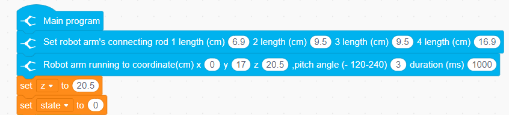

(2) In the loop function, continuously monitor the sound intensity of the onboard microphone. If the sound intensity exceeds the set threshold (50).

(3) Based on the current state, determine whether the robotic arm should move upward or downward. State 0 represents moving upward, and state 1 represents moving downward. The vertical position of the robotic arm is controlled by adjusting the value of the variable z. When the value of z exceeds the set upper or lower limits, it will be adjusted to prevent the arm from moving beyond its effective range.

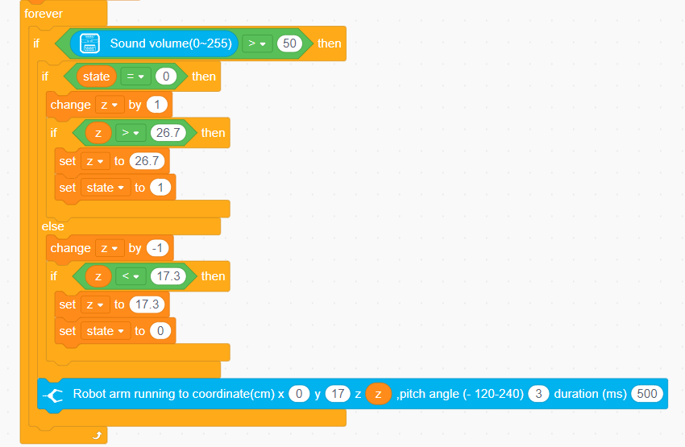

### 4.3.6 Color Recognition

* **Project Introduction**

Utilize a color sensor to identify red, green, blue, and yellow objects, and display corresponding color text through RGB and LEDs.

* **Project Logic**

* **Module Instruction**

(1) Color sensor

It is a sensor capable of recognizing the color of the measured object, surrounding ambient light intensity, object proximity detection, and non-contact gesture detection, among other functions. The sensor integrates RGB color detection, allowing it to identify various object colors. It also integrates ambient light detection, enabling light intensity measurement under different lighting conditions. With a built-in infrared LED, it can be used for object proximity detection.

**Module Wiring: Connect the matrix module to the Port No.5 of the CoreX controller.**

/(2/) Dot Matrix Module

The LED dot matrix module uses an LED display screen that features high brightness, flicker-free display, and easy wiring. It can display numbers, text, patterns, and other content.

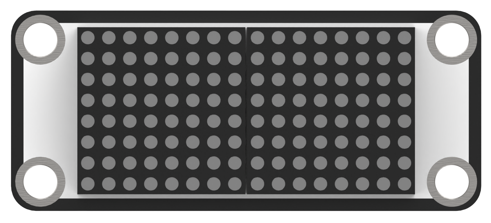

The module consists of two red 8x8 LED lights and is controlled by the TM640B driver chip, enabling control of the dot matrix display.  
**Module Wiring: Connect the dot matrix module to the port No.6 of the CoreX controller.**

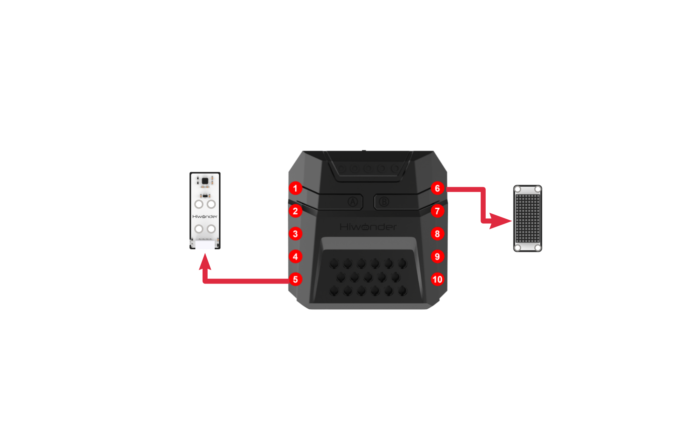

* **Download Program**

(1) Open the WonderCode software.

(2) Drag the program file "Color Recognition Program.sb3" located in the same path into WonderCode.

(3) Click on the "**Connect device**" option in the menu bar and select the COM port. In this case, COM7 is used as an example. Once connected successfully, a "**Upload Completed**" message will pop up.

(4) Click on thebutton on the right to download the program to the controller. Wait for the "**Download Successful**" prompt to appear.

* **Project Outcome**

When red is detected, the RGB displays a red light, and the LED matrix shows "R";  

When green is detected, the RGB displays a green light, and the LED matrix shows "G";  

When blue is detected, the RGB displays a blue light, and the LED matrix shows "B";  

When yellow is detected, the RGB displays a yellow light, and the LED matrix shows "Y".

* **Program Analysis**

(1) Firstly, initialize the robotic arm and execute action group No.0.

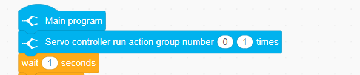

(2) In the loop, clear the content displayed by RGB light and the LED matrix. When a corresponding color is detected, set the RGB light to that color and display the first letter of the color on the LED matrix.

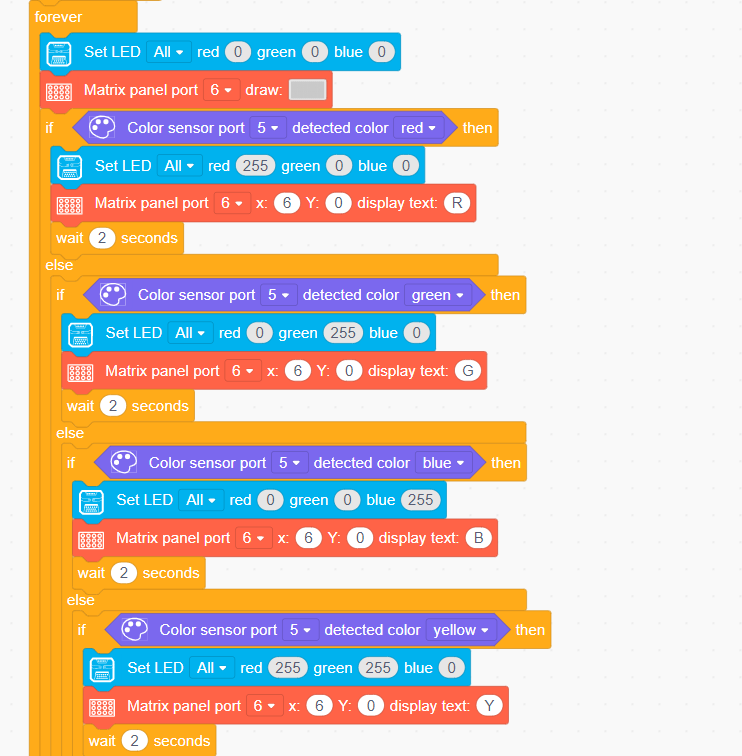

### 4.3.7 Color Sorting

* **Project Introduction**

Utilize a color sensor to identify red, green, blue and yellow objects, and then pick them to the corresponding locations.

* **Project Logic**

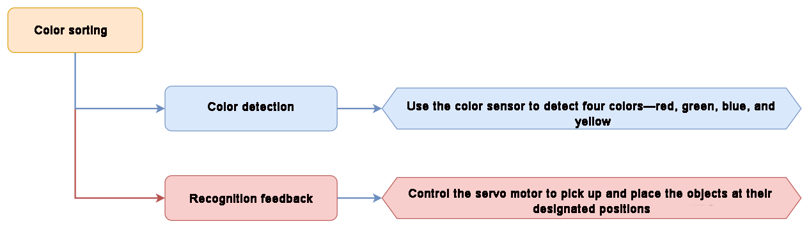

* **Module Instruction**

(1) Color sensor

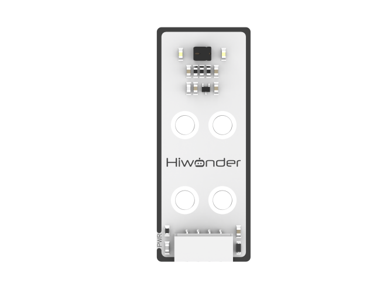

It is a sensor capable of recognizing the color of the measured object, surrounding ambient light intensity, object proximity detection, and non-contact gesture detection, among other functions. The sensor integrates RGB color detection, allowing it to identify various object colors. It also integrates ambient light detection, enabling light intensity measurement under different lighting conditions. With a built-in infrared LED, it can be used for object proximity detection.

Module Wiring: Connect the matrix module to the Port No.5 of the CoreX controller.

(2) Dot Matrix Module

The LED dot matrix module uses an LED display screen that features high brightness, flicker-free display, and easy wiring. It can display numbers, text, patterns, and other content.

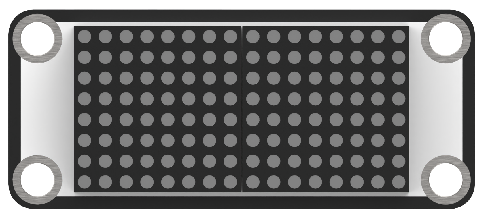

The module consists of two red 8x8 LED lights and is controlled by the TM640B driver chip, enabling control of the dot matrix display.  

**Module Wiring: Connect the dot matrix module to the port No.6 of the CoreX controller.**

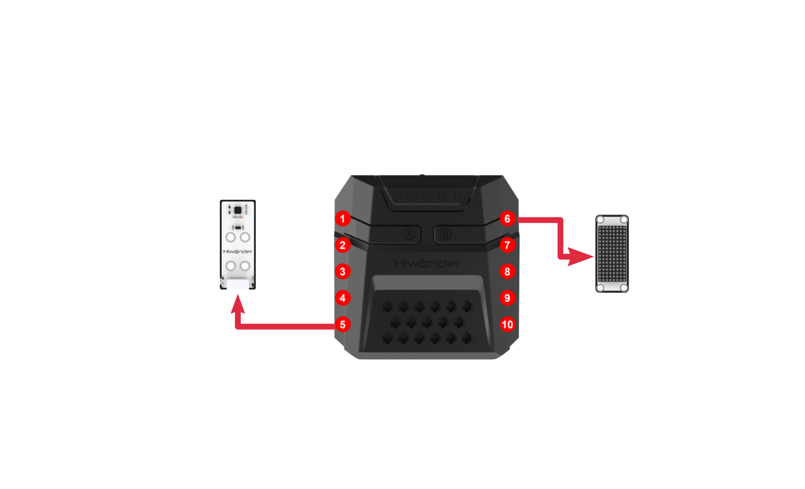

* **Download Program**

(1) Open the WonderCode software.

(2) Drag the program file **"Color Sorting Program.sb3"** located in the same path into WonderCode.

(3) Click on the "**Connect device**" option in the menu bar and select the COM port. In this case, COM7 is used as an example. Once connected successfully, a "**Connection Successful**" message will pop up.

(4) Click on thebutton on the right to download the program to the controller. Wait for the "**Upload Completed**" prompt to appear.

* **Project Outcome**

When red, green blue and yellow objects are identified by the color sensor, the robotic arm will pick them to the corresponding locations.

* **Program Analysis**

(1) Initialize the robotic arm and move it to the initial position using inverse kinematics. Control servo 1 to rotate and open the robotic gripper.

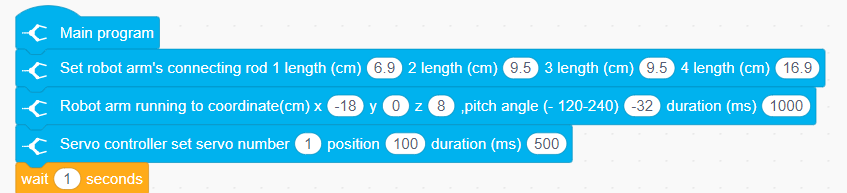

(2) Inside the loop, first turn off the RGB light and clear the display content of the LED matrix.

When the color sensor detects the corresponding color, the processing logic for the four colors is similar. In this case, the process using red detection will be explained as an example:

First, set the RGB light to the corresponding color and display the first letter of the color on the LED matrix. Then, control servo 1 to rotate and move the mechanical gripper to grab the object. Use inverse kinematics to move the robotic arm 90° to the left, lower it to prevent the object from falling, control servo 1 to rotate to release the object, and then use inverse kinematics to raise the robotic arm and return it to the initial position.

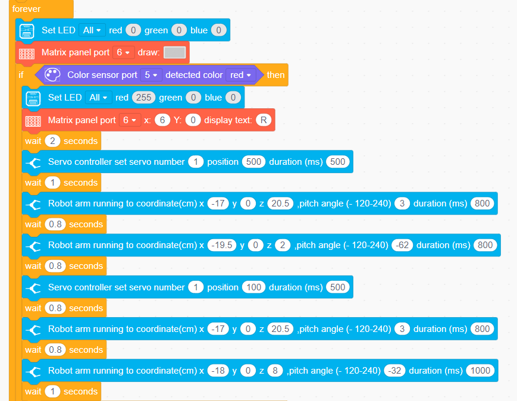

## 4.4 AI Vision Game Course

### 4.4.1 WonderCam AI Vision Module Introduction & Assembly

* **WonderCam Module Introduction**

WonderCam is an user-friendly AI visual sensor with eight built-in functions: color recognition, face recognition, AprilTag recognition, line following, Numeric recognition, Landmark recognition, image classification, and feature learning.

It eliminates the need for complicated training processes and visual algorithms, allowing you to complete AI training with just one click, making it easy to implement various AI vision creative projects.

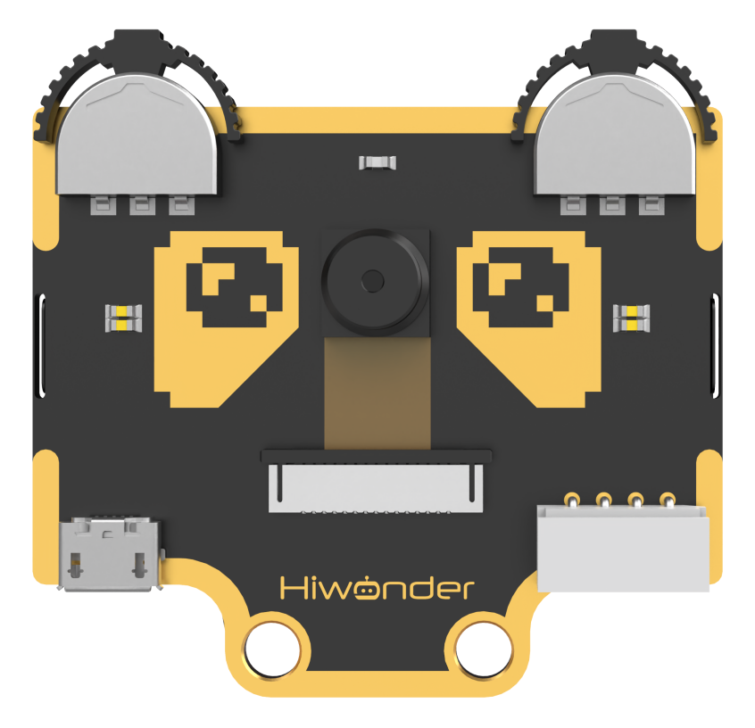

WonderCam is equipped with an I2C interface, enabling the seamless integration with various controllers such as micro:bit, Arduino, Raspberry Pi, and more. It can directly output recognition results to the controller without the need to learn complex algorithms, enabling you to create highly creative AI projects with ease.

* **Function Instruction**

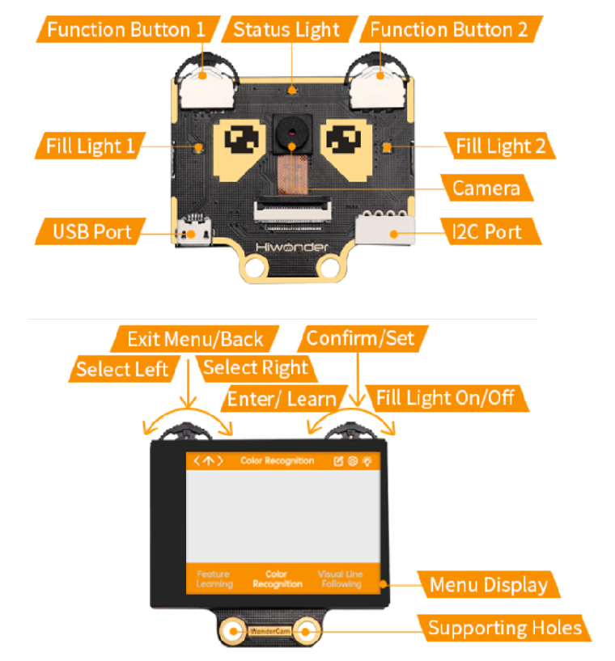

**IIC interface Specification：**

| No.  | Name |     Function      |
| :--: | :--: | :---------------: |
|  1   | SCL  |  I2C Clock Line   |
|  2   | SDA  |   I2C Data Line   |
|  3   | GND  |  Power Negative   |
|  4   |  5V  | 5V Power Positive |

* **Module Assembly & Wiring Connection**

Mount WonderCam vision module to servo No.2 bracket using two M4*6 screws.

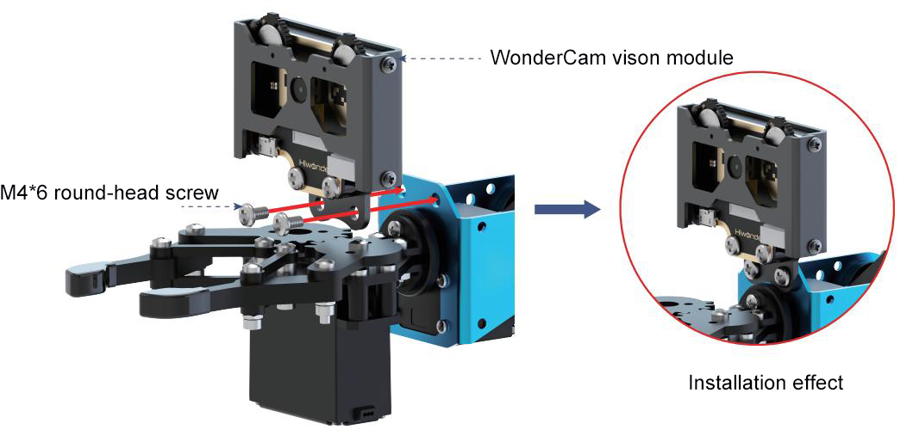

Connect WonderCam vision module to the No.9 I2C interface of the xArm Al using a 4PIN cable.

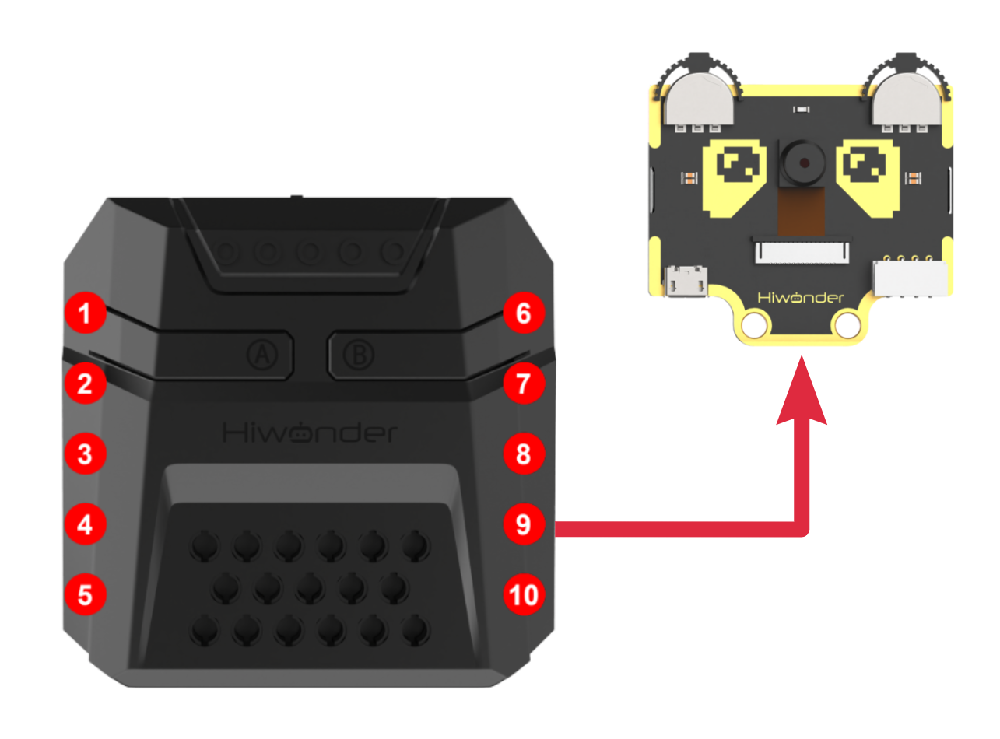

* **Operation Guideline**

(1) Basic Operation

① The WonderCam visual module has left and right buttons, each of which can be moved left, right, or pressed down. Functionally, the two buttons are divided into a navigation button and a function button. The left button is the navigation joystick, while the right is the function joystick. By pushing the right button to the right, you can switch to the **"Face Recognition"** function, as shown in the image below:

② The function of the buttons on the main interface (the default interface after powering on) is as follows:

Navigation button: Moving the navigation button left or right allows you to switch between different menu items.

② On the main interface, moving the navigation button left or right switches between function interfaces. The switch is complete when the progress circle disappears. Holding the joystick down allows for quick switching between functions.

Function button: Opens the function options and confirms selections in the dialog box. Note: Since different function interfaces correspond to different features, the icons will change accordingly.

③ On the main interface, moving the function button to the right can control the turning on and off of the fill light.

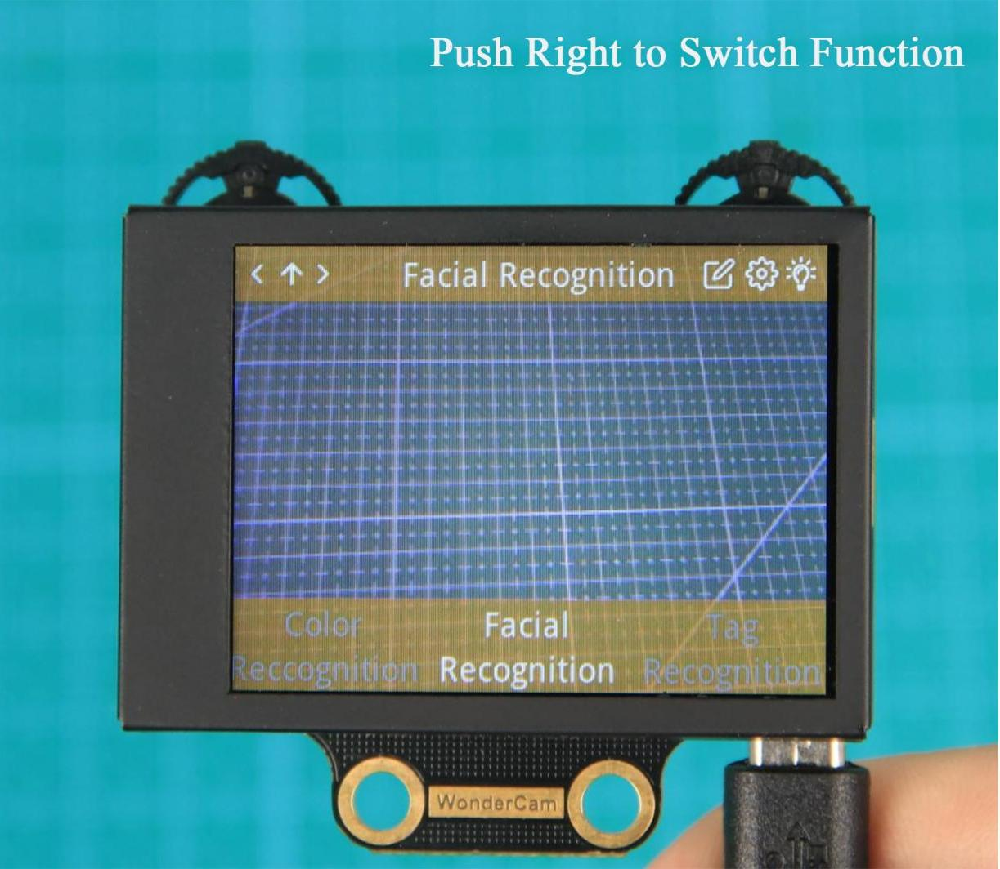

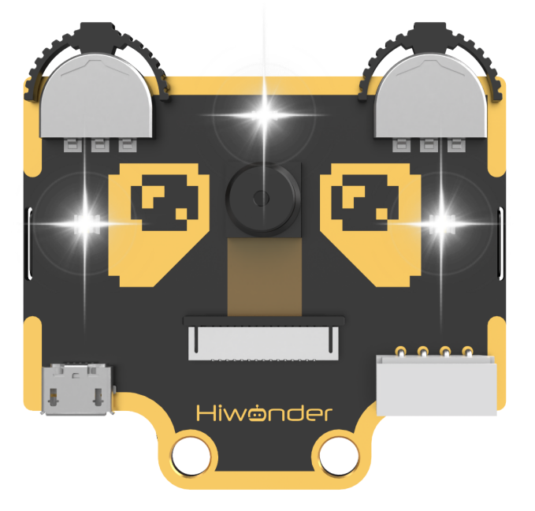

* **Function Settings**

Certain function settings is configurable. For example, face recognition can configure detection threshold level, NMS threshold etc. The functions can be configured when a setting icon display on top right screen.

(1) Operation instruction

Press the button corresponding to the gear icon to enter the parameter settings. For example, in face recognition, the gear icon can be found at the top right center. Press the **Function button** down to enter the parameter settings for face recognition.

(2) Configuration settings

Move the Navigation button left or right to select the parameter to be set, then press the button corresponding to the gear icon again to enter the specific parameter settings. Once in the settings, you can use the Navigation button to move left or right to change the parameter options, and long press to change quickly. After completing the settings, press the OK icon to finish and return to the previous menu.

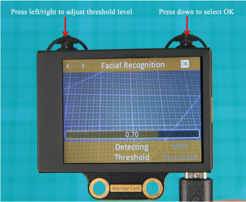

(3) Exiting settings and returning to the main menu:

In the settings interface, pressicon on the Navigation button to bring up the exit dialog box. Follow the prompts and use the Navigation button to select "Yes" or "No."

"Yes" will save the changed parameters.

"No" will discard the changes and restore the original settings.  

After making your selection, press the Function button down to confirm your choice.

* **System settings**

In addition to the function parameters under each feature, there are also system-wide settings, such as system language. This section mainly explains how to set these parameters.

(1) Enter system settings:

On the main interface, move the Navigation button to the right to navigate to the far-right option, which is the "System Settings" option. Then press the gear icon to enter the system settings.

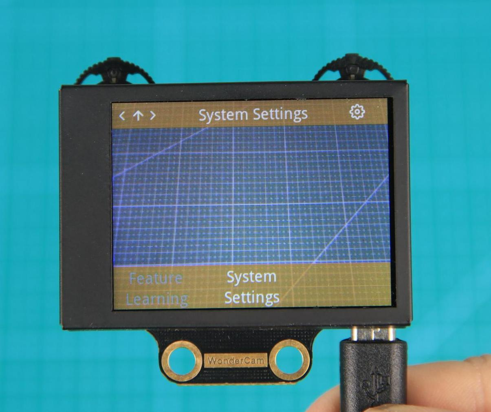

(2) Settings Options

**Display Brightness**: Used to adjust the brightness of the screen.  

② **Fill Light Brightness**: Used to adjust the brightness of the fill light.  

③ **Menu Auto-Hide Time**: Used to set the time for the menu to automatically hide. For example, if set to 30, the menu will automatically hide after 30 seconds of inactivity.  

④ **I2C Address**: Used to configure the I2C slave address of the WonderCam module. The default address is 0x32.  

⑤ **Language**: Used to set the system language, supporting both English and Chinese. After setting, the module will automatically restart to apply the changes.

* **What's the Coordinate System?**

The coordinate system will help you better interpret the output data from the WonderCam visual module in subsequent lessons. The WonderCam module sets the top-left corner of the image as point 0, with the positive X-axis direction extending to the right and the positive Y-axis direction extending downward. The maximum value for the X-axis is 319, and the maximum value for the Y-axis is 239.

### 4.4.2 Color Recognition

**01 Color Recognition Feature Description**

* **Instructions**

(1) Use bright and high saturated color. Example red, green or blue.

(2) Targeted object color and its background must be distinctive. Example if target object is Yellow, avoid yellow background.

Do not learn White color or Composite color. Ensure environment is bright enough or use Fill Light on WonderCam when required.

Adjusting light condition and the focus angle can help to stabilize and improve the color recognition process in the white frame within the display panel.

* **Introduction to Color Recognition function**

WonderCam recognizes and identifies the various colors in the white frame shown within the display. It provides data such as object position and size etc to perform color recognition, color tracking etc.

* **Color Recognition Operations**

(1) Enter Function

The default start-up function on WonderCam is Color Recognition. If not, push Navigation button on WonderCam to left or right to select to Color Recognition menu.

(2) Learning new color and recognizing new color

To use Color Recognition function, program WonderCam to learn about the color first.

Steps are as follows

Step 1: When in the Color Recognition Menu, push Function button to the left once to enter Learning mode.

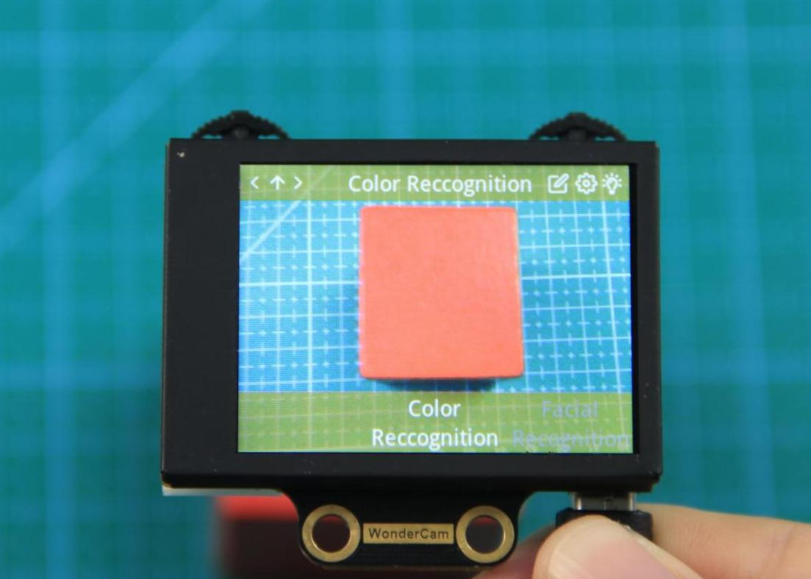

Step 2: In Learning mode, a red + sign will be shown in center of display with menu showing "Color ID:1", "Color ID:2".

Step 3: Focus red + on to the targeted colored object. When target is in focus, a white frame on screen will encapsulate the object.

:::{Reminder}

* Use bright and high saturated color. Example red, green or blue.

* Targeted object color and its background must be distinctive. Example if target object is Yellow, avoid yellow background.

* Do not Learn White color or Composite color. Ensure lighting condition is bright enough or use Fill Light on WonderCam when required.

* Adjusting light condition and the focus angle can help to stabilize and improve the color recognition process in the white frame within the display panel.

:::

Step 4: Push Function button to the left for WonderCam to Learn the color. Wait for Learning successful message display. Push Function button down to OK to complete. If Learning fail, try adjusting lighting condition or change to more distinctive color. Ensure the White frame is stabilized when in focus and push top right button to the left to Learn.

Step 5: When learning is successful and WonderCam detected corresponding color to the ID number it had learned previously, the ID number of the object will be shown on display.

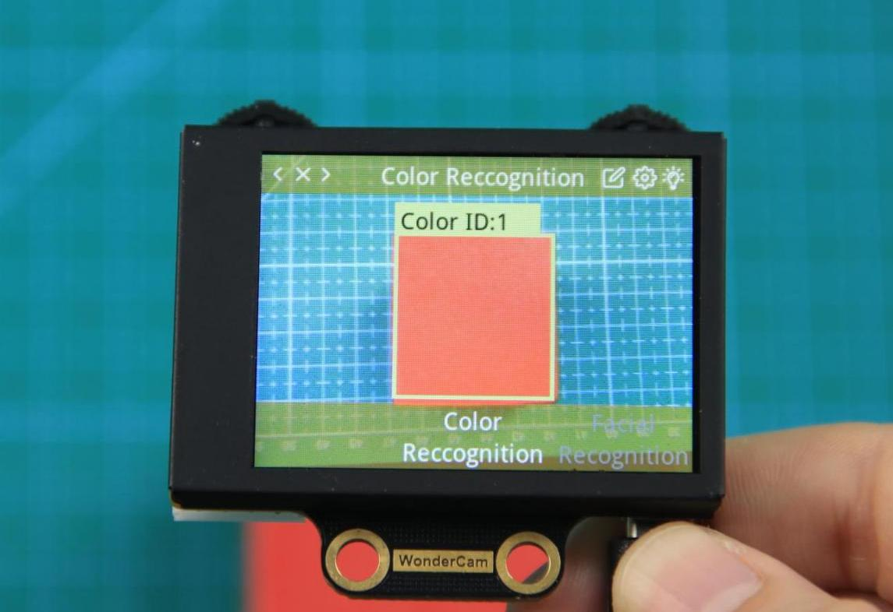

* **Delete Color**

To delete an ID color, enter Color Recognition mode and move to the selected ID by using Navigation button. Select Color ID to delete and push Function button to the right towards Bin icon. Push Function button down to select OK to delete.

* **Color Recognition Function Settings**

In the Color Recognition main menu, press Function button down to enter Settings interface.

Available for configurations are: Color Range and Reset.

(1) Color Range: This controls the White Frame parameter size in detecting the target object color variation. Higher value will enlarge White Frame size and will cover wider range of color variation on the display. Lower value will reduce White Frame size and focus on smaller portion of color. Range value at 20 is optimum in most situation.

(2) Reset. This will reset to factory default value. Do note to Save settings to effective the reset settings.

**02  Color Recognition** 

* **Project Introduction**

This section demonstrates how xArm AI uses the WonderCam Vision Module to recognize red, green, blue, and yellow objects, and place them to the corresponding locations.

* **Program Logic**

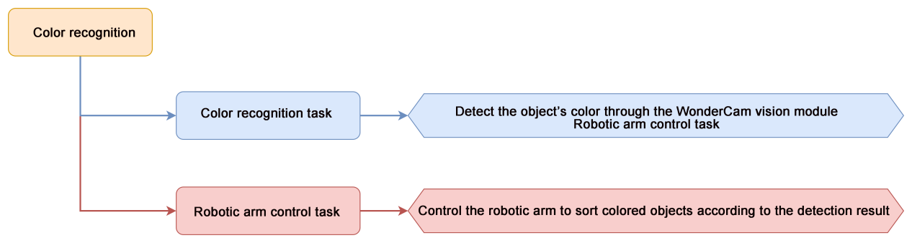

* **Module Instruction**

WonderCam is an user-friendly AI visual sensor with eight built-in functions: color recognition, face recognition, AprilTag recognition, line following, Numeric recognition, Landmark recognition, image classification, and feature learning. It can be used with various controllers like ESP32, micro:bit, Arduino, and Raspberry Pi, enabling you to easily implement a wide range of AI visual creative projects.

**Module Wiring: Connect WonderCam module to the port No.9 on the CoreX controller.**

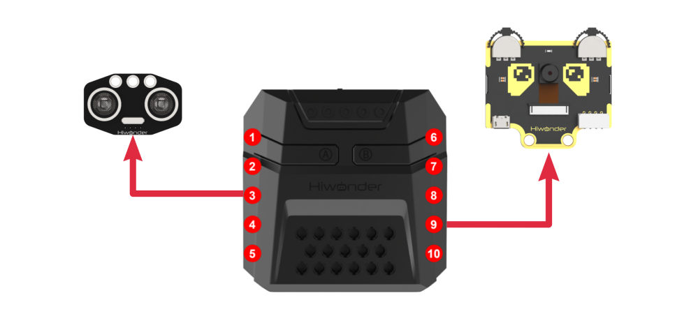

* **Download Program**

(1) Open the WonderCode software.

(2) Drag the program file "[**Color Recognition Program.sb3**]()" located in the same path into WonderCode.

(3) Click on the "**Connect device**" option in the menu bar and select the COM port. In this case, COM7 is used as an example. Once connected successfully, a "**Connection Successful**" message will pop up.

(4) Click on thebutton on the right to download the program to the controller. Wait for the "**Upload Completed**" prompt to appear.

* **Project Outcome**

WonderCam wision module recognizes red, green, blue, and yellow blocks and places them into the corresponding areas.

* **Program Analysis**

(1) Initialize the xArm AI, create variables, and switch the WonderCam visual module functionality to color recognition.

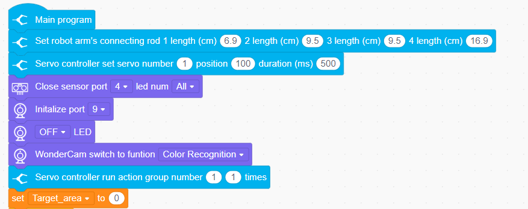

(2) Continuously update the camera results and detect the colors in the loop. Based on the detected color, display the corresponding RGB color, play the buzzer sound, and perform different actions.

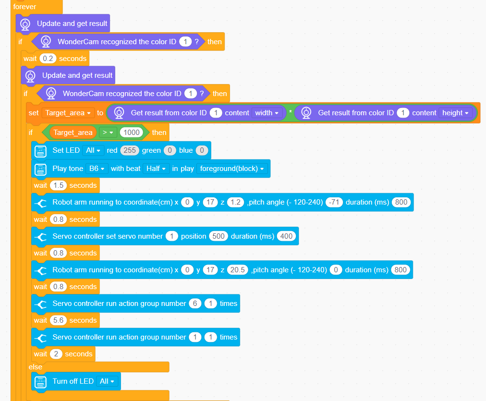

### 4.4.3 Color Tracking

[01 Color Recognition Feature Description]()

**02 Color Tracking**

* **Project Introduction**

In this lesson, we will use the WonderCam visionl module to detect the color with ID 1 (red) and simultaneously control the robotic arm to track it.  

:::{Note}

Before the WonderCam vision module can recognize colors, it needs to first learn the corresponding colors. The colors to be learned are as follows: ID1 - Red, ID2 - Green, ID3 - Blue, ID4 - Yellow.

:::

* **Program Logic**

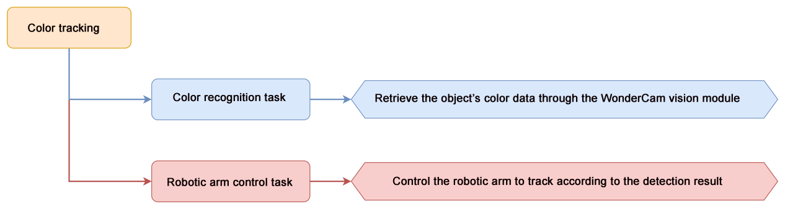

* **Module Instruction**

WonderCam is an user-friendly AI visual sensor with eight built-in functions: color recognition, face recognition, AprilTag recognition, line following, Numeric recognition, Landmark recognition, image classification, and feature learning. It can be used with various controllers like ESP32, micro:bit, Arduino, and Raspberry Pi, enabling you to easily implement a wide range of AI visual creative projects.

**Module Wiring: Connect WonderCam module to the port No.9 of the CoreX controller.**

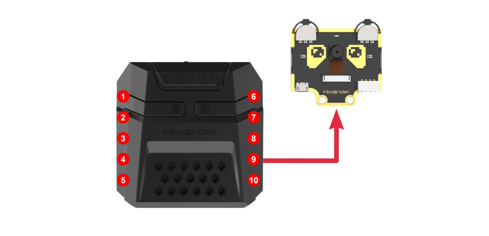

* **Download Program**

(1) Open the WonderCode software.

(2) Drag the program file "[**Color Tracking Program.sb3**]()" located in the same path into WonderCode.

(3) Click on the "**Connect device**" option in the menu bar and select the COM port. In this case, COM7 is used as an example. Once connected successfully, a "**Connection Successful**" message will pop up.

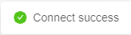

(4) Click on thebutton on the right to download the program to the controller. Wait for the "**Upload Completed**" prompt to appear.

* **Project Outcome**

When moving the red sponge block in front of the WonderCam module, xArm AI will follow the movement of the ball.

* **Program Analysis**

(1) Initialize the WonderCam vision module, turn off the ultrasonic color lights (to prevent misidentification), set the basic parameters for the robotic arm, and control the robotic arm to move to the initial position.

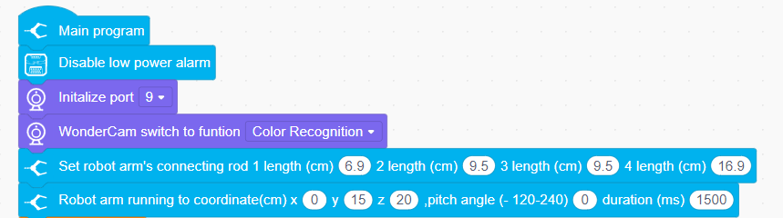

(2) Set the basic parameters required for recognition. x: the horizontal width (in pixels) of the module screen, y: the vertical width (in pixels) of the module screen, and the target area, initially set to 0.

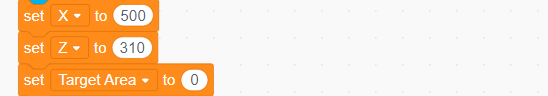

(3) Update and obtain the recognition result for color ID 1, and calculate the target area. When the target area is greater than 1000, obtain the coordinates of the center point (x, y) of the target color block on the screen.

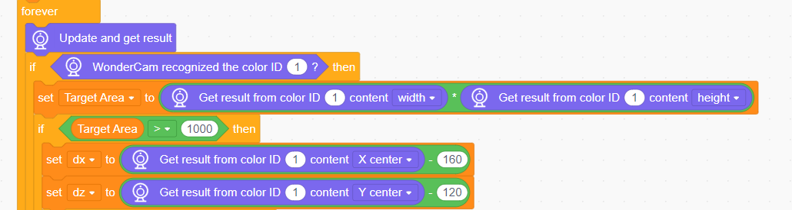

(4) Calculate the angle for the left and right adjustment of the robotic arm, and control the rotation of the robotic arm's servo ID6.

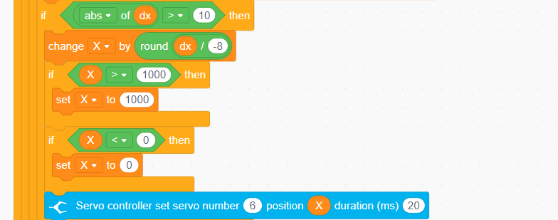

(5) Calculate the angle for the up and down adjustment of the robotic arm, and control the rotation of servo ID3.

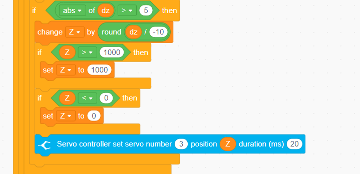

* **Function Extension**

This lesson demonstrates the color tracking function by directly assigning values to a single servo. We can also achieve color tracking through inverse kinematics. In this case, regard the robotic arm's end effector as performing circular motion, while the robotic arm moves up and down along the Z-axis to follow the color.

(1) Initialize the WonderCam vision module, turn off the ultrasonic color lights (to prevent misidentification), set the basic parameters of the robotic arm, and control it to move to the initial position.

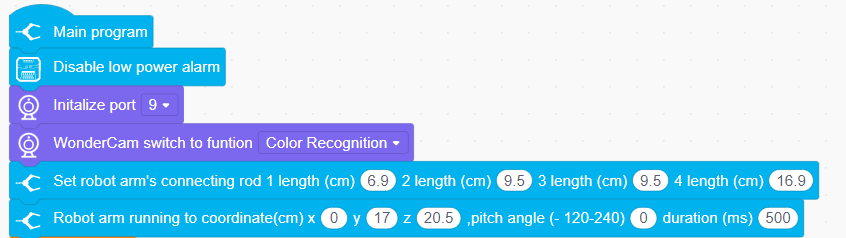

(2) Set the basic parameters required for recognition.

x, y, z: The initial coordinates of the robotic arm.

x_execution: The value for movement along the x-axis of the robotic arm.

y_execution: The value for movement along the y-axis of the robotic arm.

z_execution: The value for movement along the z-axis of the robotic arm.

Radius: The radius of the robotic arm's left-right rotation, fixed at 17.

Target Area: The area of the color block to be recognized, initially set to

Motion Status: A flag variable indicating whether the robotic arm is in motion.

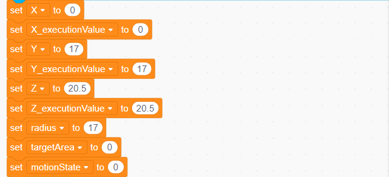

(3) Update and retrieve the recognition result for color ID 1, and calculate the target area. When the target area is greater than 1000, obtain the (x, y) coordinates of the center point of the target color block on the screen.

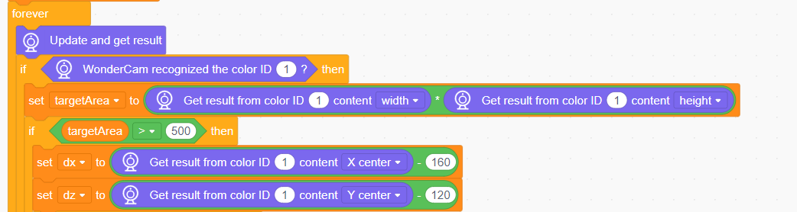

(4) Calculate the movement position along the z-axis of the robotic arm and set the threshold range to \[16.4, 25.8\].

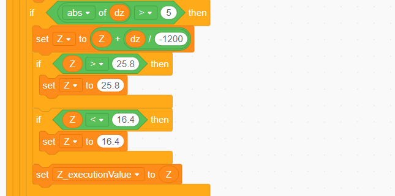

(5) Calculate the movement position along the x-axis of the robotic arm and set the threshold range to \[-17, 17\]. Finally, set the motion status to 1 to start moving the robotic arm.

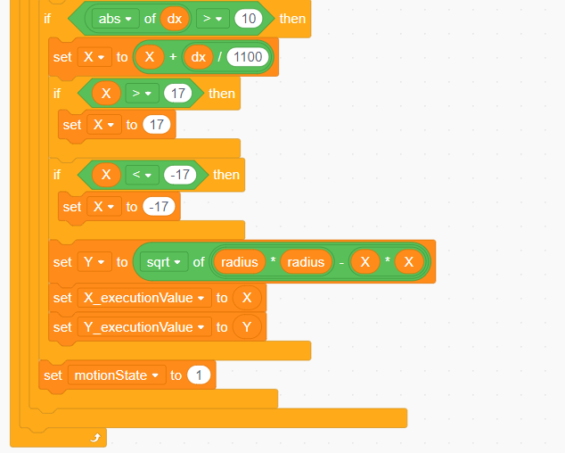

(6) In another main program, control the robotic arm to move according to the calculated positions along the coordinate axes.

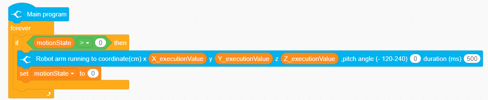

### 4.4.4 Tag Recognition

**01 Facial Recognition Feature Description**

For this lesson, Face template can be found in the lesson folder.

* **Instructions**

(1) To Learn Facial, point + to center of face for higher accuracy in learning.

(2) Use proper front facing Facial photograph for Face Template.

(3) Ensure environment is bright enough or use Fill Light on WonderCam when required.

* **Introduction to Facial Recognition Function**

Through face detection and facial recognition on the screen display, WonderCam provides data such as Face position and size etc.

* **Facial Recognition Operations**

(1) Enter Function

Push Navigation button to Facial Recognition menu.

(2) Face Detection

Once WonderCam is in Facial Recognition mode, face detection will automatically be activated. When face is detected, a white frame will appear on screen to enclose the detected face.

(3) Learning and Recognizing Face

To recognize specific face, WonderCam need to learn to recognize the face.

① Learn Single Face

Step 1: Push Function button to left to enter Learn mode.

When enter to Learn model, a "+"will appear in the middle of screen, menu will show "Face ID:1", "Face ID:2" etc. The ID is to tag and save different Faces.

Step 2: Point on screen "+" to center of Face. Take note of the pointers given in Instructions.

Step 3: When face is centered, push Function button to the left camera icon to learn the face. When learning is successful, push Function button down once to OK and complete the learning process. If the learning is successful, when camera detected the face, WonderCam will display the corresponding ID on screen.

② Learn Multiple Faces

To learn more faces, when in Learning mode, push Navigation button to the right to to other ID number and repeat earlier process.

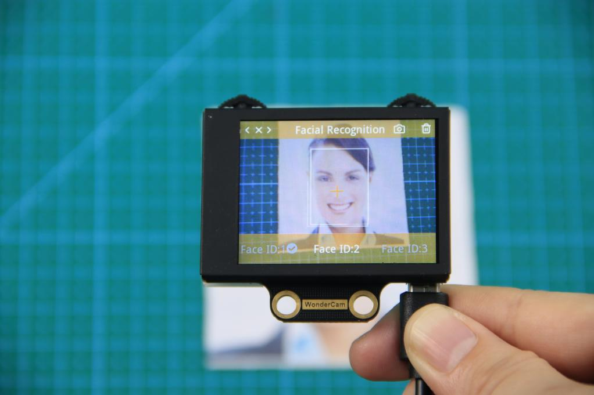

③ Recognizing Faces

When learning multiple faces is completed, Wondercam is able to display multiple faces detected in same display frame with their corresponding ID.

④ Delete Face

To delete Face ID that is no longer required. In Face Recognition Learning mode, push Navigation button to the Face ID number targeted to delete. Push Function button to the right toward Bin icon, push Function button down to OK to delete.

* **Facial Recognition Function Settings**

In Facial Recognition main menu, press Function button down toward Gear icon to enter Settings interface.

Available for configurations are: Detecting Threshold, NMS Threshold, Recognition Threshold and Reset.

① Detecting Threshold: To set threshold is recognizing face. Higher value will have higher accuracy rate. However, higher value will also resulted in lower face detection rate.

② NMS Threshold:Non- Maximum Suppression is a computer vision method. Leave it at default value.

③ Recognition Threshold:Settings for specific Face ID. Higher value will have higher accuracy rate. However, higher value may result in unable to recognize or only recognize at specific part or angle of the face.

④ Reset: This will erase all previous recordings and reset to factory default value. Do note to Save settings to effective the reset settings.

**02 Tag Recognition**

* **Project Introduction**

xArm AI will recognize the Tag IDs 1-4 through WonderCam vision module, and execute the sorting tasks based on the recognition results.

* **Program Logic**

* **Module Instruction**

WonderCam is an user-friendly AI visual sensor with eight built-in functions: color recognition, face recognition, Tag recognition, line following, Numeric recognition, Landmark recognition, image classification, and feature learning. It can be used with various controllers like ESP32, micro:bit, Arduino, and Raspberry Pi, enabling you to easily implement a wide range of AI visual creative projects.

**Module Wiring: Connect WonderCam module to the port No.9 on the CoreX controller.**

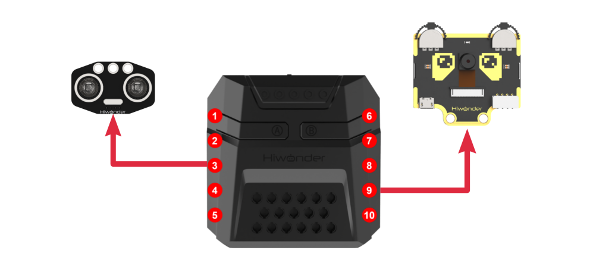

* **Download Program**

(1) Open the WonderCode software.

(2) Drag the program file [Tag Recognition Program.sb3]() located in the same path into WonderCode.

(3) Click on the "**Connect device**" option in the menu bar and select the COM port. In this case, COM7 is used as an example. Once connected successfully, a "**Connection Successful**" message will pop up.

(4) Click on thebutton on the right to download the program to the controller. Wait for the "**Upload Completed**" prompt to appear.

* **Project Outcome**

WonderCam vision module recognizes tag IDs 1, 2, 3, and 4, and the robotic arm then grabs each item and places it in the corresponding position.

* **Program Analysis**

(1) Initialize the robot, create variables, and switch the WonderCam vision module to tag recognition mode.

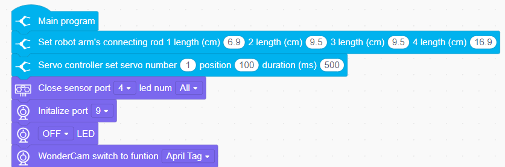

(2) In the loop function, if tag ID 1 is detected, light up the corresponding RGB and grab the tag block. For other tag IDs, grab them and place them in their respective corresponding positions.

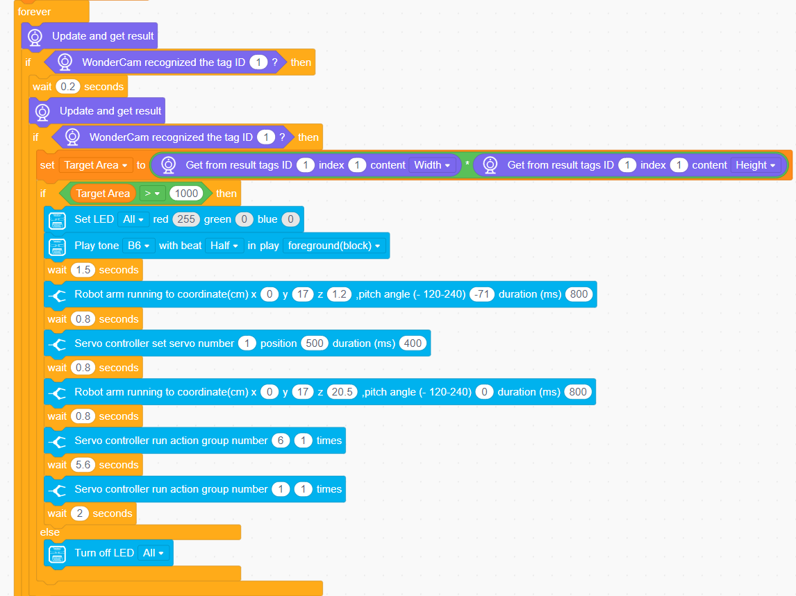

### 4.4.5 Tag Tracking

[01 Facial Recognition Feature Description]()

**02 Tag Tracking**

* **Project Introduction**

Utilize WonderCam vision module to detect Tag ID1, while simultaneously controlling the robotic arm to track the tag.

* **Program Logic**

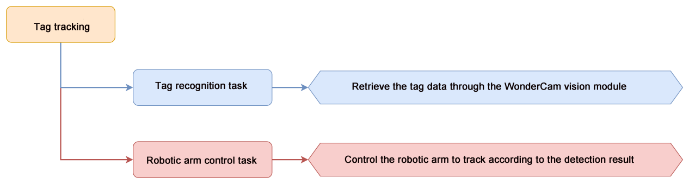

* **Module Instruction**

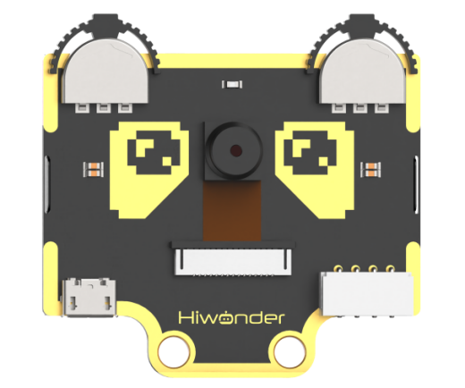

WonderCam is an user-friendly AI visual sensor with eight built-in functions: color recognition, face recognition, AprilTag recognition, line following, Numeric recognition, Landmark recognition, image classification, and feature learning. It can be used with various controllers like ESP32, micro:bit, Arduino, and Raspberry Pi, enabling you to easily implement a wide range of AI visual creative projects.

**Module Wiring: Connect WonderCam module to the port No.9 on the CoreX controller.**

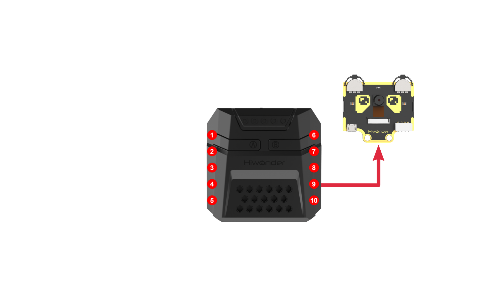

* **Download Program**

(1) Open the WonderCode software.

(2) Drag the program file [Tag Tracking Program.sb3]() located in the same path into WonderCode.

(3) Click on the "**Connect device**" option in the menu bar and select the COM port. In this case, COM7 is used as an example. Once connected successfully, a "Connection Successful" message will pop up.

(4) Click on thebutton on the right to download the program to the controller. Wait for the "**Upload Completed**" prompt to appear.

* **Project Outcome**

When WonderCam vision module detects tag ID 1, it will control the robotic arm to track tag ID 1.

* **Program Analysis**

(1) Initialize the WonderCam vision module, turn off the ultrasonic color lights (to prevent misidentification), set the basic parameters for the robotic arm, and control the robotic arm to move to the initial position.

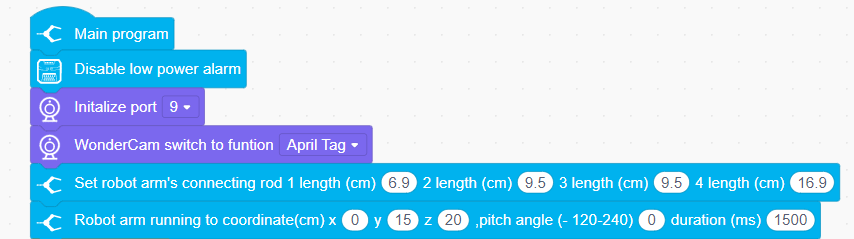

(2) Set the basic parameters required for recognition. x: the horizontal width (in pixels) of the module screen, y: the vertical width (in pixels) of the module screen, and the target area, initially set to 0.

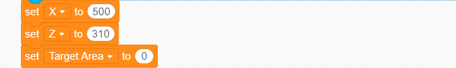

(3) Update and obtain the recognition result for color ID 1, and calculate the target area. When the target area is greater than 1000, obtain the coordinates of the center point (x, y) of the target color block on the screen.

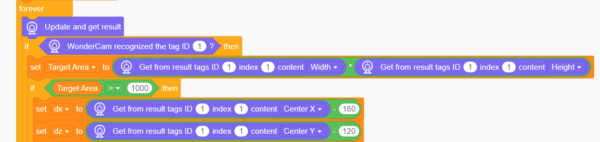

(4) Calculate the angle for the left and right adjustment of the robotic arm, and control the rotation of the robotic arm's servo ID6.

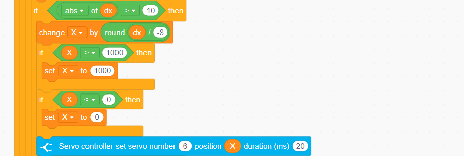

(5) Calculate the angle for the up and down adjustment of the robotic arm, and control the rotation of servo ID3.

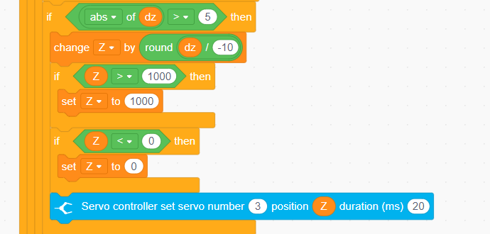

### 4.4.6 Face Recognition

**01 Facial Recognition Feature Description**

For this lesson, Face template can be found in the lesson folder.

* **Instructions**

(1) To Learn Facial, point + to center of face for higher accuracy in learning.

(2) Use proper front facing Facial photograph for Face Template.

(3) Ensure environment is bright enough or use Fill Light on WonderCam when required.

* **Introduction to Facial Recognition Function**

Through face detection and facial recognition on the screen display, WonderCam provides data such as Face position and size etc.

* **Facial Recognition Operations**

(1) Enter Function

Push Navigation button to Facial Recognition menu.

(2) Face Detection

Once WonderCam is in Facial Recognition mode, face detection will automatically be activated. When face is detected, a white frame will appear on screen to enclose the detected face.

(3) Learning and Recognizing Face

To recognize specific face, WonderCam need to learn to recognize the face.

① Learn Single Face

Step 1: Push Function button to left to enter Learn mode.

When enter to Learn model, a "+"will appear in the middle of screen, menu will show "Face ID:1", "Face ID:2" etc. The ID is to tag and save different Faces.

Step 2: Point on screen "+" to center of Face. Take note of the pointers given in Instructions.

Step 3: When face is centered, push Function button to the left camera icon to learn the face. When learning is successful, push Function button down once to OK and complete the learning process. If the learning is successful, when camera detected the face, WonderCam will display the corresponding ID on screen.

② Learn Multiple Faces

To learn more faces, when in Learning mode, push Navigation button to the right to to other ID number and repeat earlier process.

③ Recognizing Faces

When learning multiple faces is completed, Wondercam is able to display multiple faces detected in same display frame with their corresponding ID.

④ Delete Face

To delete Face ID that is no longer required. In Face Recognition Learning mode, push Navigation button to the Face ID number targeted to delete. Push Function button to the right toward Bin icon, push Function button down to OK to delete.

* **Facial Recognition Function Settings**

In Facial Recognition main menu, press Function button down toward Gear icon to enter Settings interface.

Available for configurations are: Detecting Threshold, NMS Threshold, Recognition Threshold and Reset.

① Detecting Threshold: To set threshold is recognizing face. Higher value will have higher accuracy rate. However, higher value will also resulted in lower face detection rate.

② NMS Threshold:Non- Maximum Suppression is a computer vision method. Leave it at default value.

③ Recognition Threshold:Settings for specific Face ID. Higher value will have higher accuracy rate. However, higher value may result in unable to recognize or only recognize at specific part or angle of the face.

④ Reset: This will erase all previous recordings and reset to factory default value. Do note to Save settings to effective the reset settings.

**02 Face Recognition**

* **Project Introduction**

Utilize WonderCam vision module to detect any face. Once a face is detected, the dot motrix module will display a greeting message, and the gripper will perform a greeting gesture.

* **Program Logic**

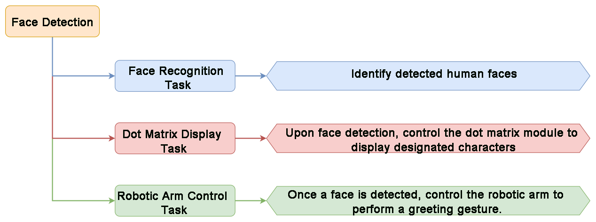

* **Module Instruction**

WonderCam is an user-friendly AI visual sensor with eight built-in functions: color recognition, face recognition, AprilTag recognition, line following, Numeric recognition, Landmark recognition, image classification, and feature learning. It can be used with various controllers like ESP32, micro:bit, Arduino, and Raspberry Pi, enabling you to easily implement a wide range of AI visual creative projects.

**Module Wiring: Connect WonderCam module to the port No.9 on the CoreX controller.**

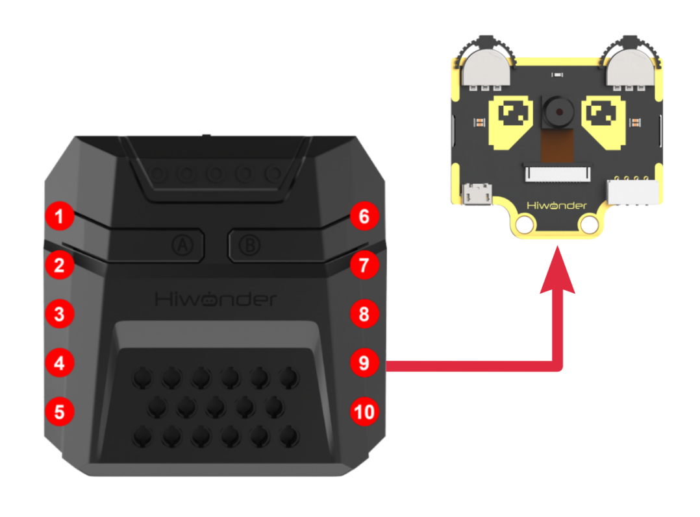

* **Download Program**

(1) Open the WonderCode software.

(2) Drag the program file [Face Tracking Program.sb3]() located in the same path into WonderCode.

(3) Click on the "**Connect device**" option in the menu bar and select the COM port. In this case, COM7 is used as an example. Once connected successfully, a "**Connection Successful**" message will pop up.

(4) Click on thebutton on the right to download the program to the controller. Wait for the "**Upload Completed**" prompt to appear.

* **Project Outcome**

When WonderCam module detects any face, xArm AI will display the "Hello" character on the dot matrix module and control the gripper to open and close.

* **Program Analysis**

(1) Initialize the robot, create variables, and switch the WonderCam vision module to face recognition mode.

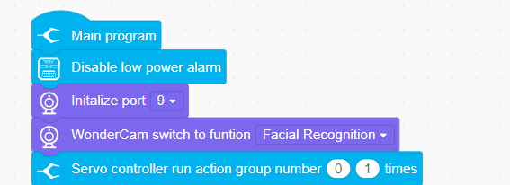

(2) Continuously update the camera's result in the loop and detect faces. If any face is detected, display the "Hello" string on the dot matrix module and control the gripper to open and close once.

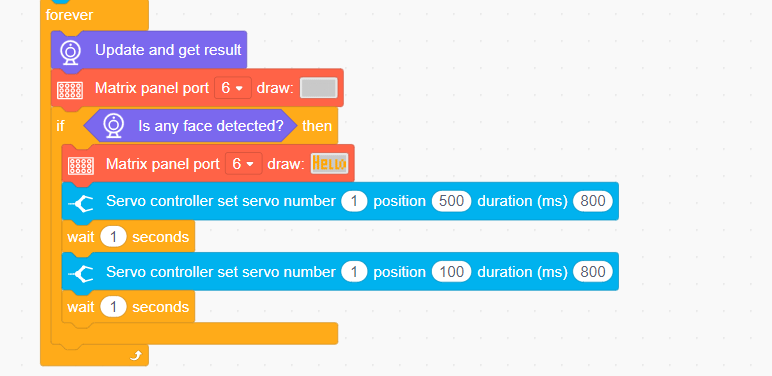

### 4.4.7 Face Tracking

[01 Facial Recognition Feature Description]()

**02 Face Tracking**

* **Project Introduction**

xArm AI utilizes the WonderCam vision module detects faces, while the robotic arm moves in the direction of the detected face.

* **Program Logic**

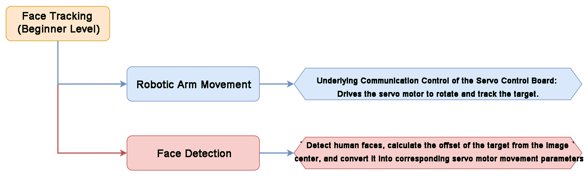

* **Module Instruction**

WonderCam is an user-friendly AI visual sensor with eight built-in functions: color recognition, face recognition, AprilTag recognition, line following, Numeric recognition, Landmark recognition, image classification, and feature learning. It can be used with various controllers like ESP32, micro:bit, Arduino, and Raspberry Pi, enabling you to easily implement a wide range of AI visual creative projects.

**Module Wiring: Connect WonderCam module to the port No.9 on the CoreX controller.**

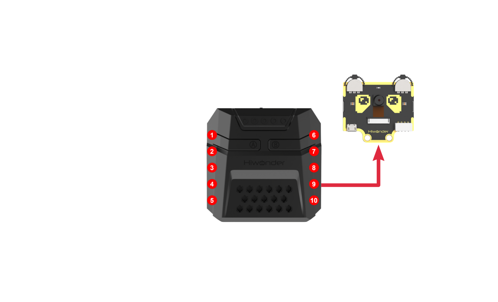

* **Download Program**

(1) Open the WonderCode software.

(2) Drag the program file [Face Tracking Program.sb3]() located in the same path into WonderCode.

(3) Click on the "**Connect device**" option in the menu bar and select the COM port. In this case, COM7 is used as an example. Once connected successfully, a "**Upload Completed**" message will pop up.

(4) Click on thebutton on the right to download the program to the controller. Wait for the "**Upload Completed**" prompt to appear.

* **Project Outcome**

When moving the face in front of the WonderCam vision module camera, the robotic arm will follow the movement of the face.

* **Program Analysis**

(1) Initialize the WonderCam vision module, turn off the ultrasonic color lights (to prevent misidentification), execute action group No.0 to restore the robotic arm to its initial posture.

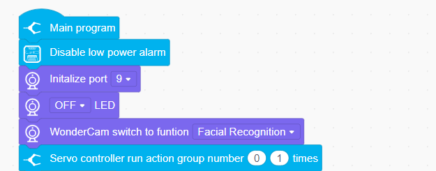

(2) Set the basic parameters required for recognition.

x: The horizontal width (in pixels) of the module screen.

y: The vertical width (in pixels) of the module screen.

variation: The angle value that the servo motor changes when searching for a face.

face_index: The ID of the detected face.

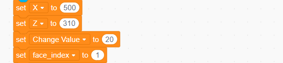

(3) Update and retrieve the face recognition results. If a previously learned face is detected, continuously obtain the face ID and calculate the center point (x, y) coordinates.

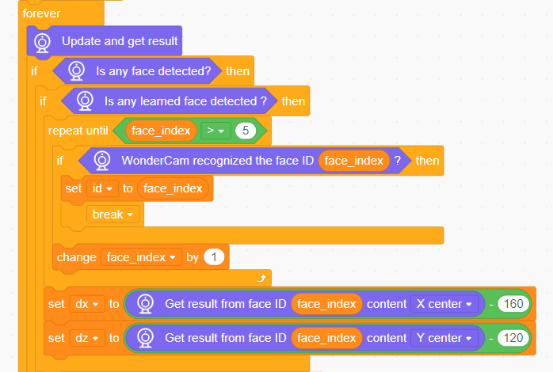

(4) If an unlearned face is detected, directly obtain the center point (x, y) coordinates of the first unlearned face.

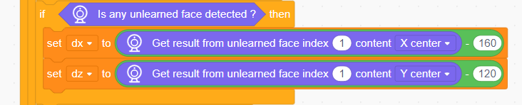

(5) Based on the obtained x-coordinate value, calculate the angle for the robotic arm's left-right movement and control the rotation of servo ID6.

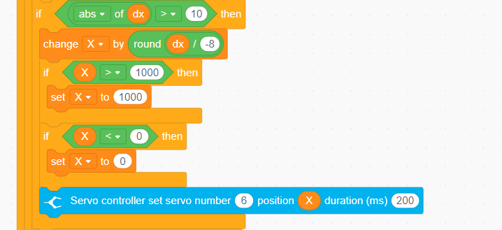

(6) Based on the calculated y-coordinate value, determine the position for the robotic arm's up-down movement and control the rotation of servo ID3.

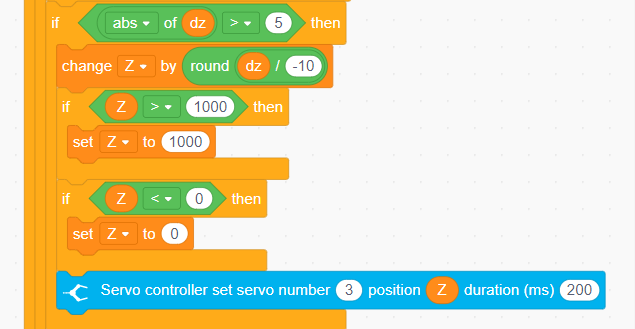

(7) Finally, if no face is detected, control servo ID3 to return to the initial position and make servo ID6 perform a left-right cyclic rotation to search for a face.

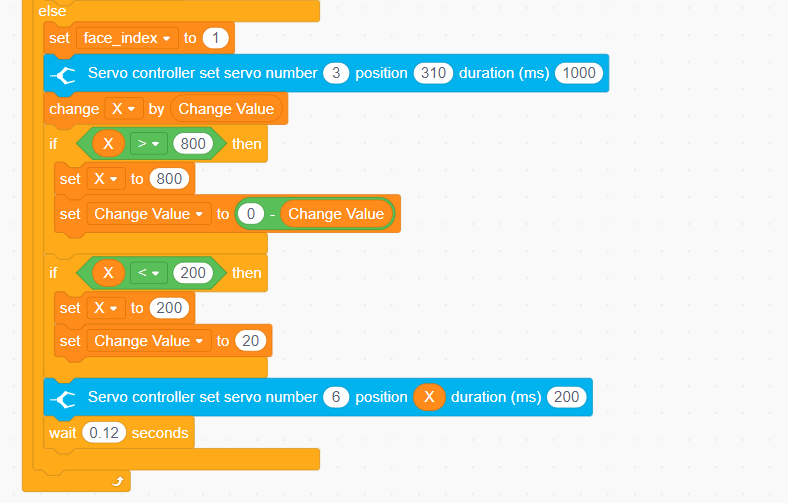

### 4.4.8 Waste Sorting

**01 Waste Sorting Feature Description**

* **Important Guidelines for Image Classification**

For best results, maintain a distance of approximately 15–20 cm between the card and the camera. Avoid dim lighting conditions, and use a plain, solid-colored background—preferably white—to ensure optimal image recognition accuracy.

* **Overview of the Image Classification Feature**

The image classification feature utilizes a pre-trained MobileNet model to categorize images based on their visual characteristics. This enables applications such as icon recognition, waste sorting, and more.

The WonderCam vision module comes with a built-in model that supports classification of 12 different cards. It is compatible with the included waste sorting cards, making it easy to test and explore classification capabilities right out of the box.

* **Image Classification Instructions**

(1) Entering Image Classification Mode

Gently push the navigation joystick to the right until the **"Image Classification"** menu appears at the top of the screen.

(2) Running Image Classification

Once the image classification feature is activated, you can begin testing with the 12 included waste-sorting cards. Each card is assigned a unique ID. During operation, the WonderCam vision module will display the ID with the highest confidence score, along with its confidence value.

A confidence score closer to 1.0 indicates a more accurate and reliable recognition result.

Tips for Best Performance:

- Keep the card at an optimal distance of **15–20 cm** from the camera.

- Avoid dim lighting conditions.

- Use a **plain, solid background**—**white** is recommended for best results.

|                          **Image**                           | **Corresponding ID** |                          **Image**                           | **Corresponding ID** |
| :----------------------------------------------------------: | :------------------: | :----------------------------------------------------------: | :------------------: |
|                       White Background                       |          1           |  |          2           |
| 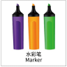 |          3           |  |          4           |
|  |          5           |  |          6           |
|  |          7           |  |          8           |
|  |          9           |  |          10          |
|  |          11          |  |          12          |
|  |          13          |                                                              |                      |

**02 Waste Sorting**

* **Project Introduction**

WonderCam vision module will recognize the waste cards, and sort them into the corresponding waste categories for placement in the designated areas.

* **Program Logic**

* **Module Instruction**

WonderCam is an user-friendly AI visual sensor with eight built-in functions: color recognition, face recognition, AprilTag recognition, line following, Numeric recognition, Landmark recognition, image classification, and feature learning. It can be used with various controllers like ESP32, micro:bit, Arduino, and Raspberry Pi, enabling you to easily implement a wide range of AI visual creative projects.

**Module Wiring: Connect WonderCam module to the port No.9 on the CoreX controller.**

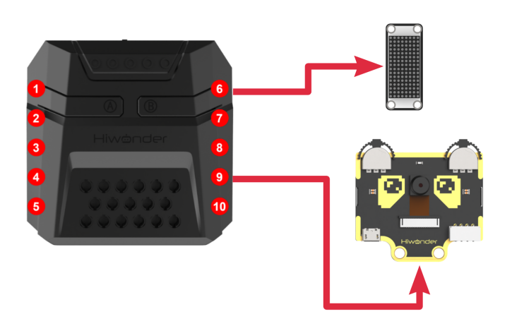

* **Download Program**

(1) Open the WonderCode software.

(2) Drag the program file [Waste Sorting Program.sb3]() located in the same path into WonderCode.

(3) Click on the "**Connect device**" option in the menu bar and select the COM port. In this case, COM7 is used as an example. Once connected successfully, a "**Upload Completed**" message will pop up.

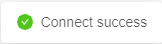

(4) Click on thebutton on the right to download the program to the controller. Wait for the "**Download Successful**" prompt to appear.

* **Project Outcome**

:::{Note}

If the current firmware of the WonderCam module is the "Mask Recognition" firmware, please refer to the tutorials under "Firmware Flashing Method" document in the "[WonderCam Firmware Flashing Tool and Flashing Method]()" to flash the default firmware to the WonderCam module.

:::

WonderCam vision module detects waste cards, classifies them into different waste types, and controls the robotic arm to pick them up and place them in the corresponding waste category area.

* **Program Analysis**

(1) Initialize the WonderCam vision module, turn off the ultrasonic LED light (to prevent misidentification), execute action group No.0 to restore the robotic arm to its initial posture.

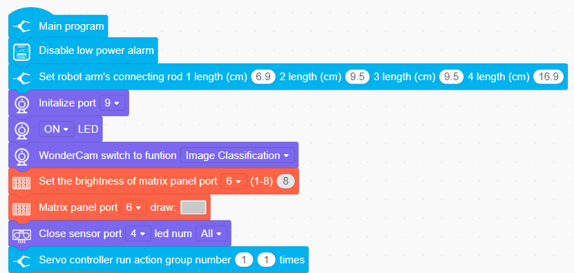

(2) Update and retrieve the recognition results. Use the "count" variable to obtain the specific recognized image ID. If the same image is recognized 5 times, the image is confirmed as the recognized one.

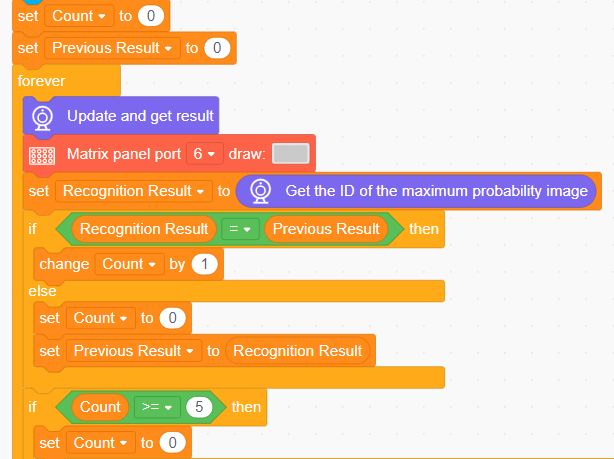

(3) If an image with ID 2 to 4 is recognized, it indicates hazardous waste. Control the robotic arm to pick it up and place it in the hazardous waste area.

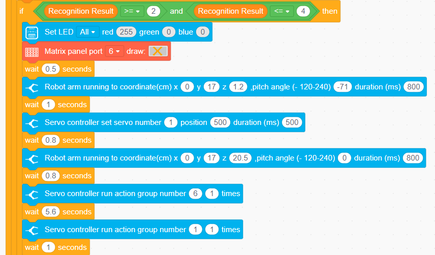

(4) If ID 5 to 7 is recognized, it indicates recyclable materials; if ID 8 to 10 is recognized, it indicates residual waste; if ID 11 to 13 is recognized, it indicates other waste. Control the robotic arm to pick it up and place it in the designated location.

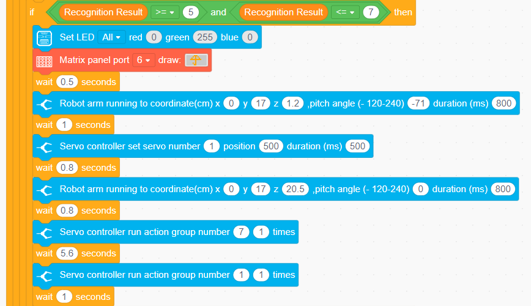

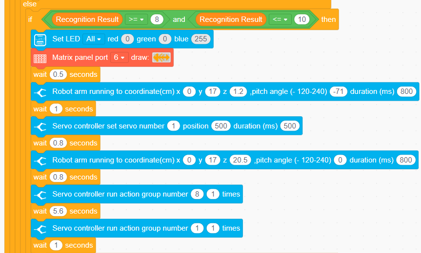

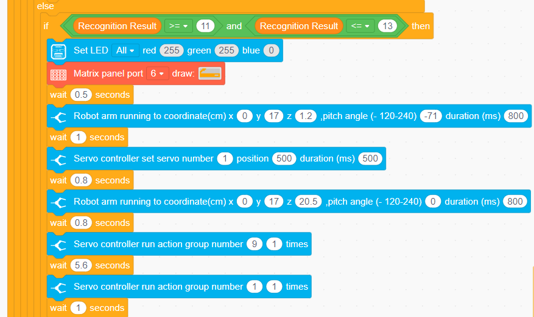

### 4.4.9 Mask Recognition

* **Project Introduction**

Utilize WonderCam vision module to recognize the waste cards, and display the corresponding category icon on the LED dot matrix.

* **Program Logic**

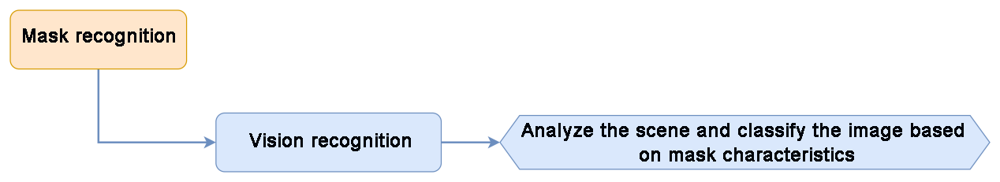

* **Module Instruction**

WonderCam is an user-friendly AI visual sensor with eight built-in functions: color recognition, face recognition, AprilTag recognition, line following, Numeric recognition, Landmark recognition, image classification, and feature learning. It can be used with various controllers like ESP32, micro:bit, Arduino, and Raspberry Pi, enabling you to easily implement a wide range of AI visual creative projects.

**Module Wiring: Connect WonderCam module to the port No.9 on the CoreX controller.**

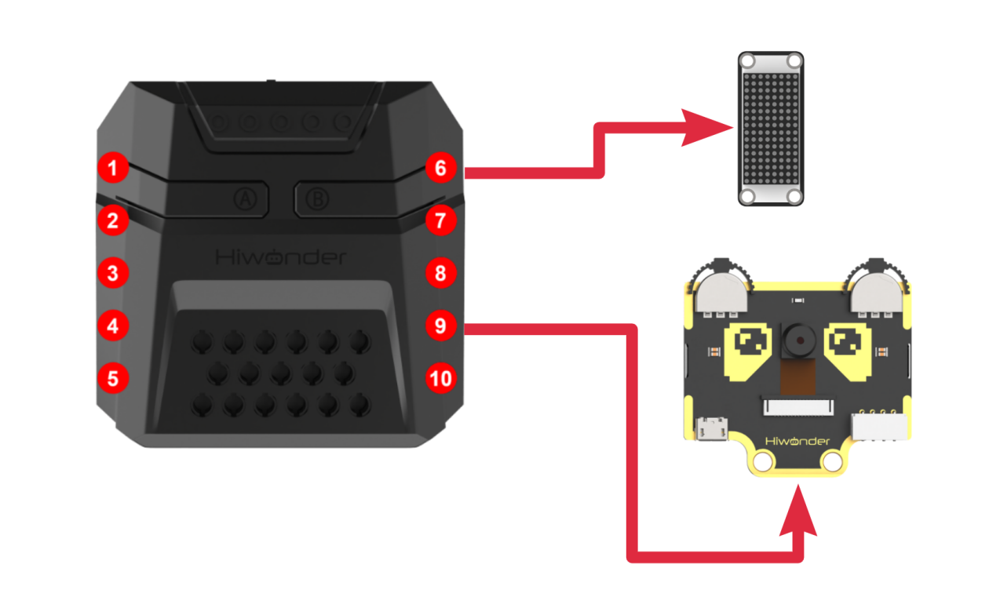

* **Download Program**

(1) Open the WonderCode software.

(2) Drag the program file [Mask Recognition Program.sb3]() located in the same path into WonderCode.

(3) Click on the "**Connect device**" option in the menu bar and select the COM port. In this case, COM7 is used as an example. Once connected successfully, a "**Connection Successful**" message will pop up.

(4) Click on thebutton on the right to download the program to the controller. Wait for the "**Upload Completed**" prompt to appear.

* **Project Outcome**

:::{Note}

If the current firmware on the vision module is the default one, please refer to the tutorials under "Firmware Flashing Method" document in the  [WonderCam Firmware Flashing Tool and Flashing Method]() to flash the "Mask Recognition" firmware to the WonderCam module.

:::

After the robotic arm is powered on, the WonderCam vision module will automatically detect whether a human face is present in the current view. If a face is detected, it will further determine whether the person is wearing a mask. The result is displayed on the LED dot matrix. If a face without a mask is detected, a buzzer will sound as a warning.

If no face is detected, the dot matrix module will display pattern.

If a face with a mask is detected, the dot matrix module will display pattern.

If a face without a mask is detected, the dot matrix module will also display pattern.

* **Program Analysis**

(1) Initialize the WonderCam vision module and dot matrix, turn off the ultrasonic LED light (to prevent misidentification), execute action group No.0 to restore the robotic arm to its initial posture.

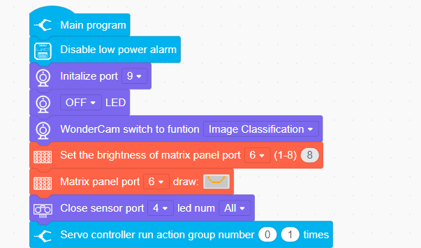

(2) Update and retrieve the recognition results. Use the "count" variable to obtain the specific recognized image ID. If the same image is recognized 5 times, the image is confirmed as the recognized one.

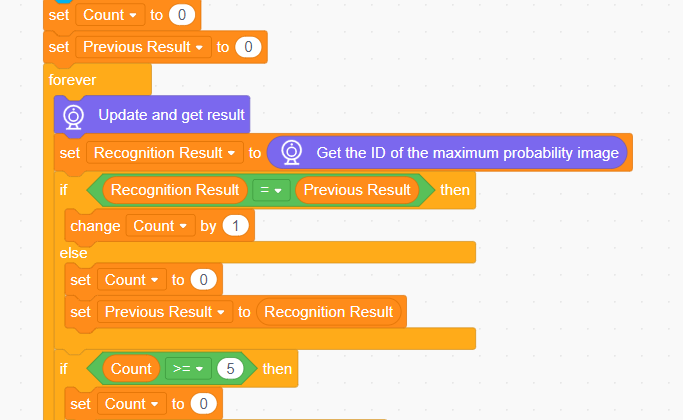

(3) If the recognition result is 1, it indicates that no mask was detected, and the dot matrix will display the initial pattern. If the recognition result is 2, it indicates that a face with a mask was detected, and the dot matrix will display a smiling face. If the recognition result is 3, it indicates that a face without a mask was detected, and the dot matrix will display an "X".

## 4.5 AI Voice Interaction Course

### 4.5.1 Introduction to Voice Interaction Module

* **Introduction and Working Principle**

(1) Introduction

The WonderEcho is an all-in-one voice interaction module built on the CI1302 chip, designed for speech recognition and playback. It supports offline neural network (NN) acceleration and hardware-accelerated voice signal processing, leveraging advanced noise reduction and neural network models to deliver highly accurate recognition results.

The CI1302 chip features a Brain Neural Processing Unit (BNPU), supporting offline NN acceleration and hardware-accelerated speech processing. With a CPU clock speed of up to 220 MHz, it enables far-field voice recognition in offline mode. Additionally, it has 2MB of built-in flash storage, capable of recognizing up to 300 command words.

Thanks to its user-friendly operation and outstanding speech recognition performance, the WonderEcho module is ideal for a wide range of applications, including smart home systems, conversational robots, educational robots, and in-vehicle dispatch terminals.

(2) Working Principle

This module operates in wake word activation mode, requiring users to say a designated wake word to activate the voice interaction module before issuing commands. The default wake word is **"Hello Hiwonder"**. If no voice input is detected within 15 seconds, the module will enter sleep mode and must be reactivated before further use.

Once the CI1302 chip recognizes a voice command, it transmits the corresponding instruction to the IIC chip, which then processes and broadcasts the response. The IIC chip stores the received command and transmits it using the IIC slave protocol.

This module supports customization of both wake words and command words. For instructions on modifying them, please refer to the document "[5.5.2 Modify Wake-up Word]()" under the same directory.

* **Module Assembly & Wiring Connection**

Connect the WonderEcho voice module to Port No.5 on xArm AI using a 4PIN cable.

* **Notice**

(1) Ensure the module is powered with 5V to prevent damage.

(2) Keep the surroundings quiet, as background noise may affect recognition accuracy.

(3) Speak loudly and clearly at a moderate pace. Maintain a distance of approximately 5 meters from the module for optimal performance.

* **Port Instruction**

| **No.** |   **Hardware name**   |                       **Instruction**                        |
| :-----: | :-------------------: | :----------------------------------------------------------: |
|    1    |        Speaker        |             Convert the analog signal into sound             |
|    2    |      Microphone       |             Convert the sound into analog signal             |
|    3    |      RST button       |                         Reset button                         |
|    4    | Blue signal indicator | Signal indicator remains on continuously, and it will blink once while a keyword is detected |
|    5    |  Red power indicator  |        It remains on when the power supply is normal         |
|    6    |       I2C port        | Serve as an I2C slave device, providing power and facilitating communication with the master device |
|    7    |      Type-C port      |  For power supply and firmware update for the CI1302 chip.   |
|    8    |      CI1302 chip      | A high-performance voice recognition chip. It recognizes voice and outputs corresponding signals |
|    9    |       I2C chip        | Transform the commands from the voice recognition chip into commands of the I2C protocol |
|   10    |    Amplifier chip     | Convert digital signals into analog signals to drive the speaker |

[Command Word Broadcasting Protocol List]()

### 4.5.2 Modify Wake-up Word

* **Note**

(1) Ensure the surroundings are quiet, as noise can impact the effectiveness of recognition.

(2) Speak the keywords clearly and at a moderate pace, maintaining a distance of approximately 5 meters from the module.

* **Device Connection**

Connect the module to the computer with a Type-C cable.

* **Modify Wake-up Word**

(1) Wake up the module by saying **"Hello Hiwonder."** When the module responds with **"I'm here,"** it indicates that the module is in recognition mode.

(2) Say the command "Learn wake-up word" to the voice interaction module. If the module responds with "Please speak the wake-up word to be learned in a quiet environment," it means the module has entered wake-up word learning mode.

(3) Say the desired wake-up word to the module. It is recommended to choose a short word. For example, set **"Hiwonder"** as the wake-up word.

(4) Once the module successfully recognizes the word, it will announce "Learning successful," confirming that the wake-up word has been successfully modified. You can now use "Hiwonder" to activate the module.

:::{Note}

The default wake-up word, **"Hello Hiwonder"**, in the factory firmware is the primary wake-up word and cannot be modified or deleted via voice. The custom wake-up word set by the user can only exist alongside the default wake-up word, meaning only one custom wake-up word can be active in addition to the default.

:::

### 4.5.3 Voice Control 

* **Project Introduction**

In this section, users give a specific voice command to xArm AI, and the robot executes the corresponding action to pick up the blocks.

* **Program Logic**

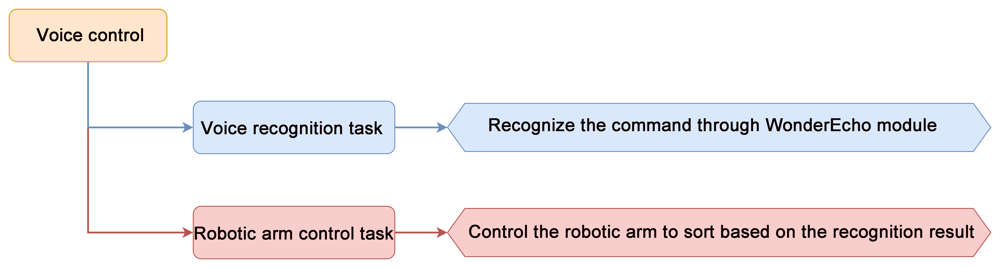

* **Module Instruction**

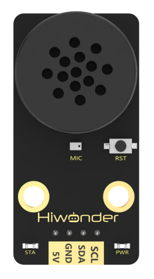

WonderEcho voice module is based on the CI1302 chip for voice recognition and broadcasting. It supports offline NN acceleration and speech signal processing hardware acceleration. Through deep noise reduction and neural network models, it analyzes and produces recognition results.

**Module Wiring: Connect WonderCam module to the port No.5 of the CoreX controller.**

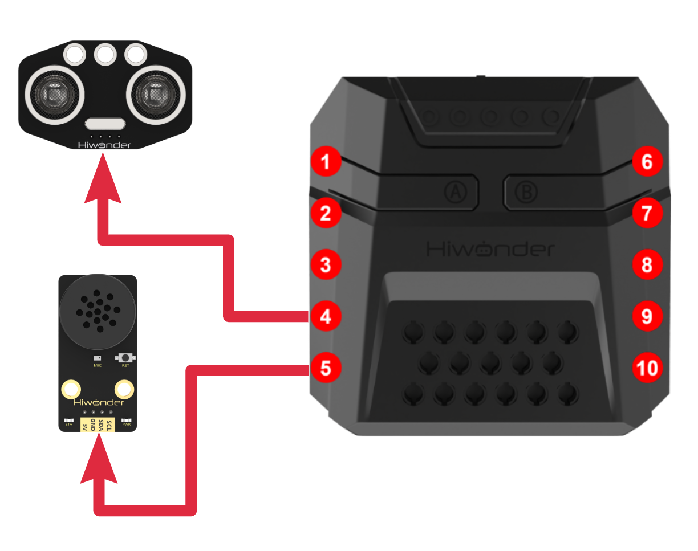

* **Download Program**

(1) Open the WonderCode software 

(2) Drag the [Voice Control Program.sb3]() file from the same folder as this document into WonderCode.

(3) In the menu bar, click on "**Connect device**" and select the correct COM port (e.g., COM7). Once the connection is successful, you'll see a "**Connection Successful**" message.

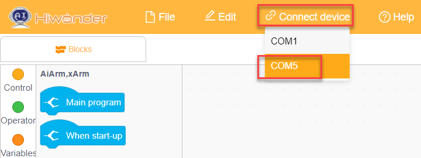

(4) Hit the **Upload"** button  on the right to transfer the program to the xArm AI. Wait for the confirmation that the upload is complete.

* **Project Outcome**

To activate the voice recognition module, simply say **'Hello Hiwonder'**. You can then use any command phrases listed in the table below. Upon recognition, xArm AI will grab the color block and place it at the corresponding position. The following phrases can be used multiple times.

| **Command Phrase** |  **ID**   |
| :----------------: | :-------: |
|      SORT-RED      | 105(0x69) |
|     SORT-GREEN     | 106(0x6A) |
|     SORT-BLUE      | 107(0x6B) |
|    SORT-YELLOW     | 124(0x7C) |

* **Program Analysis**

(1) Initialize xArm AI's posture and dot matrix module and WonderEcho voice module.

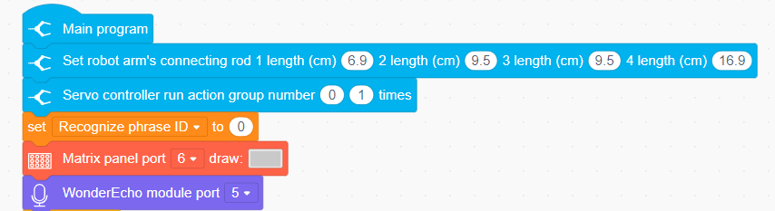

(2) If the current action group has finished running, turn off the LED lights and clear the dot matrix module. Then, retrieve the phrase number recognized by the voice interaction module.

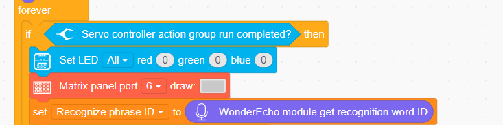

(2) The phrase numbers 105, 106, and 107 represent **"Sort Red,"** **"Sort Green,"** and **"Sort Blue,"** respectively.

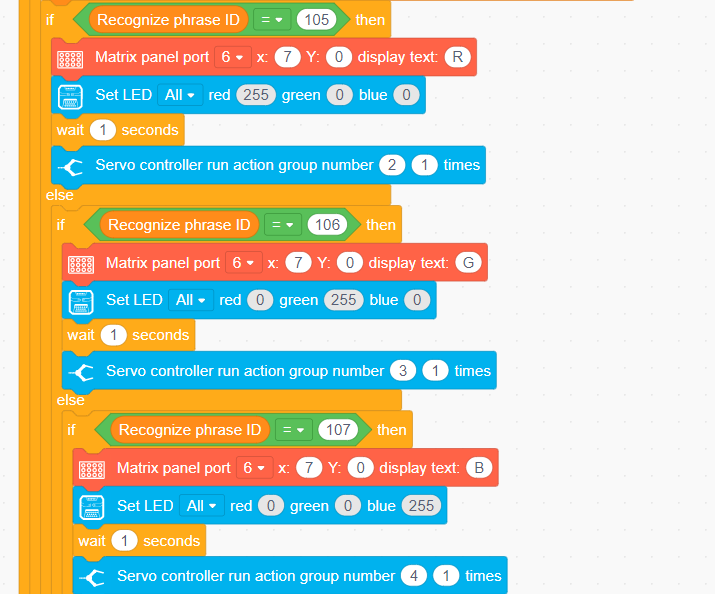

(3) The phrase number 124 represents **"Sort Yellow."**

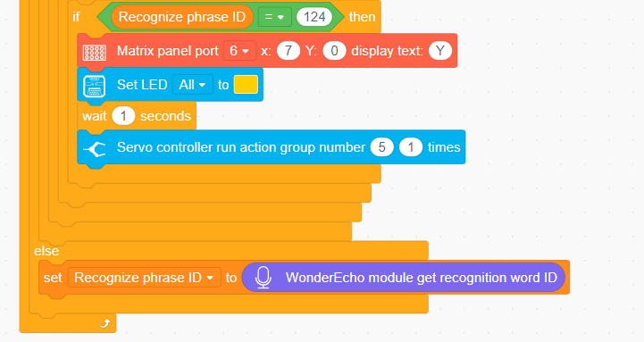

### 4.5.4 Voice Broadcasting

* **Project Introduction**

In this section, the voice interaction module is used to broadcast command phrases.

* **Program Logic**

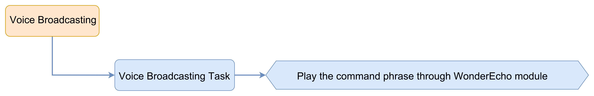

* **Module Instruction**

WonderEcho voice module is based on the CI1302 chip for voice recognition and broadcasting. It supports offline NN acceleration and speech signal processing hardware acceleration. Through deep noise reduction and neural network models, it analyzes and produces recognition results.

**Module Wiring: Connect WonderEcho voice module to the port No.5 of the CoreX controller.**

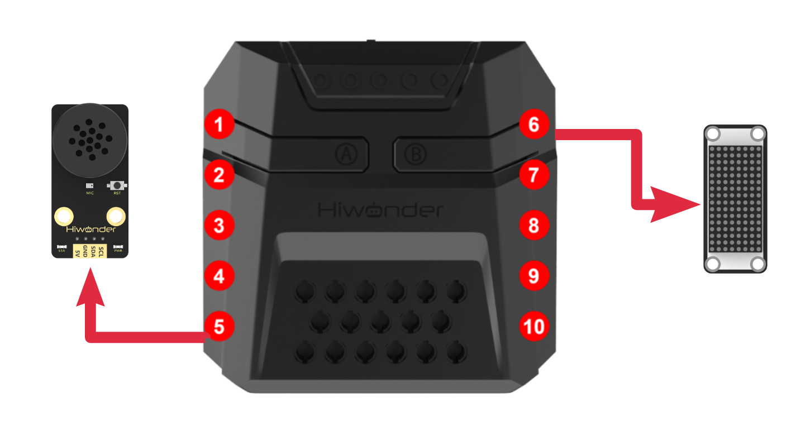

* **Download Program**

(1) Open the WonderCode software 

(2) Drag the [Voice Broadcasting Program.sb3]() file from the same folder as this document into WonderCode.

(2) In the menu bar, click on "**Connect device**" and select the correct COM port (e.g., COM7). Once the connection is successful, you'll see a "**Connection Successful**" message.

(3) Hit the Upload" button  on the right to transfer the program to the xArm AI. Wait for the confirmation that the upload is complete.

* **Project Outcome**

The voice interaction module will continuously broadcast the command phrases in the following order:

| **Broadcasting Phrase** | **ID**  |
| :---------------------: | :-----: |
|    Recyclable Waste     | 1(0x01) |
|     Residual Waste      | 2(0x01) |
|     Hazardous Waste     | 3(0x01) |
|       Other Waste       | 4(0x01) |
|     Obstacle Ahead      | 5(0x01) |

:::{Note}

* The IDs for the broadcasting phrases and the command phases are not interchangeable.

* The robot's response phrase, after recognizing the broadcasting phrase, can also be automatically played when invoked in the program.

:::

* **Program Analysis**

(1) Initialize xArm AI's posture and dot matrix module and WonderEcho voice module.

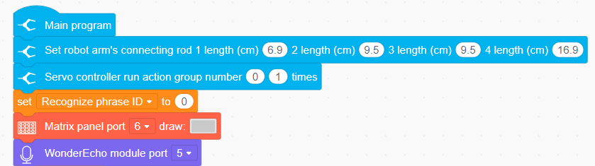

2() Continuously play **"Recyclable,"** **"Residual Waste,"** **"Hazardous Waste,"** **"Other Waste,"** and **"Obstacle Ahead."**

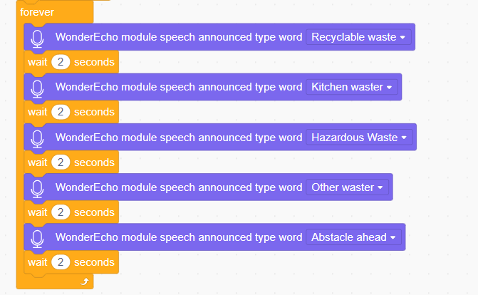

### 4.5.5 Voice-Controlled Visual Sorting

* **Project Introduction**

In this section, the user speaks the corresponding phrases to the WonderEcho voice module, and the xArm AI will then execute the corresponding recognition function.

* **Program Logic**

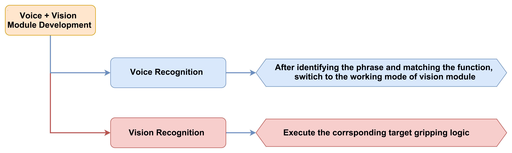

* **Module Instruction**

(1) WonderCam AI Vision Module

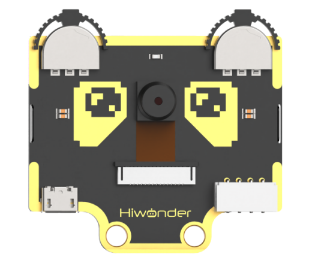

WonderCam is an user-friendly AI visual sensor with eight built-in functions: color recognition, face recognition, label recognition, line following, Numeric recognition, Landmark recognition, image classification, and feature learning. It can be used with various controllers like ESP32, micro:bit, Arduino, and Raspberry Pi, enabling you to easily implement a wide range of AI visual creative projects.

**Module Wiring: Connect WonderCam module to the port No.9 of the CoreX controller.**

(2) WonderEcho AI Voice Module

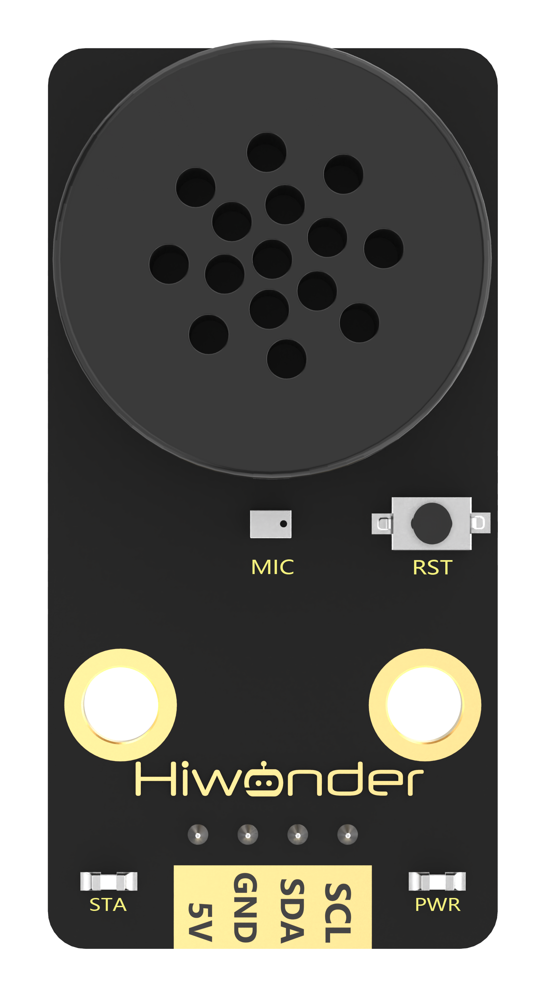

WonderEcho voice module is based on the CI1302 chip for voice recognition and broadcasting. It supports offline NN acceleration and speech signal processing hardware acceleration. Through deep noise reduction and neural network models, it analyzes and produces recognition results.

**Module Wiring: Connect WonderEcho voice module to the port No.5 of the CoreX controller.**

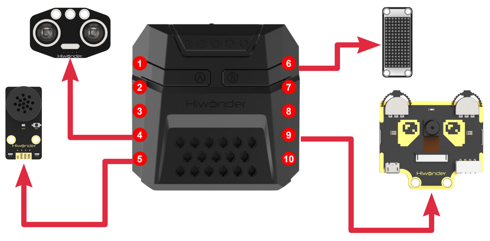

* **Download Program**

(1) Open the WonderCode software 

(2) Drag the [Voice-Controlled Visual Sorting Program.sb3]() file from the same folder as this document into WonderCode.

(3) In the menu bar, click on "**Connect device**" and select the correct COM port (e.g., COM7). Once the connection is successful, you'll see a "**Connection Successful**" message.

(4) Hit the **Upload"** button  on the right to transfer the program to the xArm AI. Wait for the confirmation that the upload is complete.

* **Project Outcome**

To activate the voice recognition module, simply say 'Hello Hiwonder'. You can then use any command phrases listed in the table below, then xArm AI will automatically perform the corresponding visual task in a continuous loop. The following phrases can be used multiple times.

|   **Command Phrase**    |  **ID**   |
| :---------------------: | :-------: |
| START-LABEL-RECOGNITION | 99(0x63)  |
|   START-WASTE-SORTING   | 100(0x64) |
| START-COLOR-RECOGNITION | 101(0x65) |

* **Program Analysis**

(1) Initialize Program

① Initialize the robotic arm's position, as well as the interfaces for the matrix module, voice interaction module, vision module, and ultrasonic module. Define variables to store the phrase ID and variables to store the waste classification results.

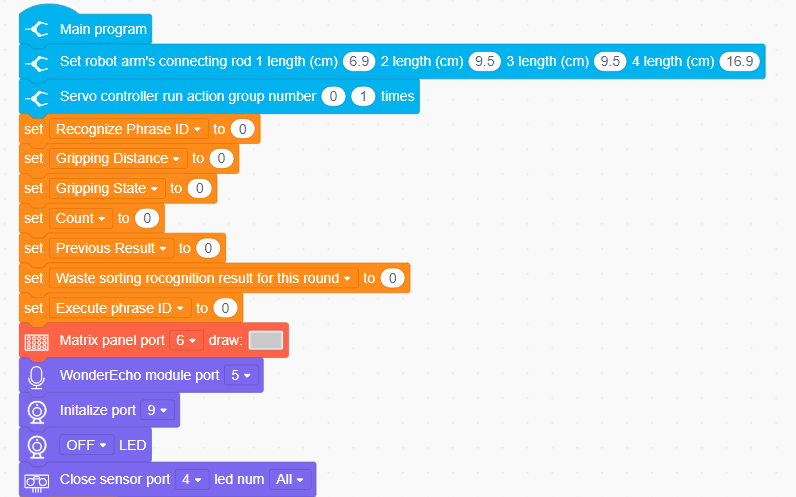

② If the current action group has finished running and the recognized phrase is "Label Recognition" (99), "Waste Sorting" (100), or "Color Recognition" (101), the recognized phrase ID will be set as the active phrase. Action group 1 will then be executed to move the robotic arm to the initial position for grasping.

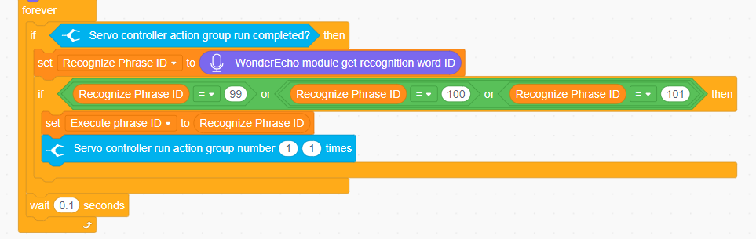

(2) Robotic Arm Control Program

① If the current action group has completed, control the robotic arm to perform different sorting operations based on the executed phrase ID.

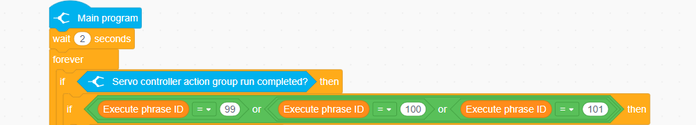

② When the phrase ID is 100, it corresponds to the waste sorting function. We will switch the vision module to image classification mode and retrieve the ID with the highest confidence. When the same ID is recognized consecutively 5 times, the waste sorting result for this round will be recorded.

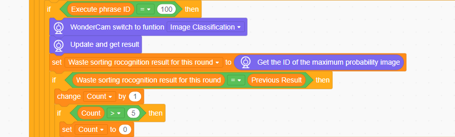

③ The specific implementation of waste sorting is as follows:

When the recognition result is ID2-4, indicating hazardous waste, the voice interaction module plays the hazardous waste phrase, and the robotic arm sorts the hazardous waste into the hazardous waste placement area.

When the recognition result is ID5-7, indicating recyclables, the voice interaction module plays the recyclables phrase, and the robotic arm sorts the

When the recognition result is ID8-10, indicating residual waste, the voice interaction module plays the kitchen waste phrase, and the robotic arm sorts the kitchen waste into the residual waste placement area.

When the recognition result is ID11-13, indicating other waste, the voice interaction module plays the other waste phrase, and the robotic arm sorts the other waste into the other waste placement area.

Below are partial program:

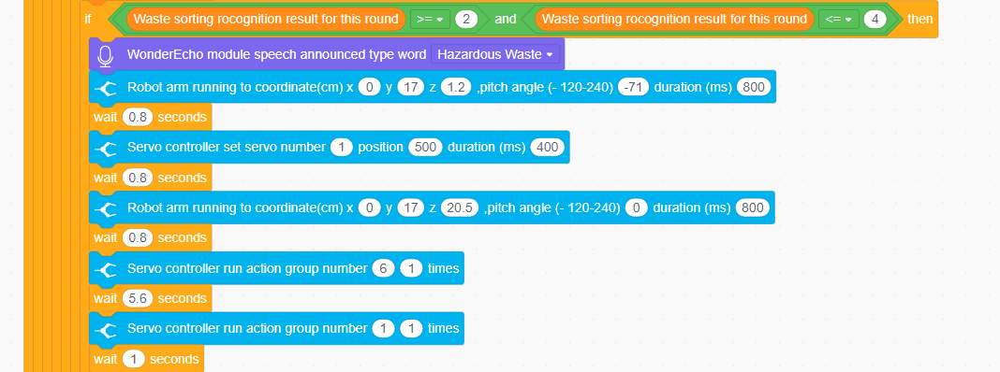

④ When the phrase ID is 101, it corresponds to color recognition. We will switch the vision module to color recognition mode, then update and retrieve the recognition results.

⑤ The specific implementation of color recognition is as follows:

When the color ID 1 is recognized consecutively twice, indicating red, the LED light will be set to red, and the robotic arm will pick up the color block and place it in the red area.

When the color ID 2 is recognized consecutively twice, indicating green, the LED light will be set to green, and the robotic arm will pick up the color block and place it in the green area.

When the color ID 3 is recognized consecutively twice, indicating blue, the LED light will be set to blue, and the robotic arm will pick up the color block and place it in the blue area.

When the color ID 4 is recognized consecutively twice, indicating yellow, the LED light will be set to yellow, and the robotic arm will pick up the color block and place it in the yellow area.

Below are partial program:

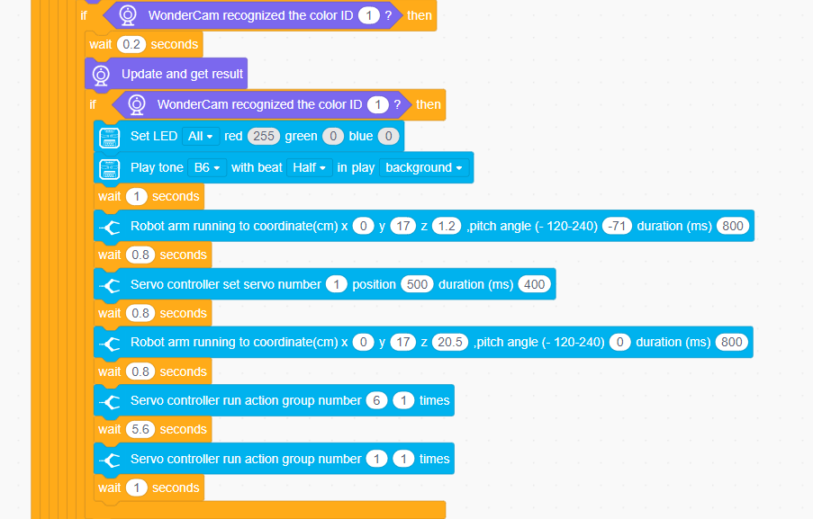

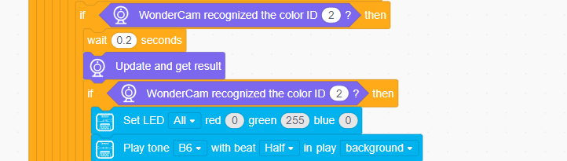

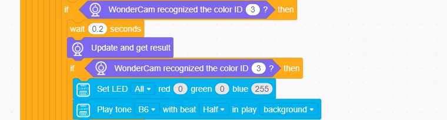

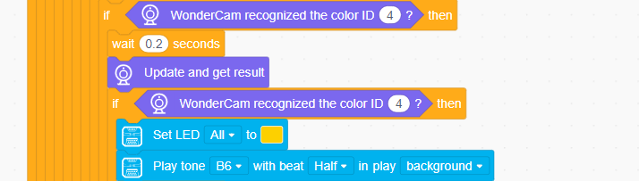

⑥ When the executed phrase ID is 101, it corresponds to label recognition. Switch the vision module to label recognition mode, then update and retrieve the recognition results. When tag ID 1 is recognized, the matrix module will display the number 1, and the robotic arm will place the label at position 1.

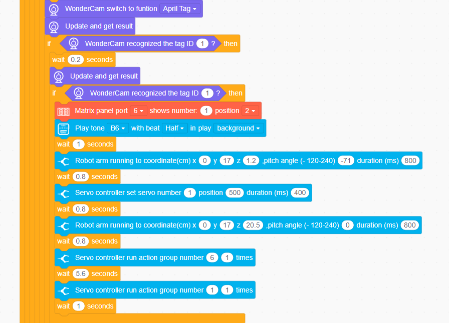

When label ID 2 is recognized, the matrix module will display the number 2, and the robotic arm will place the label at position 2.  

When label ID 3 is recognized, the matrix module will display the number 3, and the robotic arm will place the label at position 3.  

When tag ID 4 is recognized, the matrix module will display the number 4, and the robotic arm will place the label at position 4.

Below are the partial program:

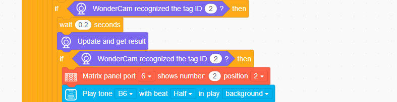

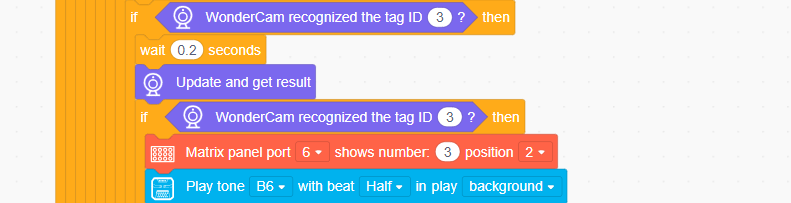

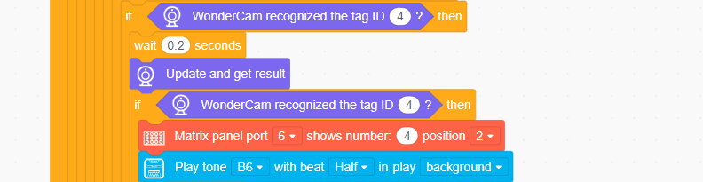

### 4.5.6 Adaptive Grasping & Broadcasting

* **Project Introduction**

In this section, user can place the object to be grasped at any distance directly in front of the ultrasonic module. xArm AI will then execute the corresponding action based on the distance between the object and the sensor. Additionally, the voice interaction module will play the corresponding phrase to provide a prompt or notification.

* **Program Logic**

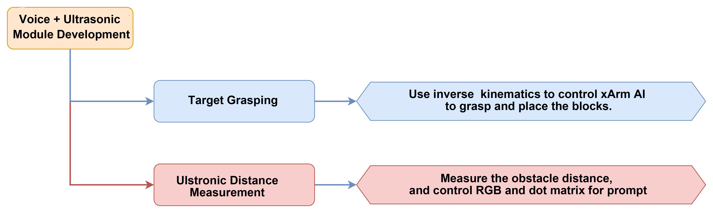

* **Module Instruction**

(1) Ultrasonic Module

The module uses an I2C communication interface, allowing the distance measured by the ultrasonic sensor to be read via I2C communication.

Additionally, the ultrasonic probe position integrates two RGB LEDs, which not only allow adjustment of the light brightness but also enable the creation of a variety of colors through changes in the red (R), green (G), and blue (B) color channels, as well as their combinations.

**Module wiring: Connect the dot matrix module to Port No.4 of the CoreX controller.**

(2) WonderEcho AI Voice Module

The WonderEcho is an all-in-one voice interaction module built on the CI1302 chip, designed for speech recognition and playback. It supports offline neural network (NN) acceleration and hardware-accelerated voice signal processing, leveraging advanced noise reduction and neural network models to deliver highly accurate recognition results.

The CI1302 chip features a Brain Neural Processing Unit (BNPU), supporting offline NN acceleration and hardware-accelerated speech processing. With a CPU clock speed of up to 220 MHz, it enables far-field voice recognition in offline mode. Additionally, it has 2MB of built-in flash storage, capable of recognizing up to 300 command words.

**Module Wiring: Connect WonderEcho voice module to the port No.5 of the CoreX controller.**

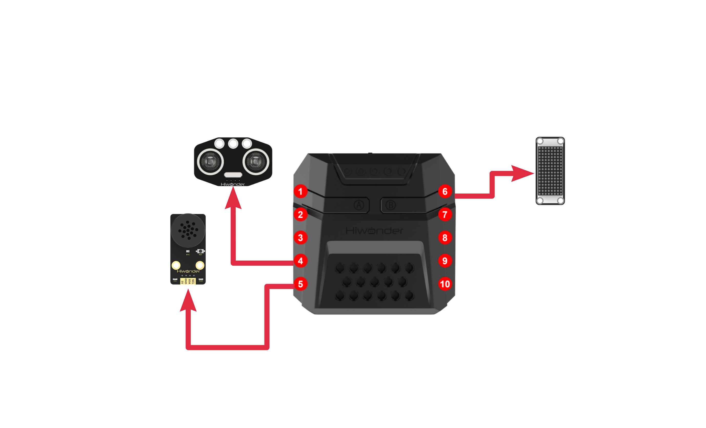

* **Download Program**

(1) Open the WonderCode software 

(2) Drag the [Adaptive Grasping & Broadcasting Program.sb3]() file from the same folder as this document into WonderCode.

(3) In the menu bar, click on "**Connect device**" and select the correct COM port (e.g., COM7). Once the connection is successful, you'll see a "**Connection Successful**" message.

(4) Hit the **Upload"** button  on the right to transfer the program to the xArm AI. Wait for the confirmation that the upload is complete.

* **Project Outcome**

After the robotic arm is powered on, the ultrasonic module continuously detects the distance between the xArm AI and the object to be grasped in front of it.

If the object is within the recognition range, the RGB light will turn green. The robotic arm will use inverse kinematics to grasp and place the object, while the voice module plays "Detect object ahead, grabbing." After placement, the voice module will play "Grabbing end."

If the object is within a smaller range than the grasping range, the RGB light will turn red, and the buzzer will sound repeatedly.

If the object is beyond the grasping range, the RGB light will turn blue, and the voice module will play "Detect object ahead, out of reach, cannot grab" once.

<table  class="docutils-nobg" style="margin:0 auto" border="1">
<colgroup>
<col  />
<col  />
<col  />
</colgroup>
<tbody>
<tr>
<td ><strong>Command Phrase</strong></td>
<td ><strong>ID</strong></td>
<td ><strong>Phrase Type</strong></td>
</tr>
<tr>
<td >
DETECT-OBJECT-AHEAD-

GRABBING
</td>
<td >16(0X10)</td>
<td >Broadcasting (0xFF)</td>
</tr>
<tr>
<td >DETECT-OBJECT-AHEAD-OUT-OF-REACH-CANNOT-GRAB</td>
<td >17(0X11)</td>
<td >Broadcasting (0xFF)</td>
</tr>
<tr>
<td >GRABBING-END</td>
<td >18(0X12)</td>
<td >Broadcasting (0xFF)</td>
</tr>
</tbody>
</table>

* **Program Analysis**

(1) Ultrasonic RGB Light Control Program

① When the measurement switch is turned on, the distance detected by the ultrasonic sensor is retrieved and displayed on the matrix module.

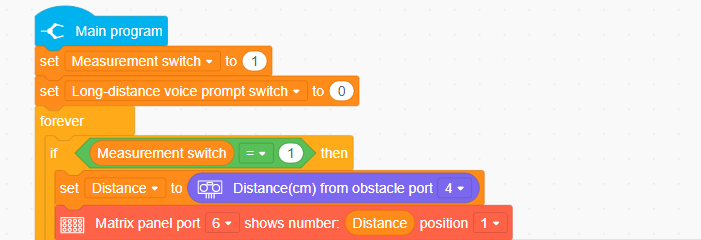

② When the detected distance value is between the "maximum grasping distance" and the "minimum grasping distance," control the ultrasonic RGB light and the main controller's RGB light to turn green.

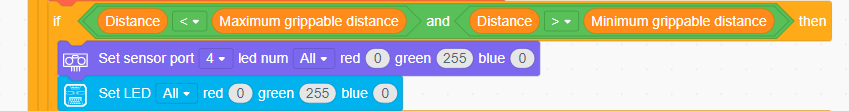

③ Otherwise, when the detected distance is greater than the "maximum grasping distance," control both RGB lights to turn blue.

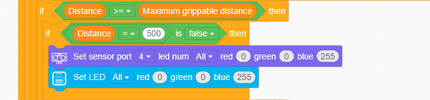

④ Finally, when the detected distance is less than the "minimum grasping distance," control both RGB lights to turn red.

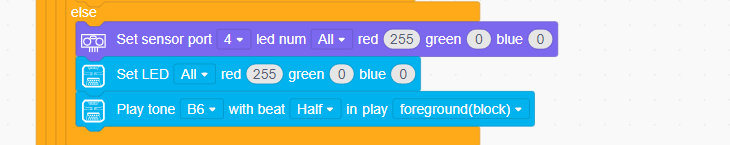

(2) Robotic Arm Grasping Program

① Initialize the robotic arm's initial position, set the robotic arm parameters, clear the matrix module, and initialize the voice module and ultrasonic module.

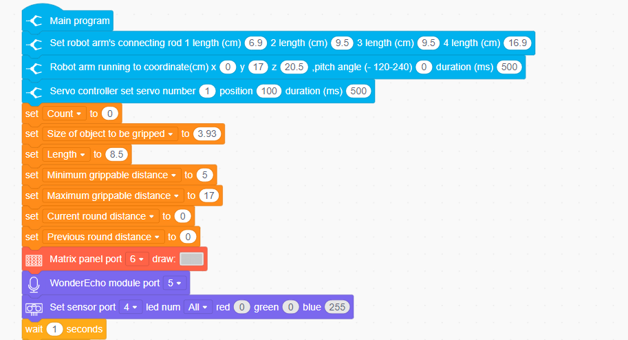

② When the distance measured in this round is less than the "maximum grasping distance," turn off the out-of-range voice prompt. Then, compare it with the previous round's distance. If the previous round's distance equals the current round's distance, turn off the measurement switch and begin controlling the robotic arm to grasp the object.

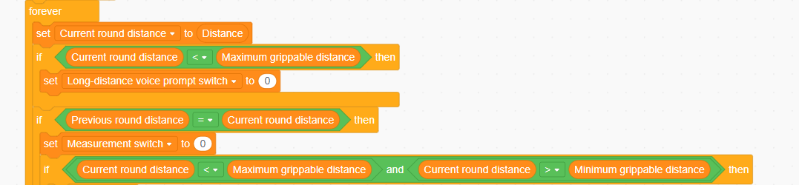

③ After meeting the above conditions, when the distance is between the "maximum grasping distance" and the "minimum grasping distance," play voice phrase 16 ("detect object ahead, grabbing"). The robotic arm will then begin to grasp the object. After placement is completed, play voice phrase 18 ("Grabbing end").

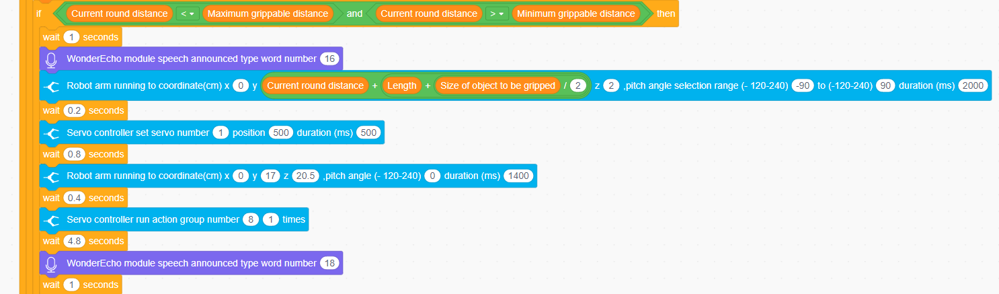

④ When the distance in this round exceeds the **"maximum grasping distance"** and is less than 40cm, enable the out-of-range voice prompt and play voice phrase 17 ("Detect object ahead, out of reach, cannot grab"). Finally, turn on the measurement switch, and the ultrasonic sensor will remeasure the distance to the object ahead.

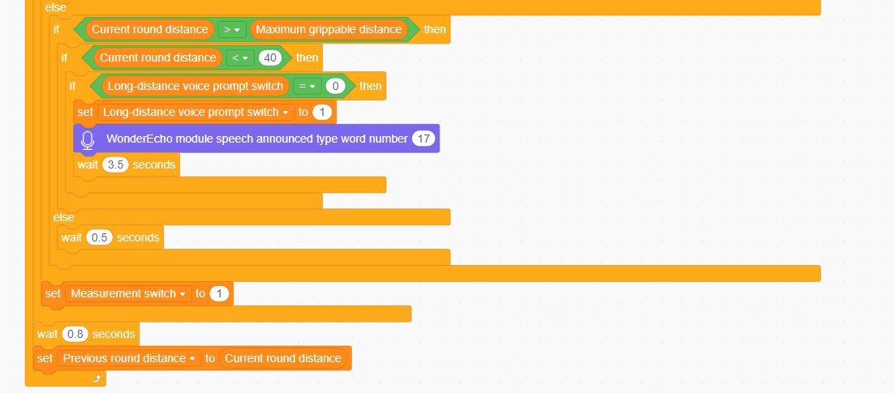

## 4.6 Secondard Development Course

### 4.6.1 Touch Control

* **Project Introduction**

In this section, the xArm AI will be controlled to perform a set of actions based on the number of touches detected by the touch sensor.

* **Program Logic**

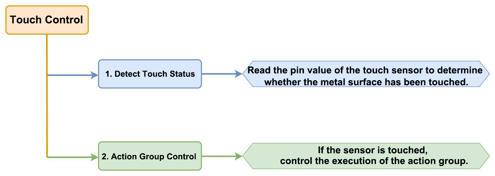

* **Module Instruction**

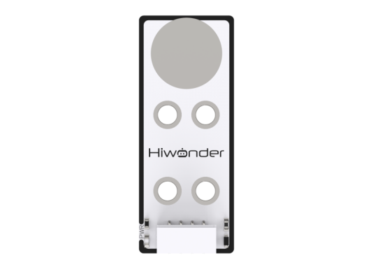

The touch sensor is a capacitive sensing-based sensor that detects humand touch or metal through its gold-plated contact surface.  

When no human or metal comes into contact with the metal surface, the signal output is a high level. When a human or metal touches the metal surface, the signal output becomes a low level.  

**Wiring Connection: The touch sensor is connected to the 8th port of CoreX controller.**

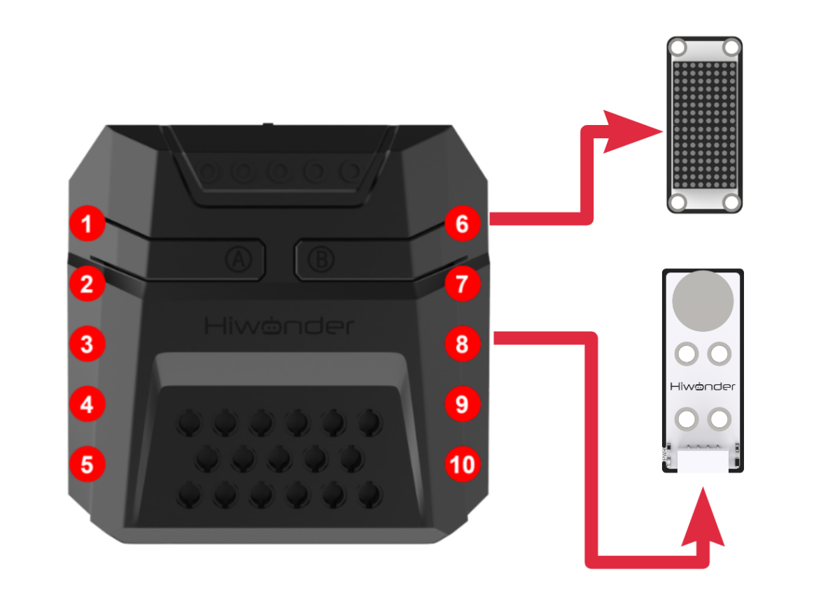

* **Download Program**

(1) Open the WonderCode software.

(2) Drag the program file [Touch Control Program.sb3]() located in the same directory as this document into WonderCode.

(3) Click on the "**Connect device**" option in the menu bar and select the COM port. In this case, COM7 is used as an example. Once connected successfully, a "**Connection Successful**" message will pop up.

(4) Click on thebutton on the right to download the program to the controller. Wait for the "**Upload Completed**" prompt to appear.

* **Project Outcome**

After the robotic arm is powered on, the following actions will occur based on touch sensor inputs:

Single-click the touch sensor: The CoreX box's RGB light turns red, and Action Group No.2 is executed.

Double-click the touch sensor: The CoreX box's RGB light turns green, and Action Group No.3 is executed.

Triple-click the touch sensor: The CoreX box's RGB light turns blue, and Action Group No.4 is executed.

Quadruple-click the touch sensor: The CoreX box's RGB light turns yellow, and Action Group No.5 is executed.

* **Program Analysis**

(1) When the touch sensor is pressed, first check the "pending touch status" flag. If it is 0, set it to 1 as an indication that the sensor has been clicked. At the same time, increment the click count, but it will not exceed 4.

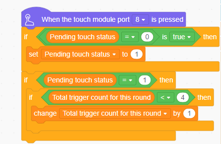

(2) In the main program, execute action group No.0 to move the robotic arm to its initial posture.

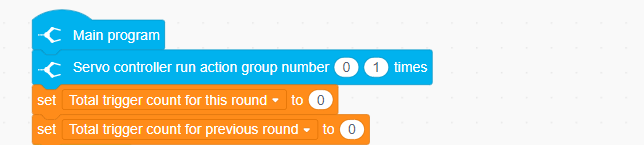

(3) Enter the loop and first check whether the robotic arm is currently executing an action group. Confirm that the arm is not executing an action group and is idle before executing the internal logic. Start by turning off the LED lights.  

Next, compare the "current cumulative trigger count" with the "previous cumulative trigger count." If they are not consistent, it indicates that the user has not yet completed the process of continuous clicks. In this case, record the "current cumulative trigger count" to the "previous cumulative trigger count" and wait for a while before checking again.  

This process repeats until the user completes the continuous clicks.  

Finally, display the total click count on the matrix.

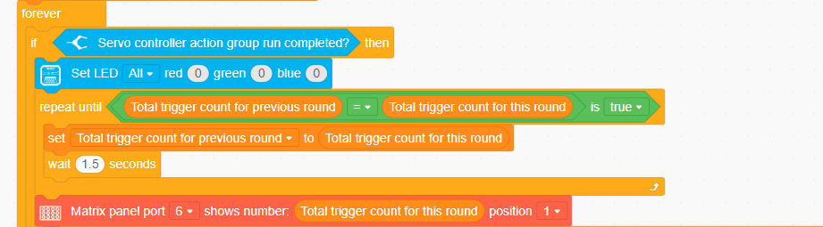

① Before executing the corresponding logic based on the click count, check the "pending touch status" flag. Then, confirm once again whether the "current cumulative trigger count" and the "previous cumulative trigger count" are consistent. This ensures that the current round of clicks has been fully processed before the user starts the next round of clicks, preventing confusion in the logic of the current round's processing.

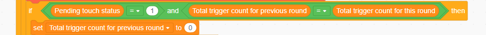

② Based on the click count, execute the corresponding action group and turn the LED light to the corresponding color.  

Once the corresponding logic is completed, clear the **"pending touch status"** flag and reset the "current cumulative trigger count.

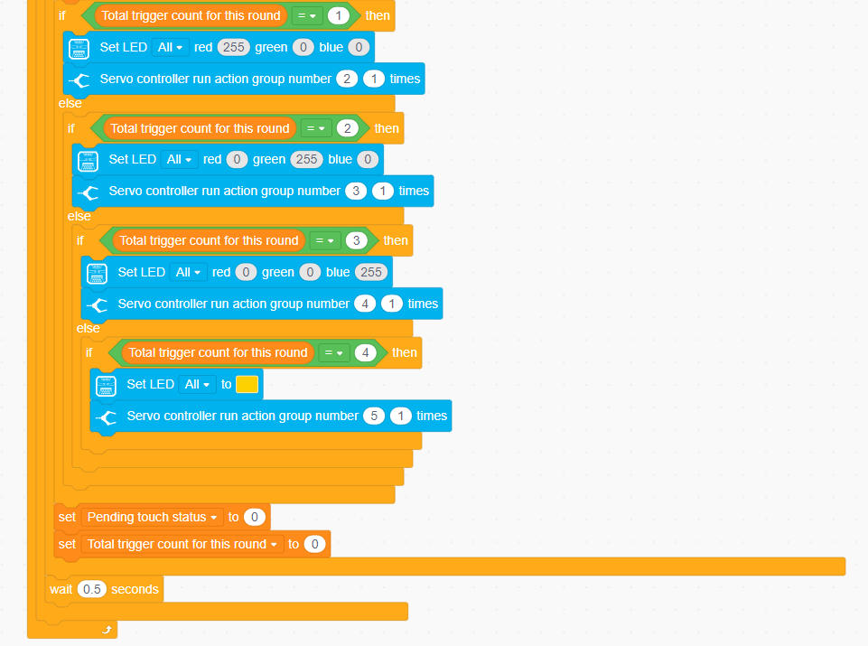

### 4.6.2 **Dual Infrared Detection & Sorting Control** 

* **Project Introduction**

In this section, use infrared obstacle-avoidance sensors (installed on both sides) and an ultrasonic module working together to achieve multi-directional detection and sorting of target objects for gripping.

* **Program Logic**

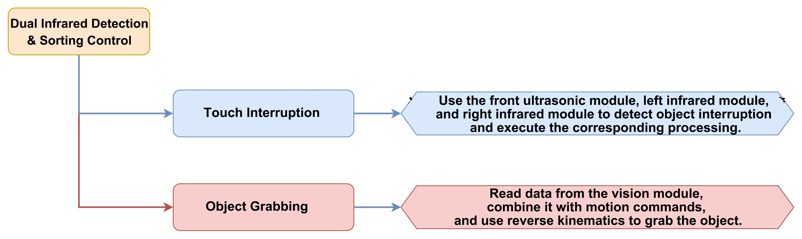

* **Module Instruction**

(1) Infrared Obstacle Avoidance Module

This is a sensor used to detect obstacles in front. The sensor consists of an infrared emitter and an infrared receiver. When the sensor encounters an obstacle, the infrared light is reflected back and received by the receiver. If the infrared receiver does not detect the infrared light, the signal output pin (OUT) will output a high-level signal. When the infrared light is received, the signal output pin (OUT) will output a low-level signal.

The sensor has a small potentiometer that allows adjustment of the detection distance by rotating it. When the potentiometer is adjusted such that the LED1 on the sensor is at the critical point between being off and on, the sensor's detection range is maximized.

**Module wiring: Connect the infrared obstacle avoidance sensor module to the 2th and 8th ports of the CoreX controller.**

(2) Ultrasonic Module

The module uses an I2C communication interface, allowing the distance measured by the ultrasonic sensor to be read via I2C communication.

Additionally, the ultrasonic probe position integrates two RGB LEDs, which not only allow adjustment of the light brightness but also enable the creation of a variety of colors through changes in the red (R), green (G), and blue (B) color channels, as well as their combinations.

**Module wiring: Connect the ultrasonic module to Port 4th of the CoreX controller.**

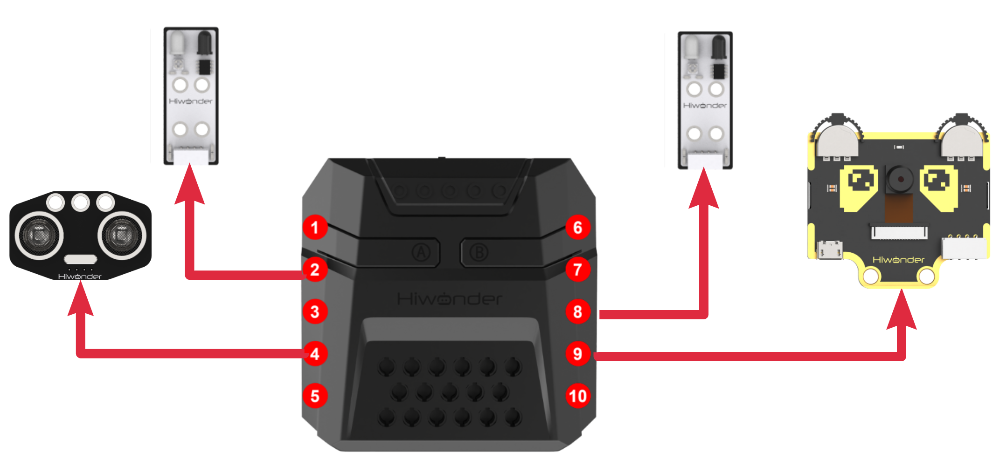

* **Download Program**

(1) Open the WonderCode software.

(2) Drag the program file [Dual Infrared Detection Sorting & Control Program.sb3]() located in the same directory as this document into WonderCode.

(3) Click on the "**Connect device**" option in the menu bar and select the COM port. In this case, COM7 is used as an example. Once connected successfully, a "**Connection Successful**" message will pop up.

(4) Click on thebutton on the right to download the program to the controller. Wait for the "**Upload Completed**" prompt to appear.

* **Project Outcome**

After the robotic arm is powered on, it will continuously check whether the ultrasonic module facing the front of the arm and the two infrared obstacle avoidance modules on both sides detect any objects to be grasped. The user can place objects in three areas:

① In front of the **"dashed box"** on the map,

② In front of the **"red square box"** on the left side, near the infrared obstacle avoidance sensor,

③ In front of the **"yellow square box"** on the right side, near the infrared obstacle avoidance sensor.

If an object is detected, the robotic arm will rotate and extend down to the object's location. The vision module will then perform color recognition to determine the color of the object to be grasped. Then it will then grasp the object and place it in the corresponding location.

This process can be repeatedly executed.

* **Program Analysis**

(1) In the main program, control the ID1 servo to rotate and open the robotic gripper. The robotic arm will then move to its initial state using inverse kinematics. Turn on the vision module's fill light and switch to the corresponding function.

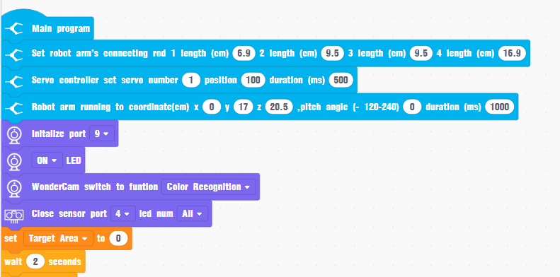

(2) Enter the loop and check the ultrasonic module to detect the distance and determine if there are any obstacles in front. If there are no obstacles, sequentially check the two infrared obstacle avoidance sensors to determine if there are obstacles on the left or right sides.

If an obstacle is detected on either side, execute the corresponding custom logic.

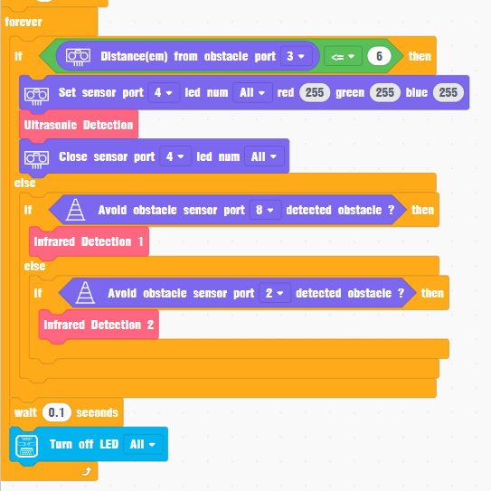

(3) The custom processing methods for detecting obstacles in the three directions are generally the same. Here, we will explain the "ultrasonic detection" method for handling obstacles in front:  

First, the program controls the robotic arm to extend downwards in the direction where the obstacle is placed, ensuring that the vision module on the gripper can observe the obstacle from above. After a period of observation, the system retrieves the recognition results from the vision module.

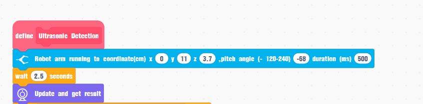

(4) Sequentially check which color ID (red, green, blue, yellow) the current detected color belongs to in the vision module's recorded IDs, and execute the corresponding logic. The execution logic for the four color IDs is highly similar, so here we will use red (ID=1) as an example:

Assuming red is detected, wait for a period of time and then detect again to avoid misrecognition. After excluding any misrecognition, check the target area of the object to be grasped in the vision module's view to avoid interference from small red objects in the background.

After excluding all these special cases, turn on the LED to display a red light as a prompt for detecting red. The robotic arm will then use inverse kinematics to extend down, rotate servo 1 to move the gripper, and use inverse kinematics to lift the object. Subsequently, the action group will execute the process of placing the object and returning the arm to its position. After placement is complete, turn off the LED light.

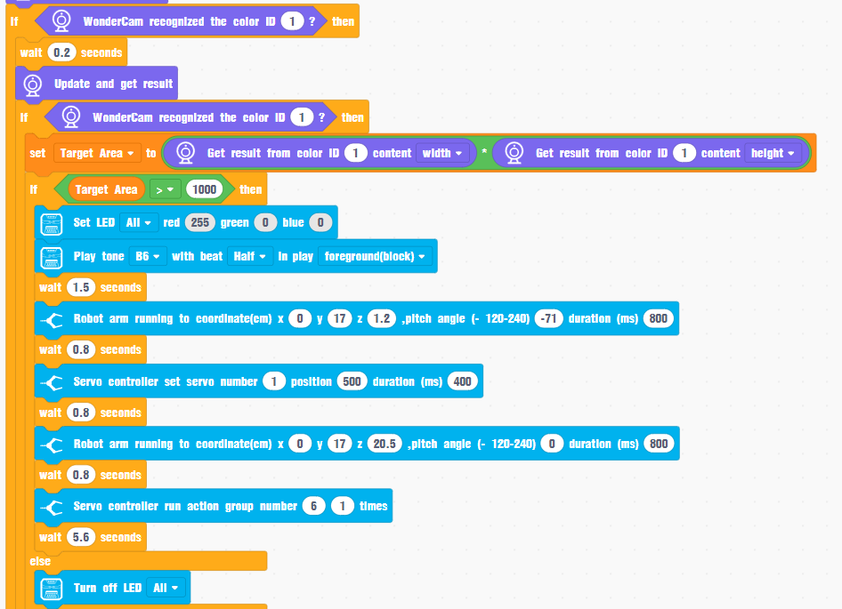

(5) If the color ID detected by the vision module does not match the valid IDs (1-4) for this program's logic, turn off the LED light and have the robotic arm maintain its initial pose only.

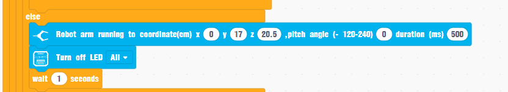

### 4.6.3 Light Sensing Control

* **Project Introduction**

In this section, utilize a light sensor to detect the light intensity and map it to the red and blue light intensity ratio of the RGB light.

* **Program Logic**

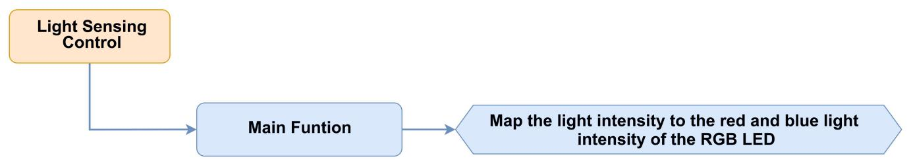

* **Module Instruction**

(1) Light Sensor Module

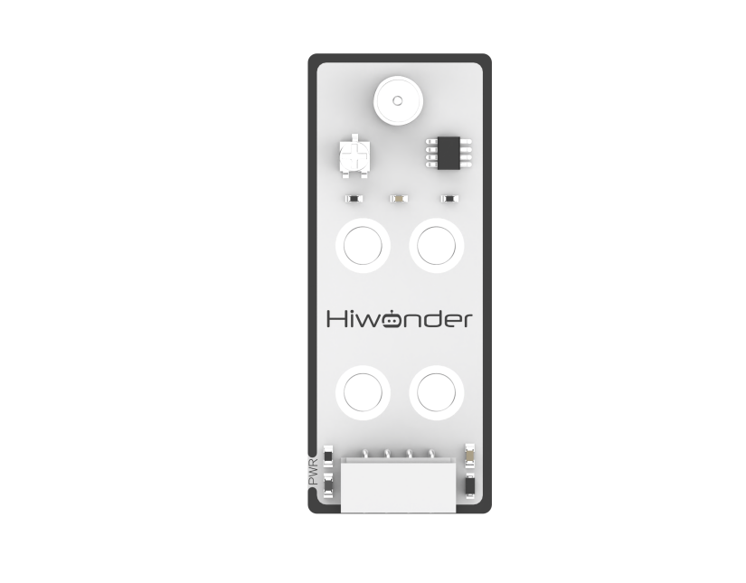

The sensor mainly consists of a QT523C (photoresistor) and an LM358 chip (voltage comparator). During operation, the sensor uses the QT523C to convert the light signal into an electrical signal, which is then transformed into a 0-5V voltage. This voltage is converted via A/D conversion and received by the data collector. The stronger the external light intensity, the smaller the output voltage.

The sensor uses the LM358 chip to design a voltage comparator. During use, we can manually set a threshold by rotating the mini potentiometer. When the external brightness exceeds the set threshold, the LED1 on the sensor lights up, and the signal pin OUT outputs a low level. When the brightness does not exceed the set threshold, the LED1 on the sensor turns off, and the signal pin OUT outputs a high level.

**Module Wiring: Connect the sensor module to the 1st port of the CoreX controller.**

(2) Ultrasonic Module

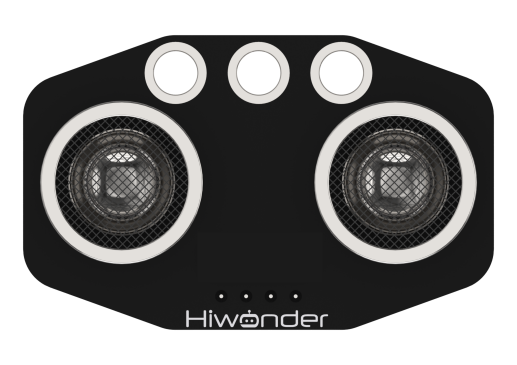

During distance measurement, the module will automatically send 8 pulses of 40kHz square waves and then detect if a signal is returned. If a signal is received, a high-level output will be generated. The duration of the high level corresponds to the time it takes for the ultrasonic wave to travel from the transmitter to the receiver.  
**Module wiring: Connect the ultrasonic module to 4th port on the CoreX controller.**

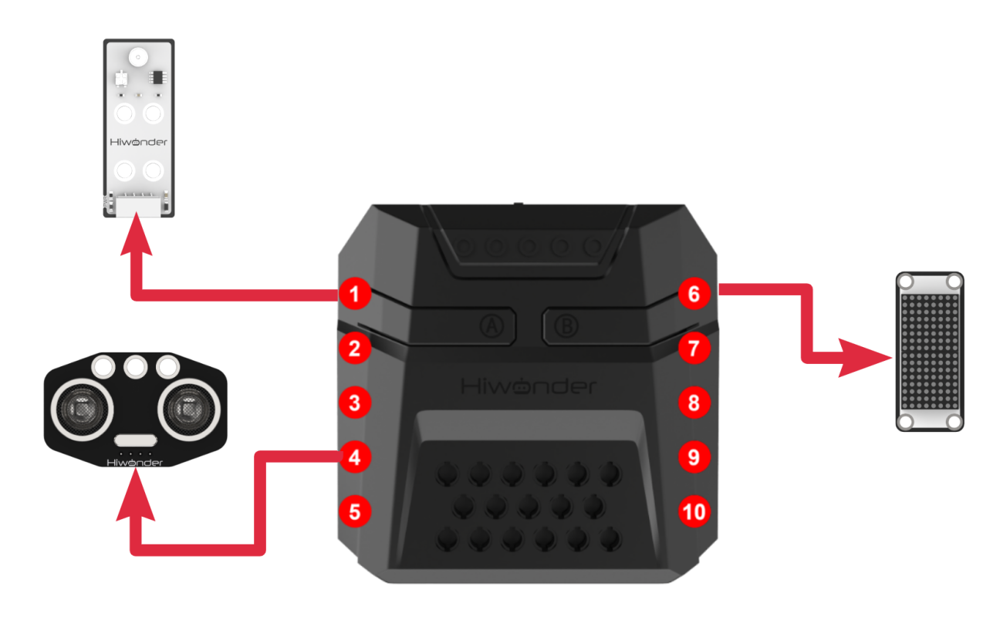

* **Download Program**

(1) Open the WonderCode software.

(2) Drag the program file "Light Sensing Control Program.sb3" located in the same directory as this document into WonderCode.

(3) Click on the "**Connect device**" option in the menu bar and select the COM port. In this case, COM7 is used as an example. Once connected successfully, a "**Connection Successful**" message will pop up.

(4) Click on thebutton on the right to download the program to the controller. Wait for the "**Upload Completed**" prompt to appear.

* **Project Outcome**

After the robotic arm is powered on, the RGB light changes the red-to-blue light intensity ratio based on the light intensity detected by the light sensor. The brighter the environment, the higher the red light intensity ratio of the RGB light; the darker the environment, the higher the blue light intensity ratio of the RGB light.

* **Program Analysis**

(1) In the main program, run action group No.0 once to move the robotic arm to its initial position. The light intensity measured and fed back by the light sensor ranges from 0 to 255. Here, assign the value of 255 to "Maximum Light Intensity." Finally, clear the dot matrix screen.

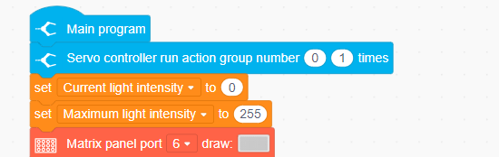

(2) In the loop, read the current light intensity from the light sensor and use it to control the red light intensity of the LED on the CoreX controller and the RGB light on the ultrasonic module. Set the blue light intensity as "Maximum Light Intensity - Current Light Intensity.

The stronger the current light intensity, the more the LED will lean towards red, and conversely, it will lean towards blue when the light intensity is weaker.

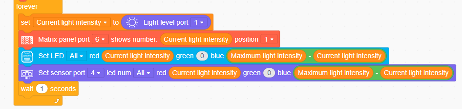

### 4.6.4 Acceleration Control 

* **Project Introduction**

In this lesson, utilize an accelerometer sensor module to detect the tilt direction and trigger the corresponding actions.

* **Program Logic**

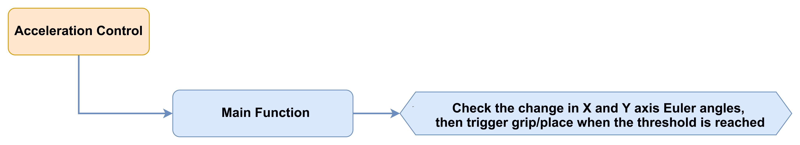

* **Module Introduction**

(1) Accelerometer Sensor

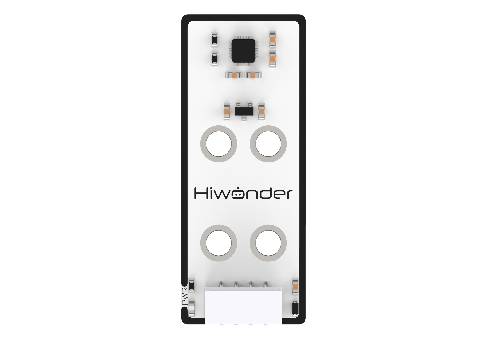

This sensor mainly uses the MPU6050 sensor component. It integrates a 3-axis MEMS gyroscope, a 3-axis MEMS accelerometer, and an expandable Digital Motion Processor (DMP). The sensor uses three 16-bit ADCs for the gyroscope and accelerometer, converting the measured analog values into digital outputs.

To accurately track both fast and slow movements, the sensor's measurement ranges are user-configurable. The gyroscope has measurement ranges of ±250, ±500, ±1000, and ±2000°/second (dps), while the accelerometer can measure in ranges of ±2, ±4, ±8, and ±16g.

**Module Wiring: Connect the dot matrix module to the 5th port of the CoreX controller.**

(2) Dot Matrix Module

The LED dot matrix module uses an LED display screen that features high brightness, flicker-free display, and easy wiring. It can display numbers, text, patterns, and other content. The module consists of two red 8x8 LED lights and is controlled by the TM640B driver chip, enabling control of the dot matrix display.  

**Module Wiring: Connect the dot matrix module to the 6th port of the CoreX controller.**

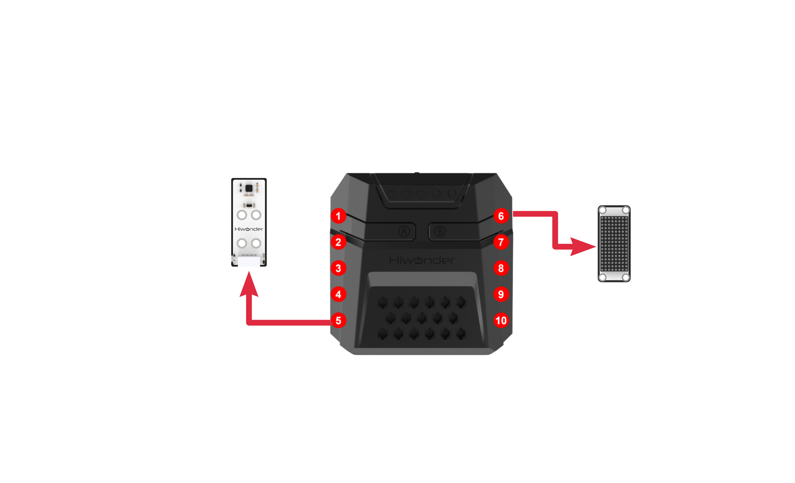

* **Download Program**

(1) Open the WonderCode software.

(2) Drag the program file "Ultrasonic Distance Measurement Program.sb3" located in the same directory as this document into WonderCode.

(3) Click on the "**Connect**" option in the menu bar and select the COM port. In this case, COM7 is used as an example. Once connected successfully, a "**Connection Successful**" message will pop up.

(4) Click on thebutton on the right to download the program to the controller. Wait for the "**Download Successful**" prompt to appear.

* **Project Outcome**

After powering on the robotic arm, tilt the accelerometer forward by a certain angle to enter the grasping stage. The robotic arm will then move forward and downward to grasp the object.

Next, tilt the accelerometer to the left or right by a certain angle to enter the placement stage. The robotic arm will then rotate 90° to the left or right to place the object.

This process can be executed in a loop.

* **Program Analysis**

(1) In the main program, execute action group No.0 once to move the robotic arm to the initial posture and initialize the accelerometer sensor. Clear the dot matrix panel, and set the trigger thresholds for subsequent robotic arm actions: forward grasping, left placement, and right placement.

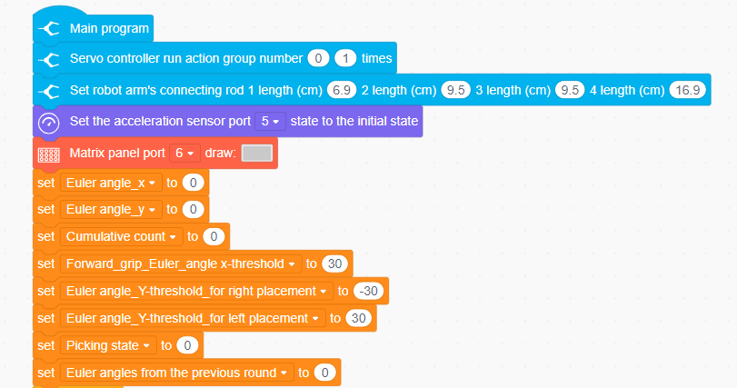

(2) Enter the loop. First, check if the robotic arm is currently executing an action group. Only if the robotic arm is idle and not executing any action group, proceed to execute the internal logic. Begin by clearing the dot matrix display. Then, retrieve the current tilt angles recorded by the accelerometer sensor in the X and Y directions.

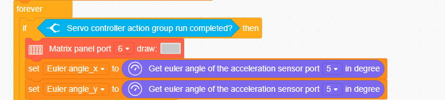

(3) Determine the current pick-up status (=0: Ready to pick, =1: Ready to place). If the status is 0, check if the X-axis tilt angle exceeds the trigger threshold for forward pick-up.  

If the X-axis tilt angle exceeds the trigger threshold for 3 consecutive times, it can exclude errors. Switch the pick-up status to 1, display the prompt string "Go" on the dot matrix, and the robotic arm will descend using inverse kinematics, control the servo to perform the pick-up, and then lift the arm back up using inverse kinematics.  

If the X-axis tilt angle does not exceed the trigger threshold for 3 consecutive times, it is assumed that the previous exceedance was caused by error, and the accumulated count is reset to start from 0.

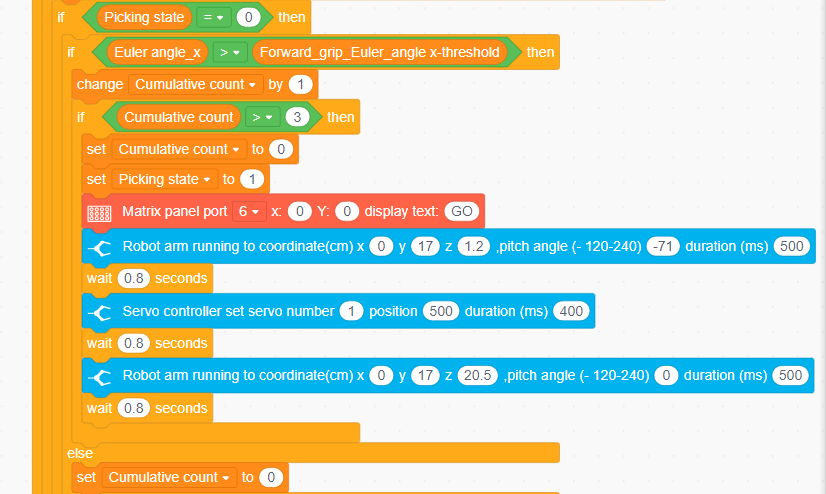

(4) If the current pick-up status is 1 (Ready to place), compare the Y-axis tilt angle with the trigger threshold for placing the object to the left and to the right. The logic for both actions is highly similar. Here, we will explain the process for comparing with the left placement trigger threshold:

First, check if the Y-axis tilt angle exceeds the trigger threshold for placing to the left. If so, confirm whether the previous Y-axis tilt angle was also greater than the preset trigger threshold for leftward placement.

If both the current and previous tilt angles exceed the threshold, it indicates that the module has just rotated to the correct posture for leftward placement, so reset the accumulated count for future counting. If not, the accumulated count continues normally.

If the Y-axis tilt angle exceeds the trigger threshold for 3 consecutive times, it can exclude errors. Switch the pick-up status back to 0, display the prompt string "L" on the dot matrix, and the robotic arm will execute the placement action group and reset the position.

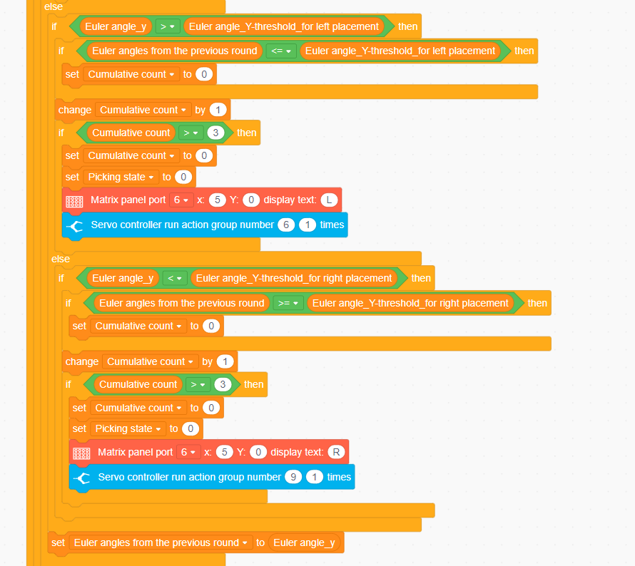

### 4.6.5 Temperature and Humidity Display

* **Project Introduction**

In this lesson, continuously read data from the temperature and humidity sensor and display it on the dot matrix.

* **Program Logic**

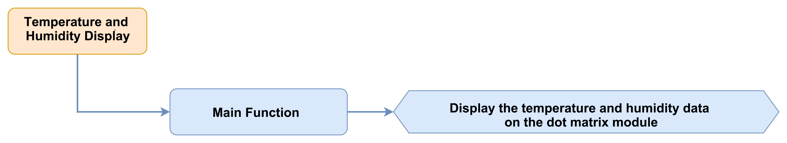

* **Module Instruction**

(1) Temperature and Humidity Sensor

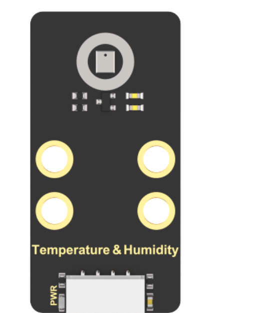

The AHT10 is a high-precision, low-power digital temperature and humidity sensor, widely used in environmental monitoring, smart homes, agriculture greenhouses, and other fields. It uses an I²C communication interface to measure temperature and humidity in real-time, outputting data as a digital signal.

This sensor has the following features: ① High precision: Temperature measurement accuracy: ±0.5℃, Humidity measurement accuracy: ±3% RH. ② Wide measurement range: Temperature range: -40℃ ~ 85℃, Humidity range: 0% ~ 100% RH.

**Module wiring: Connect the temperature and humidity sensor module to the 5th port of the CoreX controller.**

(2) Dot Matrix Module

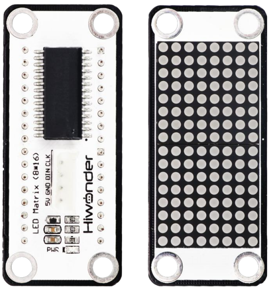

The LED dot matrix module uses an LED display screen that features high brightness, flicker-free display, and easy wiring. It can display numbers, text, patterns, and other content. The module consists of two red 8x8 LED lights and is controlled by the TM640B driver chip, enabling control of the dot matrix display.  

**Module Wiring: Connect the dot matrix module to the 6th port of the CoreX controller.**

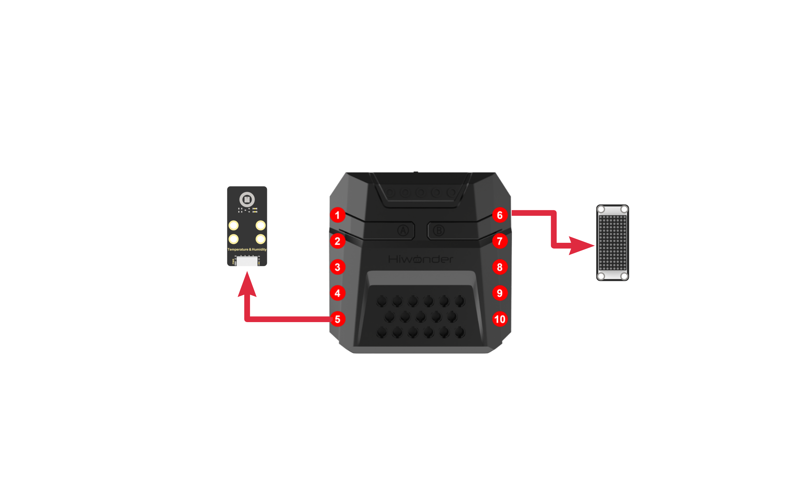

* **Download Program**

(1) Open the WonderCode software.

(2) Drag the program file [Temperature and Humidity Display Program.sb3]() located in the same directory as this document into WonderCode.

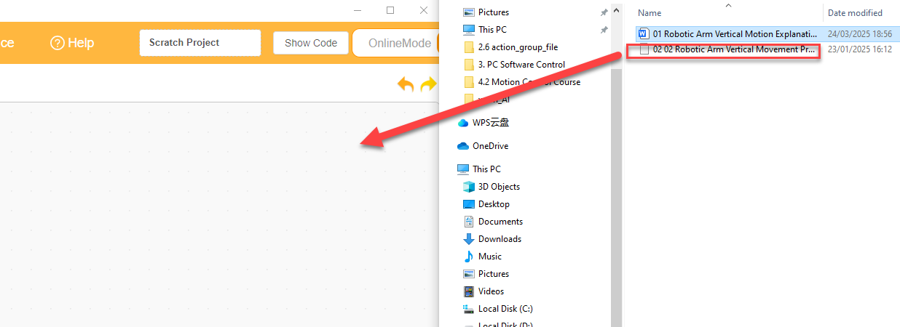

(3) Click on the "**Connect device**" option in the menu bar and select the COM port. In this case, COM7 is used as an example. Once connected successfully, a "**Connection Successful**" message will pop up.

(4) Click on thebutton on the right to download the program to the controller. Wait for the "**Upload Completed**" prompt to appear.

* **Project Outcome**

After powering on the robot, it will continuously read temperature and humidity data and display it on the dot matrix screen. When printing temperature data, the RGB light on the CoreX controller will turn red; when printing humidity data, the RGB light will turn blue.

This process will repeat in a loop.

* **Program Analysis**

(1) In the main program, run action group No.0 once to move the robotic arm to its initial position and clear the dot matrix display.

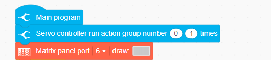

(2) Enter the loop, read the temperature data, and display it on the dot matrix. During the display of the temperature data on the screen, the LED will light up in red as an indication. Then, read the humidity data and display it on the dot matrix. During the display of the humidity data on the screen, the LED will light up in blue as an indication.

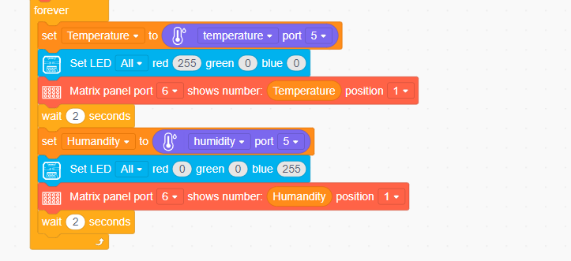

### 4.6.6 Temperature and Humidity Display + Fan Control

* **Project Introduction**

In this lesson, continuously read the temperature sensor's detection data, display it on the dot matrix screen, and automatically turn on the fan if the temperature is too high.

* **Program Logic**

* **Module Instruction**

(1) Temperature and Humidity Sensor

The AHT10 is a high-precision, low-power digital temperature and humidity sensor, widely used in environmental monitoring, smart homes, agriculture greenhouses, and other fields. It uses an I²C communication interface to measure temperature and humidity in real-time, outputting data as a digital signal.

This sensor has the following features: ① High precision: Temperature measurement accuracy: ±0.5℃, Humidity measurement accuracy: ±3% RH. ② Wide measurement range: Temperature range: -40℃ ~ 85℃, Humidity range: 0% ~ 100% RH.

**Module wiring: Connect the temperature and humidity sensor module to the 5th port of the CoreX controller.**

(2) Fan Module

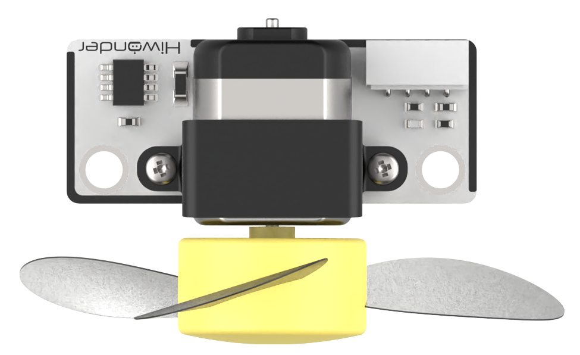

This is a fan module that does not require an additional motor driver board, and its speed is adjustable. The fan sensor controls the direction of the fan's rotation through two directions of PWM pulse waveforms. Additionally, the speed of the fan can be set by adjusting the duty cycle of the PWM pulse width.

**Module Wiring: Connect the module to the 8th interface of the CoreX controller.**

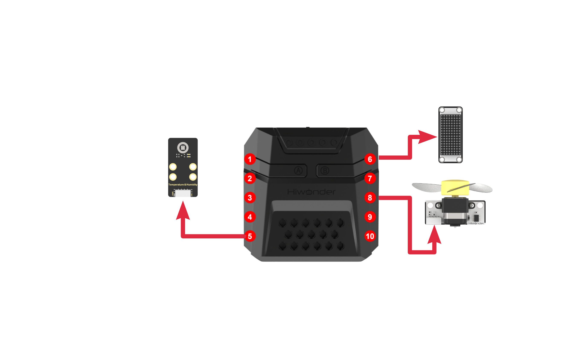

* **Download Program**

(1) Open the WonderCode software.

(2) Drag the program file "Temperature and Humidity + Fan Control Program.sb3" located in the same directory as this document into WonderCode.

(3) Click on the "**Connect device**" option in the menu bar and select the COM port. In this case, COM7 is used as an example. Once connected successfully, a "**Connection Successful**" message will pop up.

(4) Click on thebutton on the right to download the program to the controller. Wait for the "**Upload Completed**" prompt to appear.

* **Project Outcome**

After powering on the robotic arm, the system continuously reads the temperature data and displays it on the dot matrix screen. When the temperature exceeds 31°C, the fan is automatically turned on.

This process will repeat in a loop.

* **Program Analysis**

(1) In the main program, run action group No.0 once to move the robotic arm to its initial position and clear the dot matrix screen.

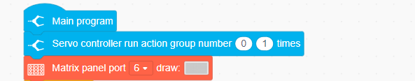

(2) Enter the loop, read the temperature data, and display it on the dot matrix screen.

Check the temperature data:

If the temperature is greater than 31°C, control the fan speed to 80 (duty cycle of 80%) to turn on the fan.

If the temperature is less than or equal to 31°C, set the fan speed to 0 (duty cycle of 0%) to turn off the fan.

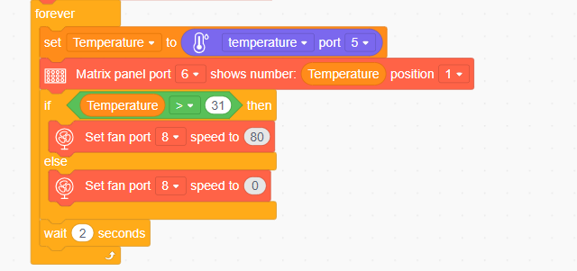

### 4.6.7 Face Recognition + Fan Tracking

* **Project Introduction**

In this section, utilize the WonderCam vision module to detect faces and control the robotic arm's end effector to follow the movement of the face. Additionally, when a face is detected, the fan will be turned on.

* **Program Logic**

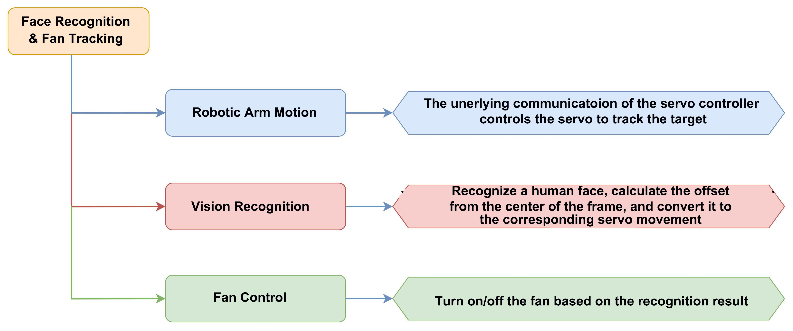

* **Module Instruction**

(1) WonderCam Vision Module

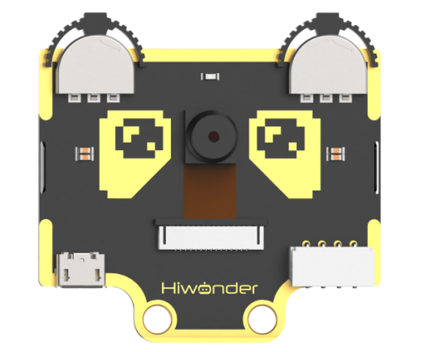

WonderCam is an user-friendly AI visual sensor with eight built-in functions: color recognition, face recognition, AprilTag recognition, line following, Numeric recognition, Landmark recognition, image classification, and feature learning. It can be used with various controllers like ESP32, micro:bit, Arduino, and Raspberry Pi, enabling you to easily implement a wide range of AI visual creative projects.

**Module Wiring: Connect WonderCam module to the port No.9 on the CoreX controller.**

(2) Fan Module

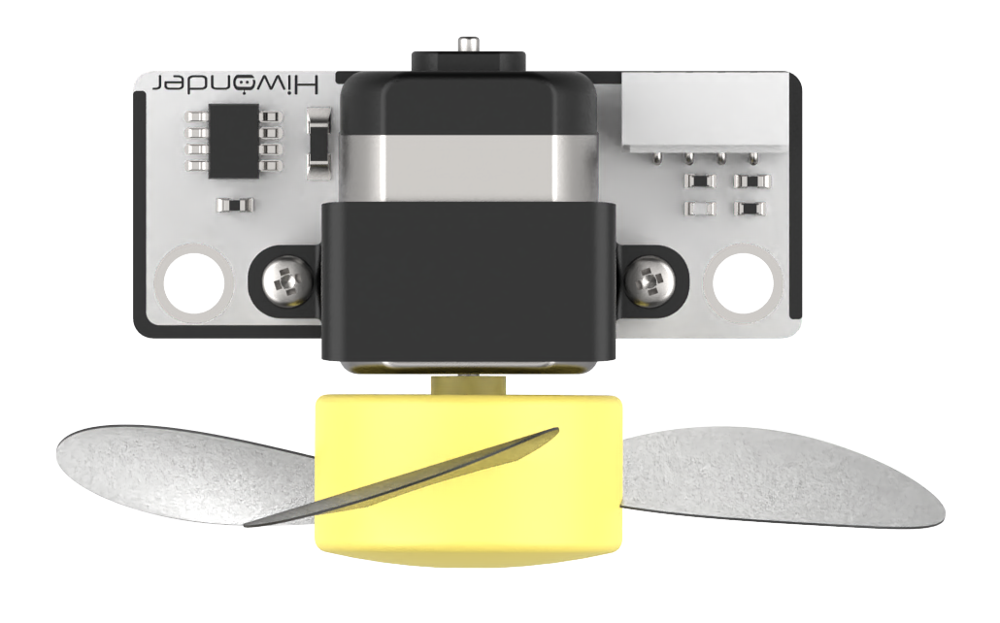

This is a fan module that does not require an additional motor driver board, and its speed is adjustable. The fan sensor controls the direction of the fan's rotation through two directions of PWM pulse waveforms. Additionally, the speed of the fan can be set by adjusting the duty cycle of the PWM pulse width.

**Module Wiring: Connect the module to the 8th interface of the CoreX controller.**

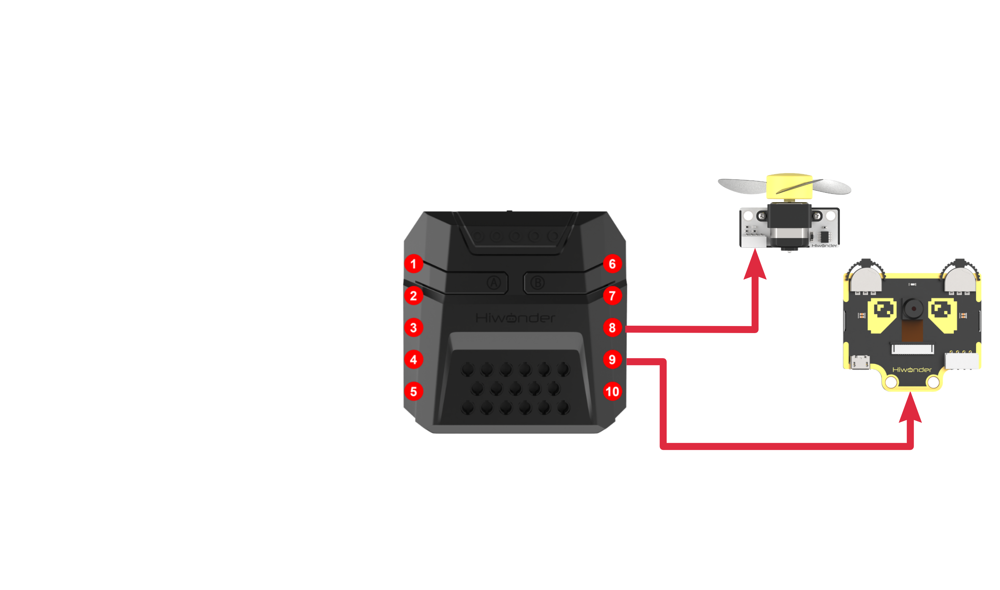

* **Download Program**

(1) Open the WonderCode software.

(2) Drag the program file [Face Recognition + Fan Tracking Program.sb3]() located in the same directory as this document into WonderCode.

(3) Click on the "**Connect device**" option in the menu bar and select the COM port. In this case, COM7 is used as an example. Once connected successfully, a "**Connection Successful**" message will pop up.

(4) Click on thebutton on the right to download the program to the controller. Wait for the "**Upload Completed**" prompt to appear.

<!-- -->

* **Project Outcome**

After the robot arm is powered on, the end effector of the robotic arm will track the movement of any face detected by the vision module and turn on the fan. When the target is lost, the robotic arm will return to its initial posture and pitch angle, turn off the fan, and then continuously rotate within a 180-degree range in front to search for the target.

* **Program Analysis**

(1) Initialize the WonderCam AI vision module, turn off the glowy ultrasonic color lights (to prevent misidentification), and run Action Group No.0 to position the robotic arm in its initial state.

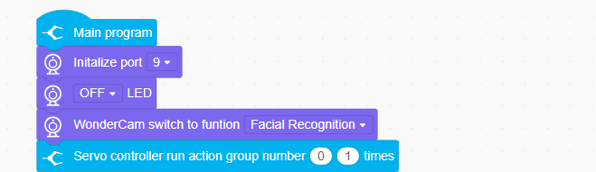

(2) Set the basic parameters required for recognition:

x: The horizontal width (in pixels) of the vision module screen.

y: The vertical width (in pixels) of the vision module screen.

Change Value: The angle value by which the servo motor adjusts when searching for a face.

face_index: The ID of the recognized face.

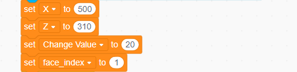

(3) Update and retrieve the face recognition results. If a learned face is recognized, loop through to get the face ID and calculate the center coordinates (x, y).

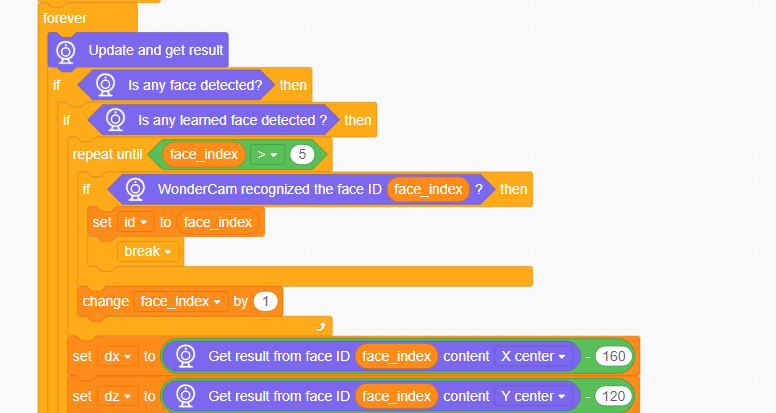

(4) If an unlearned face is detected, directly retrieve the center coordinates (x, y) of the first unlearned face.

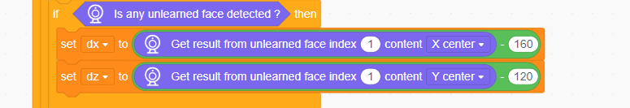

(5) After completing the facial recognition box data retrieval, the fan can be turned on.

(6) Based on the obtained x-coordinate value, calculate the angle for the robotic arm to move left or right, and control the rotation of the ID6 servo.

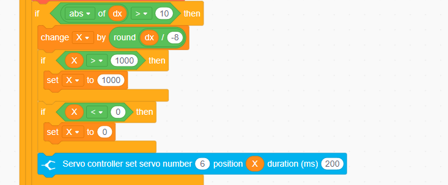

(7) Based on the calculated y-coordinate value, determine the vertical position for the robotic arm's movement, and control the rotation of the ID3 servo.

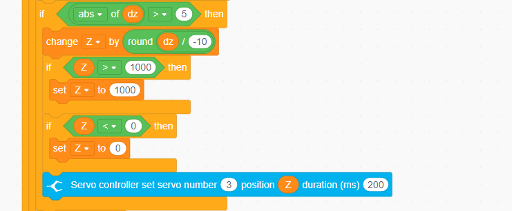

(8) Finally, if no face is detected, control the ID3 servo to return to its initial position, turn off the fan, and control the ID6 servo to rotate back and forth horizontally within a 180-degree range to search for a face.

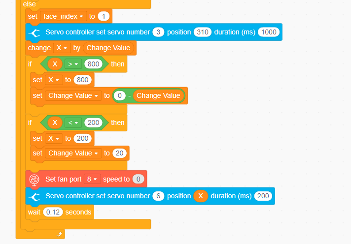
