# 5. Python Programming Projects

## 5.1 Introduction to Hiwonder Python Editor

In this section, we will learn about the connection methods and specific functions of the Hiwonder Python Editor.

:::{Note}

If the editor fails to open, please change the editor's name to English only, such as 'Hiwonder'.

:::

### 5.1.1 Function Introduction

The editor interface is divided into 5 sections as below:

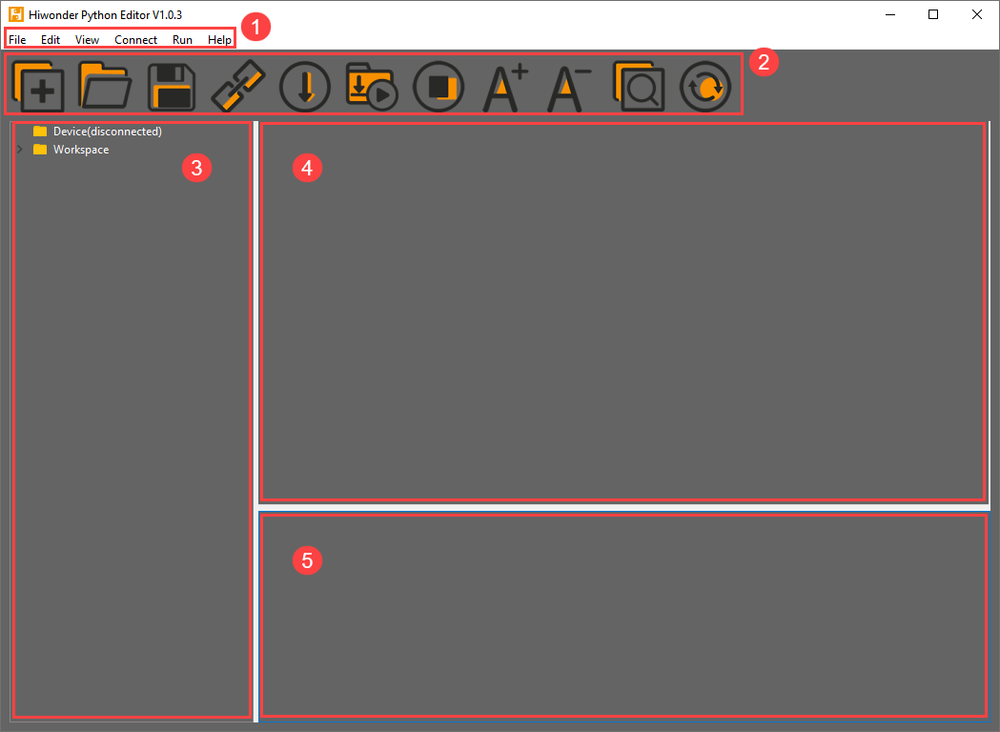

Each area has its corresponding functions, as shown in the table below:

| **No.** |   **Area Name**   |                   **Function Description**                   |
| :-----: | :---------------: | :----------------------------------------------------------: |
|    1    |     Menu Bar      |      Contains File, Edit, View, Connect, Run, and Help       |
|    2    |      Toolbar      | Includes some commonly used shortcut keys that have the same effect as certain keys in the menu bar |
|    3    |     File List     | Divided into multiple project files in the device and locally, allowing you to view the contents of project files (folders, source code, etc.) |
|    4    | Code Editing Area |              Allows you to view and write code               |
|    5    |     Terminal      | Displays message logs and debugging information. When no device is connected, only the message logs can be viewed |

### 5.1.2 Operation Instructions

* **Importing Local Projects**

(1) When importing a local project for the first time, left-click on '**Local Projects**' to open the file selection list. (For subsequent imports, right-click on '**Local Projects**' and select '**Switch Project Path**').


(2) Select [Appendix/Program Collection/Python Project Programs](https://docs.hiwonder.com/projects/xArm-Ai/en/latest/docs/resources_download.html) and click the '**Select Folder**' button.


(3) The files in the folder will be automatically added to the local projects, and you will be able to see them under '**Local Projects**'.


:::{Note}

Importing a local project brings files from your computer into the editor, not downloading them to the ESP32 core board.

:::

* **Viewing Imported Files/Programs**

Here, we can double-click on the program file in the file list to view the detailed code. For example, let's take [Smart_fan.py](../_static/source_code/05/smart_fan.zip):


Similarly, after downloading the program file to the ESP32 core board, you can double-click it under the 'Devices' list to view the program file.

* **Code Writing and Storage**

The code editing area on the right side of the interface supports functions such as creating, viewing, editing, modifying, and saving code. Before you start writing code, please read the following notes:

(1) Users cannot directly create files within the **'Devices'** tab, and files in the 'Devices' can only be saved and modified by downloading. If you need to back up, please copy them to the local projects first.

(2) Do not modify action group files with the **'.rob'** extension within the editor to avoid unknown formatting errors. If you need to modify action group files, please do so on the host machine.

(3) Among the provided low-level program files, **'main.py'** is the main program for the device. All functionalities of the robot need to be initiated through this file, meaning that both reset and power-on operations require this program to be executed. If it becomes unresponsive, subsequent operations cannot proceed. Therefore, if the user needs to add functions to this file, it is recommended to rename the program as a precaution. If 'main.py' is renamed, even if a special freeze occurs during debugging (when the shortcuts **'Ctrl+C'** and **'Ctrl+D'** become unresponsive), you only need to reset the control board and delete and re-download the required program.

* **Program Download and Execution**

Downloading a program is an interactive action between the editor and the device. Using '**smart_fan.py**' as an example:

(1) After selecting the '**smart_fan.py**' file in the '**Local Projects**' tab, click  in the toolbar or right-click the file and choose '**Download and Run**'


(2) You can view the download progress and completion status in the terminal interface. Since '**Download and Run**' was selected in the previous step, you can also observe the program's running effect.


(3) Once the download is complete, the program will appear in the file list under the '**Devices**' tab.


(4) Finally, delete the original '**main.py**' file of Tonybot and rename the downloaded 'smart_fan.py' to '**main.py**.'


Additionally, here are a few points for users to be aware of:

① Besides this download method, you can also rename the file you want to download to '**main.py**' before proceeding with the download.

② The '**Download and Run**' function first resets the device (restarts) and then downloads and runs the program, which helps enhance the stability of the program execution.

③ If you do not need to execute the program immediately, you can click  or right-click the target file and select '**Download**.' Before executing the program later, we can first click  to reset the device and then run the program.

* **Terminal Usage (Debugging)**

The terminal is a functional area that combines an information window and a debugging interface. However, it is important to note that if no device is connected, the terminal area is only for viewing information and cannot be used for editing or debugging.

Regarding information viewing, you have already experienced this in the previous steps, so I won't elaborate further. Here, I will mainly explain the debugging functions.

(1) The terminal supports code input. When you input the code **`print(123)`** in the terminal and press Enter, the output will be as follows:


(2) Additionally, the terminal supports automatic indentation. When you type a Python statement that ends with a colon (such as `if`, `for`, or `while`) and press Enter, the next line will continue at the same indentation level as a regular statement or, when appropriate, at a different indentation level. If you press the Backspace key, it will undo one level of indentation.


(3) To copy and paste code, select the target code and right-click in the terminal interface to perform the operation.


It is important to note that because the terminal has automatic indentation, you must press `Ctrl+E` to enter edit mode before pasting code; otherwise, you may encounter indentation errors during debugging. The following image shows the correct method for copying and pasting, with the indentation format appearing correctly.


The following image shows an incorrect indentation format:


To exit edit mode, you can press **Ctrl+C**. Additionally, if you write an infinite loop, you can also press `Ctrl+C` to exit.

**Friendly Reminder**: In the terminal, the **Ctrl+C** shortcut key can only be used to interrupt a running program; it does not have a copy function, and **Ctrl+V** has no paste function.

(4) When entering commands in the terminal, you can use the **Tab** key for code completion. For example, after typing  **os**  in the terminal, pressing the  **Tab**  key will yield the following result:


If there are two or more options available for the current code completion, the terminal will list all options; if there is only one option, the terminal will automatically complete it; if there are none, it will have no effect.

(5) In the terminal, you can use the **"and"** keys on your keyboard to view the command history, saving you input time.

For more commands and command descriptions, you can visit <http://docs.micropython.org/en/latest/library/uos.html>.

## 5.2 Motion Control Course

### 5.2.1 Inverse Kinematics Introduction

* **Introduction**

Inverse kinematics is the process of determining the parameters of the joint movable object to be set to achieve the required posture.

The inverse kinematics of the robotic arm is an important foundation for its trajectory planning and control. Whether the inverse kinematics solution is fast and accurate will directly affect the accuracy of the robotic arm's trajectory planning and control. so it is important to design a fast and accurate inverse kinematics solution method for a six-degree-of-freedom robotic arm.

* **Brief Analysis of Inverse Kinematics**

For the robotic arm, the position and orientation of the gripper are given to obtain the rotation angle of each joint. The three-dimensional motion of the robotic arm is complicated. In order to simplify the model, we remove the rotation joint of the pan-tilt so that the kinematics analysis can be performed on a two-dimensional plane.

Inverse kinematics analysis generally requires a large number of matrix operations, and the process is complex and computationally expensive, so it is difficult to implement. In order to better meet our needs, we use geometric methods to analyze the robotic arm.

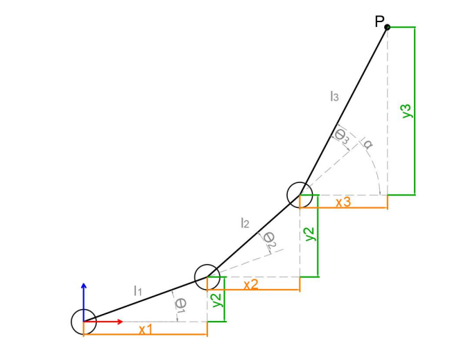

We simplify the model of the robotic arm, remove the pan-tilt at the base, and the actuator part to get the main body of the robotic arm. From the figure above, you can see the coordinates (x, y) of the end point P of the robotic arm, which ultimately consists of three parts (x1+x2+x3, y1+y2+y3).

Among them θ1, θ2,θ3 in the above figure are the angles of the servo that we need to solve, and α is the angle between the paw and the horizontal plane. From the figure, it is obvious that the top angle of the claw α=θ1+θ2+θ3, based on which we can formulate the following formula:


Among them, x and y are given by the user, and l1, l2, and l3 are the inherent properties of the mechanical structure of the robotic arm.

In order to facilitate the calculation, we will deal with the known part and consider the whole:


Substituting m and n into the existing equation, and then simplifying can get:


Through calculation:


We see that the above formula is the root-finding formula of a quadratic equation in one variable:


Based on this, we can find the angle of θ1, and similarly we can also find θ2. From this we can obtain the angles of the three steering gears, and then control the steering gears according to the angles to realize the control of the coordinate position.

### 5.2.2 Establish Robotic Arm Coordinate System

* **Establishing Coordinate System**

We typically control the robotic arm's movement through action groups. The prerequisite for this implementation is the use of a PC to edit the actions. However, after editing and downloading the actions to the robotic arm, it becomes less flexible if fine adjustments are needed, or if action editing is required without a PC. Therefore, the following introduces the xArm AI's coordinate system and how to control the robotic arm's movement using coordinates.

Since we're dealing with a coordinate system, the first thing to know is the origin of the coordinate system and what the coordinates represent. The origin of xArm AI's coordinate system is based on the bottom of the servo in its base platform, as shown in the diagram below. 

From the robot's first-person perspective, the positive direction of the X-axis is to the right of the robotic arm, the positive direction of the Y-axis is in front of the robotic arm, and the Z-axis is directed upwards.


After defining the X, Y, and Z axes, we can now define the distance for each unit on the coordinate axes, which allows us to calculate the position of a specific point on the robotic arm within this coordinate system. In this case, we define the unit distance for the coordinate axes as centimeters (cm).

* **Coordinate System Parameter**

After understanding the coordinate system of the robotic arm, let's now discuss some related parameters. First is the coordinate information. The X, Y, and Z coordinates actually refer to the position of the robotic arm's end effector. Here, the end effector refers to the position reached when the end gripper is fully closed.

We will use a coordinate example that will be used in subsequent lessons, as shown in the diagram below:


This is a coordinate instruction for setting the robotic arm's initial position. As you can see, the coordinates (x, y, z) are filled in as (0, 17, 20.5), which means the position of the robotic arm's end effector is 17 cm directly in front of the origin and 20.5 cm high. The pitch angle is set to 0°, meaning the gripper's angle is level with the horizontal plane.


Now that we know the origin, the three axes, and the description of the coordinates of the robotic arm, it is still not enough to determine or control the arm's position. We need to find another standard to determine the specific position and configuration of the robotic arm. The standard we use here is the arm's **link length**.

In most cases, the link length refers to the distance between two servos. However, since the servo for the gripper is somewhat special, the final link length (Link 4) refers to the distance from the servo to the end effector of the robotic arm.


If the link lengths are not defined with the same number of links, then the position and orientation of the robotic arm cannot be determined solely based on the end effector's coordinates and pitch angle. Using the following two diagrams as examples, the end effector's coordinates and pitch angle are the same, but the arm's shape and position can result in different outcomes: (where each colored line corresponds to a different link).

<p style="text-align:center;" class="common_img">


</p>


As seen from the above diagram, to determine the exact position and configuration of the robotic arm, it is necessary to define the link lengths. This is also related to controlling the robotic arm's movement, because once the link lengths are defined, along with the position parameters of the end effector, the solution for the position will be unique.

Having discussed the above parameters, let's now think in reverse: Is it true that once we have the three-axis coordinates of the end effector, the pitch angle of the gripper, and the link lengths, we can obtain a unique solution for the robotic arm's position? The answer is yes.

* **Coordinate Control**

The above content has explained the link lengths and the coordinate information of the robotic arm. Next, we can combine these two to control the robotic arm's movement. Here, we will illustrate this through a few actions, as shown in the diagram below:


First, we need to close the gripper, which is controlled by Servo 1. Then, define the link lengths of the robotic arm.  

The first position represents the robotic arm's initial position. After 1 second, it will move to the position we set for the end effector and the pitch angle of the gripper. Since the pitch angle is 0, the gripper will be in a level position.  

After another second, the arm will move to the position with X=0, Y=11, Z=3.7, and a pitch angle of -68°.  

At this point, our action is considered edited and completed. Of course, we can also try modifying the values to other numbers, but due to the mechanical arm's built-in limit switches, some positions may be unreachable.  

Therefore, when editing the robotic arm's movements using coordinates, we also need to consider whether the link lengths and angular positions are reasonable.

### 5.2.3 Motion Control Library File Introduction

* **Kinematics Function Introduction**

(1) Link Length Setting

This function has 4 parameters, all in centimeters (cm).

Parameter 1 is the length of Link 1, which is the distance from the base to the output shaft of Servo 5.

Parameter 2 is the length of Link 2, which is the distance from the output shaft of Servo 5 to the output shaft of Servo 4.

Parameter 3 is the length of Link 3, which is the distance from the output shaft of Servo 4 to the output shaft of Servo 3.

Parameter 4 is the length of Link 4, which is the distance from the output shaft of Servo 3 to the end position of the gripper in the closed state.

This function is used to set the lengths of the robotic arm's links. The xArm AI has 4 links, with the distances from the base to the gripper being 6.9 cm, 9.5 cm, 9.5 cm, and 16.9 cm, respectively. Once the link lengths are determined, the target position can be accurately calculated during kinematic calculations.


(2) Coordinate Movement within the Pitch Angle Range

This function has 6 parameters:

Parameter 1 is the x-axis coordinate, in centimeters (cm);

Parameter 2 is the y-axis coordinate, in centimeters (cm);

Parameter 3 is the z-axis coordinate, in centimeters (cm);

Parameter 4 is the minimum pitch angle, in degrees (°), with a range of -120 to 240;

Parameter 5 is the maximum pitch angle, in degrees (°), with a range of -120 to 240;

Parameter 6 is the arm movement time, in milliseconds (ms).

This function allows the robotic arm to move to the corresponding coordinates within the set pitch angle range. The kinematics will iterate through each value within the set pitch angle range and calculate whether a solution exists. If a solution is found, the arm will move to the corresponding coordinates.


(3) Move to a Specific Coordinate with a Specified Pitch Angle

This function has 6 parameters:

Parameter 1 is the x-axis coordinate, in centimeters (cm);

Parameter 2 is the y-axis coordinate, in centimeters (cm);

Parameter 3 is the z-axis coordinate, in centimeters (cm);

Parameter 4 is the minimum pitch angle, in degrees (°), with a range of -120 to 240;

Parameter 5 is the maximum pitch angle, in degrees (°), with a range of -120 to 240;

Parameter 6 is the arm movement time, in milliseconds (ms).

This function allows the robotic arm to move to the corresponding coordinates within the set pitch angle range. The kinematics will iterate through each value within the set pitch angle range and calculate whether a solution exists. If a solution is found, the arm will move to the corresponding coordinates.


### 5.2.4 Robotic Arm Vertical Motion 

* **Project Introduction**

This project will achieve vertical upward and downward movement for the xArm AI robot.

* **Project Process**


* **Download Program**

(1) Open the 'Hiwonder Python Editor' software 。

(2) Drag the .py file, located in the same directory as this document, into the Hiwonder Python Editor.


(3) Click the connection button  in the menu bar; it will change to a green icon  once connected successfully.


(4) After successfully connecting, click the download button  in the menu bar to download the program to xArm AI. Wait for the information interaction box below to indicate that the download is complete.


* **Project Outcome**

The robotic arm will repeatedly perform vertical up and down movements.


* **Program Analysis**

(1) Import the Hiwonder, time, kinematics, and LSC library files. These libraries include functions for sensors, inverse kinematics, servo control, and more.

{lineno-start=1}

```
import Hiwonder
import time
import kinematics
from Hiwonder import LSC
```

(2) In the main function, first set the lengths of the four links of the robotic arm. Then, control Servo 1 and Servo 2 to move to positions 100 and 500, respectively. Finally, control the robotic arm to reach the position (x=0, y=17, z=20.5) and wait for 1.5 seconds.

{lineno-start=7}

```
def start_main():
  kinematics.set_link_length(6.9,9.5,9.5,16.9)  #(Set the robotic arm link lengths) 设置机械臂连杆长度
  LSC.moveServo(1,100,1000)   #(LSC.moveServo(1, 100, 1000)   # Control servo 1 and 2 to rotate)控制1、2号舵机转动 
  LSC.moveServo(2,500,1000)
  kinematics.ki_move(0,17,20.5,0,1500)  #(Move the robotic arm to the initial position)控制机械臂运动至初始姿态
  time.sleep(1.5)
```

(3) Next, in the program, use a loop to control the robotic arm to move to the position (x=0, y=17, z=16.4) within 1.5 seconds, with the pitch angle set to 0. After waiting for 1.5 seconds, control the robotic arm to move to the position (x=0, y=17, z=25.8). This will create a continuous vertical motion loop for the robotic arm.

{lineno-start=13}

```
  while True:
    kinematics.ki_move(0,17,16.4,0,1500)   #(Move the arm straight downward)使机械臂竖直向下运动
    time.sleep(1.5)
    kinematics.ki_move(0,17,25.8,0,1500)   #(Move the arm straight upward)使机械臂竖直向上运动
    time.sleep(1.5)
```

To run the `start_main()` function in a new thread, you should use the startMain method from the Hiwonder library. Here's how you can structure the code:

{lineno-start=19}

```
Hiwonder.startMain(start_main)
```

### 5.2.5 Robotic Arm Fixed-Point Motion 

* **Project Introduction**

In this section, the robotic arm performs object grasping by calling kinematics functions. It sequentially places the object in four positions: 90 degrees to the left, 45 degrees to the left, 45 degrees to the right, and 90 degrees to the right.

* **Project Logic**


* **Download Program**

(1) Launch the **"Hiwonder Python Editor"** software .

(2) Drag the .py file (located in the same folder as this document) into the editor window.


(3) Click the connection button  in the menu bar. Once connected, the icon  will turn green, indicating a successful connection.


(4) After the connection is established, click the download button  in the menu bar to upload the program to xArm AI. Wait for the completion message to appear in the info box below.


* **Project Outcome**

The robotic arm will repeatedly grasp the object and move to the positions of 90° to the left, 45° to the left, 45° to the right, and 90° to the right.


* **Program Analysis**

(1) Import the HiWonder, time, kinematics, and LSC library files, which include functions for sensors, inverse kinematics, servo control, and other features.

{lineno-start=1}

```
import Hiwonder
import time
import kinematics
from Hiwonder import LSC
```

(2) First, set the lengths of the robotic arm's four links. Then, rotate ID1 servo to position 100 and open the gripper. Next, rotate ID2 servo to position 500. After that, move the robotic arm to the coordinates (x=0, y=17, z=20.5) to return to its initial posture, and wait for 2 seconds.

{lineno-start=7}

```
def start_main():
  kinematics.set_link_length(6.9,9.5,9.5,16.9)
  LSC.moveServo(1,100,500)
  LSC.moveServo(2,500,500)
  kinematics.ki_move(0,17,20.5,0,1000)
  time.sleep(2)
```

(3) In the following program, cycle through and run 4 functions, each corresponding to placing an object at a different angle.

{lineno-start=13}

```
  while True:
    left90()
    time.sleep(1)
    left45()
    time.sleep(1)
    right45()
    time.sleep(1)
    right90()
    time.sleep(1)
```

(4) Here, we take picking and placing at 90° on the left side as an example:

Call the kinematics.ki_move() function to control the robotic arm to move to the position (x=0, y=17, z=1.8) with a pitch angle of -69°, putting the arm into the grabbing state. Then, use LSC.moveServo() to control servo 1 to rotate and grab the object. After grabbing the object, return to the initial position (x=0, y=17, z=20.5).

After waiting for 0.6 seconds, control the robotic arm to move to the left 90° position. Based on the arm's coordinate system, when x is negative, the arm will rotate to the left. Since y is 0, the arm will move to the left 90° position. Then, control the arm to move to the position (x=-19.5, y=0, z=2.8) to place the object. Finally, return the arm to its initial posture.

{lineno-start=23}

```
def left90():
  kinematics.ki_move(0,17,1.2,-71,800)    #(Move the robotic arm downward to grip) 机械臂向下探 
  time.sleep(0.6)
  LSC.moveServo(1,500,500)                #(Close the robotic gripper) 机械爪收拢
  time.sleep(1)
  kinematics.ki_move(0,17,20.5,0,800)     #(Lift the arm back to the original position) 机械臂抬起复位
  time.sleep(0.6)
  kinematics.ki_move(-17,0,20.5,0,800)    #(Rotate the arm to the left) 向左转
  time.sleep(0.6)
  kinematics.ki_move(-19.5,0,2.8,-60,800) #(Lower the arm to place the object at 90° left) 向左放下90度
  time.sleep(0.6)
  LSC.moveServo(1,100,500)                #(Open the gripper to release the object）机械爪放开
  time.sleep(1)
  kinematics.ki_move(-17,0,20.5,0,800)    #(Lift the arm up again) 机械臂抬起
  time.sleep(0.6)
  kinematics.ki_move(0,17,20.5,0,800)     #(Rotate the arm back to the center position) 机械臂转回中间位置复位
  time.sleep(0.6)
```

To run the `start_main()` function in a new thread using the startMain method from the Hiwonder library, you would follow the structure as shown below:

{lineno-start=96}

```
Hiwonder.startMain(start_main)
```

## 5.3 Basic Function Course

### 5.3.1 Dot Matrix Display

* **Assembly**

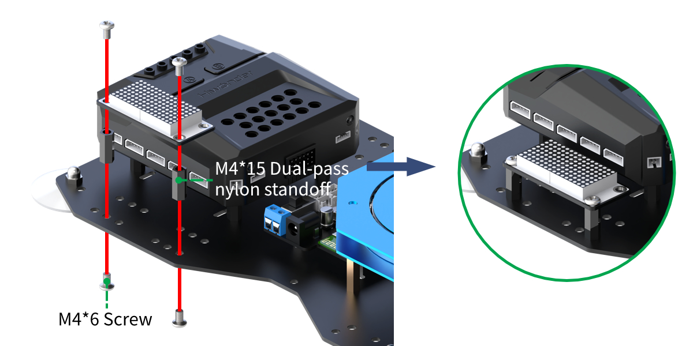

* **Project Introduction**

The LED dot matrix module is used to display the set text.

* **Project Logic**


* **Module Instruction**

The LED dot matrix display module features high display brightness, no flickering during display, easy wiring, and can display numbers, text, patterns, and other content.


The module consists of two red 8x8 LED lights and is controlled by the TM640B driver chip, enabling control of the dot matrix display.  

Module Wiring: Connect the dot matrix module to the port No.6 on the CoreX controller.


* **Download Program**

[Dot Matrix Display Program](../_static/source_code/05/03/Dot%20Matrix%20Display%20Program.zip)

(1) Open the **'Hiwonder Python Editor'** software 。

(2) Drag the .py file, located in the same directory as this document, into the Hiwonder Python Editor.


(3) Click "**Connect**" in the menu bar and select the appropriate COM port. Here, COM3 is used as an example. Once the connection is successful, the connection icon will turn green .


(4) After successfully connecting, click the download button  in the menu bar to download the program to xArm AI. Wait for the information interaction box below to indicate that the download is complete.


* **Project Outcome**

The LED dot matrix module displays "**Hi I AM xArm**"

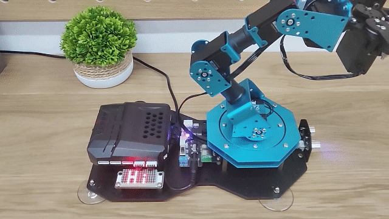

* **Program Analysis**

[Dot Matrix Display Program](../_static/source_code/05/03/Dot%20Matrix%20Display%20Program.zip)

(1) Load the libraries: the HiWonder library includes sensor libraries and low voltage alarm functions; the time library is for time-related operations;

{lineno-start=1}

```
import Hiwonder
import time
```

(2) Instantiate the Digitaltube class object from the Hiwonder library and bind it to IO port 6. After entering the main function, the robotic arm will perform the action group 0 once and adjust to the initial posture.

{lineno-start=5}

```
# initialize variables
digitalTube_6 = Hiwonder.Digitaltube(Hiwonder.Port(6))


def start_main():
  global digitalTube_6

  LSC.runActionGroup(0,1)
```

(3) Next, call the member method of the dot matrix module object to display a specified string at a given position on the matrix.

The function internally maps each character in the string to the corresponding LED on the matrix, displaying the character's on/off state (represented by several hexadecimal numbers, where each number corresponds to the on/off state of a column of LEDs). This data is then transmitted to the module to control its display.

{lineno-start=13}

```
  while True:
    digitalTube_6.drawStr((3,0,'Hi'))
    time.sleep(1)
    digitalTube_6.drawStr((6,0,'I'))
    time.sleep(1)
    digitalTube_6.drawStr((2,0,'AM'))
    time.sleep(1)
```

4() Finally, we use the font generation software to create the "**xarm**" pattern and export the corresponding dot matrix display data. This data is then directly transmitted to the dot matrix module via the drawBitMap function to control its display.

:::{Note}
* The development software WonderCode used in the xarm Scratch programming project integrates the font generation software for the corresponding dot matrix module. You can refer to the program and documentation in "[**4. Scratch Programming Projects->4.3 Basic Project Course->4.3.1 Dot Matrix Display**](https://docs.hiwonder.com/projects/xArm-Ai/en/latest/docs/4.Scratch_Programming_Project.html#dot-matrix-display)" to learn more.

* The parameter passed to drawBitMap represents the on/off state of each column of LEDs on the dot matrix, from left to right. For each hexadecimal number, the lower bits correspond to the upper LEDs of the matrix, while the higher bits correspond to the lower LEDs. Each bit set to 1 indicates that the corresponding LED is on.
:::

{lineno-start=20}

```
    digitalTube_6.drawBitMap((0x50,0x20,0x50,0x0,0x78,0x14,0x78,0x0,0x78,0x10,0x8,0x70,0x8,0x70,0x8,0x70))
    time.sleep(3)
```

The process described above needs to be executed in a loop.

Additionally, the main function start_main() should be run in a new thread using the startMain method from the Hiwonder library.

{lineno-start=23}

```
Hiwonder.startMain(start_main)
```

### 5.3.2 RGB Light Flashing

* **Project Introduction**

This section introduces how the RGB lights on the CoreX controller light up and turn off one by one, creating a flowing effect.

* **Project Logic**


* **Module Instruction**


The CoreX controller comes with 6 built-in RGB lights. These onboard RGB lights use RGB LED light bulbs, which allow the three colors—red, green, and blue—to be individually adjusted for brightness. This enables the creation of a colorful, mixed light effect.

* **Download Program**

[RGB Light Flashing Program](../_static/source_code/05/03/RGB%20Light%20Flashing%20Program.zip)

(1) Open the Python editor software .

(2) Drag the program file under the same path as this document to the Python editor.


(3) Click on the "**Connect**" in the menu bar and select the COM port. In this case, COM3 is successful, the connection icon will turn green.


(4) Click Download on the right , download the program to the device and wait for the prompt to complete the download.


* **Project Outcome**

The RGB lights on the CoreX controller will light up and turn off in the order of red, green, and blue colors.


* **Program Analysis**

[RGB Light Flashing Program](../_static/source_code/05/03/RGB%20Light%20Flashing%20Program.zip)

(1) Load libraries. The Hiwonder library includes sensor libraries, low-voltage alarms, etc., the time library is used for time-related functions, and the LSC library handles low-level communication between the main controller and the servo control board.

{lineno-start=1}

```
import Hiwonder
import time
from Hiwonder import LSC
```

(2) A delay variable is created to control the speed of the running light. In the main function, this delay shall be set to 0.1 seconds. Upon powering up, the robotic arm will execute Action Group 0 and return to its initial posture.

{lineno-start=5}

```
# initialize variables
delay_time = 0


LSC.runActionGroup(0,1)
```

{lineno-start=14}

```
def start_main():
  global delay_time

  delay_time = 0.1
```

(3) Next, you need to call the setItem function of the RGB light module object Neopixel_onboard method in the Hiwonder library to control the turning on and off of the RGB lights. The process is very similar for each light switch. Here's an example of one switching process:

First, the controller sets the RGB light with ID 1 to display red by setting the RGB values to 255:0:0. The write function is then called to send the data, and the RGB light with ID 1 will turn on with a red light. RGB lights are numbered starting from 1, but in the underlying code, arrays are indexed starting from 0, so the ID is mapped by subtracting 1.

Next, the controller sets the RGB light with ID 1 to 0:0:0 and sets the RGB light with ID 2 to display green by setting the RGB values to 0:255:0. The write function is then called again to send the data, turning off the red light and turning on the green light for RGB light 2.

{lineno-start=18}

```
  while True:
    Hiwonder.Neopixel_onboard.setItem(1-1,255,0,0)
    Hiwonder.Neopixel_onboard.write()
    time.sleep(delay_time)
    Hiwonder.Neopixel_onboard.setItem(1-1,0,0,0)
    Hiwonder.Neopixel_onboard.write()
    Hiwonder.Neopixel_onboard.setItem(2-1,0,255,0)
    Hiwonder.Neopixel_onboard.write()
    time.sleep(delay_time)
```

This process continues in a loop, repeating the switching process for the lights.

The start_main() function must be executed in a new thread using the startMain method from the Hiwonder library.

{lineno-start=51}

```
Hiwonder.startMain(start_main)
```

### 5.3.3 Ultrasonic Distance Measurement

* **Assembly**


* **Project Introduction**

This section introduces how the LED matrix module display the distance value detected by the ultrasonic sensor, and how the RGB lights change color to indicate the proximity of the object.

* **Project Logic**


* **Module Instruction**

(1) Ultrasonic Module

This module uses an IIC communication interface and can read distance measurements from the ultrasonic sensor via IIC.

Additionally, the ultrasonic probe integrates two RGB LEDs, which not only support brightness adjustment but also can produce colorful lighting effects through changes and combinations of the red (R), green (G), and blue (B) channels.


During distance measurement, the module automatically sends out 8 pulses of 40 kHz square waves and waits for a signal to return. If a signal is returned, the module outputs a high-level signal, and the duration of the high-level signal corresponds to the time it takes for the ultrasound to travel to the object and back.

**Module Wiring: Connect the ultrasonic sensor module to port 4 of the CoreX controller.**

(2) Dot Matrix Module

The LED dot matrix module is a display unit that features high brightness, no flickering during display, and easy wiring, and it can show numbers, text, and patterns.


This module consists of two red 8x8 LED matrices and is controlled by the TM640B driver chip, which enables control of the dot matrix display.

**Module Wiring: Connect the dot matrix module to port 6 of the CoreX controller.**


* **Download Program**

[Ultrasonic Distance Measurement Program](../_static/source_code/05/03/Ultrasonic%20Distance%20Measurement%20Program.zip)

(1) Open the Python editor software。

(2) Drag the program file under the same path as this document to the Python editor.


(3) Click on the "**Connect**" in the menu bar and select the COM port. In this case, COM3 is successful, the connection icon will turn green .


(4) Click Download on the right , download the program to the device and wait for the prompt to complete the download.


* **Project Outcome**

The distance detected by the ultrasonic sensor is displayed as a numerical value on the dot matrix module.

When the distance is greater than 10 cm, the ultrasonic RGB lights will turn green. Otherwise, the ultrasonic RGB lights will turn red, and a sound will be played.


*  **Program Analysis**

[Ultrasonic Distance Measurement Program](../_static/source_code/05/03/Ultrasonic%20Distance%20Measurement%20Program.zip)

(1) Load libraries. The Hiwonder library includes sensor libraries, low-voltage alarms, etc., the time library is used for time-related functions，and the LSC library handles low-level communication between the controller and the servo control board, and the Buzzer library controls the buzzer.

{lineno-start=1}

```
import Hiwonder
import time
from Hiwonder import LSC
from Hiwonder import Buzzer
```

(2) Create the LED matrix module object and bind it to IO port 6. Create the ultrasonic module object and bind it to the IIC port 4. Create a "**distance**" variable to store the distance values measured by the ultrasonic module.

:::{Note}

Ports 3, 4, 5, and 9 on the CoreX box all connect to the same internal IIC bus. For convenience, the IIC bus is initialized using port number 4 with the Port method from the Hiwonder library. Once initialized, all ports on that bus can communicate interchangeably.

:::

{lineno-start=6}

```
# initialize variables
distance = 0
i2csonar_3 = Hiwonder.I2CSonar(Hiwonder.Port(4))
digitalTube_6 = Hiwonder.Digitaltube(Hiwonder.Port(6))
```

Inside the main function, the ultrasonic module's getDistance method is called in a loop to read the distance value. The returned value is rounded by using the round method, and the corresponding data is printed on position 1 of the LED matrix using the showNum method.

{lineno-start=22}

```
  while True:
    distance = round(i2csonar_3.getDistance())
    digitalTube_6.showNum((_var_8ddd_79bb,1))
```

The distance value is then checked. If it is greater than the threshold 10 cm, the RGB lights on the CoreX box will turn green (R: G: B = 0: 255: 0), using the fill method from the Hiwonder library's RGB light module. The setRGB method of the glowy ultrasonic module is also called to make all the lights turn green.

If the distance is below the threshold, the RGB lights on the CoreX box will turn red ( R: G: B = 255: 0: 0), and all lights on the glowy ultrasonic module will turn red. Additionally, the playTone method from the Buzzer library is called to play a tone with a frequency of 1976 Hz at B6 note for 500 ms, half a beat.

{lineno-start=25}

```
    if (distance>10):
      Hiwonder.Neopixel_onboard.fill(0,255,0)
      i2csonar_3.setRGB(0,0,255,0)
    else:
      Hiwonder.Neopixel_onboard.fill(255,0,0)
      i2csonar_3.setRGB(0,255,0,0)
      Buzzer.playTone(1976,500,True)
    time.sleep(0.1)
```

This process continues in a loop, repeating the switching process for the lights.

The `start_main()` function must be executed in a new thread using the startMain method from the Hiwonder library.

{lineno-start=34}

```
Hiwonder.startMain(start_main)
```

### 5.3.4 Button Control

* **Project Introduction**

This lesson gives an introduction about controlling the robotic arm to perform action groups by buttons.

* **Project Logic**


* **Module Instruction**

The onboard buttons are common input components in embedded systems or development boards. They are used for user interaction and control functions. Typically, buttons are used to start, reset, or trigger specific functions.

* **Program Download**

[Button Control Program](../_static/source_code/05/03/Button%20Control%20Program.zip)

(1) Open the Python editor software .

(2) Drag the program file under the same path as this document to the Python editor.


(3) Click on the **"Connect"** in the menu bar and select the COM port. In this case, COM3 is successful, the connection icon will turn green .


(4) Click Download on the right , download the program to the device and wait for the prompt to complete the download.


* **Project Outcome**

After the robotic arm is powered on, pressing button A once will execute action group 3 once. Pressing button B once will execute action group 2 once. After the execution of these action groups, the robotic arm will automatically perform action group 0 to reset to the initial position.


* **Program Analysis**

(1) Load libraries. The Hiwonder library includes sensor libraries, low-voltage alarms, etc., the time library is used for time-related functions, and the LSC library handles low-level communication between the main controller and the servo control board.

{lineno-start=1}

```
import Hiwonder
import time
from Hiwonder import LSC
```

(2) This part introduces the handler function of the main function and the handler functions executed when the two buttons are pressed together, because the internal execution logic of the three functions is similar,

After powering on the robotic arm, the main function is executed by default to run action group 0 to position the arm in its initial state. When button A is detected as pressed, the logic function controls the robotic arm to execute action group 3 once. When button B is detected as pressed, the logic function controls the robotic arm to execute action group 2 once.

To prevent interference between these three logics, the logic for handling button A and B presses will only take effect when the actionFinish function checks that the servo control board is idle, and the robotic arm is not currently executing any action group.

{lineno-start=6}

```
def start_main():
  LSC.runActionGroup(0,1)


def on_button_A_clicked():
  if LSC.actionFinish():
    LSC.runActionGroup(3,1)


def on_button_B_clicked():
  if LSC.actionFinish():
    LSC.runActionGroup(2,1)
```

(3) Inside the Hiwonder library, there is a thread that monitors the button press states. Different logic is executed depending on which button is pressed. By using the functions Button_A.Clicked and Button_B.Clicked, you can bind the appropriate logic function to the corresponding button press event.

{lineno-start=20}

```
Hiwonder.Button_A.Clicked(on_button_A_clicked)
Hiwonder.Button_B.Clicked(on_button_B_clicked)
```

The start_main() function must be executed in a new thread using the startMain method from the Hiwonder library.

{lineno-start=19}

```
Hiwonder.startMain(start_main)
```

### 5.3.5 Sound Control

* **Project Introduction**

This section gives an introduction about how the robotic arm move up and down based on the detected sound level.

* **Project Logic**


* **Module Instruction**


The onboard sound sensor is designed to detect the level of external sound. It can read the sound level by using the ADC pin to get the pin value. The main working principle is that sound vibrations at the microphone's sensor cause the diaphragm inside the microphone to vibrate. These vibrations lead to changes in capacitance, which then generate a small voltage corresponding to these changes. This voltage is then converted into an electrical signal output.

* **Program Download**

[Sound Control Program](../_static/source_code/05/03/Sound%20Control%20Program.zip)

(1) Open the Python editor software .

(2) Drag the program file under the same path as this document to the Python editor.


(3) Click on the **"Connect"** in the menu bar and select the COM port. In this case, COM3 is successful, the connection icon will turn green .


(4) Click Download on the right , download the program to the device and wait for the prompt to complete the download.


* **Project Outcome**

When the detected sound intensity exceeds 50, the robotic arm will first move upward. After reaching the maximum position, it will then move downward.


* **Program Analysis**

[Sound Control Program](../_static/source_code/05/03/Sound%20Control%20Program.zip)

(1) Load libraries. The Hiwonder library includes sensor libraries, low-voltage alarms, etc., the time library is used for time-related functions, and the kinematics library provides the necessary algorithms for motion calculations.

{lineno-start=1}

```
import Hiwonder
import time
import kinematics
```

About the initialize variables, the Z_position variable represents the position of the robotic arm's end effector along the Z-axis in the robotic arm's coordinate system. The state variable represents the movement direction of the robotic arm. When the state value is 0, the arm moves upward, and when the state value is 1, it moves downward.

{lineno-start=5}

```
# initialize variables
Z_position = 0
state = 0
```

(2) When the main function starts running, the set_link_length method of the kinematics library is called to define the lengths of each segment of the robotic arm for inverse kinematics calculations. Then, the ki_move function is used to move the robotic arm's end effector to the position (0, 17, 20.5), with a 0° pitch angle in 1000ms. This initializes the robotic arm to the desired position.

The current Z-axis value of the robotic arm's end effector, Z_position, shall be set to 20.5 synchronously, and the robotic arm's movement direction shall be 0, which enables the robotic arm to move upward.

{lineno-start=10}

```
def start_main():
  global Z_position
  global state

  kinematics.set_link_length(6.9,9.5,9.5,16.9)
  kinematics.ki_move(0,17,20.5,0,1000)
  Z_position = 20.5
  state = 0
```

(3) In the main function loop, the read method of the Hiwonder library's Sound_onboard object is called to read the current environmental sound level. If the environmental sound level exceeds 50, the current movement direction of the robotic arm, represented by the variable state, is checked first. If state value is 0, it means the robotic arm is moving upward. In this case, the Z-axis position of the robotic arm's end effector, represented by Z_position, is incremented by 1. If the updated Z_position value exceeds the maximum allowed height of 25.8, it is limited to 25.8 and the state value is set to 1. In this case, the robotic arm will move in the opposite direction in the next loop iteration.

When the state value is 1, the same logic applies and further details are not provided here.

{lineno-start=18}

```
  while True:
    if (Hiwonder.Sound_onboard.read()>50):
      if (state==0):
        Z_position+=1
        if (Z_position>25.8):
          Z_position = 25.8
          state = 1
      else:
        Z_position+=-1
        if (Z_position<16.4):
          Z_position = 16.4
          state = 0
      kinematics.ki_move(0,17,Z_position,0,500)
```

The start_main() function must be executed in a new thread using the startMain method from the Hiwonder library.

{lineno-start=32}

```
Hiwonder.startMain(start_main)
```


### 5.3.6 Color Recognition

* **Assembly**


* **Project Introduction**

This section how to use the color sensor to recognize red, green, blue, and yellow objects. The recognition results will be displayed through RGB lights and an LED matrix.

* **Project Logic**


*  **Module Instruction**

(1) Color Sensor


This is a sensor that can detect the color of an object, the ambient light intensity, object proximity, and support non-contact gesture detection. The sensor integrates RGB color detection, allowing it to identify various object colors. It also has an integrated ambient light sensor that can measure light intensity under different lighting conditions. Additionally, the sensor includes an infrared LED for detecting object proximity.

**Module Wiring: Connect the color sensor module to port 5 of the CoreX controller.**

(2) Dot Matrix Module

The LED dot matrix module is a display unit that features high brightness, no flickering during display, and easy wiring, and it can show numbers, text, and patterns.

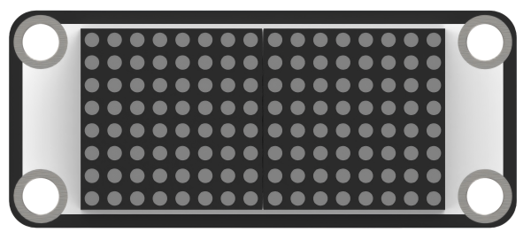

This module consists of two red 8x8 LED matrices and is controlled by the TM640B driver chip, which enables control of the dot matrix display.

**Module Wiring: Connect the dot matrix module to port 6 of the CoreX controller.**


* **Download Program**

[Color Recognition Program](../_static/source_code/05/03/Color%20Recognition%20Program.zip)

(1) Open the Python editor software。

(2) Drag the program file under the same path as this document to the Python editor.


(3) Click on the "**Connect**" in the menu bar and select the COM port. In this case, COM3 is successful, the connection icon will turn green .


(4) Click Download on the right , download the program to the device and wait for the prompt to complete the download.


* **Project Outcome**

When red is detected, the RGB light turns red, and the LED matrix displays "**R**".

When green is detected, the RGB light turns green, and the LED matrix displays "**G**".

When blue is detected, the RGB light turns blue, and the LED matrix displays "**B**".

When yellow is detected, the RGB light turns yellow, and the LED matrix displays "**Y**".


* **Program Analysis**

[Color Recognition Program](../_static/source_code/05/03/Color%20Recognition%20Program.zip)

(1) Load libraries. The Hiwonder library includes sensor libraries, low-voltage alarms, etc., the time library is used for time-related functions, and the LSC library handles low-level communication between the controller and the servo control board.

{lineno-start=1}

```
import Hiwonder
import time
from Hiwonder import LSC
```

(2) Create a dot matrix module object digitalTube_6 and bind it to port 6, and create a color sensor module object colorsensor_4 and bind it to the IIC port 5.

:::{Note}

Ports 3, 4, 5, and 9 on the CoreX box all connect to the same internal IIC bus. For convenience, the IIC bus is initialized using port number 4 with the Port method from the Hiwonder library. Once initialized, all ports on that bus can communicate interchangeably.

:::

{lineno-start=5}

```
# initialize variables
digitalTube_6 = Hiwonder.Digitaltube(Hiwonder.Port(6))
colorsensor_4 = Hiwonder.ColorSensor(Hiwonder.Port(4))
```

When the robotic arm is powered on, it defaults to executing the main function, which runs action group 0 once to place the arm in its initial position. The sleep function from the time library is then called to make the system sleep for 1 second.

{lineno-start=10}

```
def start_main():
  global digitalTube_6
  global colorsensor_4

  LSC.runActionGroup(0,1)
  time.sleep(1)

```

At the beginning of each iteration in the main function loop, the fill method of the Neopixel_onboard object from the Hiwonder library's CoreX module is called to turn off all the onboard RGB LEDs (R:G:B = 0:0:0). The drawBitMap method of the LED matrix object is then called to turn off all LEDs on the matrix to clear the screen.

Then, the readColorName method of color sensor object is called to read the recognition result.

If the return value is 2, it indicates that red has been detected. In this case, the fill method of the CoreX box RGB light array object is called again to turn all RGB lights red (R:G:B = 255:0:0). The drawStr method of the matrix object is then called to display the initial letter of the corresponding color name at position (6,0) on the matrix, and the system then sleeps for 2 seconds.

Similar actions are taken for other return values and corresponding colors, which are not detailed here.

{lineno-start=16}

```
  while True:
    Hiwonder.Neopixel_onboard.fill(0,0,0)
    digitalTube_6.drawBitMap((0x0,0x0,0x0,0x0,0x0,0x0,0x0,0x0,0x0,0x0,0x0,0x0,0x0,0x0,0x0,0x0))
    if colorsensor_4.readColorName() == 2:
      Hiwonder.Neopixel_onboard.fill(255,0,0)
      digitalTube_6.drawStr((6,0,'R'))
      time.sleep(2)
    else:
      if colorsensor_4.readColorName() == 5:
        Hiwonder.Neopixel_onboard.fill(0,255,0)
        digitalTube_6.drawStr((6,0,'G'))
        time.sleep(2)
      else:
        if colorsensor_4.readColorName() == 7:
          Hiwonder.Neopixel_onboard.fill(0,0,255)
          digitalTube_6.drawStr((6,0,'B'))
          time.sleep(2)
        else:
          if colorsensor_4.readColorName() == 4:
            Hiwonder.Neopixel_onboard.fill(255,255,0)
            digitalTube_6.drawStr((6,0,'Y'))
            time.sleep(2)
```

The `start_main()` function must be executed in a new thread using the startMain method from the Hiwonder library.

{lineno-start=39}

```
Hiwonder.startMain(start_main)
```

### 5.3.7 Color Sorting

* **Assembly**


* **Project Introduction**

This lesson introduces how to use a color sensor to detect colors, and based on the color detected by the sensor to control the RGB lights to display the corresponding color, and show the initial letter of the color name on the LED matrix, and the robotic arm will perform sorting based on the detected color.

* **Project Process**


* **Module Instruction**

(1) Dot Matrix Module


The LED dot matrix module is a display unit that features high brightness, no flickering during display, and easy wiring, and it can show numbers, text, and patterns. This module consists of two red 8x8 LED matrices and is controlled by the TM640B driver chip, which enables control of the dot matrix display.

Module Wiring: Connect the dot matrix module to port 6 of the xArm AI.

(2) Color Sensor


The color sensor is equipped with the APDS9960 sensor component, which contains four photodiodes inside. These photodiodes detect the intensity of red light (R), green light (G), blue light (B), and clear light (C), respectively. By calculating the ratio of these intensities, the sensor determines the RGB color values of an object, enabling color recognition.

Module Wiring: Connect the color sensor module to port 5 of the xArm AI.


* **Download Program**

[Color Sorting Program](../_static/source_code/05/03/Color%20Sorting%20Program.zip)

(1) Open the Python editor software.

(2) Drag the program file under the same path as this document to the Python editor.


(3) Click on the "**Connect**" in the menu bar and select the COM port. In this case, COM4 is successful, the connection icon will turn green .


(4) Click Download on the right , download the program to the device and wait for the prompt to complete the download.


* **Project Outcome**

In this section, the color sensor is used to recognize red, green, blue, and yellow blocks. After identifying the color of each block, the robotic arm will pick it up and place it in the correct designated position.


* **Program Analysis**

[Color Sorting Program](../_static/source_code/05/03/Color%20Sorting%20Program.zip)

(1) Load libraries. The Hiwonder library contains sensor libraries, low-voltage alerts, etc., the time library is for time-related functions, the kinematics library is for kinematics algorithms, and the LSC library is for low-level communication between the controller and the servo control board.

{lineno-start=1}

```
import Hiwonder
import time
import kinematics
from Hiwonder import LSC
```

(2) Create a dot matrix module object digitalTube_6 and bind it to port 6, and create a color sensor module object colorsensor_4 and bind it to the IIC port 5.

:::{Note}

Ports 3, 4, 5, and 9 on the CoreX box all connect to the same internal IIC bus. For convenience, the IIC bus is initialized using port number 4 with the Port method from the Hiwonder library. Once initialized, all ports on that bus can communicate interchangeably.

:::

{lineno-start=6}

```
# initialize variables
digitalTube_6 = Hiwonder.Digitaltube(Hiwonder.Port(6))
colorsensor_4 = Hiwonder.ColorSensor(Hiwonder.Port(4))
```

When the robotic arm is powered on, it automatically runs the main function. At the beginning, it uses the set_link_length and ki_move methods from the kinematics library to define the length of each arm segment and move the arm to its initial position. Then, it calls the moveServo function from the LSC library to move Servo 1 to position 100, which opens the robotic gripper. The sleep function from the time library is then called to make the system sleep for 1 second.

{lineno-start=11}

```
def start_main():
  global digitalTube_6
  global colorsensor_4

  kinematics.set_link_length(6.9,9.5,9.5,16.9)
  kinematics.ki_move(-18,0,8,-32,1000)
  LSC.moveServo(1,100,500)
  time.sleep(1)
```

At the beginning of each iteration in the main function loop, the fill method of the Neopixel_onboard object from the Hiwonder library's CoreX module is called to turn off all the onboard RGB LEDs (R:G:B = 0:0:0). The drawBitMap method of the LED matrix object is then called to turn off all LEDs on the matrix to clear the screen.

Then, the readColorName method of color sensor object is called to read the recognition result. The following actions are taken if the sensor detects the color red. The handling of other return values follows the same logic, and further details are not provided here.

If the return value is 2, it indicates that red has been detected. In this case, the fill method of the CoreX box RGB light array object is called again to turn all RGB lights red (R:G:B = 255:0:0). The drawStr method of the matrix object is then called to display the initial letter of the corresponding color name at position (6,0) on the matrix, and the system then sleeps for 2 seconds.

Next, Servo 1 is moved to position 500 using the moveServo function, which closes the robotic gripper to grab the colored block. Then, the robotic arm lifts up and rotates 90 degrees to the left using the ki_move method from the kinematics library and places the block down.

After placing the block, Servo 1 moves back to position 100 to open the gripper and release the block. Finally, the robotic arm lifts up again in the current direction and returns to its original position using the ki_move function.

{lineno-start=19}

```
  while True:
    Hiwonder.Neopixel_onboard.fill(0,0,0)
    digitalTube_6.drawBitMap((0x0,0x0,0x0,0x0,0x0,0x0,0x0,0x0,0x0,0x0,0x0,0x0,0x0,0x0,0x0,0x0))
    if colorsensor_4.readColorName() == 2:
      Hiwonder.Neopixel_onboard.fill(255,0,0)
      digitalTube_6.drawStr((6,0,'R'))
      time.sleep(2)
      LSC.moveServo(1,500,500)
      time.sleep(1)
      kinematics.ki_move(-17,0,20.5,0,800)
      time.sleep(0.8)
      kinematics.ki_move(-19.5,0,2.8,-60,800)
      time.sleep(0.8)
      LSC.moveServo(1,100,500)
      time.sleep(0.8)
      kinematics.ki_move(-17,0,20.5,0,800)
      time.sleep(0.8)
      kinematics.ki_move(-18,0,8,-32,1000)
      time.sleep(1)
```

The `start_main()` function must be executed in a new thread using the startMain method from the Hiwonder library.

{lineno-start=102}

```
Hiwonder.startMain(start_main)
```

## 5.4 AI Vision Game Course

### 5.4.1 WonderCam AI Vision Module Introduction & Assembly

* **WonderCam Module Introduction**

WonderCam is an user-friendly AI visual sensor with eight built-in functions: color recognition, face recognition, AprilTag recognition, line following, Numeric recognition, Landmark recognition, image classification, and feature learning.

It eliminates the need for complicated training processes and visual algorithms, allowing you to complete AI training with just one click, making it easy to implement various AI vision creative projects.


WonderCam is equipped with an I2C interface, enabling the seamless integration with various controllers such as micro:bit, Arduino, Raspberry Pi, and more. It can directly output recognition results to the controller without the need to learn complex algorithms, enabling you to create highly creative AI projects with ease.

* **Function Instruction**


**IIC interface Specification：**


| No.  | Name |     Function      |
| :--: | :--: | :---------------: |
|  1   | SCL  |  I2C Clock Line   |
|  2   | SDA  |   I2C Data Line   |
|  3   | GND  |  Power Negative   |
|  4   |  5V  | 5V Power Positive |

* **Module Assembly & Wiring Connection**

Mount WonderCam vision module to servo No.2 bracket using two M4*6 screws.


Connect WonderCam vision module to the No.9 I2C interface of the xArm Al using a 4PIN cable.


* **Operation Guideline**

(1) Basic Operation

① The WonderCam visual module has left and right buttons, each of which can be moved left, right, or pressed down. Functionally, the two buttons are divided into a navigation button and a function button. The left button is the navigation joystick, while the right is the function joystick. By pushing the right button to the right, you can switch to the "**Face Recognition**" function, as shown in the image below:


② The function of the buttons on the main interface (the default interface after powering on) is as follows:

Navigation button: Moving the navigation button left or right allows you to switch between different menu items.


② On the main interface, moving the navigation button left or right switches between function interfaces. The switch is complete when the progress circle disappears. Holding the joystick down allows for quick switching between functions.

Function button: Opens the function options and confirms selections in the dialog box. Note: Since different function interfaces correspond to different features, the icons will change accordingly.


③ On the main interface, moving the function button to the right can control the turning on and off of the fill light.


* **Function Settings**

Certain function settings is configurable. For example, face recognition can configure detection threshold level, NMS threshold etc. The functions can be configured when a setting icon  display on top right screen.

(1) Operation instruction

Press the button corresponding to the gear icon to enter the parameter settings. For example, in face recognition, the gear icon can be found at the top right center. Press the **Function button** down to enter the parameter settings for face recognition.


(2) Configuration settings

Move the Navigation button left or right to select the parameter to be set, then press the button corresponding to the gear icon again to enter the specific parameter settings. Once in the settings, you can use the Navigation button to move left or right to change the parameter options, and long press to change quickly. After completing the settings, press the OK icon to finish and return to the previous menu.


(3) Exiting settings and returning to the main menu:

In the settings interface, press icon on the Navigation button to bring up the exit dialog box. Follow the prompts and use the Navigation button to select "**Yes**" or "**No**".

"**Yes**" will save the changed parameters.

"**No**" will discard the changes and restore the original settings.  

After making your selection, press the Function button down to confirm your choice.


* **System settings**

In addition to the function parameters under each feature, there are also system-wide settings, such as system language. This section mainly explains how to set these parameters.

(1) Enter system settings:

On the main interface, move the Navigation button to the right to navigate to the far-right option, which is the "**System Settings**" option. Then press the gear icon to enter the system settings.


(2) Settings Options

**Display Brightness**: Used to adjust the brightness of the screen.  

② **Fill Light Brightness**: Used to adjust the brightness of the fill light.  

③ **Menu Auto-Hide Time**: Used to set the time for the menu to automatically hide. For example, if set to 30, the menu will automatically hide after 30 seconds of inactivity.  

④ **I2C Address**: Used to configure the I2C slave address of the WonderCam module. The default address is 0x32.  

⑤ **Language**: Used to set the system language, supporting both English and Chinese. After setting, the module will automatically restart to apply the changes.

* **What's the Coordinate System?**

The coordinate system will help you better interpret the output data from the WonderCam visual module in subsequent lessons. The WonderCam module sets the top-left corner of the image as point 0, with the positive X-axis direction extending to the right and the positive Y-axis direction extending downward. The maximum value for the X-axis is 319, and the maximum value for the Y-axis is 239.


<p id="anchor_5_4_2"></p>

### 5.4.2 Color Recognition

**01 Color Recognition Feature Description**

* **Instructions**

(1) Use bright and high saturated color. Example red, green or blue.

(2) Targeted object color and its background must be distinctive. Example if target object is Yellow, avoid yellow background.

Do not learn White color or Composite color. Ensure environment is bright enough or use Fill Light on WonderCam when required.

Adjusting light condition and the focus angle can help to stabilize and improve the color recognition process in the white frame within the display panel.

* **Introduction to Color Recognition function**

WonderCam recognizes and identifies the various colors in the white frame shown within the display. It provides data such as object position and size etc to perform color recognition, color tracking etc.

* **Color Recognition Operations**

(1) Enter Function

The default start-up function on WonderCam is Color Recognition. If not, push Navigation button on WonderCam to left or right to select to Color Recognition menu.

(2) Learning new color and recognizing new color

To use Color Recognition function, program WonderCam to learn about the color first.

Steps are as follows

Step 1: When in the Color Recognition Menu, push Function button to the left once to enter Learning mode.


Step 2: In Learning mode, a red + sign will be shown in center of display with menu showing "**Color ID:1**", "**Color ID:2**".

Step 3: Focus red + on to the targeted colored object. When target is in focus, a white frame on screen will encapsulate the object.


:::{Reminder}

* Use bright and high saturated color. Example red, green or blue.

* Targeted object color and its background must be distinctive. Example if target object is Yellow, avoid yellow background.

* Do not Learn White color or Composite color. Ensure lighting condition is bright enough or use Fill Light on WonderCam when required.

* Adjusting light condition and the focus angle can help to stabilize and improve the color recognition process in the white frame within the display panel.

:::

Step 4: Push Function button to the left for WonderCam to Learn the color. Wait for Learning successful message display. Push Function button down to OK to complete. If Learning fail, try adjusting lighting condition or change to more distinctive color. Ensure the White frame is stabilized when in focus and push top right button to the left to Learn.


Step 5: When learning is successful and WonderCam detected corresponding color to the ID number it had learned previously, the ID number of the object will be shown on display.


* **Delete Color**

To delete an ID color, enter Color Recognition mode and move to the selected ID by using Navigation button. Select Color ID to delete and push Function button to the right towards Bin icon. Push Function button down to select OK to delete.

* **Color Recognition Function Settings**

In the Color Recognition main menu, press Function button down to enter Settings interface.


Available for configurations are: Color Range and Reset.

(1) Color Range: This controls the White Frame parameter size in detecting the target object color variation. Higher value will enlarge White Frame size and will cover wider range of color variation on the display. Lower value will reduce White Frame size and focus on smaller portion of color. Range value at 20 is optimum in most situation.

(2) Reset. This will reset to factory default value. Do note to Save settings to effective the reset settings.

**02  Color Recognition**

* **Assembly**


* **Project Introduction**

In this lesson, we use the WonderCam vision module to detect colors and control the robotic arm for sorting based on the detected colors.

* **Program Logic**


* **Module Instruction**


WonderCam is an user-friendly AI visual sensor with eight built-in functions: color recognition, face recognition, AprilTag recognition, line following, Numeric recognition, Landmark recognition, image classification, and feature learning. It can be used with various controllers like ESP32, micro:bit, Arduino, and Raspberry Pi, enabling you to easily implement a wide range of AI visual creative projects.

**Module Wiring: Connect WonderCam module to the port No.9 on the CoreX controller.**


* **Download Program**

[Color Recognition Program](../_static/source_code/05/04/Color%20Recognition%20Program.zip)

(1) Open the **'Hiwonder Python Editor'** software .

(2) Drag the .py file, located in the same directory as this document, into the Hiwonder Python Editor.


(3) Click "**Connect**" in the menu bar and select the appropriate COM port. Here, COM4 is used as an example. Once the connection is successful, the connection icon will turn green .


(4) After successfully connecting, click the download button  in the menu bar to download the program to xArm AI. Wait for the information interaction box below to indicate that the download is complete.


* **Project Outcome**

After powering on the robotic arm, different colored blocks are placed in front of the vision module for recognition. The RGB light on the CoreX controller will change to the corresponding color based on the recognized result, and the robotic arm will grip the block and place it in the position corresponding to that color.


* **Program Analysis**

[Color Recognition Program](../_static/source_code/05/04/Color%20Recognition%20Program.zip)

(1) Load libraries: Hiwonder library (which contains sensor libraries, low voltage alarm, etc.); the time library for time-related functions; kinematics for kinematics algorithms; LSC for underlying communication between the main controller and the servo control board; and Buzzer for buzzer control.

{lineno-start=1}

```
import Hiwonder
import time
import kinematics
from Hiwonder import LSC
from Hiwonder import Buzzer
```

(2) Create a vision module object cam and bind it to the I2C port (Port 9), and create an LED ultrasonic module object i2csonar_3 and bind it to the I2C port (Port 4).

:::{Note}

Ports 3, 4, 5, and 9 on the CoreX controller are all connected to the same internal I2C bus of the main controller. For simpler use, Port 4 is used by default as the parameter in the Port method of the Hiwonder library to initialize the corresponding I2C bus. After initialization, all ports on this bus can be used interchangeably.

:::

{lineno-start=7}

```
# initialize variables
i2csonar_3 = Hiwonder.I2CSonar(Hiwonder.Port(4))
cam = Hiwonder.WonderCam(Hiwonder.Port(4))
Target_area = 0
#The area of the color block in the vision module's field of view is proportional to the distance between the object and the vision module (which is mounted on the robotic gripper). This value is used to ensure that the color block is not placed too far away.

```

When the robotic arm is powered on, it automatically executes the main function. It calls the set_link_length method from the kinematics library to specify the length of the arm segments, and uses the moveServo function from the LSC library to move Servo 1 to position 100 (to open the robotic gripper).

Next, it calls the setRGB method of the LED ultrasonic module object to turn off all (0) RGB LEDs.

Then, it uses the setLed and switchFunc methods of the vision module object cam to turn off the fill light and switch to color recognition mode.

Finally, it calls the runActionGroup method from the LSC library to execute Action Group 1 once, moving the arm to its initial position.

{lineno-start=13}

```
def start_main():
  global i2csonar_3
  global cam
  global Target_area

  kinematics.set_link_length(6.9,9.5,9.5,16.9)
  LSC.moveServo(1,100,500)
  i2csonar_3.setRGB(0,0x00,0x00,0x00)
  cam.setLed(cam.LED_OFF)
  cam.switchFunc(cam.ColorDetect)
  LSC.runActionGroup(1,1)
  Target_area = 0
```

In each iteration of the main function loop, the updateResult method of the vision module object cam is first called to obtain the latest recognition results.

Then, the isColorOfIdDetected method is used to check whether the vision module has detected the color with ID = 1 (red). If detected, the corresponding processing is executed and the current loop ends. If not, the program proceeds to check for the next color ID.

This process is repeated four times to check whether red, green, blue, or yellow is detected in the current recognition result.

{lineno-start=25}

```
  while True:
    cam.updateResult()
    
    if cam.isColorOfIdDetected(1):
```

The logic executed when any of the four colors is detected is very similar. Here, we use red as an example to explain the process.

When cam.isColorOfIdDetected(1) returns True, it indicates that red has been detected. The system then pauses for 0.2 seconds. After that, it calls cam.updateResult and cam.isColorOfIdDetected again to get the latest recognition result and confirm whether red is still detected—this helps prevent false detections.

Once red is confirmed, the system calls cam.getColorOfId to retrieve the bounding box data of the red block (ID=1) in the frame (specifically, the 2nd and 3rd items: the width and height of the bounding box), and calculates the bounding box area as Target_area. It then checks whether the area exceeds 1000. (Since the area is proportional to the distance between the object and the vision module, this check ensures that only objects within a certain range are recognized, avoiding false detections caused by similarly colored objects in the background.)

If the target area meets the requirement, the system uses the fill method of the CoreX controller's onboard RGB LED array object Neopixel_onboard to light up the red LED (corresponding to the detected color). It then calls the playTone method from the Buzzer library to emit a short beep as feedback.  

(1976 = frequency for note B6, 500 = duration in ms (half beat), True = play in foreground)

Next, the system uses the ki_move method from the kinematics library to move the robotic arm to a specific position and pitch angle via inverse kinematics, allowing the arm to lower and reach the target. Then, the moveServo method from the LSC library is used to rotate Servo 1 and close the gripper to pick up the object.

After the grip, the ki_move method is called again to lift the arm, and then the runActionGroup method from the LSC library is used to perform a series of actions: placing the object in a designated area and resetting the arm to its initial pose.

If the target area does not meet the requirement, the system calls the clear method of Neopixel_onboard to turn off the RGB lights.

{lineno-start=25}

```
  while True:
    cam.updateResult()
    
    if cam.isColorOfIdDetected(1):
      time.sleep(0.2)
      cam.updateResult()
      if cam.isColorOfIdDetected(1):
        Target_area = (cam.getColorOfId(1)[2]*cam.getColorOfId(1)[3])
        if (Target_area>1000):
          Hiwonder.Neopixel_onboard.fill(255,0,0)
          Buzzer.playTone(1976,500,True)
          time.sleep(1.5)
          kinematics.ki_move(0,17,1.2,-71,800)
          time.sleep(0.8)
          LSC.moveServo(1,500,400)
          time.sleep(0.8)
          kinematics.ki_move(0,17,20.5,0,800)
          time.sleep(0.8)
          LSC.runActionGroup(6,1)
          time.sleep(4.8)
          LSC.runActionGroup(1,1)
          time.sleep(0.8)
        else:
          Hiwonder.Neopixel_onboard.clear()
          time.sleep(0.01)
          
    else:
```

To run the start_main() function in a new thread using the startMain method from the Hiwonder library, you can implement it as follows:

{lineno-start=124}

```
Hiwonder.startMain(start_main)
```

### 5.4.3 Color Tracking

[01 Color Recognition Feature Description](#anchor_5_4_2)

**02 Color Tracking**

* **Assembly**


* **Project Introduction**

In this lesson, we will use the WonderCam visionl module to detect the color with ID 1 (red) and simultaneously control the robotic arm to track it.  

:::{Note}

Before the WonderCam vision module can recognize colors, it needs to first learn the corresponding colors. The colors to be learned are as follows: ID1 - Red, ID2 - Green, ID3 - Blue, ID4 - Yellow.

:::

* **Program Logic**


* **Module Instruction**


WonderCam is an user-friendly AI visual sensor with eight built-in functions: color recognition, face recognition, AprilTag recognition, line following, Numeric recognition, Landmark recognition, image classification, and feature learning. It can be used with various controllers like ESP32, micro:bit, Arduino, and Raspberry Pi, enabling you to easily implement a wide range of AI visual creative projects.

**Module Wiring: Connect WonderCam module to the port No.9 of the CoreX controller.**


<p id="anchor_5_4_3_Download"></p>

* **Download Program**

[Color Tracking Program](../_static/source_code/05/04/Color%20Tracking%20Program.zip)

(1) Open the **'Hiwonder Python Editor'** software 。

(2) Drag the .py file, located in the same directory as this document, into the Hiwonder Python Editor.


(3) Click "**Connect**" in the menu bar and select the appropriate COM port. Here, COM4 is used as an example. Once the connection is successful, the connection icon will turn green .


(4) After successfully connecting, click the download button  in the menu bar to download the program to xArm AI. Wait for the information interaction box below to indicate that the download is complete.


* **Project Outcome**

When we move the red sponge block in front of the WonderCam vision module, the robot's head will follow the movement of the ball.


* **Program Analysis**

[Color Tracking Program](../_static/source_code/05/04/Color%20Tracking%20Program.zip)

(1) Load libraries: Hiwonder library (which contains sensor libraries, low voltage alarm, etc.); the time library for time-related functions; kinematics for kinematics algorithms; LSC for underlying communication between the main controller and the servo control board.

{lineno-start=1}

```
import Hiwonder
import time
import kinematics
import math
from Hiwonder import LSC
```

(2) Create a vision module object cam and bind it to the I2C port (Port 9).

:::{Note}

Ports 3, 4, 5, and 9 on the CoreX controller are all connected to the same internal I2C bus of the main controller. For simpler use, Port 4 is used by default as the parameter in the Port method of the Hiwonder library to initialize the corresponding I2C bus. After initialization, all ports on this bus can be used interchangeably.

:::

{lineno-start=7}

```
# initialize variables
cam = Hiwonder.WonderCam(Hiwonder.Port(4))
X = 0
Z = 0
Target_area = 0
dx = 0
dz = 0
```

When the robotic arm is powered on, it automatically executes the main function. It first calls the disableLowPowerAlarm method from the **Hiwonder** library to disable the low voltage alarm on the CoreX controller.

Then, it uses the switchFunc method of the vision module object cam to switch to color recognition mode.

Finally, it calls the set_link_length method from the kinematics library to specify the lengths of the robotic arm segments and moves the arm to its initial position. It also assigns values to the position of Servo 3 (Z) and Servo 6 (X).

Instructions:

The current initial values assigned to Servo ID3 and Servo ID6 correspond to their positions when the robotic arm is in its initial pose (the posture defined by Action Group 1). You can open this action group file using the PC software to view the details.

Servo ID3 controls the vertical movement of the robotic arm's end-effector (Z-axis in the robotic arm's coordinate system);

Servo ID6 controls the lateral (left-right) movement of the end-effector (X-axis in the robotic arm's coordinate system).

{lineno-start=16}

```
def start_main():
  global cam
  global X
  global Z
  global Target_area
  global dx
  global dz

  Hiwonder.disableLowPowerAlarm()
  cam.switchFunc(cam.ColorDetect)
  kinematics.set_link_length(6.9,9.5,9.5,16.9)
  kinematics.ki_move(0,15,20,0,1500)
  X = 500
  Z = 310
  Target_area = 0
```

In each iteration of the main function loop, the updateResult method of the vision module object cam is first called to obtain the latest recognition result.

Then, the isColorOfIdDetected method is used to determine whether the color with ID = 1 (red) has been detected. If red is detected, the corresponding logic is executed and the current loop ends. If not, no logic is executed, and the loop ends directly.

{lineno-start=31}

```
  while True:
    cam.updateResult()
    if cam.isColorOfIdDetected(1):
```

When cam.isColorOfIdDetected(1) returns True, it indicates that red has been detected.

After confirming the detection of red, the getColorOfId method of the vision module is called to obtain the bounding box data for the color block with ID = 1. (The 2nd and 3rd items represent the width and height of the bounding box.) The area of the bounding box, Target_area, is then calculated. If the area exceeds 1000 (since the area is proportional to the distance between the target and the vision module), it confirms that the target is within a valid range. This helps prevent false detections caused by similarly colored objects in the background.

If the target area meets the requirement, the logic for tracking the target image begins:

First, the center point (X and Y coordinates) of the bounding box is computed within the 2D coordinate system of the image (cam.getColorOfId(1)\[0\] and cam.getColorOfId(1)\[1\]). Then, the offset between the center of the bounding box and the image center along the X and Z axes is calculated as dx and dz.

The absolute value of dx is compared against a predefined acceptable range. If it exceeds that range, the robotic arm needs to adjust its position accordingly. If the value is within the range, no movement is required along that axis.

Adjustment method:  

The offset dx is scaled by a factor (−8) to convert it into a servo position adjustment value (dx / -8). This offset is then added to the current servo position controlling movement along that axis. Finally, the moveServo function from the LSC library is called to move the servo to the new position.

The adjustment logic for the Z axis (dz) is very similar and the same method can be reviewed.

Explanation:The center coordinates of the image frame are (160, 120).

(1) The program continuously compares the difference between the center of the recognition box and the center of the image, and controls this difference to approach zero through an algorithm, thus ensuring that the visual module (located at the end of the robotic arm) always follows the target's movement.

(2) Since each change is relatively large, the process of the dx and dz differences approaching zero does not require an exact value of zero; it can stay within a certain range near zero to prevent small errors that cannot be corrected from causing the robotic arm to oscillate or twitch back and forth.

(3) The ratio of dx and dz to the positions of the two servos is based on measured values, and the user can adjust these values. Different ratios affect the speed of the robotic arm's tracking, while the sign (positive or negative) determines the direction of tracking.

If the target area does not meet the requirements, the program will sleep for a period of time and then end the current loop.

{lineno-start=34}

```
      Target_area = (cam.getColorOfId(1)[2]*cam.getColorOfId(1)[3])
      if (Target_area>1000):
        dx = (cam.getColorOfId(1)[0]-160)
        dz = (cam.getColorOfId(1)[1]-120)
        if (math.fabs(dx)>10):
          X+=round((dx/-8))
          if (X>1000):
            X = 1000
          if (X<0):
            X = 0
          LSC.moveServo(6,X,20)
        if (math.fabs(dz)>5):
          Z+=round((dz/-10))
          if (Z>1000):
            Z = 1000
          if (Z<0):
            Z = 0
          LSC.moveServo(3,Z,20)
    else:
      time.sleep(0.01)
```

To run the start_main() function using the startMain method from the Hiwonder library in a new thread, you can structure the code like this:

{lineno-start=55}

```
Hiwonder.startMain(start_main)
```

* **Function Extension**

(1) Download Program

① Please refer to the "[**5.4.3 Color Tracking -> Program Download**](#anchor_5_4_3_Download)" in this document to download the program.

② Program: "**[Color Tracking Program/Color Tracking (Advanced Kinematics Gameplay)](../_static/source_code/05/04/Color%20Tracking%20Program.zip)**" .

(2) Project Outcome

After the robotic arm is powered on, the end of the arm will maintain its initial posture. It will then track the red color block captured by the visual module, moving in a circular trajectory within the 180° range directly in front of it.

:::{Note}

In the advanced kinematics application, when the robotic arm follows the target, the pitch angle of the end effector remains fixed.

:::

(3) Program Analysis

:::{Note}

The program contains detailed comments, which can be referred to and studied along with the following text.

:::

In the advanced kinematics gameplay, the task is divided into two threads to improve execution efficiency.

① Main Thread (Thread 1)

voltage alarm on the CoreX's controller, followed by calling the switchFunc function to switch the visual module to color recognition mode.

Finally, the set_link_length and ki_move functions are called to specify the lengths of each link in the robotic arm, and through inverse kinematics, the robotic arm's end effector is controlled to move to the specified coordinates (0, 17, 20.5) with a pitch angle of 0° within the specified time (500ms).

{lineno-start=48}

```
  Hiwonder.disableLowPowerAlarm()
  cam.switchFunc(cam.ColorDetect)
  kinematics.set_link_length(6.9,9.5,9.5,16.9)
  kinematics.ki_move(0,17,20.5,0,500)
  X = 0             #(The actual execution values of X, Y, and Z are, by default, initialized to the same coordinates as the initial pose. Otherwise, the robotic arm will immediately rotate to the coordinates specified by these execution values.) X、Y、Z实际执行值在初始化时，默认取与初始姿态时相同的坐标值，否则机械臂会立刻转动到此处X、Y、Z实际执行值指定的坐标
  X_execute = 0
  Y = 17
  Y_execute = 17
  Z = 20.5
  Z_execute = 20.5
  radius = 17
  Target_area = 0
  running_state = 0 
```

In the main thread loop, following the same logic as in the basic routine:  

First, calculate whether the target's area meets the required threshold. If it does, further compute the differences in the X and Z axes—dx and dz—between the center of the target's bounding box and the center of the image in the 2D coordinate system of the vision module. Then, check whether the absolute values of dx and dz fall within an acceptable range.

From this point onward, the basic and advanced routines diverge. The advanced kinematics are handled as follows:

The X-axis difference dx is scaled by a factor (1100) and converted into an offset for the robotic arm's end effector in the X-axis of the robotic arm's 3D coordinate system (dx / -8). This offset is then added to the current X-axis coordinate value of the robotic arm's end effector.

Since the robotic arm tracks the target along a circular trajectory （). Once the X-axis value is determined, the corresponding Y-axis value of the robotic arm's end effector can be determined as well.

:::{Note}

In the design, the robotic arm's end effector maintains its initial posture (0, 17, 20.5) while performing circular motion on the X-Y plane. Therefore, in this case.  

:::

If you design the robotic arm to track in a different posture, the value of r should be recalculated based on the new X and Y values of the new posture.

The adjustment method on the Z-axis is similar to the adjustment for the X-axis height, and will not be further elaborated here.

{lineno-start=61}

```
  while True:
    cam.updateResult()
    if cam.isColorOfIdDetected(1):
      Target_area = (cam.getColorOfId(1)[2]*cam.getColorOfId(1)[3])
      if (Target_area>500):                         #(Only proceed if the detected color block area is greater than this threshold.) 大于此阈值才开始计算，此时目标距离足够近，识别效果好，同时避免误识别
        dx = (cam.getColorOfId(1)[0]-160)           #(This ensures the target is close enough, recognition is accurate, and reduces false detection.) 视觉模块二维画面坐标系中，画面中心点坐标：(160,120)
        dz = (cam.getColorOfId(1)[1]-120)           #( X-axis offset: difference between the target center and image center (160, 120) in the 2D visual coordinate system.) 二维画面坐标系X轴<-->机械臂三维坐标系X-Y面  二维画面坐标系Y轴<-->机械臂三维坐标系Z轴
        if (math.fabs(dz)>5):                       #(Y-axis offset: difference along the vertical direction in the image, which maps to the Z-axis in the robot's coordinate system, and converts it to the corresponding X and Z axis offset of the robotic arm's end-effector (gripper) in the arm's coordinate system.) 二维画面坐标偏差值过小则机械臂无需移动
          Z = (Z+(dz/-1200))                        #(Convert 2D pixel deviation to a real-world 3D Z-axis offset for the robotic arm.)将二维画面坐标偏差值 换算为 机械臂三维坐标偏差值(dz/-1200)
          if (Z>25.8):
            Z = 25.8
          if (Z<16.4):                              #(Based on real-world testing:  values between 16.4 and 25.8, and X values between -17 and 17, always yield a valid inverse kinematics solution.)经实测，Z在16.4--25.8内取值，X在-17--17取值(Y与X有约束关系，不是独立变量)，逆运动学计算均有解
            Z = 16.4
          Z_execute = Z
        if (math.fabs(dx)>10):
          X = (X+(dx/1100))
          if (X>17):
            X = 17
          if (X<-17):
            X = -17
          Y = math.sqrt(((radius*radius)-(X*X)))   #(Since the robotic arm tracks along a circular trajectory in the X-Y plane, the relationship X² + Y² = r² is used to calculate Y.) 因为机械臂在X-Y平面上以圆形轨迹追踪，故X^2 + Y^2 =r^2
          X_execute = X
          Y_execute = Y
        running_state = 1                          #(Thread 2 becomes active; the actual execution values of X, Y, and Z will now be used.) 线程2生效，X、Y、Z的实际执行量被采用
```

② Sub-thread (Thread 2)

Since the inverse kinematics calculation for the robotic arm and the movement of the end effector to the specified posture and coordinates requires some time, we isolate this process and implement it in a parallel thread.  

Additionally, we introduce a thread work switch running_state, which ensures that the sub-thread only starts working when running_state = 1. This value is set to 1 only when the main thread completes image data processing and obtains the new end effector coordinates. During other times, the sub-thread does not run, which helps reduce CPU resource consumption.

{lineno-start=87}

```
def start_main1():  #(Thread 2: Receives the motion parameters calculated by Thread 1, and controls the robotic arm using inverse kinematics.)线程2：接收线程1计算得到的运动参数，使用逆运动学控制机械臂运动
  global cam
  global X
  global X_execute
  global Y
  global Y_execute
  global Z
  global Z_execute
  global radius
  global Target_area
  global running_state
  global dx
  global dz

  while True:
    if (running_state>0):
      kinematics.ki_move(X_execute,Y_execute,Z_execute,0,500)
      running_state = 0
```

<p id="anchor_5_4_4"></p>

### 5.4.4 Tag Recognition

**01 Tag Recognition Feature Description**

* **AprilTag Recognition Feature**

In AprilTag recognition mode, the WonderCam vision module can identify AprilTag markers in the image and display bounding boxes around them on the screen. Through the I2C interface, external control devices can obtain each AprilTag's position data and 3D transformation data to achieve spatial positioning.

AprilTag, as a visual fiducial marker system, is similar to QR codes or barcodes but with reduced complexity to meet real-time requirements. It can quickly detect markers and calculate relative positions. It can be applied to various tasks including AR, robotics, and camera calibration. The tags can be printed directly using a printer, while the AprilTag detection program can calculate precise 3D position, orientation, and ID relative to the camera.


* **Special Considerations for Tag Recognition**

(1) Users do not need to download materials online. Please navigate to the "**AprilTag Label Collection**" in this program directory and use the provided tag materials. (We provide a total of 200 pre-generated tags.)

(2) Maintain an appropriate distance from the tags (the module can detect them as long as bounding boxes appear). If the tags are too far from the Little Magic Bear vision module or appear too small in the frame, detection will fail.

(3) For optimal performance, ensure the area around the tags has a white or plain white background. Dark backgrounds may prevent the Little Magic Bear vision module from recognizing the tags.

* **Tag Recognition Instructions**

(1) Enter Mode

Turn the **\[navigation joystick\]** to the right until the 'Tag Recognition' menu bar appears at the top of the screen.

(2) Tag Recognition Result

When a TAG36H11 AprilTag appears in the image, it will be outlined on the display with a crosshair marked at its center. The WonderCam vision module can simultaneously recognize multiple tags with either the same or different IDs.


Note: Maintain an appropriate distance from the tag (the module can detect it when the bounding box appears). If the tag is too far from the WonderCam vision module or appears too small in the frame, detection will fail.

**02 Tag Recognition**

* **Assembly**


* **Project Introduction**

xArm AI will recognize the Tag IDs 1-4 through WonderCam vision module, and execute the sorting tasks based on the recognition results.

* **Program Logic**


* **Module Instruction**


WonderCam is an user-friendly AI visual sensor with eight built-in functions: color recognition, face recognition, Tag recognition, line following, Numeric recognition, Landmark recognition, image classification, and feature learning. It can be used with various controllers like ESP32, micro:bit, Arduino, and Raspberry Pi, enabling you to easily implement a wide range of AI visual creative projects.

**Module Wiring: Connect WonderCam module to the port No.9 on the CoreX controller.**

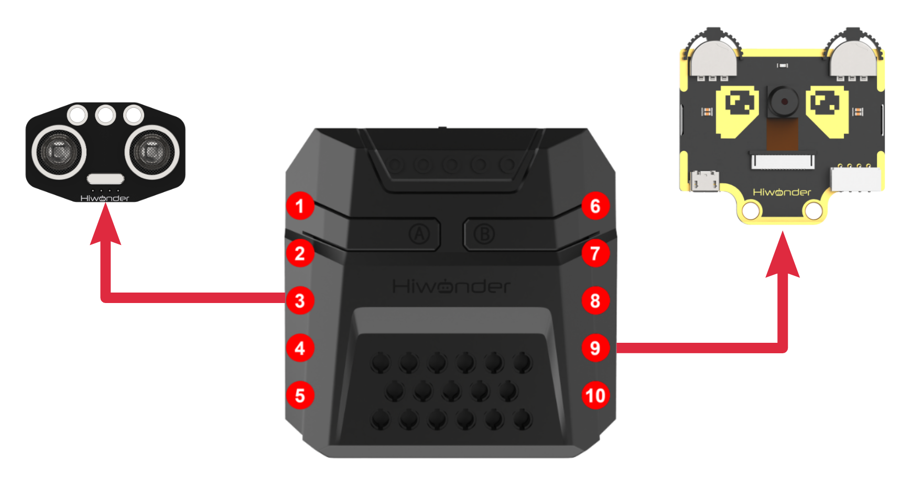

* **Download Program**

[Tag Recogniton Program](../_static/source_code/05/04/Tag%20Recogniton%20Program.zip)

(1) Open the 'Hiwonder Python Editor' software .

(2) Drag the .py file, located in the same directory as this document, into the Hiwonder Python Editor.


(3) Click "**Connect**" in the menu bar and select the appropriate COM port. Here, COM4 is used as an example. Once the connection is successful, the connection icon will turn green .


(4) After successfully connecting, click the download button  in the menu bar to download the program to xArm AI. Wait for the information interaction box below to indicate that the download is complete.


* **Project Outcome**

WonderCam vision module recognizes tag IDs 1, 2, 3, and 4, and the robotic arm then grabs each item and places it in the corresponding position.


* **Program Analysis**

[Tag Recogniton Program](../_static/source_code/05/04/Tag%20Recogniton%20Program.zip)

(1) Load libraries: Hiwonder library (which contains sensor libraries, low voltage alarm, etc.); the time library for time-related functions; kinematics for kinematics algorithms; LSC for underlying communication between the main controller and the servo control board; and Buzzer for buzzer control.

{lineno-start=1}

```
import Hiwonder
import time
import kinematics
from Hiwonder import LSC
from Hiwonder import Buzzer
```

(2) Create a vision module object cam and bind it to the I2C port (Port 9), and create an LED ultrasonic module object i2csonar_3 and bind it to the I2C port (Port 4).

:::{Note}

Ports 3, 4, 5, and 9 on the CoreX controller are all connected to the same internal I2C bus of the main controller. For simpler use, Port 4 is used by default as the parameter in the Port method of the Hiwonder library to initialize the corresponding I2C bus. After initialization, all ports on this bus can be used interchangeably.

:::

{lineno-start=7}

```
# initialize variables
i2csonar_3 = Hiwonder.I2CSonar(Hiwonder.Port(4))
cam = Hiwonder.WonderCam(Hiwonder.Port(4))
Target_area = 0 
#(The area of the labeled object in the visual module's image. This value is proportional to the distance between the object and the vision module (located on the robotic gripper), and is used to ensure the object is not placed too far away.)标签物块在视觉模块画面中的面积，该值与物块距离视觉模块（所在的机械爪）的距离远近成正比，以此值确保物块不会放置的过远

```

Upon powering on the robotic arm, the main function is executed by default. The set_link_length method from the kinematics library is called to specify the length of the arm's links. The moveServo method from the LSC library is used to move Servo ID1 to position 100, which opens the gripper. The setRGB method of the ultrasonic module object is called to turn off all the RGB lights (set to 0).

Then, the setLed and switchFunc methods of the visual module object cam are called to turn off the supplementary lighting and switch to label recognition mode. Finally, the runActionGroup method from the LSC library is called to execute Action Group 1 once, moving the arm to its initial position.

{lineno-start=14}

```
def start_main():
  global i2csonar_3
  global cam
  global Target_area

  kinematics.set_link_length(6.9,9.5,9.5,16.9)
  LSC.moveServo(1,100,500)
  i2csonar_3.setRGB(0,0x00,0x00,0x00)
  cam.setLed(cam.LED_OFF)
  cam.switchFunc(cam.AprilTag)
  LSC.runActionGroup(1,1)
  Target_area = 0
```

In the main function's loop, during each iteration, the following steps are executed:

First, the updateResult method of the visual module object cam is called to obtain the latest recognition results.

Next, the isTagOfIdDetected method of cam is called to determine if the visual module has detected a tag with ID = 1. If detected, the corresponding logic is executed, and the current loop is ended.

If ID = 1 is not detected, the program proceeds to check if the next ID tag is detected (ID = 2). This process continues for a total of four checks, where the tags with IDs 1, 2, 3, and 4 are sequentially checked in the current recognition results.

{lineno-start=26}

```
  while True:
    cam.updateResult()
    
    if cam.isTagOfIdDetected(1):
```

The logic for handling the four detected tags is quite similar. Here, we will use ID=1 as an example for explanation.

When the method cam.isTagOfIdDetected(1) returns True, it indicates that the tag with ID=1 has been detected. The program then sleeps for 0.2 seconds.

After sleeping, the updateResult and isTagOfIdDetected methods of the visual module object cam are called again to obtain the latest recognition results and check if the red color is detected again. This step helps avoid false recognition.

Once red is confirmed to be detected, the cam.getColorOfId method is called to get the recognition box data for the tag with ID=1 in the image (the second item is the length of the recognition box, and the third item is the width). The area of the recognition box, Target_area, is then calculated.

The program checks if the area exceeds 1000. Since the area is proportional to the distance between the target and the visual module, this ensures that only tags within a certain range are recognized. If the target's area is sufficient, the following actions occur:

The fill method of the RGB light array object Neopixel_onboard in the CoreX controller is called to turn on the red light corresponding to the detected tag.

The playTone method from the Buzzer library is called to make a short beep sound (1976: frequency (B6 tone), 500: duration (half note), True: play in the foreground).

Then, using the ki_move method from the kinematics algorithm library, the inverse kinematics calculation controls the robotic arm's end effector to move to the specified coordinates and pitch angle, allowing the robotic arm to reach the target position. The moveServo method from the LSC library is used to control Servo 1, moving it to close the gripper and pick up the target.

After picking up the target, the ki_move method is called again to control the robotic arm's end effector to lift. Finally, the runActionGroup method from the LSC library is used to control the robotic arm to place the target in the specified area and reset to the initial posture.

If the target's area does not meet the requirement, the clear method of the RGB light array object Neopixel_onboard in the CoreX controller is called to turn off the RGB lights.

{lineno-start=26}

```
  while True:
    cam.updateResult()
    
    if cam.isTagOfIdDetected(1):
      time.sleep(0.2)
      cam.updateResult()
      if cam.isTagOfIdDetected(1):
        Target_area = (cam.getDataOfTagIdIndex(1,1)[2]*cam.getDataOfTagIdIndex(1,1)[3])
        if (Target_area>1000):
          Hiwonder.Neopixel_onboard.fill(255,0,0)
          Buzzer.playTone(1976,500,True)
          time.sleep(1.5)
          kinematics.ki_move(0,17,1.2,-71,800)
          time.sleep(0.8)
          LSC.moveServo(1,500,400)
          time.sleep(0.8)
          kinematics.ki_move(0,17,20.5,0,800)
          time.sleep(0.8)
          LSC.runActionGroup(6,1)
          time.sleep(4.8)
          LSC.runActionGroup(1,1)
          time.sleep(0.8)
        else:
          Hiwonder.Neopixel_onboard.clear()
          time.sleep(0.01)
    else:
```

To run the start_main() function in a new thread using the startMain method from the Hiwonder library, you can implement it as follows:

{lineno-start=124}

```
Hiwonder.startMain(start_main)
```

### 5.4.5 Tag Tracking

[01 Tag Tracking Feature Description](#anchor_5_4_4)

**02 Tag Tracking**

* **Assembly**


* **Project Introduction**

The WonderCam vision module identifies tags ID1 through ID4 and controls the robotic arm to perform sorting operations based on the recognition results.

* **Program Logic**


* **Module Introduction**


WonderCam is an user-friendly AI visual sensor with eight built-in functions: color recognition, face recognition, Tag recognition, line following, Numeric recognition, Landmark recognition, image classification, and feature learning. It can be used with various controllers like ESP32, micro:bit, Arduino, and Raspberry Pi, enabling you to easily implement a wide range of AI visual creative projects.

**Module Wiring: Connect WonderCam module to the port No.9 on the CoreX controller.**


<p id="anchor_5_4_5_Download"></p>

* **Download Program**

[Tag Tracking](../_static/source_code/05/04/Tag%20Tracking.zip)

(1) Open the 'Hiwonder Python Editor' software .

(2) Drag the .py file, located in the same directory as this document, into the Hiwonder Python Editor.


(3) Click "**Connect**" in the menu bar and select the appropriate COM port. Here, COM4 is used as an example. Once the connection is successful, the connection icon will turn green .


(4) After successfully connecting, click the download button  in the menu bar to download the program to xArm AI. Wait for the information interaction box below to indicate that the download is complete.


* **Project Outcome**

When WonderCam vision module detects tag ID1, the robotic arm will be controlled to track tag ID1.


* **Program Analysis**

[Tag Tracking](../_static/source_code/05/04/Tag%20Tracking.zip)

(1) Load libraries: Hiwonder library (which contains sensor libraries, low voltage alarm, etc.); the time library for time-related functions; kinematics for kinematics algorithms; LSC for underlying communication between the main controller and the servo control board.

{lineno-start=1}

```
import Hiwonder
import time
import kinematics
import math
from Hiwonder import LSC
```

(2) Create a vision module object cam and bind it to the I2C port (Port 9), and create an LED ultrasonic module object i2csonar_3 and bind it to the I2C port (Port 4).

:::{Note}

Ports 3, 4, 5, and 9 on the CoreX controller are all connected to the same internal I2C bus of the main controller. For simpler use, Port 4 is used by default as the parameter in the Port method of the Hiwonder library to initialize the corresponding I2C bus. After initialization, all ports on this bus can be used interchangeably.

:::

{lineno-start=7}

```
# initialize variables
cam = Hiwonder.WonderCam(Hiwonder.Port(4))
X = 0
Z = 0
Target_area = 0
dx = 0
dz = 0
```

When the robotic arm is powered on, it automatically executes the main function. It first calls the disableLowPowerAlarm method from the Hiwonder library to disable the low voltage alarm on the CoreX controller.

Next, it calls the switchFunc method of the vision module object cam to switch to tag recognition mode. Finally, it calls the set_link_length method from the kinematics library to specify the lengths of the robotic arm's links and moves the arm to its initial position. The position value Z for Servo 3 and X for Servo 6 are then assigned accordingly.

Instructions: 

The current initial values assigned to Servo ID3 and Servo ID6 represent the position values of each servo when the robotic arm is in the initial position. (The initial position corresponds to the posture in Action Group 1. You can open the action group file using the upper-level control software to view it.)

Servo ID3 controls the movement of the robotic arm's end effector in the vertical direction (Z-axis of the robotic arm coordinate system); Servo ID6 controls the movement of the robotic arm's end effector in the horizontal direction (X-axis of the robotic arm coordinate system).

{lineno-start=16}

```
def start_main():
  global cam
  global X
  global Z
  global Target_area
  global dx
  global dz

  Hiwonder.disableLowPowerAlarm()
  cam.switchFunc(cam.AprilTag)
  kinematics.set_link_length(6.9,9.5,9.5,16.9)
  kinematics.ki_move(0,15,20,0,1500)
  X = 500
  Z = 310
  Target_area = 0
```

In each iteration of the main function's loop, the updateResult method of the vision module object cam is first called to obtain the latest recognition result.

Then, the isColorOfIdDetected method is called to let the vision module determine whether the tag with **ID = 1** (red) is currently detected. If detected, the corresponding logic is executed and the current loop iteration ends. If not detected, no logic is executed, and the loop simply ends.

{lineno-start=31}

```
  while True:
    cam.updateResult()
    if cam.isTagOfIdDetected(1):
```

When cam.isTagOfIdDetected(1) returns True, it indicates that tag ID=1 has been detected.

Once confirmed, the method cam.getDataOfTagIdIndex is called to obtain the data of the first recognized bounding box with ID=1 in the image (specifically, item 2: width of the bounding box; item 3: height of the bounding box). The area of the bounding box, Target_area, is then calculated. If the area exceeds 1000 (which correlates with the tag's proximity to the vision module), it is considered valid for tracking. This ensures that only tags within a certain distance are tracked.

If the target area meets the requirement, the logic for computing and tracking the target begins:

First, calculate the center point (X, Y) of the bounding box in the 2D coordinate system of the vision module's image frame using: cam.getDataOfTagIdIndex(1,1)\[0\] for X and cam.getDataOfTagIdIndex(1,1)\[1\] for Y.

Then, compute the difference between this center point and the center of the image frame in both X and Y directions, denoted as dx and dz.

Next, check whether the absolute value of dx falls within an acceptable range.

If dx exceeds this range, the robotic arm needs to adjust its position.

If it's within the range, the robotic arm remains stationary along the X-axis. Adjustment method:Convert the X-axis offset dx into a servo position offset by dividing it by a fixed ratio (e.g., -8). This value (dx / -8) is added to the current position of the servo responsible for X-axis movement. Finally, the moveServo function from the LSC library is called to rotate the servo to the new position.

The adjustment method for the Z-axis is similar and is not elaborated here.

Explanation:The center coordinates of the image frame are (160, 120).

① The program continuously compares the difference between the center of the recognition box and the center of the image, and controls this difference to approach zero through an algorithm, thus ensuring that the visual module (located at the end of the robotic arm) always follows the target's movement.

② Since each change is relatively large, the process of the dx and dz differences approaching zero does not require an exact value of zero; it can stay within a certain range near zero to prevent small errors that cannot be corrected from causing the robotic arm to oscillate or twitch back and forth.

③ The ratio of dx and dz to the positions of the two servos is based on measured values, and the user can adjust these values. Different ratios affect the speed of the robotic arm's tracking, while the sign (positive or negative) determines the direction of tracking.

If the target area does not meet the requirements, the program will sleep for a period of time and then end the current loop.

{lineno-start=34}

```
      Target_area = (cam.getDataOfTagIdIndex(1,1)[2]*cam.getDataOfTagIdIndex(1,1)[3])
      if (Target_area>1000):
        dx = (cam.getDataOfTagIdIndex(1,1)[0]-160)
        dz = (cam.getDataOfTagIdIndex(1,1)[1]-120)
        if (math.fabs(dx)>10):
          X+=round((dx/-8))
          if (X>1000):
            X = 1000
          if (X<0):
            X = 0
          LSC.moveServo(6,X,20)
        if (math.fabs(dz)>5):
          Z+=round((dz/-10))
          if (Z>1000):
            Z = 1000
          if (Z<0):
            Z = 0
          LSC.moveServo(3,Z,20)
    else:
      time.sleep(0.01)
```

To run the start_main() function in a new thread using the startMain method from the Hiwonder library, you can implement it as follows:

{lineno-start=55}

```
Hiwonder.startMain(start_main)
```

* **Function Extension**

(1) Download Program

① Please refer to the "[**5.4.5 Tag Tracking -> Program Download**](#anchor_5_4_5_Download)" in this document to download the program.

② Program: "[**Tag Program/Tag Tracking (Advanced Kinematics Gameplay**)](../_static/source_code/05/04/Tag%20Tracking.zip)".

* **Project Outcome**

After the robotic arm is powered on, its end effector will maintain its initial posture and track the object with tag ID=1 detected by the vision module. The tracking motion follows a circular trajectory within a 180° range directly in front of the arm.

:::{Note}

In the advanced kinematics application, when the robotic arm follows the target, the pitch angle of the end effector remains fixed.

:::

* **Program Analysis**

:::{Note}

The program contains detailed comments, which can be referred to and studied along with the following text.

:::

In the advanced kinematics gameplay, the task is divided into two threads to improve execution efficiency.

(1) Main Thread (Thread 1)

voltage alarm on the CoreX's controller, followed by calling the switchFunc function to switch the visual module to color recognition mode.

Finally, the set_link_length and ki_move functions are called to specify the lengths of each link in the robotic arm, and through inverse kinematics, the robotic arm's end effector is controlled to move to the specified coordinates (0, 17, 20.5) with a pitch angle of 0° within the specified time (500ms).

{lineno-start=47}

```
  Hiwonder.disableLowPowerAlarm()
  cam.switchFunc(cam.AprilTag)
  kinematics.set_link_length(6.9,9.5,9.5,16.9)
  kinematics.ki_move(0,17,20,0,500)
  X = 0               #(The actual executed values of X, Y, and Z are initialized to the same coordinates as the initial pose by default; otherwise, the robotic arm would immediately move to the coordinates specified by these actual executed values.) X、Y、Z实际执行值在初始化时，默认取与初始姿态时相同的坐标值，否则机械臂会立刻转动到此处X、Y、Z实际执行值指定的坐标
  X_execute = 0 
  Y = 17
  Y_execute = 17
  Z = 20.5
  Z_execute = 20.5
  radius = 17
  Target_area = 0
  running_state = 0  #(Default to running state 0: first acquire recognition data and perform calculations)默认先进入运行状态0，先获取识别数据进行运算
```

In the main thread loop, following the same logic as in the basic routine:  
First, calculate whether the target's area meets the required threshold. If it does, further compute the differences in the X and Z axes—dx and dz—between the center of the target's bounding box and the center of the image in the 2D coordinate system of the vision module. Then, check whether the absolute values of dx and dz fall within an acceptable range.

From this point onward, the basic and advanced routines diverge. The advanced kinematics are handled as follows:

The X-axis difference dx is scaled by a factor (1100) and converted into an offset for the robotic arm's end effector in the X-axis of the robotic arm's 3D coordinate system (dx / -8). This offset is then added to the current X-axis coordinate value of the robotic arm's end effector.

Since the robotic arm tracks the target along a circular trajectory （)）on the X-Y plane, there is a natural constraint between the Y-axis and X-axis values (). Once the X-axis value is determined, the corresponding Y-axis value of the robotic arm's end effector can be determined as well.

:::{Note}

Due to the design, the robotic arm's end effector maintains its initial posture (0, 17, 20.5) and performs circular trajectory movement in the X-Y plane. Therefore, in this case, the value of r = 17. If you wish to design the robotic arm to track targets in a different posture, the value of r must be recalculated based on the new X and Y values of the posture.

:::

The adjustment method on the Z-axis is similar to the adjustment for the X-axis height, and will not be further elaborated here.

{lineno-start=60}

```
  while True:
    cam.updateResult()
    if cam.isTagOfIdDetected(1):
      Target_area = (cam.getDataOfTagIdIndex(1,1)[2]*cam.getDataOfTagIdIndex(1,1)[3])
      if (Target_area>500):                                 #(Only start calculations if the area exceeds this threshold, meaning the target is close enough for reliable recognition, and to avoid false detection. )大于此阈值才开始计算，此时目标距离足够近，识别效果好，同时避免误识别
        dx = (cam.getDataOfTagIdIndex(1,1)[0]-160)          #(In the 2D vision module coordinate system, the center of the frame is at (160, 120))视觉模块二维画面坐标系中，画面中心点坐标：(160,120)
        dz = (cam.getDataOfTagIdIndex(1,1)[1]-120)          #(2D image X-axis corresponds to robotic arm X-Y plane, 2D image Y-axis corresponds to robotic arm Z axis. )二维画面坐标系X轴<-->机械臂三维坐标系X-Y面  二维画面坐标系Y轴<-->机械臂三维坐标系Z轴
        if (math.fabs(dz)>5):                               #()If the offset in 2D image Y is too small, no need to move the arm)二维画面坐标偏差值过小则机械臂无需移动
          Z = (Z+(dz/-1200))                                #(convert 2D image offset to 3D robotic arm coordinate offset (dz/-1200))将二维画面坐标偏差值 换算为 机械臂三维坐标偏差值(dz/-1200)
          if (Z>25.8):
            Z = 25.8
          if (Z<16.4):                                      #(Through testing, Z is limited between 16.4 and 25.8, X ranges between -17 and 17 (Y has constraints with X, not independent),so inverse kinematics always has a solution in this range.)经实测，Z在16.4--25.8内取值，X在-17--17取值(Y与X有约束关系，不是独立变量)，逆运动学计算均有解
            Z = 16.4
          Z_execute = Z
        if (math.fabs(dx)>10):
          X = (X+(dx/1100))
          if (X>17):
            X = 17
          if (X<-17):
            X = -17
          Y = math.sqrt(((radius*radius)-(X*X)))           #（Since the robotic arm tracks along a circular path on the X-Y plane, it follows the equation X^2 + Y^2 = r^2）因为机械臂在X-Y平面上以圆形轨迹追踪，故X^2 + Y^2 =r^2
          X_execute = X
          Y_execute = Y
        running_state = 1                                  #（Activate thread 2: the calculated X, Y, Z values will now be executed）线程2生效，X、Y、Z的实际执行量被采用
```

(2) Sub-thread (Thread 2)

Since the inverse kinematics calculation for the robotic arm and the movement of the end effector to the specified posture and coordinates requires some time, we isolate this process and implement it in a parallel thread.  

Additionally, we introduce a thread work switch running_state, which ensures that the sub-thread only starts working when running_state = 1. This value is set to 1 only when the main thread completes image data processing and obtains the new end effector coordinates. During other times, the sub-thread does not run, which helps reduce CPU resource consumption.

{lineno-start=86}

```
def start_main1():   #（Thread 2: receives the motion parameters calculated by thread 1, and controls the robotic arm using inverse kinematics）线程2：接收线程1计算得到的运动参数，使用逆运动学控制机械臂运动
  global cam
  global X
  global X_execute
  global Y
  global Y_execute
  global Z
  global Z_execute
  global radius
  global Target_area
  global running_state
  global dx
  global dz

  while True:
    if (running_state>0):
      kinematics.ki_move(X_execute,Y_execute,Z_execute,0,500)
      running_state = 0
```

<p id="anchor_5_4_6"></p>

### 5.4.6 Face Recognition

**01 Facial Recognition Feature Description**

For this lesson, Face template can be found in the lesson folder.

* **Instructions**

(1) To Learn Facial, point + to center of face for higher accuracy in learning.

(2) Use proper front facing Facial photograph for Face Template.

(3) Ensure environment is bright enough or use Fill Light on WonderCam when required.

* **Introduction to Facial Recognition Function**

Through face detection and facial recognition on the screen display, WonderCam provides data such as Face position and size etc.

* **Facial Recognition Operations**

(1) Enter Function

Push Navigation button to Facial Recognition menu.

(2) Face Detection

Once WonderCam is in Facial Recognition mode, face detection will automatically be activated. When face is detected, a white frame will appear on screen to enclose the detected face.


(3) Learning and Recognizing Face

To recognize specific face, WonderCam need to learn to recognize the face.

① Learn Single Face

Step 1: Push Function button to left to enter Learn mode.

When enter to Learn model, a "**+**" will appear in the middle of screen, menu will show "**Face ID:1**", "**Face ID:2**" etc. The ID is to tag and save different Faces.


Step 2: Point on screen "**+**" to center of Face. Take note of the pointers given in Instructions.


Step 3: When face is centered, push Function button to the left camera icon to learn the face. When learning is successful, push Function button down once to OK and complete the learning process. If the learning is successful, when camera detected the face, WonderCam will display the corresponding ID on screen.


② Learn Multiple Faces

To learn more faces, when in Learning mode, push Navigation button to the right to to other ID number and repeat earlier process.


③ Recognizing Faces

When learning multiple faces is completed, Wondercam is able to display multiple faces detected in same display frame with their corresponding ID.


④ Delete Face

To delete Face ID that is no longer required. In Face Recognition Learning mode, push Navigation button to the Face ID number targeted to delete. Push Function button to the right toward Bin icon, push Function button down to OK to delete.


* **Facial Recognition Function Settings**

In Facial Recognition main menu, press Function button down toward Gear icon to enter Settings interface.


Available for configurations are: Detecting Threshold, NMS Threshold, Recognition Threshold and Reset.

① Detecting Threshold: To set threshold is recognizing face. Higher value will have higher accuracy rate. However, higher value will also resulted in lower face detection rate.

② NMS Threshold: Non- Maximum Suppression is a computer vision method. Leave it at default value.

③ Recognition Threshold:Settings for specific Face ID. Higher value will have higher accuracy rate. However, higher value may result in unable to recognize or only recognize at specific part or angle of the face.

④ Reset: This will erase all previous recordings and reset to factory default value. Do note to Save settings to effective the reset settings.

**02 Face Recognition**

* **Assembly**


* **Project Introduction**

Utilize WonderCam vision module to detect any face. Once a face is detected, the dot matrix module will display a greeting message, and the gripper will perform a greeting gesture.

* **Program Logic**


* **Module Instruction**


WonderCam is an user-friendly AI visual sensor with eight built-in functions: color recognition, face recognition, AprilTag recognition, line following, Numeric recognition, Landmark recognition, image classification, and feature learning. It can be used with various controllers like ESP32, micro:bit, Arduino, and Raspberry Pi, enabling you to easily implement a wide range of AI visual creative projects.

**Module Wiring: Connect WonderCam module to the port No.9 on the CoreX controller.**


* **Download Program**

[Face Recognition Program](../_static/source_code/05/04/Face%20Recognition%20Program.zip)

(1) Open the 'Hiwonder Python Editor' software .

(2) Drag the .py file, located in the same directory as this document, into the Hiwonder Python Editor.


(3) Click "**Connect**" in the menu bar and select the appropriate COM port. Here, COM4 is used as an example. Once the connection is successful, the connection icon will turn green .


(4) After successfully connecting, click the download button  in the menu bar to download the program to xArm AI. Wait for the information interaction box below to indicate that the download is complete.


* **Project Outcome**

When WonderCam module detects any face, xArm AI will display the "**Hello**" character on the dot matrix module and control the gripper to open and close.


* **Program Analysis**

[Face Recognition Program](../_static/source_code/05/04/Face%20Recognition%20Program.zip)

(1) Load libraries: Hiwonder library (which contains sensor libraries, low voltage alarm, etc.); the time library for time-related functions; LSC for underlying communication between the main controller and the servo control board.

{lineno-start=1}

```
import Hiwonder
import time
from Hiwonder import LSC
```

(2) Create the dot matrix module object digitalTube_6 and bind it to IO port 6, and create the vision module object cam and bind it to the IIC port (port 9).

:::{Note}

Ports 3, 4, 5, and 9 on the CoreX controller are all connected to the same internal I2C bus of the main controller. For simpler use, Port 4 is used by default as the parameter in the Port method of the Hiwonder library to initialize the corresponding I2C bus. After initialization, all ports on this bus can be used interchangeably.

:::

{lineno-start=5}

```
# initialize variables
cam = Hiwonder.WonderCam(Hiwonder.Port(4))
digitalTube_6 = Hiwonder.Digitaltube(Hiwonder.Port(6))
```

Upon powering on, the robotic arm executes the main function by default. It calls the disableLowPowerAlarm method from the Hiwonder library to disable the CoreX low voltage alarm; uses the switchFunc method of the cam object to switch the vision module to "**face recognition**" mode; and calls the runActionGroup method from the LSC library to run action group 0 once, moving the robotic arm to its initial posture.

{lineno-start=10}

```
def start_main():
  global cam
  global digitalTube_6

  Hiwonder.disableLowPowerAlarm()
  cam.switchFunc(cam.FaceDetect)
  LSC.runActionGroup(0,1)
```

In the loop of the main function, at the beginning of each iteration, the updateResult method of the cam object is called to obtain the latest recognition results. Then, the drawBitMap method of digitalTube_6 is called to turn off the LEDs on the dot matrix, effectively clearing the screen.

Next, the isAnyFaceDetected method of the cam object is called to check whether any face has been detected (even untrained faces will be recognized). If it returns True, indicating a face is detected, the following logic is executed:

The drawBitMap method of digitalTube_6 is called again to display the greeting message "**Hello**" on the dot matrix. Then, the moveServo method from the LSC library is called to control servo 1 to rotate to position 500 and then to 100 within 800 ms, driving the robotic gripper to close and open—simulating a waving gesture.

{lineno-start=17}

```
  while True:
    cam.updateResult()
    digitalTube_6.drawBitMap((0x0,0x0,0x0,0x0,0x0,0x0,0x0,0x0,0x0,0x0,0x0,0x0,0x0,0x0,0x0,0x0))
    if cam.isAnyFaceDetected():
      digitalTube_6.drawBitMap((0x7f,0x8,0x7f,0x0,0x7c,0x54,0x5c,0x0,0x7c,0x40,0x0,0x7c,0x40,0x38,0x44,0x38))
      LSC.moveServo(1,500,800)
      time.sleep(1)
      LSC.moveServo(1,100,800)
      time.sleep(1)
```

To run the start_main() function using the startMain method from the Hiwonder library in a new thread, you can structure the code like this:

{lineno-start=27}

```
Hiwonder.startMain(start_main)
```

### 5.4.7 Face Tracking

[01 Facial Recognition Feature Description](#anchor_5_4_6)

**02 Face Tracking**

* **Assembly**


* **Project Introduction**

xArm AI utilizes the WonderCam vision module detects faces, while the robotic arm moves in the direction of the detected face.

* **Program Logic**


* **Module Instruction**


WonderCam is an user-friendly AI visual sensor with eight built-in functions: color recognition, face recognition, AprilTag recognition, line following, Numeric recognition, Landmark recognition, image classification, and feature learning. It can be used with various controllers like ESP32, micro:bit, Arduino, and Raspberry Pi, enabling you to easily implement a wide range of AI visual creative projects.

**Module Wiring: Connect WonderCam module to the port No.9 of the CoreX controller.**


<p id="anchor_5_4_7_Download"></p>

* **Download Program**

[Face Tracking Program](../_static/source_code/05/04/Face%20Tracking%20Program.zip)

(1) Open the 'Hiwonder Python Editor' software 。

(2) Drag the .py file, located in the same directory as this document, into the Hiwonder Python Editor.


(3) Click "**Connect**" in the menu bar and select the appropriate COM port. Here, COM4 is used as an example. Once the connection is successful, the connection icon will turn green .


(4) After successfully connecting, click the download button  in the menu bar to download the program to xArm AI. Wait for the information interaction box below to indicate that the download is complete.


* **Project Outcome**

When moving the face in front of the WonderCam vision module camera, the robotic arm will follow the movement of the face.


* **Program Analysis**

[Face Tracking Program](../_static/source_code/05/04/Face%20Tracking%20Program.zip)

(1) Load libraries: Hiwonder library (which contains sensor libraries, low voltage alarm, etc.); the time library for time-related functions; kinematics for kinematics algorithms; LSC for underlying communication between the main controller and the servo control board.

{lineno-start=1}

```
import Hiwonder
import time
from Hiwonder import LSC
import math
```

(2) Create a vision module object cam and bind it to the I2C port (Port 9).

:::{Note}

Ports 3, 4, 5, and 9 on the CoreX controller are all connected to the same internal I2C bus of the main controller. For simpler use, Port 4 is used by default as the parameter in the Port method of the Hiwonder library to initialize the corresponding I2C bus. After initialization, all ports on this bus can be used interchangeably.

:::

{lineno-start=6}

```
# initialize variables
cam = Hiwonder.WonderCam(Hiwonder.Port(4))
_X = 0
_Z = 0
_var_53d8_5316_503c = 0
_face_index = 0
_id = 0
_dx = 0
_dz = 0
```

When the robotic arm is powered on, it automatically executes the main function. It first calls the disableLowPowerAlarm method from the **Hiwonder** library to disable the low voltage alarm on the CoreX controller.

Then, it uses the switchFunc method of the vision module object cam to switch to color recognition mode.

Finally, it calls the set_link_length method from the kinematics library to specify the lengths of the robotic arm segments and moves the arm to its initial position. It also assigns values to the position of Servo 3 (Z) and Servo 6 (X).

Instructions:

① The current initial values assigned to Servo ID3 and Servo ID6 correspond to their positions when the robotic arm is in its initial pose (the posture defined by Action Group 1). You can open this action group file using the PC software to view the details.

② Servo ID3 controls the vertical movement of the robotic arm's end-effector (Z-axis in the robotic arm's coordinate system);

③ Servo ID6 controls the lateral (left-right) movement of the end-effector (X-axis in the robotic arm's coordinate system).

{lineno-start=17}

```
def start_main():
  global cam
  global _X
  global _Z
  global _var_53d8_5316_503c
  global _face_index
  global _id
  global _dx
  global _dz

  Hiwonder.disableLowPowerAlarm()
  cam.setLed(cam.LED_OFF)
  cam.switchFunc(cam.FaceDetect)
  LSC.runActionGroup(0,1)
  _X = 500
  _Z = 310
  _var_53d8_5316_503c = 20
  _face_index = 1
  time.sleep(1)
```

In each iteration of the main function loop, the updateResult method of the vision module object cam is first called to obtain the latest recognition result.

Then, the isColorOfIdDetected method is used to determine whether the color with ID = 1 (red) has been detected. If red is detected, the corresponding logic is executed and the current loop ends. If not, no logic is executed, and the loop ends directly.

{lineno-start=36}

```
  while True:
    cam.updateResult()
    if cam.isAnyFaceDetected():
```

After confirming a face has been detected, it's necessary to check whether the face has already been learned by the vision module, so that the appropriate method can be used later to retrieve face recognition data.

First, call the isAnyLearnedFaceRec method of the cam object to determine if the detected face has been previously learned. If it returns True, it means the face has been learned. The next step is to match its ID:

Within a loop, repeatedly call the isFaceOfIdRec method of cam to check whether a face with a specific ID has been recognized. This is done by iterating through possible IDs to match the recognized, learned face.

Once a matching ID is found, call the getFaceOfId method of cam to retrieve the bounding box data of the recognized face with that ID (item 0: X-coordinate of the center of the bounding box; item 1: Y-coordinate of the center).

:::{Note}

The number of loop iterations can be adjusted based on the number of faces that have already been learned by the vision module.

:::

If the detected face has not been previously learned, the above logic does not apply. In that case, the following logic takes effect:

Call the isAnyUnlearnedFaceDetecte method of the cam object. If it returns True, it indicates that an unlearned face has been detected. Then, call the getUnlearnedFaceOfIndex method to obtain the bounding box data of the first unlearned face detected (item 0: X-coordinate of the bounding box center; item 1: Y-coordinate of the bounding box center).

At this point, we have determined the nature of the detected face and retrieved the corresponding data. The next step is to begin the logic for computing the target image data and tracking:

First, calculate the difference in the X and Y axes (dx and dz) between the center of the target's bounding box (e.g., cam.getColorOfId(1)\[0\] and cam.getColorOfId(1)\[1\]) and the center of the image, in the 2D coordinate system of the vision module.

Check whether the absolute value of dx falls within an acceptable range. If it exceeds this range, the robotic arm must be adjusted accordingly. Otherwise, the arm remains stationary along that axis.  

Adjustment method:  

Scale the X-axis difference dx using a factor of -8, converting it into an offset in the servo position value that controls movement along the X-axis (dx / -8). This offset is then added to the servo's current position. Finally, call the moveServo function from the LSC library to rotate the servo to the new position.

The adjustment method for the Z-axis is very similar and will not be elaborated here.

:::{Note}

* The coordinates of the image center are (160, 120).

* The program continuously compares the difference between the center of the detected bounding box and the image center, and adjusts the robotic arm using an algorithm to minimize this difference, enabling the vision module (mounted at the end of the robotic arm) to continuously follow the target.

* Since each adjustment may involve relatively large movements, it is not necessary for the dx and dz values to reach exactly zero. Keeping them within a small acceptable range near zero helps prevent the robotic arm from oscillating or twitching due to minor, uncorrectable errors.

* The scaling factor used to convert dx and dz into position values for the two servos is based on empirical measurements. Users may adjust these values as needed. Different scaling factors will affect the tracking speed of the robotic arm, and reversing the sign of the factor will change the tracking direction.

:::

{lineno-start=38}

```
    if cam.isAnyFaceDetected():
      if cam.isAnyLearnedFaceRec():
        while not (_face_index>5):
          if cam.isFaceOfIdRec(_face_index):
            _id = _face_index
            break
          _face_index+=1
        _dx = (cam.getFaceOfId(_face_index)[0]-160)
        _dz = (cam.getFaceOfId(_face_index)[1]-120)
      if cam.isAnyUnlearnedFaceDetected():
        _dx = (cam.getUnlearnedFaceOfIndex(1)[0]-160)
        _dz = (cam.getUnlearnedFaceOfIndex(1)[1]-120)
      if (math.fabs(_dx)>10):
        _X+=round((_dx/-8))
        if (_X>1000):
          _X = 1000
        if (_X<0):
          _X = 0
        LSC.moveServo(6,_X,200)
      if (math.fabs(_dz)>5):
        _Z+=round((_dz/-10))
        if (_Z>1000):
          _Z = 1000
        if (_Z<0):
          _Z = 0
        LSC.moveServo(3,_Z,200)
      time.sleep(0.1)
```

The above process describes the logic for computing target image data and performing tracking. At the end of each cycle, the program pauses for a short duration before completing the loop.

At the beginning of each loop, the isAnyFaceDetected method of the cam object is called to determine whether any face is currently detected by the vision module.

If a face is detected, the program executes the tracking logic described above.

If no face is detected in the current frame, the following face search logic is triggered:

First, reset the face ID to 1. Then, call the moveServo method from the LSC library to rotate servo 3 (which controls movement along the Z-axis) to position 310. This restores the end effector of the robotic arm to its initial Z-axis height.

Next, apply a fixed increment Position_delta to the current position value X of servo 6 (which controls movement along the X-axis), and send the new position value to the servo using the moveServo method. This causes the robotic arm to swing back and forth along the X-axis (left and right) to search for a face.

:::{Note}

Each time the robotic arm reaches one end of the search range (i.e., servo ID6's position value falls within \[200, 800\]), the value of Position_delta reverses its sign. This causes the servo to drive the robotic arm to move in the opposite direction at the start of the next loop, enabling back-and-forth scanning.

:::

{lineno-start=65}

```
    else:
      _face_index = 1
      LSC.moveServo(3,310,1000)
      _X+=_var_53d8_5316_503c
      if (_X>800):
        _X = 800
        _var_53d8_5316_503c = (0-_var_53d8_5316_503c)
      if (_X<200):
        _X = 200
        _var_53d8_5316_503c = 20
      LSC.moveServo(6,_X,200)
      time.sleep(0.12)
```

If the target area does not meet the requirements, the program will sleep for a period of time and then end the current loop.

{lineno-start=78}

```
Hiwonder.startMain(start_main)
```

* **Function Extension**

(1) Download Program

① Please refer to the "[**5.4.7 Face Tracking -> Program Download**](#anchor_5_4_7_Download)" in this document to download the program.

② Program path: "**03 Face Tracking Program/Face Tracking (Advanced Kinematics Gameplay)**" in the same directory as this document.

(2) Project Outcome

After the robotic arm is powered on, the end effector will track the movement of any face detected by the vision module. When the target is lost, the robotic arm will maintain its initial posture and pitch angle, rotating in a loop within a 180° range directly in front to search for the target.

:::{Note}

In the advanced kinematics application, when the robotic arm follows the target, the pitch angle of the end effector remains fixed.

:::

* **Program Analysis**

:::{Note}

* Detailed comments are already provided in the program, which can be referenced and studied alongside the following text.

* The advanced kinematics for face tracking differs from the advanced kinematics used for color/tag tracking. Please be mindful of the distinctions while learning.

:::

In the advanced kinematics gameplay, the task is divided into two threads to improve execution efficiency.

(1) Main Thread (Thread 1)

In thread 1, the following steps are executed:

Call set_link_length to initialize the link lengths in preparation for the kinematic calculations. Call disableLowPowerAlarm to turn off the low voltage alarm on the CoreX controller. Call setLed and switchFunc to turn off the vision module's light and switch to face recognition mode. Finally, call set_link_length and ki_move to specify the lengths of the robotic arm's segments. Then, using inverse kinematics, control the end effector to move to the specified coordinates (0, 17, 20.5) with a 0° pitch angle within the specified time (500ms).

{lineno-start=63}

```
  kinematics.set_link_length(6.9,9.5,9.5,16.9)
  Hiwonder.disableLowPowerAlarm()
  cam.setLed(cam.LED_OFF)
  cam.switchFunc(cam.FaceDetect)
  kinematics.ki_move(0,17,20.5,3,500)
  X = 0                #（The actual execution values of X, Y, and Z are initially set to match the coordinates of the initial posture； Otherwise, the robotic arm would immediately move to the specified X, Y, Z coordinates.  ）X、Y、Z实际执行值在初始化时，默认取与初始姿态时相同的坐标值，否则机械臂会立刻转动到此处X、Y、Z实际执行值指定的坐标
  Y = 17
  Z = 20.5
  X_delta = 2
  face_index = 1
  X_execute = 0
  Y_execute = 17
  Z_execute = 20.5
  radius = 17
  running_state = 0   #（ Default to running state 0, first obtain recognition data for processing）默认先进入运行状态0，先获取识别数据进行运算
  time.sleep(1)
```

In the main thread's loop, following the same approach as in the basic example: Verify if the Detected Face has been Learned: First, confirm whether the detected face has been learned by calling different interfaces to retrieve recognition data.

**Calculate the Difference**: Then, calculate the difference in X and Y coordinates (dx and dz) between the center of the target's bounding box and the center of the image in the 2D coordinate system of the vision module.

 **Compare the Difference:** Compare the absolute values of dx and dz to check if they fall within an acceptable range.

After these steps, the processing in the advanced kinematics differs from the basic example. The advanced kinematics logic proceeds as follows:

·The X-axis difference dx is scaled by a factor of 40, converting it into an offset in the robotic arm's 3D coordinate system (X-axis). The formula is:  

Offset = dx / 40, this offset is then added to the current X-axis position of the robotic arm's end effector to adjust its position.

Since the robotic arm tracks the target along a circular trajectory （on the X-Y plane, there is a natural constraint between the Y-axis and X-axis values . Once the X-axis value is determined, the corresponding Y-axis value of the robotic arm's end effector can be determined as well.

:::{Note}

In the design, the robotic arm's end effector maintains its initial posture (0, 17, 20.5) while performing circular motion on the X-Y plane. Therefore, in this case, =17.  

:::

If you design the robotic arm to track in a different posture, the value of r should be recalculated based on the new X and Y values of the new posture.**

The adjustment method on the Z-axis is similar to the adjustment for the X-axis height, and will not be further elaborated here.

{lineno-start=79}

```
  while True:
    if (running_state==0):   #（When in motion state 1, the robotic arm is controlled by thread 2; During this time, visual data does not need to be processed, saving resources）运动状态为1时，机械臂在线程2的控制下运动，在此期间无需再对视觉模块数据进行解算，释放资源
      cam.updateResult()
	  
      if cam.isAnyFaceDetected():                      #（If a face is detected）识别到人脸
	  
        if cam.isAnyLearnedFaceRec():                  #（If the detected face has been previously learned）该人脸已被学习
          while not (face_index>5):                    # （Match the detected face with a known ID (maximum 5 IDs checked)）对已学习的人脸进行ID匹配
            if cam.isFaceOfIdRec(face_index):
              id = face_index
              break
            face_index+=1
          dx = (cam.getFaceOfId(face_index)[0]-160)    #（In 2D image coordinate system, image center: (160, 120)）视觉模块二维画面坐标系中，画面中心点坐标：(160,120)
          dz = (cam.getFaceOfId(face_index)[1]-120)    #（2D X-axis ↔ 3D X-Y plane; 2D Y-axis ↔ 3D Z-axis）二维画面坐标系X轴<-->机械臂三维坐标系X-Y面  二维画面坐标系Y轴<-->机械臂三维坐标系Z轴
		  
        if cam.isAnyUnlearnedFaceDetected():           #（If the detected face has not been learned）该人脸未被学习
          dx = (cam.getUnlearnedFaceOfIndex(1)[0]-160)
          dz = (cam.getUnlearnedFaceOfIndex(1)[1]-120)
        if (math.fabs(dx)>10):                         #（ If the offset is too small, no movement needed）二维画面坐标偏差值过小则机械臂无需移动
          X+=(dx/40)                                   #（Convert 2D offset to 3D robotic arm X-axis offset (dz / -50)）将二维画面坐标偏差值 换算为 机械臂三维坐标偏差值(dz/-50)
          if (X>17):
            X = 17
          if (X<-17):
            X = -17
          X_execute = X
          Y = math.sqrt(((radius*radius)-(X*X)))
          Y_execute = Y
        if (math.fabs(dz)>5):
          Z+=(dz/-50)                                 
          if (Z>25.4):                                 #（Based on actual testing, Z should be within 16.4–25.8, and X within -17–17. (Y is constrained by X and is not an independent variable). Within this range, inverse kinematics calculations always have a solution.）经实测，Z在16.4--25.8内取值，X在-17--17取值(Y与X有约束关系，不是独立变量)，逆运动学计算均有解
            Z = 25.4
          if (Z<17.3):
            Z = 17.3
          Z_execute = Z
        running_state = 1
```

When no face is detected by the cam.isAnyFaceDetected function (i.e., it returns False), the robotic arm will rotate in a loop to search for a face. The implementation logic for this is similar to the basic version:

**Reset Face ID**: First, reset the face ID to 1. Then, directly assign the initial Z-axis coordinate value to the robotic arm's end effector, restoring it to the initial Z-axis height.

**Adjust X-axis Position**: Next, apply a change amount X_delta to the X-axis position of the robotic arm's end effector. Using the constraint relationship between X and Y, calculate the corresponding Y value.

**Inverse Kinematics Calculation:** Finally, pass the end effector's 3D coordinates to another thread, where ki_move will perform inverse kinematics calculations. This allows the robotic arm to swing back and forth along the X-axis (left and right) to search for a face.

{lineno-start=115}

```
      else:      #（No face detected）未识别到人脸
        face_index = 1
        X+=X_delta
        if (X>17):
          X = 17
          X_delta = (0-X_delta)                       #（In the next cycle, the robotic arm starts moving in the opposite direction, same below
    if (X < -17):）下一轮开始，机械臂开始反方向运动，下同
        if (X<-17):
          X = -17
          X_delta = (0-X_delta)
        Z_execute = 20.5
        X_execute = X
        Y = math.sqrt(((radius*radius)-(X*X)))        #（Since the robotic arm traces a circular path in the X-Y plane, X^2 + Y^2 = r^2）因为机械臂在X-Y平面上以圆形轨迹追踪，故X^2 + Y^2 =r^2
        Y_execute = Y
        running_state = 1                             #（Thread 2 becomes active; X, Y, Z execution values are now used）线程2生效，X、Y、Z的实际执行量被采用

```

(2) Sub-thread (Thread 2)

Since the inverse kinematics calculation for the robotic arm and the movement of the end effector to the specified posture and coordinates requires some time, we isolate this process and implement it in a parallel thread.

Additionally, we introduce a thread work switch running_state, which ensures that the sub-thread only starts working when running_state = 1. This value is set to 1 only when the main thread completes image data processing and obtains the new end effector coordinates. During other times, the sub-thread does not run, which helps reduce CPU resource consumption.

In the advanced kinematics, when no face is detected and the robotic arm swings back and forth, the X-axis coordinate of the end effector will accumulate the same change amount each time it moves in a given direction.

Since the robotic arm moves in a circular trajectory on the X-Y plane, the X-axis moves the same distance on both sides of the trajectory. However, the corresponding arc lengths are not equal. The larger the arc, the greater the corresponding distance for each movement segment. If the movement time is constant, the robotic arm will turn faster as it reaches the sides.

To address this, a deceleration ratio variable is introduced. When the robotic arm reaches a larger section of the trajectory, the movement time is increased to a fixed value of 700ms. This helps balance the overall movement speed.

{lineno-start=132}

```
def start_main1():  #（Thread 2: Receives motion parameters calculated by Thread 1 and uses inverse kinematics to control the robotic arm）线程2：接收线程1计算得到的运动参数，使用逆运动学控制机械臂运动
  global cam
  global X
  global Y
  global Z
  global X_delta
  global face_index
  global X_execute
  global Y_execute
  global Z_execute
  global radius
  global running_state
  global id
  global dx
  global dz
  global Reduction_ratio
  global move_time

  Reduction_ratio = 1.75
  move_time = 700
  while True:
    if (running_state==1):
      if (math.fabs(X_execute)>14):     #（ |x| > 14 — At this point, the robotic arm is in the side regions. Tests show that the single-turn movement speed (trajectory length) increases to 1.5 to 2 times that of the center region.）|x|>14--此时机械臂在两侧区域，实测单次的转动速度（运动轨迹长度）提升至在中间区域的1.5至2倍
        move_time = math.floor((700*Reduction_ratio))
      else:                             #（ |x| <= 14 — At this point, the robotic arm is in the central region）|x|<=14--此时机械臂在中心区域
        move_time = 700
      kinematics.ki_move(X_execute,Y_execute,Z_execute,0,move_time)
      running_state = 0
```

### 5.4.8 Wasting Sorting

**01 Waste Sorting Feature Description**

* **Important Guidelines for Image Classification**

For best results, maintain a distance of approximately 15–20 cm between the card and the camera. Avoid dim lighting conditions, and use a plain, solid-colored background—preferably white—to ensure optimal image recognition accuracy.

* **Overview of the Image Classification Feature**

The image classification feature utilizes a pre-trained MobileNet model to categorize images based on their visual characteristics. This enables applications such as icon recognition, waste sorting, and more.

The WonderCam vision module comes with a built-in model that supports classification of 12 different cards. It is compatible with the included waste sorting cards, making it easy to test and explore classification capabilities right out of the box.

* **Image Classification Instructions**

(1) Entering Image Classification Mode

Gently push the navigation joystick to the right until the **"Image Classification"** menu appears at the top of the screen.

(2) Running Image Classification

Once the image classification feature is activated, you can begin testing with the 12 included waste-sorting cards. Each card is assigned a unique ID. During operation, the WonderCam vision module will display the ID with the highest confidence score, along with its confidence value.

A confidence score closer to 1.0 indicates a more accurate and reliable recognition result.

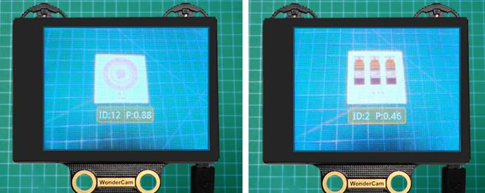

Tips for Best Performance:

- Keep the card at an optimal distance of **15–20 cm** from the camera.

- Avoid dim lighting conditions.

- Use a **plain, solid background**—**white** is recommended for best results.

|                          **Image**                           | **Corresponding ID** |                          **Image**                           | **Corresponding ID** |
| :----------------------------------------------------------: | :------------------: | :----------------------------------------------------------: | :------------------: |
|                       White Background                       |          1           |  |          2           |
|  |          3           |  |          4           |
| 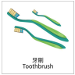 |          5           |  |          6           |
|  |          7           |  |          8           |
|  |          9           |  |          10          |
|  |          11          |  |          12          |
|  |          13          |                                                              |                      |

**02 Waste Sorting**

* **Assembly**


* **Project Introduction**

WonderCam vision module will recognize the waste cards, and sort them into the corresponding waste categories for placement in the designated areas.

* **Program Logic**


* **Module Instruction**


WonderCam is an user-friendly AI visual sensor with eight built-in functions: color recognition, face recognition, AprilTag recognition, line following, Numeric recognition, Landmark recognition, image classification, and feature learning. It can be used with various controllers like ESP32, micro:bit, Arduino, and Raspberry Pi, enabling you to easily implement a wide range of AI visual creative projects.

**Module Wiring: Connect WonderCam module to the port No.9 on the CoreX controller.**


* **Download Program**

[Wasting Sorting Program](../_static/source_code/05/04/Wasting%20Sorting%20Program.zip)

(1) Open the **'Hiwonder Python Editor'** software .

(2) Drag the .py file, located in the same directory as this document, into the Hiwonder Python Editor.


(3) Click "**Connect**" in the menu bar and select the appropriate COM port. Here, COM4 is used as an example. Once the connection is successful, the connection icon will turn green.


(4) After successfully connecting, click the download button  in the menu bar to download the program to xArm AI. Wait for the information interaction box below to indicate that the download is complete.


* **Project Outcome**

:::{Note}

 If the current firmware of the WonderCam module is the "**Mask Recognition**" firmware, please refer to the tutorials under "[**Firmware Flashing Method**](../_static/source_code/04/WonderCam%20Firmware%20Flashing%20Tool%20&%20Method.zip)"  to flash the default firmware to the WonderCam module.

:::

WonderCam vision module detects waste cards, classifies them into different waste types, and controls the robotic arm to pick them up and place them in the corresponding waste category area.


* **Program Analysis**

[Wasting Sorting Program](../_static/source_code/05/04/Wasting%20Sorting%20Program.zip)

(1) Load libraries: Hiwonder library (which contains sensor libraries, low voltage alarm, etc.); the time library for time-related functions; kinematics for kinematics algorithms; LSC for underlying communication between the main controller and the servo control board.

{lineno-start=1}

```
import Hiwonder
import time
import kinematics
from Hiwonder import LSC
```

(2) Create the vision module object cam and bind it to the I2C port (port 9), the ultrasonic light module object i2csonar_4 and bind it to the I2C port (port 4), and the matrix object and bind it to the IO port 6.

:::{Note}

Ports 3, 4, 5, and 9 on the CoreX controller are all connected to the same internal I2C bus of the main controller. For simpler use, Port 4 is used by default as the parameter in the Port method of the Hiwonder library to initialize the corresponding I2C bus. After initialization, all ports on this bus can be used interchangeably.

:::

{lineno-start=6}

```
# initialize variables
cam = Hiwonder.WonderCam(Hiwonder.Port(4))
digitalTube_8 = Hiwonder.Digitaltube(Hiwonder.Port(6))
i2csonar_4 = Hiwonder.I2CSonar(Hiwonder.Port(4))
count = 0
result_last = 0
result_now = 0
```

Upon powering on the robotic arm, the main function is executed by default. The disableLowPowerAlarm method from the Hiwonder library is called to turn off the low voltage alarm. The set_link_length method from the kinematics library is then called to specify the lengths of the robotic arm's segments. The moveServo method from the LSC library is used to move servo 1 to position 100, which opens the mechanical claw.

The setLed and switchFunc methods from the cam vision module object are called to turn off the light and switch to image classification mode. After that, the runActionGroup method from the LSC library is called to run action group 1 and move the robotic arm to its initial position.

The setRGB method from the ultrasonic light module object is called to turn off all RGB lights (set to 0), and the setBrightness and drawBitMap methods from the matrix module are used to set the brightness and turn off all LEDs to clear the screen.

{lineno-start=15}

```
def start_main():
  global cam
  global digitalTube_8
  global i2csonar_4
  global count
  global result_last
  global result_now

  Hiwonder.disableLowPowerAlarm()
  kinematics.set_link_length(6.9,9.5,9.5,16.9)
  cam.setLed(cam.LED_ON)
  cam.switchFunc(cam.Classification)
  digitalTube_8.setBrightness(8)
  digitalTube_8.drawBitMap((0x0,0x0,0x0,0x0,0x0,0x0,0x0,0x0,0x0,0x0,0x0,0x0,0x0,0x0,0x0,0x0))
  i2csonar_4.setRGB(0,0x00,0x00,0x00)
  LSC.runActionGroup(1,1)
  count = 0
  result_last = 0
```

In the main function's loop, at the start of each iteration, the updateResult method of the vision module object cam is called to get the latest recognition results.

Then, the drawBitMap method of the matrix module is called to clear the screen. Next, the getClMaxProbId method of cam is called, which allows the vision module to determine the ID number corresponding to the captured image after classification based on the model prebuilt in the firmware.

:::{Note}

* After the model recognizes a specific class of target, classification starts from ID=2. If no content recorded in the model is recognized, the vision module automatically categorizes the current image into ID=1.

* The 12 waste cards correspond to 12 IDs in the model, with every 3 cards (IDs) belonging to one of the following major categories: hazardous waste, recyclables, kitchen waste, and other waste.

  :::

The program compares the classification result of the current round with the classification result from the previous round. If the results are consistent between the two rounds, the count variable count is incremented. If the same classification result is detected consistently for 5 rounds, it is considered that a specific target with a particular ID has been accurately identified, which helps reduce the possibility of misclassification.

{lineno-start=33}

```
  while True:
    cam.updateResult()
    digitalTube_8.drawBitMap((0x0,0x0,0x0,0x0,0x0,0x0,0x0,0x0,0x0,0x0,0x0,0x0,0x0,0x0,0x0,0x0))
    result_now = cam.getClMaxProbId()
    if (result_now==result_last):
      count+=1
    else:
      count = 0
      result_last = result_now
    if (count>=5):
      count = 0
```

The program determines which of the four major categories the current target (ID) belongs to and executes the corresponding logic. The logic for each of the four categories is quite similar, and here we will use one category (hazardous waste) as an example for explanation:

First, the fill method of the Neopixel_onboard RGB light array object from the Hiwonder libary is called to turn on the red RGB light corresponding to the recognized category, and then the drawBitMap method of the matrix object is called to display the icon corresponding to the recognized category on the matrix.

Then, using the inverse kinematics method ki_move from the kinematics library, the robotic arm's end is controlled to move to the specified coordinates and pitch angle, allowing the arm to reach the target. The moveServo method from the LSC library is called to control servo 1, moving the mechanical claw to close and grab the target.

Finally, the ki_move method is called again to raise the robotic arm's end, followed by the runActionGroup method from the LSC library to control the robotic arm to place the target in a designated area and reset to its initial position.

{lineno-start=44}

```
      if ((result_now>=2) and (result_now<=4)):
        Hiwonder.Neopixel_onboard.fill(255,0,0)
        digitalTube_8.drawBitMap((0x0,0x0,0x0,0x81,0xc3,0x66,0x3c,0x18,0x3c,0x66,0xc3,0x81,0x0,0x0,0x0,0x0))
        time.sleep(0.5)
        kinematics.ki_move(0,17,1.2,-71,800)
        time.sleep(1)
        LSC.moveServo(1,500,500)
        time.sleep(0.8)
        kinematics.ki_move(0,17,20.5,0,800)
        time.sleep(0.8)
        LSC.runActionGroup(6,1)
        time.sleep(5)
        LSC.runActionGroup(1,1)
        time.sleep(1)
```

The main function program `start_main()` needs to be run in a newly created thread using the startMain method from the Hiwonder library. This allows the program to run in a separate thread, ensuring that it operates independently and efficiently.

{lineno-start=109}

```
Hiwonder.startMain(start_main)
```

### 5.4.9  Mask Recognition

* **Assembly**


* **Project Introduction**

Utilize WonderCam vision module to recognize the waste cards, and display the corresponding category icon on the LED dot matrix.

* **Program Logic**


* **Module Instruction**


WonderCam is an user-friendly AI visual sensor with eight built-in functions: color recognition, face recognition, AprilTag recognition, line following, Numeric recognition, Landmark recognition, image classification, and feature learning. It can be used with various controllers like ESP32, micro:bit, Arduino, and Raspberry Pi, enabling you to easily implement a wide range of AI visual creative projects.

**Module Wiring: Connect WonderCam module to the port No.9 on the CoreX controller.**

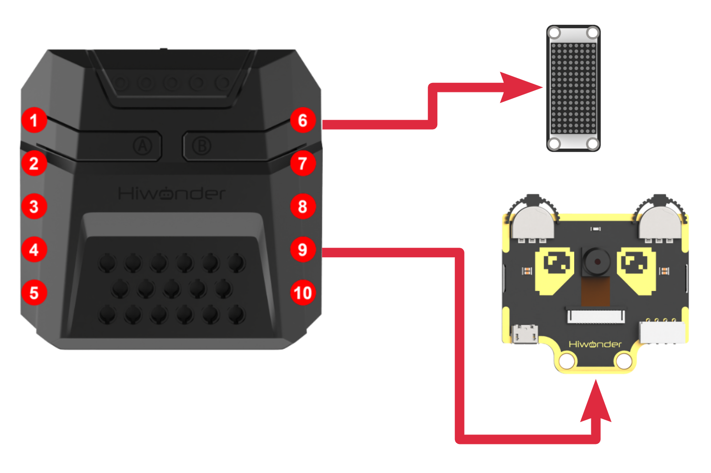

* **Download Program**

(1) Open the **'Hiwonder Python Editor'** software .

(2) Drag the .py file, located in the same directory as this document, into the Hiwonder Python Editor.


(3) Click "**Connect**" in the menu bar and select the appropriate COM port. Here, COM4 is used as an example. Once the connection is successful, the connection icon will turn green .


(4) After successfully connecting, click the download button  in the menu bar to download the program to xArm AI. Wait for the information interaction box below to indicate that the download is complete.


* **Project Outcome**

If the current firmware on the vision module is the default one, please refer to the tutorials under "**Firmware Flashing Method**" document in the "**05 WonderCam Module Firmware/ 2. WonderCam Firmware Flashing Tool and Flashing Method**" to flash the "**Mask Recognition**" firmware to the WonderCam module.

After the robotic arm is powered on, the WonderCam vision module will automatically detect whether a human face is present in the current view. If a face is detected, it will further determine whether the person is wearing a mask. The result is displayed on the LED dot matrix. If a face without a mask is detected, a buzzer will sound as a warning.

If no face is detected, the dot matrix module will display pattern.

If a face with a mask is detected, the dot matrix module will display pattern.

If a face without a mask is detected, the dot matrix module will also display pattern.


* **Program Analysis**

(1) Load libraries: Hiwonder library (which contains sensor libraries, low voltage alarm, etc.); the time library for time-related functions; kinematics for kinematics algorithms; LSC for underlying communication between the main controller and the servo control board.

{lineno-start=1}

```
import Hiwonder
import time
from Hiwonder import LSC
from Hiwonder import Buzzer
```

(2) Create the vision module object cam and bind it to the I2C port (port 9), the ultrasonic light module object i2csonar_4 and bind it to the I2C port (port 4), and the matrix object and bind it to the IO port 6.

:::{Note}

Ports 3, 4, 5, and 9 on the CoreX controller are all connected to the same internal I2C bus of the main controller. For simpler use, Port 4 is used by default as the parameter in the Port method of the Hiwonder library to initialize the corresponding I2C bus. After initialization, all ports on this bus can be used interchangeably.

:::

{lineno-start=6}

```
# initialize variables
cam = Hiwonder.WonderCam(Hiwonder.Port(4))
digitalTube_6 = Hiwonder.Digitaltube(Hiwonder.Port(6))
i2csonar_4 = Hiwonder.I2CSonar(Hiwonder.Port(4))
count = 0
result_last = 0
result_now = 0
```

Upon powering on the robotic arm, the main function is executed by default. The disableLowPowerAlarm method from the Hiwonder library is called to turn off the low voltage alarm. The set_link_length method from the kinematics library is then called to specify the lengths of the robotic arm's segments. The moveServo method from the LSC library is used to move servo 1 to position 100, which opens the mechanical claw.

The setLed and switchFunc methods from the cam vision module object are called to turn off the light and switch to image classification mode. After that, the runActionGroup method from the LSC library is called to run action group 1 and move the robotic arm to its initial position.

The setRGB method from the ultrasonic light module object is called to turn off all RGB lights (set to 0), and the setBrightness and drawBitMap methods from the matrix module are used to set the brightness and turn off all LEDs to clear the screen.

{lineno-start=15}

```
def start_main():
  global cam
  global digitalTube_6
  global i2csonar_4
  global count
  global result_last
  global result_now

  Hiwonder.disableLowPowerAlarm()
  cam.setLed(cam.LED_OFF)
  cam.switchFunc(cam.Classification)
  digitalTube_6.setBrightness(8)
  digitalTube_6.drawBitMap((0x0,0x0,0x3,0x4,0x8,0x10,0x10,0x10,0x10,0x10,0x10,0x8,0x4,0x3,0x0,0x0))
  i2csonar_4.setRGB(0,0x00,0x00,0x00)
  LSC.runActionGroup(0,1)
  count = 0
  result_last = 0
```

In the main function's loop, for each iteration, the following steps occur:

The updateResult method of the visual module object cam is called to obtain the latest recognition results.

The getClMaxProbId method of cam is then called, where the visual module classifies the currently captured image based on the pre-built model within the firmware and returns the corresponding ID number.

:::{Note}

* After the model recognizes a specific class of target, the classification starts from ID=2. If the model does not recognize anything in the current frame, the visual module automatically classifies the image as ID=1.

* A face with a mask is classified as ID=2; a face without a mask is classified as ID=3.

:::

The program will compare the current round's classification result with the previous round's recorded result. If the classification results are consistent between the two rounds, the count variable will increment. If the classification result remains consistent for 5 consecutive rounds, it can be assumed that the program has accurately identified a target with a specific ID, thereby reducing the likelihood of misidentification.

{lineno-start=32}

```
  while True:
    cam.updateResult()
    result_now = cam.getClMaxProbId()
    if (result_now==result_last):
      count+=1
    else:
      count = 0
      result_last = result_now
    if (count>=5):
      count = 0
```

Next, the program will determine which of the two major categories the current target (ID) belongs to and execute the corresponding logic. The logic for handling both categories is quite similar. In both cases, the drawBitMap method will be called to control the LED matrix to display the corresponding prompt icon. For the **"No Mask"** category, the program will additionally call the playTone method from the Buzzer library to activate the buzzer, providing an alert signal.

{lineno-start=42}

```
      if (result_now==1):
        digitalTube_6.drawBitMap((0x0,0x0,0x3,0x4,0x8,0x10,0x10,0x10,0x10,0x10,0x10,0x8,0x4,0x3,0x0,0x0))
        time.sleep(0.5)
      if (result_now==2):
        digitalTube_6.drawBitMap((0x0,0x0,0x4,0x2,0x31,0x41,0x82,0x80,0x80,0x82,0x41,0x31,0x2,0x4,0x0,0x0))
        time.sleep(0.5)
      if (result_now==3):
        digitalTube_6.drawBitMap((0x0,0x0,0x0,0x0,0x0,0x82,0x44,0x28,0x10,0x28,0x44,0x82,0x0,0x0,0x0,0x0))
        for count in range(3):
          Buzzer.playTone(1976,250,True)
          time.sleep(0.3)
    time.sleep(0.1)
```

The above main function `start_main()` needs to be executed in a newly created thread using the startMain method from the Hiwonder library.

{lineno-start=55}

```
Hiwonder.startMain(start_main)
```

## 5.5 AI Voice Interaction Course

### 5.5.1 Introduction to Voice Interaction Module

* **Introduction and Working Principle**

(1) Introduction


The WonderEcho is an all-in-one voice interaction module built on the CI1302 chip, designed for speech recognition and playback. It supports offline neural network (NN) acceleration and hardware-accelerated voice signal processing, leveraging advanced noise reduction and neural network models to deliver highly accurate recognition results.

The CI1302 chip features a Brain Neural Processing Unit (BNPU), supporting offline NN acceleration and hardware-accelerated speech processing. With a CPU clock speed of up to 220 MHz, it enables far-field voice recognition in offline mode. Additionally, it has 2MB of built-in flash storage, capable of recognizing up to 300 command words.

Thanks to its user-friendly operation and outstanding speech recognition performance, the WonderEcho module is ideal for a wide range of applications, including smart home systems, conversational robots, educational robots, and in-vehicle dispatch terminals.

(2) Working Principle

This module operates in wake word activation mode, requiring users to say a designated wake word to activate the voice interaction module before issuing commands. The default wake word is **"Hello Hiwonder"**. If no voice input is detected within 15 seconds, the module will enter sleep mode and must be reactivated before further use.

Once the CI1302 chip recognizes a voice command, it transmits the corresponding instruction to the IIC chip, which then processes and broadcasts the response. The IIC chip stores the received command and transmits it using the IIC slave protocol.

This module supports customization of both wake words and command words. For instructions on modifying them, please refer to the document "[**5.5.2 Modify Wake-up Word**](#anchor_5_5_2)" under the same directory.

* **Module Assembly & Wiring Connection**

Connect the WonderEcho voice module to Port No.5 on xArm AI using a 4PIN cable.


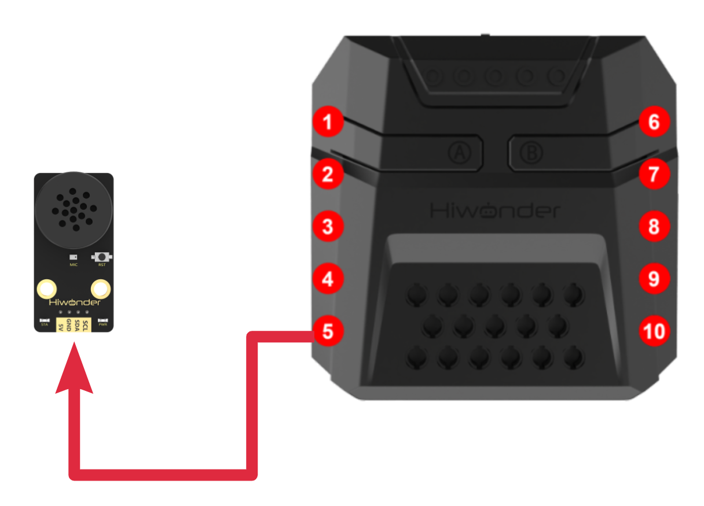

* **Notice**

(1) Ensure the module is powered with 5V to prevent damage.

(2) Keep the surroundings quiet, as background noise may affect recognition accuracy.

(3) Speak loudly and clearly at a moderate pace. Maintain a distance of approximately 5 meters from the module for optimal performance.

* **Port Instruction**


| **No.** |   **Hardware name**   |                       **Instruction**                        |
| :-----: | :-------------------: | :----------------------------------------------------------: |
|    1    |        Speaker        |             Convert the analog signal into sound             |
|    2    |      Microphone       |             Convert the sound into analog signal             |
|    3    |      RST button       |                         Reset button                         |
|    4    | Blue signal indicator | Signal indicator remains on continuously, and it will blink once while a keyword is detected |
|    5    |  Red power indicator  |        It remains on when the power supply is normal         |
|    6    |       I2C port        | Serve as an I2C slave device, providing power and facilitating communication with the master device |
|    7    |      Type-C port      |  For power supply and firmware update for the CI1302 chip.   |
|    8    |      CI1302 chip      | A high-performance voice recognition chip. It recognizes voice and outputs corresponding signals |
|    9    |       I2C chip        | Transform the commands from the voice recognition chip into commands of the I2C protocol |
|   10    |    Amplifier chip     | Convert digital signals into analog signals to drive the speaker |

[Command Word Broadcasting Protocol List](../_static/source_code/04/Command%20Word%20Broadcasting%20Protocol%20List.zip)

<p id="anchor_5_5_2"></p>

### 5.5.2 Modify Wake-up Word

* **Note**

(1) Ensure the surroundings are quiet, as noise can impact the effectiveness of recognition.

(2) Speak the keywords clearly and at a moderate pace, maintaining a distance of approximately 5 meters from the module.

* **Device Connection**

Connect the module to the computer with a Type-C cable.

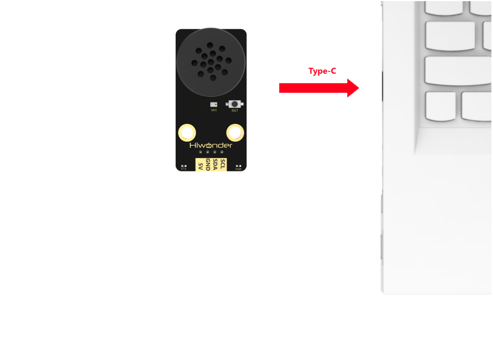

* **Modify Wake-up Word**

(1) Wake up the module by saying **"Hello Hiwonder."** When the module responds with **"I'm here,"** it indicates that the module is in recognition mode.

(2) Say the command "**Learn wake-up word**" to the voice interaction module. If the module responds with "**Please speak the wake-up word to be learned in a quiet environment**", it means the module has entered wake-up word learning mode.

(3) Say the desired wake-up word to the module. It is recommended to choose a short word. For example, set **"Hiwonder"** as the wake-up word.

(4) Once the module successfully recognizes the word, it will announce "**Learning successful**", confirming that the wake-up word has been successfully modified. You can now use "**Hiwonder**" to activate the module.

:::{Note}

The default wake-up word, **"Hello Hiwonder"**, in the factory firmware is the primary wake-up word and cannot be modified or deleted via voice. The custom wake-up word set by the user can only exist alongside the default wake-up word, meaning only one custom wake-up word can be active in addition to the default.

:::

### 5.5.3 Voice Control 

* **Assembly**


* **Project Introduction**

In this section, users give a specific voice command to xArm AI, and the robot executes the corresponding action to pick up the blocks.

* **Program Logic**


* **Module Instruction**


WonderEcho voice module is based on the CI1302 chip for voice recognition and broadcasting. It supports offline NN acceleration and speech signal processing hardware acceleration. Through deep noise reduction and neural network models, it analyzes and produces recognition results.

**Module Wiring: Connect WonderCam module to the port No.5 of the CoreX controller.**


* **Download Program**

[Voice Control Program](../_static/source_code/05/05/Voice%20Control%20Program.zip)

(1) Open the 'Hiwonder Python Editor' software .

(2) Drag the .py file, located in the same directory as this document, into the Hiwonder Python Editor.


(3) Click "**Connect**" in the menu bar and select the appropriate COM port. Here, COM4 is used as an example. Once the connection is successful, the connection icon will turn green .


(4) After successfully connecting, click the download button  in the menu bar to download the program to xArm AI. Wait for the information interaction box below to indicate that the download is complete.


* **Project Outcome**

To activate the voice recognition module, simply say 'Hello Hiwonder'. You can then use any command phrases listed in the table below. Upon recognition, xArm AI will grab the color block and place it at the corresponding position. The following phrases can be used multiple times.

| **Command Phrase** |  **ID**   |
| :----------------: | :-------: |
|      SORT-RED      | 105(0x69) |
|     SORT-GREEN     | 106(0x6A) |
|     SORT-BLUE      | 107(0x6B) |
|    SORT-YELLOW     | 124(0x7C) |


* **Program Analysis**

[Voice Control Program](../_static/source_code/05/05/Voice%20Control%20Program.zip)

(1) Load libraries: Hiwonder library (which contains sensor libraries, low voltage alarm, etc.); the time library for time-related functions; kinematics for kinematics algorithms; LSC for underlying communication between the main controller and the servo control board; and Buzzer for buzzer control.

{lineno-start=1}

```
import Hiwonder
import time
import kinematics
from Hiwonder import LSC
```

(2) Create the matrix module object digitalTube_6 and bind it to the IO port (port 6), and create the voice interaction module object asr2 and bind it to the IIC port (port 4).

:::{Note}

Ports 3, 4, 5, and 9 on the CoreX controller are all connected to the same internal I2C bus of the main controller. For simpler use, Port 4 is used by default as the parameter in the Port method of the Hiwonder library to initialize the corresponding I2C bus. After initialization, all ports on this bus can be used interchangeably.

:::

{lineno-start=6}

```
# initialize variables
ID_Identify = 0
digitalTube_6 = Hiwonder.Digitaltube(Hiwonder.Port(6))
asr2 = Hiwonder.WonderEcho(Hiwonder.Port(4))
```

Upon powering on, the robotic arm automatically executes the main function. It calls the set_link_length method from the kinematics library to specify the lengths of the robotic arm's segments. Then, it calls the runActionGroup method from the LSC library to execute action group 0 once, moving the arm to its initial position.

Afterward, the drawBitMap method of the matrix object is called to turn off all LEDs on the matrix, effectively clearing the screen.

{lineno-start=12}

```
def start_main():
  global ID_Identify
  global digitalTube_6
  global asr2

  kinematics.set_link_length(6.9,9.5,9.5,16.9)
  LSC.runActionGroup(0,1)
  ID_Identify = 0
  digitalTube_6.drawBitMap((0x0,0x0,0x0,0x0,0x0,0x0,0x0,0x0,0x0,0x0,0x0,0x0,0x0,0x0,0x0,0x0))

```

In each loop of the main function, the actionFinish method from the LSC library is called first to check if the robotic arm is currently executing an action group (i.e., if it has received user instructions and is processing the corresponding logic). If the return value is 0, it means the arm is still processing the previous instruction, so the current loop is ended to ensure that each instruction is fully executed before moving on to the next one.

Next, the fill method of the Neopixel_onboard RGB light array object from the Hiwonder library is called to turn off all RGB lights on the CoreX controller. Then, the drawBitMap method of the matrix object is called to clear the screen. Finally, the getResult method of the voice interaction module is invoked to retrieve the current word ID recognition status, and the result is stored in ID_Identify.

{lineno-start=21}

```
  while True:
    if LSC.actionFinish():
      Hiwonder.Neopixel_onboard.fill(0,0,0)
      digitalTube_6.drawBitMap((0x0,0x0,0x0,0x0,0x0,0x0,0x0,0x0,0x0,0x0,0x0,0x0,0x0,0x0,0x0,0x0))
      ID_Identify = asr2.getResult()
```

In the program, we have written processing logic for the four phrases: **"Sort Red," "Sort Green," "Sort Blue," and "Sort Yellow"**. Since four phrases share a common logic, so "**Sort Red**" will be used as an example for explanation:

If the recognized word ID matches, the first step is to call the drawBitMap method of the matrix object to print the character 'R' on the matrix as a prompt. Then, the fill method of the RGB light array object (Neopixel_onboard) is called to turn on the red light on the CoreX controller, corresponding to the color in the phrase.

Finally, the runActionGroup method from the LSC library is invoked to control the robotic arm to grab and place the red color block to a specified position.

{lineno-start=26}

```
      if (ID_Identify==105):
        digitalTube_6.drawStr((7,0,'R'))
        Hiwonder.Neopixel_onboard.fill(255,0,0)
        time.sleep(1)
        LSC.runActionGroup(2,1)
      else:
        if (ID_Identify==106):
          digitalTube_6.drawStr((7,0,'G'))
          Hiwonder.Neopixel_onboard.fill(0,255,0)
          time.sleep(1)
          LSC.runActionGroup(3,1)
        else:
          if (ID_Identify==107):
            digitalTube_6.drawStr((7,0,'B'))
            Hiwonder.Neopixel_onboard.fill(0,0,255)
            time.sleep(1)
            LSC.runActionGroup(4,1)
          else:
            if (ID_Identify==124):
              digitalTube_6.drawStr((7,0,'Y'))
              Hiwonder.Neopixel_onboard.fill(0xfd,0xd0,0x00)
              time.sleep(1)
              LSC.runActionGroup(5,1)
    else:
      ID_Identify = asr2.getResult()
```

The main function program start_main() needs to be executed in a new thread using the startMain method from the HiWonder library.

{lineno-start=52}

```
Hiwonder.startMain(start_main)
```

### 5.5.4 Voice Broadcasting

* **Assembly**


* **Project Introduction**

In this section, the voice interaction module is used to play the command phrases.

* **Program Logic**


* **Module Instruction**


WonderEcho voice module is based on the CI1302 chip for voice recognition and broadcasting. It supports offline NN acceleration and speech signal processing hardware acceleration. Through deep noise reduction and neural network models, it analyzes and produces recognition results.

**Module Wiring: Connect WonderEcho voice module to the port No.5 of the CoreX controller.**


* **Download Program**

[Voice Broadcasting Program](../_static/source_code/05/05/Voice%20Broadcasting%20Program.zip)

(1) Open the **'Hiwonder Python Editor'** software .

(2) Drag the .py file, located in the same directory as this document, into the Hiwonder Python Editor.


(3) Click "**Connect**" in the menu bar and select the appropriate COM port. Here, COM4 is used as an example. Once the connection is successful, the connection icon will turn green .


(4) After successfully connecting, click the download button  in the menu bar to download the program to xArm AI. Wait for the information interaction box below to indicate that the download is complete.


* **Project Outcome**

The voice interaction module will continuously broadcast the command phrases in the following order:

| **Broadcasting Phrase** | **ID**  |
| :---------------------: | :-----: |
|    Recyclable Waste     | 1(0x01) |
|     Residual Waste      | 2(0x01) |
|     Hazardous Waste     | 3(0x01) |
|       Other Waste       | 4(0x01) |
|     Obstacle Ahead      | 5(0x01) |

:::{Note}

* The IDs for the broadcasting phrases and the command phases are not interchangeable.

* The robot's response phrase, after recognizing the broadcasting phrase, can also be automatically played when invoked in the program.

:::


* **Program Analysis**

[Voice Broadcasting Program](../_static/source_code/05/05/Voice%20Broadcasting%20Program.zip)

(1) Load libraries: Hiwonder library (which contains sensor libraries, low voltage alarm, etc.); the time library for time-related functions; kinematics for kinematics algorithms; LSC for underlying communication between the main controller and the servo control board; and Buzzer for buzzer control.

{lineno-start=1}

```
import Hiwonder
import time
import kinematics
from Hiwonder import LSC
```

Create the matrix module object digitalTube_6 and bind it to the IO port (port 6), and create the voice interaction module object asr2 and bind it to the IIC port (port 4).

:::{Note}

Ports 3, 4, 5, and 9 on the CoreX controller are all connected to the same internal I2C bus of the main controller. For simpler use, Port 4 is used by default as the parameter in the Port method of the Hiwonder library to initialize the corresponding I2C bus. After initialization, all ports on this bus can be used interchangeably.

:::

{lineno-start=6}

```
# initialize variables
digitalTube_6 = Hiwonder.Digitaltube(Hiwonder.Port(6))
asr2 = Hiwonder.WonderEcho(Hiwonder.Port(4))
```

Upon powering on, the robotic arm automatically executes the main function. It calls the set_link_length method from the kinematics library to specify the lengths of the robotic arm's segments. Then, it calls the runActionGroup method from the LSC library to execute action group 0 once, moving the arm to its initial position.

Afterward, the drawBitMap method of the matrix object is called to turn off all LEDs on the matrix, effectively clearing the screen.

{lineno-start=11}

```
def start_main():
  global digitalTube_6
  global asr2

  kinematics.set_link_length(6.9,9.5,9.5,16.9)
  LSC.runActionGroup(0,1)
  digitalTube_6.drawBitMap((0x0,0x0,0x0,0x0,0x0,0x0,0x0,0x0,0x0,0x0,0x0,0x0,0x0,0x0,0x0,0x0))
  time.sleep(2)
```

In each loop of the main function, call the speak method of the voice interaction module to send a command to the voice interaction module, broadcasting the type as ASR_ANNOUNCER (announcement) with the entry ID of 1. Then, using the same method, sequentially broadcast entries 2 to 5, all with the ASR_ANNOUNCER type.

:::{Note}

The command word type is ASR_CMDMAND, and we can also pass it as the first parameter to the function to broadcast command word type entries.

:::

For example: asr2.speak(asr2.ASR_CMDMAND, 1) will broadcast the command word type entry with ID 1 ("**Forward**") and its corresponding announcement ("**Moving forward**").

{lineno-start=19}

```
  while True:
    asr2.speak(asr2.ASR_ANNOUNCER, 1)
    time.sleep(2)
    asr2.speak(asr2.ASR_ANNOUNCER, 2)
    time.sleep(2)
    asr2.speak(asr2.ASR_ANNOUNCER, 3)
    time.sleep(2)
    asr2.speak(asr2.ASR_ANNOUNCER, 4)
    time.sleep(2)
    asr2.speak(asr2.ASR_ANNOUNCER, 5)
    time.sleep(2)
```

The main function start_main() needs to be run in a new thread using the startMain method from the Hiwonder library.

{lineno-start=31}

```
Hiwonder.startMain(start_main)
```

### 5.5.5 Voice-Controlled Visual Sorting

* **Assembly**


* **Project Introduction**

In this section, the user speaks the corresponding phrases to the WonderEcho voice module, and the xArm AI will then execute the corresponding recognition function.

* **Program Logic**


* **Module Instruction**

(1) WonderCam AI Vision Module


WonderCam is an user-friendly AI visual sensor with eight built-in functions: color recognition, face recognition, label recognition, line following, Numeric recognition, Landmark recognition, image classification, and feature learning. It can be used with various controllers like ESP32, micro:bit, Arduino, and Raspberry Pi, enabling you to easily implement a wide range of AI visual creative projects.

**Module Wiring: Connect WonderCam module to the port No.9 of the CoreX controller.**

(2) WonderEcho AI Voice Module


WonderEcho voice module is based on the CI1302 chip for voice recognition and broadcasting. It supports offline NN acceleration and speech signal processing hardware acceleration. Through deep noise reduction and neural network models, it analyzes and produces recognition results.

**Module Wiring: Connect WonderEcho voice module to the port No.5 of the CoreX controller.**

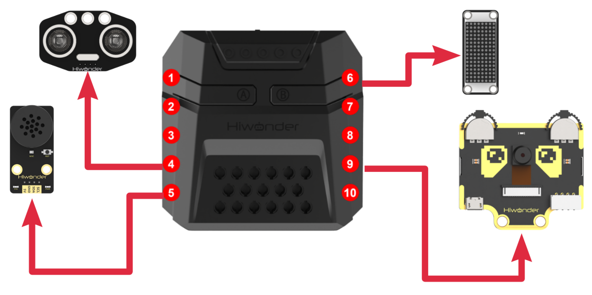

* **Download Program**

[Voice-Controlled Visual Sorting Program](../_static/source_code/05/05/Voice-Controlled%20Visual%20Sorting%20Program.zip)

(1) Open the 'Hiwonder Python Editor' software .

(2) Drag the .py file, located in the same directory as this document, into the Hiwonder Python Editor.


(3) Click "**Connect**" in the menu bar and select the appropriate COM port. Here, COM4 is used as an example. Once the connection is successful, the connection icon will turn green .


(4) After successfully connecting, click the download button  in the menu bar to download the program to xArm AI. Wait for the information interaction box below to indicate that the download is complete.


* **Project Outcome**

To activate the voice recognition module, simply say 'Hello Hiwonder'. You can then use any command phrases listed in the table below, then xArm AI will automatically perform the corresponding visual task in a continuous loop. The following phrases can be used multiple times.

|   **Command Phrase**    |  **ID**   |
| :---------------------: | :-------: |
| START-LABEL-RECOGNITION | 99(0x63)  |
|   START-WASTE-SORTING   | 100(0x64) |
| START-COLOR-RECOGNITION | 101(0x65) |


* **Program Analysis**

[Voice-Controlled Visual Sorting Program](../_static/source_code/05/05/Voice-Controlled%20Visual%20Sorting%20Program.zip)

(1) Load libraries: Hiwonder library (which contains sensor libraries, low voltage alarm, etc.); the time library for time-related functions; kinematics for kinematics algorithms; LSC for underlying communication between the main controller and the servo control board; and Buzzer for buzzer control.

{lineno-start=1}

```
import Hiwonder
import time
import kinematics
from Hiwonder import LSC
from Hiwonder import Buzzer
```

(2) Create a vision module object cam and bind it to the IIC port (port 9), create a light-emitting ultrasonic module object i2csonar_3 and bind it to the IIC port (port 4), create a voice interaction module object and bind it to the IIC port (port 5), and create a dot matrix module digitalTube_6 and bind it to the 6th IO port.

:::{Note}

Ports 3, 4, 5, and 9 on the CoreX controller are all connected to the same internal I2C bus of the main controller. For simpler use, Port 4 is used by default as the parameter in the Port method of the Hiwonder library to initialize the corresponding I2C bus. After initialization, all ports on this bus can be used interchangeably.

:::

{lineno-start=7}

```
# initialize variables
Glossary_ID_recognization = 0
count = 0
result_classification_lastround = 0
result_classification_thisround = 0
Glossary_ID_execute = 0
digitalTube_6 = Hiwonder.Digitaltube(Hiwonder.Port(6))
asr2 = Hiwonder.WonderEcho(Hiwonder.Port(4))
cam = Hiwonder.WonderCam(Hiwonder.Port(4))
i2csonar_3 = Hiwonder.I2CSonar(Hiwonder.Port(4))
```

Later, we will divide the task implementation into two threads to improve execution efficiency.

**start_main Thread**

Upon powering on the robotic arm, the main function is executed by default. The following steps are performed:

Call the kinematics library's set_link_length method to specify the arm's link lengths.

Call the LSC library's runActionGroup method to execute Action Group 1, moving the arm to its initial position.

Then, the drawBitMap method of the dot matrix module is called to clear the screen.

The moveServo method of the LSC library is called to move Servo 1 to position 100, causing the mechanical claw to open.

The setRGB method of the light-emitting ultrasonic module is called to turn off all RGB lights (set to 0).

Finally, the setLed method of the vision module object cam is called to turn off the fill light.

{lineno-start=19}

```
def start_main():
  global Glossary_ID_recognization
  global count
  global result_classification_lastround
  global result_classification_thisround
  global Glossary_ID_execute
  global digitalTube_6
  global asr2
  global cam
  global i2csonar_3

  kinematics.set_link_length(6.9,9.5,9.5,16.9)
  LSC.runActionGroup(0,1)
  Glossary_ID_recognization = 0
  count = 0
  result_classification_lastround = 0
  result_classification_thisround = 0
  Glossary_ID_execute = 0
  digitalTube_6.drawBitMap((0x0,0x0,0x0,0x0,0x0,0x0,0x0,0x0,0x0,0x0,0x0,0x0,0x0,0x0,0x0,0x0))
  cam.setLed(cam.LED_OFF)
  i2csonar_3.setRGB(0,0x00,0x00,0x00)
```

In each cycle of the main function, the following steps are executed: first, the actionFinish method from the LSC library is called to check whether the robotic arm is still executing an action group. If the return value is 0, it means the robotic arm is still processing the previous user command, so the current cycle is terminated to ensure that each instruction is processed completely.

When the return value is 1, confirming that the robotic arm is idle, the following logic is executed:

Call the getResult method of the voice interaction module to get the latest voice recognition result, store the recognized command's ID (i.e., the recognized word's ID) in the variable Glossary_ID_recognization, check the value of Glossary_ID_recognization. If it corresponds to a valid word entry, assign this value to Glossary_ID_execute (the current executing word's ID), and finally, call the runActionGroup method of the LSC library to execute Action Group 1, preparing the system for the upcoming visual task.

:::{Note}

When the voice interaction module does not recognize a valid phrase, the getResult method returns 0. Therefore, we cannot rely solely on Glossary_ID_recognization to determine whether a user command has been issued, as the system may quickly overwrite the previous word ID due to the absence of a valid word, which could interrupt the ongoing visual task. To avoid this, we have designed two variables to store the valid word ID in Glossary_ID_execute (current executing word ID) for isolation protection.

:::

{lineno-start=40}

```
  while True:
    if LSC.actionFinish():
      Glossary_ID_recognization = asr2.getResult()
      if ((Glossary_ID_execute==99) or (((Glossary_ID_execute==100) or (Glossary_ID_execute==101)))):
        Glossary_ID_execute = Glossary_ID_recognization
        LSC.runActionGroup(1,1)
    time.sleep(0.1)
```

**start_main1 Thread**

In the main loop of the function, for each iteration, the system first calls the actionFinish method from the LSC library to check if the servo control board is currently executing an action group for the robotic arm. If the returned value is 1, this indicates that the robotic arm is idle and the system proceeds with the next steps:

The system then calls the updateResult method of the visual module object cam to obtain the latest recognition results. After that, it checks whether the current Glossary_ID_execute (the currently executing word ID) matches any of the pre-set command word category IDs.

{lineno-start=49}

```
def start_main1():
  global Glossary_ID_recognization
  global count
  global result_classification_lastround
  global result_classification_thisround
  global Glossary_ID_execute
  global digitalTube_6
  global asr2
  global cam
  global i2csonar_3

  time.sleep(2)
  while True:
    if LSC.actionFinish():
      cam.updateResult()
      if ((Glossary_ID_execute==99) or (((Glossary_ID_execute==100) or (Glossary_ID_execute==101)))):

```

After the word ID matches, the program enters a branch to execute the corresponding visual task. The execution logic for the three visual tasks—"**Tag Recognition**", "**Color Recognition**", and "**Waste Sorting**"—is similar to the corresponding examples in the previous lessons, which have been analyzed in detail.  

The above start_main() and start_main1() threads need to be run in parallel using the startMain method from the HiWonder library, each in its own newly created thread.

{lineno-start=275}

```
Hiwonder.startMain(start_main)
Hiwonder.startMain(start_main1)
```

### 5.5.6 Adaptive Grasping & Broadcasting

* **Assembly**


* **Project Introduction**

In this section, user can place the object to be grasped at any distance directly in front of the ultrasonic module. xArm AI will then execute the corresponding action based on the distance between the object and the sensor. Additionally, the voice interaction module will play the corresponding phrase to provide a prompt or notification.

* **Program Logic**


* **Module Instruction**

(1) Ultrasonic Module


The module uses an I2C communication interface, allowing the distance measured by the ultrasonic sensor to be read via I2C communication.

Additionally, the ultrasonic probe position integrates two RGB LEDs, which not only allow adjustment of the light brightness but also enable the creation of a variety of colors through changes in the red (R), green (G), and blue (B) color channels, as well as their combinations.

**Module wiring: Connect the dot matrix module to Port No.4 of the CoreX controller.**

(2) WonderEcho AI Voice Module


The WonderEcho is an all-in-one voice interaction module built on the CI1302 chip, designed for speech recognition and playback. It supports offline neural network (NN) acceleration and hardware-accelerated voice signal processing, leveraging advanced noise reduction and neural network models to deliver highly accurate recognition results.

The CI1302 chip features a Brain Neural Processing Unit (BNPU), supporting offline NN acceleration and hardware-accelerated speech processing. With a CPU clock speed of up to 220 MHz, it enables far-field voice recognition in offline mode. Additionally, it has 2MB of built-in flash storage, capable of recognizing up to 300 command words.

**Module Wiring: Connect WonderEcho voice module to the port No.5 of the CoreX controller.**


* **Download Program**

[Adaptive Grasping & Broadcasting Program](../_static/source_code/05/05/Adaptive%20Grasping%20&%20Broadcasting%20Program.zip)

(1) Open the 'Hiwonder Python Editor' software .

(2) Drag the .py file, located in the same directory as this document, into the Hiwonder Python Editor.


(3) Click "**Connect**" in the menu bar and select the appropriate COM port. Here, COM4 is used as an example. Once the connection is successful, the connection icon will turn green.


(4) After successfully connecting, click the download button  in the menu bar to download the program to xArm AI. Wait for the information interaction box below to indicate that the download is complete.


* **Project Outcome**

After the robotic arm is powered on, the ultrasonic module continuously detects the distance between the xArm AI and the object to be grasped in front of it.

If the object is within the recognition range, the RGB light will turn green. The robotic arm will use inverse kinematics to grasp and place the object, while the voice module plays "**Detect object ahead, grabbing**". After placement, the voice module will play "**Grabbing end**".

If the object is within a smaller range than the grasping range, the RGB light will turn red, and the buzzer will sound repeatedly.

If the object is beyond the grasping range, the RGB light will turn blue, and the voice module will play "**Detect object ahead, out of reach, cannot grab**" once.

<table  class="docutils-nobg" border="1">
<colgroup>
<col  />
<col  />
<col  />
</colgroup>
<tbody>
<tr>
<td ><strong>Command Phrase</strong></td>
<td ><strong>ID</strong></td>
<td ><strong>Phrase Type</strong></td>
</tr>
<tr>
<td ><p>DETECT-OBJECT-AHEAD-</p>
<p>GRABBING</p></td>
<td >16(0X10)</td>
<td >Broadcasting (0xFF)</td>
</tr>
<tr>
<td >DETECT-OBJECT-AHEAD-OUT-OF-REACH-CANNOT-GRAB</td>
<td >17(0X11)</td>
<td >Broadcasting (0xFF)</td>
</tr>
<tr>
<td >GRABBING-END</td>
<td >18(0X12)</td>
<td >Broadcasting (0xFF)</td>
</tr>
</tbody>
</table>


* **Program Analysis**

[Adaptive Grasping & Broadcasting Program](../_static/source_code/05/05/Adaptive%20Grasping%20&%20Broadcasting%20Program.zip)

(1) Load libraries: Hiwonder library (which contains sensor libraries, low voltage alarm, etc.); the time library for time-related functions; kinematics for kinematics algorithms; LSC for underlying communication between the main controller and the servo control board; and Buzzer for buzzer control.

{lineno-start=1}

```
import Hiwonder
import time
from Hiwonder import Buzzer
import kinematics
from Hiwonder import LSC
```

(2) Create a vision module object cam and bind it to the IIC port (port 9), create a light-emitting ultrasonic module object i2csonar_3 and bind it to the IIC port (port 4), create a voice interaction module object and bind it to the IIC port (port 5), and create a dot matrix module digitalTube_6 and bind it to the 6th IO port.

:::{Note}

Ports 3, 4, 5, and 9 on the CoreX controller are all connected to the same internal I2C bus of the main controller. For simpler use, Port 4 is used by default as the parameter in the Port method of the Hiwonder library to initialize the corresponding I2C bus. After initialization, all ports on this bus can be used interchangeably.

:::

{lineno-start=7}

```
# initialize variables
measure_switch = 0
hyperdistance_Voice_switch = 0
distance = 0
i2csonar_3 = Hiwonder.I2CSonar(Hiwonder.Port(4))
digitalTube_6 = Hiwonder.Digitaltube(Hiwonder.Port(6))
distance_pinchable_max = 0
distance_pinchable_min = 0
count = 0
Object_size_waitforclamp = 0
length = 0
distance_this_round = 0
distance_last_round = 0
asr2 = Hiwonder.WonderEcho(Hiwonder.Port(4))
```

Later, we will divide the task implementation into two threads to improve execution efficiency.

**start_main Thread**

The robotic arm, upon powering on, defaults to executing the main function. First, it turns on the distance measurement switch for the first thread, measure_switch, and turns off the over-distance voice prompt switch, hyperdistance_Voice_switch.

{lineno-start=23}

```
def start_main():
  global measure_switch
  global hyperdistance_Voice_switch
  global distance
  global i2csonar_3
  global digitalTube_6
  global distance_pinchable_max
  global distance_pinchable_min
  global count
  global Object_size_waitforclamp
  global length
  global distance_this_round
  global distance_last_round
  global asr2

  measure_switch = 1
  hyperdistance_Voice_switch = 0
```

In each loop of the main function, the program first checks whether the distance measurement switch measure_switch is on. If it is off, the internal logic will not be executed.

Once the distance measurement switch is on, the program calls the ultrasonic module object's getDistance method to retrieve the current measured distance distance. This distance value is then displayed on the dot matrix screen using the showNum method.

Next, the program evaluates the distance value. If it falls within the grippable distance range, i.e., distance_pinchable_max (maximum grippable distance) \> distance \> distance_pinchable_min (minimum grippable distance), it calls the ultrasonic module's setRGB method to light up all (0) RGB LEDs with green light (R:G:B = 0:255:0). Additionally, it calls the HiWonder library's RGB light array object's Neopixel_onboard.fill method to control the RGB LEDs to turn on green light as well.

The logic for when the measured value is greater than or equal to or less than or equal to the grippable distance range is similar and will not be expanded here. It is worth noting that when the distance is less than or equal to the grippable distance range, the Buzzer library's playTone method is called to activate the buzzer at a frequency of 1976Hz (B6 tone) for 500ms (half-beat) to alert with the front-end (True) play.

{lineno-start=40}

```
  while True:
    if (measure_switch==1):
      distance = i2csonar_3.getDistance()
      digitalTube_6.showNum((distance,1))
      if ((distance<distance_pinchable_max) and (distance>distance_pinchable_min)):
        i2csonar_3.setRGB(0,0,255,0)
        Hiwonder.Neopixel_onboard.fill(0,255,0)
      else:
        if (distance>=distance_pinchable_max):
          if not (distance==500):
            i2csonar_3.setRGB(0,0,0,255)
            Hiwonder.Neopixel_onboard.fill(0,0,255)
        else:
          i2csonar_3.setRGB(0,255,0,0)
          Hiwonder.Neopixel_onboard.fill(255,0,0)
          Buzzer.playTone(1976,500,True)
    time.sleep(0.5)
```

**start_main1 Thread**

In the initialization of the second thread, the program first calls the set_link_length and ki_move methods from the kinematics library to specify the lengths of the robotic arm segments and move it to the initial posture. It then calls the moveServo method from the LSC library to move servo 1 to position 100, which opens the mechanical claw.

After that, the program calls the drawBitMap method from the dot matrix module to clear the screen and the setRGB method from the ultrasonic module object to turn off all RGB lights (set to 0).

{lineno-start=59}

```
def start_main1():
  global measure_switch
  global hyperdistance_Voice_switch
  global distance
  global i2csonar_3
  global digitalTube_6
  global distance_pinchable_max
  global distance_pinchable_min
  global count
  global Object_size_waitforclamp
  global length
  global distance_this_round
  global distance_last_round
  global asr2

  kinematics.set_link_length(6.9,9.5,9.5,16.9)
  kinematics.ki_move(0,17,20.5,0,500)
  LSC.moveServo(1,100,500)
  count = 0
  Object_size_waitforclamp = 3.93
  length = 8.5
  distance_pinchable_min = 5
  distance_pinchable_max = 17
  distance_this_round = 0
  distance_last_round = 0
  digitalTube_6.drawBitMap((0x0,0x0,0x0,0x0,0x0,0x0,0x0,0x0,0x0,0x0,0x0,0x0,0x0,0x0,0x0,0x0))
  i2csonar_3.setRGB(0,0,0,255)
  time.sleep(1)
```

In the loop of the second thread, at the beginning of each iteration, the program first reads the distance to the object to be picked up, measured by thread 1, and stores it as distance_this_round for the current round. It then checks if this distance is less than the maximum allowable grabbing distance. If so, it disables the over-distance voice prompt switch.

:::{Note}

Threads 1 and 2 work in parallel, so thread 1 continuously measures the distance and updates the distance value. Therefore, you should not directly use distance in thread 2. Instead, at the beginning of each loop in thread 2, store the current distance value in distance_this_round for isolation protection.

:::

The program then checks if the current distance (distance_this_round) matches the previous distance (distance_last_round). If they are the same, it indicates that the object to be grasped is stably placed in front of the robotic arm (the user has released it). If the distances are different, it means that the user has just placed the object, and it is still in the process of moving to the desired position, so the program should not attempt to grasp it yet.

Once it is confirmed that the object is stably placed and ready to be grasped, the program proceeds with the following steps:

First, the speech interaction module's speak method is called to announce the phrase "**Detect object ahead, grabbing**". The program then checks whether the object to be grasped is within the graspable range using the value of distance_this_round. If the object is within the graspable range, the distance measurement switch (measure_switch) is turned off to prevent thread 1 from executing further logic, allowing thread 2 to release CPU resources by sleeping the loop.

Next, the ki_move_adapt method from the kinematics algorithm library is used to move the robotic arm's end-effector to the specified coordinates and pitch angle using inverse kinematics, allowing the arm to descend toward the target object. Finally, the moveServo method from the LSC library is used to rotate servo 1, closing the mechanical claw to grasp the object.

① ki_move_adapt(X,Y,Z,Pitch_Angle_min,Pitch_Angle_max,time)：

X: The target X-axis coordinate of the robotic arm's end-effector in the 3D coordinate system of the arm.

Y: The target Y-axis coordinate of the robotic arm's end-effector in the 3D coordinate system of the arm.

Z: The target Z-axis coordinate of the robotic arm's end-effector in the 3D coordinate system of the arm.

Pitch_Angle_min: The minimum acceptable pitch angle for the inverse kinematics solution to reach the target coordinates.

Pitch_Angle_max: The maximum acceptable pitch angle for the inverse kinematics solution to reach the target coordinates.

time: The time duration for the movement execution.

② Value Description:In our projects, we use a square sponge block as the object to be grasped. During the grasping process, the ideal position for the robotic arm's end-effector (the front of the mechanical claw) should be at the center of the sponge block (grasping the middle of the block). The origin of the robotic arm's 3D coordinate system is located directly below the servo ID6.

Therefore, the value of Y should be:

distance_this_round (the distance from the front of the ultrasonic sensor probe to the front of the sponge block)

length (the distance from directly beneath Servo 6 to the front of the ultrasonic sensor probe)

Object_size_waitforclamp / 2 (half the size of the sponge block, i.e., the distance from the front of the sponge to its center).

The sponge block is placed directly in front of the robotic arm, aligned along the Y-axis, so the X value is 0.

The Z value is:

Object_size_waitforclamp / 2 (half the size of the sponge block, i.e., the distance from the bottom to the center of the block).

Pitch_Angle_min and Pitch_Angle_max should be set to ensure the gripper can clamp the object within a 180° vertical range directly in front without tilting backward

Finally, the ki_move method is called to lift the robotic arm's end-effector. Then, the runActionGroup method from the LSC library is called to control the robotic arm to perform two actions: placing the object in the designated area and returning to its initial posture. Lastly, the speak method of the voice interaction module object is called to broadcast the voice prompt entry "**Grasping complete**".

If the value of distance_this_round indicates that the current object is out of the graspable range and located beyond the effective grasping distance, and after ruling out special case 500, the system will then check if the out-of-range voice alert is enabled. If it is, the speak method of the voice interaction module is called to broadcast the entry: "**Obstacle detected ahead. Distance too far. Unable to grasp**". Afterward, the out-of-range voice alert will be turned off.

:::{Note}

When the ultrasonic module does not detect any obstacle in front, getDistance returns 500.

:::

At the end of the loop, assign the current round's distance to distance_last_round for use in the next iteration.

{lineno-start=87}

```
  while True:
    distance_this_round = distance
    if (distance_this_round<distance_pinchable_max):
      hyperdistance_Voice_switch = 0
    if (distance_last_round==distance_this_round):
      measure_switch = 0
      if ((distance_this_round<distance_pinchable_max) and (distance_this_round>distance_pinchable_min)):
        time.sleep(1)
        asr2.speak(asr2.ASR_ANNOUNCER, 16)
        kinematics.ki_move_adapt(0,(distance_this_round+((length+(Object_size_waitforclamp/2)))),2,-90,90,2000)
        time.sleep(0.2)
        LSC.moveServo(1,500,500)
        time.sleep(0.8)
        kinematics.ki_move(0,17,20.5,0,1400)
        time.sleep(0.4)
        LSC.runActionGroup(8,1)
        time.sleep(4.8)
        asr2.speak(asr2.ASR_ANNOUNCER, 18)
        time.sleep(1)
      else:
        if (distance_this_round>distance_pinchable_max):
          if (distance_this_round<40):
            if (hyperdistance_Voice_switch==0):
              hyperdistance_Voice_switch = 1
              asr2.speak(asr2.ASR_ANNOUNCER, 17)
              time.sleep(3.5)
        else:
          time.sleep(0.5)
      measure_switch = 1
    time.sleep(0.8)
    distance_last_round = distance_this_round
```

The above threads, start_main() and start_main1(), need to use the startMain method from the Hiwonder library and run in parallel within two newly created threads.

{lineno-start=119}

```
Hiwonder.startMain(start_main)
Hiwonder.startMain(start_main1)
```

## 5.6 Secondary Development Tutorial

### 5.6.1 Touch Control

* **Assembly**


* **Project Introduction**

This section introduces how to control xArm AI to execute action groups based on the number of times the touch sensor is tapped.

* **Project Logic**


* **Module Instruction**

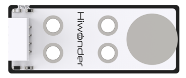

The touch sensor is a capacitive sensing-based device that primarily detects the presence of a human body or metal through its gold-plated contact surface.

When no finger or metal is touching the metal surface, the signal output is at a high level. When a finger or metal touches the metal surface, the signal output switches to a low level.

Wiring Location: The touch sensor is connected to the No.8 interface of xArm AI.


* **Program Download**

[Touch Control Program](../_static/source_code/05/06/Touch%20Control%20Program.zip)

(1) Open the Python editor software.

(2) Drag the program file under the same path as this document to the Python editor.


(3) Click on the "**Connect**" in the menu bar and select the COM port. In this case, COM4 is successful, the connection icon will turn green .


(4) Click Download on the right , download the program to the device and wait for the prompt to complete the download.


* **Project Outcome**

After the robotic arm is powered on, a single tap on the touch sensor will cause the CoreX controller's RGB light to turn red and execute action group 2. A double tap on the touch sensor will cause the RGB light to turn green and execute action group 3.

A triple tap on the touch sensor will cause the CoreX controller's RGB light to turn blue and execute action group 4. A quadruple tap will turn the RGB light yellow and execute action group 5.

The above process may be performed repeatedly.


* **Program Analysis**

[Touch Control Program](../_static/source_code/05/06/Touch%20Control%20Program.zip)

(1) Load libraries.

 The Hiwonder library includes sensor libraries, low-voltage alarms, etc., the time library is used for time-related functions, and the LSC library handles low-level communication between the controller and the servo control board.

{lineno-start=1}

```
import Hiwonder
import time
from Hiwonder import LSC
```

Create the dot matrix module object digitalTube_6 and bind it to port 6. Use IO port 8 to instantiate an object extbutton_8 of the Button class under the Hiwonder library as the touch sensor module object. The function of the touch sensor is to switch the high and low levels of pins according to whether they are touched or not, which is highly similar to the key implementation logic.

{lineno-start=5}

```
# initialize variables
trigger_times_this_round = 0
trigger_times_last_round = 0
digitalTube_6 = Hiwonder.Digitaltube(Hiwonder.Port(6))
state_waitting_handle = 0
extbutton_8= Hiwonder.Button(Hiwonder.Port(8))
```

(2) Main Function start_main

Upon powering on the robotic arm, the default action is to execute the main function, calling the runActionGroup method from the LSC library to run action group 0 once and move to the initial posture.

{lineno-start=13}

```
def start_main():
  global trigger_times_this_round
  global trigger_times_last_round
  global digitalTube_6
  global state_waitting_handle
  global extbutton_8

  LSC.runActionGroup(0,1)
  trigger_times_this_round = 0
  trigger_times_last_round = 0
```

At the beginning of each iteration in the main function loop, the actionFinish method is called to check if the robotic arm is idle. If the return value is 0, it means the robotic arm is currently executing an action group. To avoid interrupting the ongoing action, the internal logic of this loop is skipped, and the next iteration starts immediately.

If the return value is 1, it indicates that the robotic arm is idle and enters the internal logic. It calls the fill method of the RGB light array object Neopixel_onboard in the CoreX controller of the Hiwonder library to turn off all RGB lights.

Next, the program checks whether the trigger count from the last round in trigger_times_last_round and the current round in trigger_times_this_round are equal. If they are not equal, it means the user has started tapping the touch sensor during this period. The program enters a loop:

In the loop, the program checks whether the number of touch activations in the previous cycle is equal to that in the current cycle. If the counts are equal, referring to consistent across two consecutive cycles, it is considered that the user has finished tapping, and the loop ends. Otherwise, the current count is assigned to the previous cycle's count, and the program waits for 1.5 seconds to allow time for additional taps. The loop then starts the next cycle.

:::{Note}

The assignment of the last round and current round trigger counts is handled in the on_extbutton_8_clicked method, which will be described later.

:::

{lineno-start=23}

```
  while True:
    if LSC.actionFinish():
      Hiwonder.Neopixel_onboard.fill(0,0,0)
      while not (trigger_times_last_round==trigger_times_this_round):
        trigger_times_last_round = trigger_times_this_round
        time.sleep(1.5)
```

Once the user finishes tapping and the loop exits, the program calls the showNum method of the dot matrix object to display the confirmed number of taps on the screen.

Then program checks two indicators, including whether the **"pending processing"** flag state_waiting_handle is set, and whether the trigger count from the last round is equal to the trigger count from the current round.

The logic behind checking the first indicator is that only when the touch sensor has been clicked and triggered does the program enter the on_extbutton_8_clicked method, setting the **"pending processing"** flag. This check is necessary because if the touch sensor is not pressed, the trigger count will always be 0. The loop will still run, but no logic needs to be executed. Therefore, during internal execution, this situation is filtered out to avoid wasting program resources.

The logic behind checking the second indicator is that the on_extbutton_8_clicked method and the main function start_main run in parallel. Thus, the timing of when the current round's trigger count is updated within on_extbutton_8_clicked may occur at any point during the execution of the start_main function.

Without this check, there could be a scenario where the touch sensor wasn't tapped before the program reached this point, but once it reaches this point, the user starts tapping. The program could then execute logic based on an incomplete or incorrect count of the trigger times for the current round.

The program continues with the internal logic. Firstly, it clears the trigger count from the last round (trigger_times_last_round). Based on the current round's trigger count, it calls the runActionGroup method from the LSC library to execute different action groups and calls the fill method of the CoreX box's RGB light array object Neopixel_onboard to display different colors on the RGB lights.

At the end of the loop, the **"pending processing"** flag state_waiting_handle and the current round's trigger count (trigger_times_this_round) are cleared.

{lineno-start=23}

```
  while True:
    if LSC.actionFinish():
      Hiwonder.Neopixel_onboard.fill(0,0,0)
      while not (trigger_times_last_round==trigger_times_this_round):
        trigger_times_last_round = trigger_times_this_round
        time.sleep(1.5)
      digitalTube_6.showNum((trigger_times_this_round,1))
      if ((state_waitting_handle==1) and (trigger_times_last_round==trigger_times_this_round)):
        trigger_times_last_round = 0
        if (trigger_times_this_round==1):
          Hiwonder.Neopixel_onboard.fill(255,0,0)
          LSC.runActionGroup(2,1)
        else:
          if (trigger_times_this_round==2):
            Hiwonder.Neopixel_onboard.fill(0,255,0)
            LSC.runActionGroup(3,1)
          else:
            if (trigger_times_this_round==3):
              Hiwonder.Neopixel_onboard.fill(0,0,255)
              LSC.runActionGroup(4,1)
            else:
              if (trigger_times_this_round==4):
                Hiwonder.Neopixel_onboard.fill(0xfd,0xd0,0x00)
                LSC.runActionGroup(5,1)
        state_waitting_handle = 0
        trigger_times_this_round = 0
      time.sleep(0.5)
```

(3) Handler on_extbutton_8_clicked

Inside the Hiwonder library, there is a built-in thread that monitors the button press status and executes different logic based on which button is pressed. User can define the execution logic when the button, that is the touch sensor, is pressed using the on_extbutton_8_clicked method. By calling the Clicked method of the button object, this execution logic can be bound to the button press event.

The method performs the following actions: It checks whether the **"pending processing"** flag state_waiting_handle is equal to 0 and sets it to 1 if not. Each time the function is triggered, it increments the current round's trigger count, with a maximum cap of 4.

{lineno-start=53}

```
def on_extbutton_8_clicked():
  global trigger_times_this_round
  global trigger_times_last_round
  global digitalTube_6
  global state_waitting_handle
  global extbutton_8

  if (state_waitting_handle==0):
    state_waitting_handle = 1
  if (state_waitting_handle==1):
    if (trigger_times_this_round<4):
      trigger_times_this_round+=1
```

The main function program `start_main()` described above needs to be executed in a newly created thread using the startMain method from the Hiwonder library.

{lineno-start=65}

```
Hiwonder.startMain(start_main)
extbutton_8.Clicked(on_extbutton_8_clicked)
```

### 5.6.2 Dual Infrared Detection and Sorting

* **Assembly**


* **Project Introduction**

This lesson gives an introduction of combining infrared obstacle avoidance sensors and ultrasonic modules installed on both sides to realize multi-directional detection and sorting of objects to be clamped.

* **Project Logic**


* **Module Instruction**

(1) Infrared Obstacle Avoidance Sensor Module


This is a sensor designed to detect whether there is an obstacle in front of it, which features an infrared emitter and an infrared receiver. When the sensor encounters an obstacle, the emitted infrared light is reflected back and received by the receiver. When the receiver does not detect any reflected infrared light, the OUT signal pin outputs a high-level signal. When infrared light is detected, the OUT pin outputs a low-level signal.

There is a miniature potentiometer on the sensor, which can be adjusted to change the detection distance. By rotating the potentiometer to a position where the LED1 on the sensor is at the threshold between off and on, the sensor reaches its maximum detection range.

Module Wiring: Connect the infrared obstacle avoidance sensor modules to ports 2 and 8 of the xArm AI.

(2) Ultrasonic Module


This module uses an IIC communication interface and can read distance measurements from the ultrasonic sensor via IIC. Additionally, the ultrasonic probe integrates two RGB LEDs, which not only support brightness adjustment but also can produce colorful lighting effects through changes and combinations of the red (R), green (G), and blue (B) channels.

Module Wiring: Connect the ultrasonic module to port 4 of the xArm AI.


* **Program Download**

[Dual Infrared Detection and Sorting Program](../_static/source_code/05/06/Dual%20Infrared%20Detection%20and%20Sorting%20Program.zip)

(1) Open the Python editor software .

(2) Drag the program file under the same path as this document to the Python editor.


(3) Click on the "**Connect**" in the menu bar and select the COM port. In this case, COM4 is successful, the connection icon will turn green .


(4) Click Download on the right , download the program to the device and wait for the prompt to complete the download.


* **Project Outcome**

After the robotic arm is powered on, it continuously monitors whether the ultrasonic module facing the front of the arm and the two infrared obstacle avoidance modules on either side detect any object to be picked up. Users can place objects in three locations, including the **"dashed box in front of the map", "in front of the infrared sensor and the red box on the left", and "in front of the infrared sensor and the yellow box on the right"**.

If an object is detected, the robotic arm will rotate and lower itself toward the object. The vision module will then perform color recognition to determine the color of the object to be picked up. The robotic arm will then grip the object and place it in the corresponding location.

The above process may be performed repeatedly.


* **Program Analysis**

[Dual Infrared Detection and Sorting Program](../_static/source_code/05/06/Dual%20Infrared%20Detection%20and%20Sorting%20Program.zip)

(1) Load libraries. The Hiwonder library contains sensor libraries, low-voltage alerts, etc., the time library for time-related functions, the kinematics library for kinematics algorithms, the LSC library for low-level communication between the controller and the servo control board, and the Hiwonder_SimpleIO library for low-level communication of IO port sensors.

{lineno-start=1}

```
import Hiwonder
import time
import kinematics
from Hiwonder import LSC
import Hiwonder_SimpleIO
from Hiwonder import Buzzer
```

(2) An ultrasonic sensor object i2csonar_3 is created and bound to IIC port 4, and a vision module cam is bound to IIC port 9.

:::{Note}

Ports 3, 4, 5, and 9 on the CoreX box all connect to the same internal IIC bus. For convenience, the IIC bus is initialized using port number 4 with the Port method from the Hiwonder library. Once initialized, all ports on that bus can communicate interchangeably.

:::

{lineno-start=8}

```
# initialize variables
cam = Hiwonder.WonderCam(Hiwonder.Port(4))
i2csonar_3 = Hiwonder.I2CSonar(Hiwonder.Port(4))
target_area = 0
avoid_8 = Hiwonder_SimpleIO.AvoidObstacles(Hiwonder.Port(8))
avoid_2 = Hiwonder_SimpleIO.AvoidObstacles(Hiwonder.Port(2))
```

After the robotic arm is powered on, it automatically executes the main function. It calls the set_link_length method from the kinematics library to specify the lengths of the robotic arm segments first, then calls moveServo from the LSC library to move servo 1 to position 100 to open the gripper. Next, it moves the robotic arm to its initial posture using ki_move from the kinematics library. The ultrasonic module's setRGB method is called to set to 0 to turn off all RGB LEDs.

The vision module's setLed and switchFunc methods are called to turn off the fill light and switch to color recognition mode. Finally, the RGB lights on the ultrasonic module are turned off again using setRGB.

{lineno-start=16}

```
def start_main():
  global cam
  global i2csonar_3
  global target_area
  global avoid_8
  global avoid_2

  kinematics.set_link_length(6.9,9.5,9.5,16.9)
  LSC.moveServo(1,100,500)
  kinematics.ki_move(0,17,20.5,0,1000)
  cam.setLed(cam.LED_ON)
  cam.switchFunc(cam.ColorDetect)
  i2csonar_3.setRGB(0,0x00,0x00,0x00)
  target_area = 0
  time.sleep(2)
```

Main Loop Behavior: At the beginning of each loop iteration, the program checks first whether an obstacle is detected directly in front of the robotic arm by calling getDistance on the ultrasonic module. If the distance is less than 6 cm, the program considers it an object and calls the function Straight_ahead_detect() to handle front-facing object pickup.

If no object is detected in the front, the program checks the left and right sides by calling the read method on both infrared obstacle sensors. If a sensor detects a low-level signal, an obstacle is considered present, and the function Left_detect() or Right_detect() is called accordingly. See "**3. Module Description**" for details.

{lineno-start=31}

```
  while True:
    if (i2csonar_3.getDistance()<=6):
      i2csonar_3.setRGB(0,255,255,255)
      Straight_ahead_detect()
      i2csonar_3.setRGB(0,0x00,0x00,0x00)
    else:
      if avoid_8.read()==0:
        Left_detect()
      else:
        if avoid_2.read()==0:
          Right_detect()
    time.sleep(0.1)
    Hiwonder.Neopixel_onboard.clear()
    time.sleep(0.01)
```

Grasping logic in three directions:

The grasping logic in all three directions is similar, and is a modified version of the "**AI Vision Course – Color Recognition**" routine. In that routine, the robotic arm with the vision module performs color detection while facing directly downward. In this routine, however, the vision module must observe objects from three different directions.

(3) Taking the left grasp processing function as an example, when confirmed an object is on the left, the robotic arm uses ki_move to rotate and tilt leftward to enable the vision module looking down at the object.

It then calls isColorOfIdDetected method on the vision module twice to confirm the object's color. Once confirmed the color, the robotic arm lowers to the object using ki_move method, and moveServo is used to move servo 1 to position 500 to grip the object. Finally, the robotic arm lifts again in the same direction by using ki_move method.

Note: In this routine, the object placement areas on the left and right are not inside the red and yellow boxes, but between the boxes and the sensors. Hence, the inverse kinematics parameters used for rotating, tilting, and lowering are different from those in the previous routines.

The rest of the logic is the same as in the "**Color Recognition**" routine and will not be repeated here.

{lineno-start=145}

```
def Left_detect():
  global cam
  global i2csonar_3
  global target_area
  global avoid_8
  global avoid_2

  kinematics.ki_move(-8,0,3.7,-62,500)
  time.sleep(2.5)
  cam.updateResult()
  if cam.isColorOfIdDetected(1):
    time.sleep(0.2)
    cam.updateResult()
    if cam.isColorOfIdDetected(1):
      target_area = (cam.getColorOfId(1)[2]*cam.getColorOfId(1)[3])
      if (target_area>1000):
        Hiwonder.Neopixel_onboard.fill(255,0,0)
        Buzzer.playTone(1976,500,True)
        time.sleep(1.5)
        kinematics.ki_move(-11,0,0.5,-73,800)
        time.sleep(0.8)
        LSC.moveServo(1,500,400)
        time.sleep(0.8)
        kinematics.ki_move(-17,0,20.5,0,800)
        time.sleep(0.8)
        LSC.runActionGroup(6,1)
        time.sleep(4.8)
      else:
        Hiwonder.Neopixel_onboard.clear()
        time.sleep(0.01)
  else:
```

The start_main() function must be executed in a new thread using the startMain method from the Hiwonder library.

{lineno-start=343}

```
Hiwonder.startMain(start_main)
```

### 5.6.3 Light Sensor Control

* **Assembly**


* **Project Introduction**

This lesson introduces how to detect light intensity by a light sensor and map it to the red-blue intensity ratio of an RGB light.

* **Project Logic**


* **Module Instruction**

(1) Light Sensor Module


This sensor primarily comprises a QT523C (photoresistor) and an LM358 chip (voltage comparator). During operation, the sensor converts light signals to electrical signals using the QT523C, then transforms these signals into a voltage ranging from 0 to 5V, which is received by a data collector after A/D conversion. The higher the ambient light intensity, the lower the output voltage.  

The sensor utilizes the LM358 chip to design a voltage comparator. A threshold can be manually set by turning the small potentiometer when in use. When the ambient brightness exceeds the set threshold, LED1 on the sensor lights up and the OUT signal outputs a low-level signal. When the brightness is below the threshold, LED1 remains off and the OUT signal outputs a high-level signal.

Module Wiring: Connect the light sensor module to port 1 of the xArm AI.

(2) Ultrasonic Module


This module uses an IIC communication interface and can read distance measurements from the ultrasonic sensor via IIC. Additionally, the ultrasonic probe integrates two RGB LEDs, which not only support brightness adjustment but also can produce colorful lighting effects through changes and combinations of the red (R), green (G), and blue (B) channels.

Module Wiring: Connect the ultrasonic module to port 4 of the xArm AI.


* **Program Download**

[Light Sensor Control Program](../_static/source_code/05/06/Light%20Sensor%20Control%20Program.zip)

(1) Open the Python editor software.

(2) Drag the program file under the same path as this document to the Python editor.


(3) Click on the "**Connect**" in the menu bar and select the COM port. In this case, COM4 is successful, the connection icon will turn green.


(4) Click Download on the right, download the program to the device and wait for the prompt to complete the download.


* **Project Outcome**

After the robotic arm is powered on, the RGB light adjusts its red-blue intensity ratio based on the light intensity detected by the light sensor. In brighter environments, the RGB light increases its red intensity; in darker environments, the blue intensity becomes more dominant.


* **Program Analysis**

[Light Sensor Control Program](../_static/source_code/05/06/Light%20Sensor%20Control%20Program.zip)

(1) Load libraries. The Hiwonder library contains sensor libraries, low-voltage alerts, etc., the time library is for time-related functions, the kinematics library is for kinematics algorithms, the LSC library is for low-level communication between the controller and the servo control board, and the Hiwonder_ADC library is for the low-level implementation of reading analog levels from the controller.

{lineno-start=1}

```
import Hiwonder
import time
from Hiwonder import LSC
import Hiwonder_ADC
```

(2) Create a light sensor module object named light_1 and bind it to IO port 1, and an illuminated ultrasonic sensor module object named i2csonar_3 and bind it to the IIC port 4.

:::{Note}

Ports 3, 4, 5, and 9 on the CoreX box all connect to the same internal IIC bus. For convenience, the IIC bus is initialized using port number 4 with the Port method from the Hiwonder library. Once initialized, all ports on that bus can communicate interchangeably.

:::

{lineno-start=6}

```
# initialize variables
light_intensity_now = 0
light_intensity_max = 0
digitalTube_6 = Hiwonder.Digitaltube(Hiwonder.Port(6))
light_1 = Hiwonder_ADC.LightSensor(Hiwonder.Port(1))
i2csonar_3 = Hiwonder.I2CSonar(Hiwonder.Port(4))
```

(3) After powering on the robotic arm, the main function is executed by default. It calls the LSC library's runActionGroup method to execute action group 0 once, moving the robotic arm to its initial posture; sets the maximum light intensity as light_intensity_max = 255, and calls the dot matrix object's drawBitMap method to clear the screen.

:::{Note}

The output voltage of the light sensor's pin is affected by ambient light intensity on the operating principle. See "**3. Module Descriptions**" for details. Therefore, by using the ADC to detect the voltage level on the CoreX controller pin connected to the light sensor's output, we can indirectly determine the light intensity. The ADC on the CoreX's ESP32 controller has an 8-bit resolution and returns analog level values ranging from 0 (0V) to 255 (3.3V).

:::

{lineno-start=14}

```
def start_main():
  global light_intensity_now
  global light_intensity_max
  global digitalTube_6
  global light_1
  global i2csonar_3

  LSC.runActionGroup(0,1)
  light_intensity_now = 0
  light_intensity_max = 255
  digitalTube_6.drawBitMap((0x0,0x0,0x0,0x0,0x0,0x0,0x0,0x0,0x0,0x0,0x0,0x0,0x0,0x0,0x0,0x0))

```

At the beginning of each iteration in the main function loop, the read method of the light sensor object is called to read the light intensity, that is pin voltage level. The showNum method of the dot matrix display object is then used to display the obtained light intensity, that is voltage level, at position 1 on the dot matrix screen.

Finally, the setRGB method of the illuminated ultrasonic sensor module object and the fill method of the CoreX box RGB LED array object from the Hiwonder library are called to control their respective onboard RGB LEDs.

(4) The red light intensity is determined by the current light intensity value light_intensity_now, while the blue light intensity is determined by (light_intensity_max - light_intensity_now). The green light intensity is fixed at 0. As a result, the stronger the illumination, the redder of RGB. The weaker the light, the bluer of RGB.

{lineno-start=25}

```
  while True:
    light_intensity_now = light_1.read()
    digitalTube_6.showNum((light_intensity_now,1))
    Hiwonder.Neopixel_onboard.fill(light_intensity_now,0,(light_intensity_max-light_intensity_now))
    i2csonar_3.setRGB(0,light_intensity_now,0,(light_intensity_max-light_intensity_now))
    time.sleep(1)
```

The start_main() function must be executed in a new thread using the method from the Hiwonder library.

{lineno-start=32}

```
Hiwonder.startMain(start_main)
```

### 5.6.4 Acceleration Control

* **Assembly**


* **Project Introduction**

This lesson explains how to use an accelerometer to detect the tilt direction of the module and trigger corresponding actions.

* **Project Logic**


* **Module Instruction**

(1) Accelerometer Module


This sensor primarily uses the MPU6050 component. It integrates a 3-axis MEMS gyroscope, a 3-axis MEMS accelerometer, and an expandable Digital Motion Processor (DMP). The sensor uses three 16-bit ADCs for both the gyroscope and accelerometer to convert measured analog signals into digital output. To accurately track both fast and slow movements, the measurement ranges are user-configurable. The gyroscope supports ±250/±500/±1000/±2000°/s (dps), and the accelerometer supports ±2/±4/±8/±16g.

Module Wiring: Connect the accelerometer module to port 5 of the xArm AI.

(2) Dot Matrix Module


The LED dot matrix module is a display unit that features high brightness, no flickering during display, and easy wiring, and it can show numbers, text, and patterns. This module consists of two red 8x8 LED matrices and is controlled by the TM640B driver chip, which enables control of the dot matrix display.

Module Wiring: Connect the dot matrix module to port 6 of the xArm AI.


* **Program Download**

[Acceleration Control Program](../_static/source_code/05/06/Acceleration%20Control%20Program.zip)

(1) Open the Python editor software.

(2) Drag the program file under the same path as this document to the Python editor.


(3) Click on the "**Connect**" in the menu bar and select the COM port. In this case, COM4 is successful, the connection icon will turn green.


(4) Click Download on the right , download the program to the device and wait for the prompt to complete the download.


* **Project Outcome**

After the robotic arm is powered on, tilting the accelerometer sensor forward at a certain angle triggers the gripping phase, during which the arm moves forward and downward to pick up the object. Then, by tilting the accelerometer sensor left or right at a certain angle, the system enters the placement phase, and the robotic arm rotates 90° to the left or right to place the object.

The above process may be performed repeatedly.


* **Program Analysis**

[Acceleration Control Program](../_static/source_code/05/06/Acceleration%20Control%20Program.zip)

(1) Load libraries. The Hiwonder library includes sensor libraries, low-voltage alerts, etc., the time library is for time-related functions, the kinematics library is for kinematics algorithms, the LSC library is for low-level communication between the main controller and the servo control board, and the Hiwonder_MPU library is for low-level communication of the MPU6050 accelerometer sensor.

{lineno-start=1}

```
import Hiwonder
import time
from Hiwonder import LSC
import Hiwonder_MPU
import kinematics
```

(2) Create a dot matrix module object digitalTube_6 and bind it to port 6, and create an accelerometer sensor module object mpu_4 and bind it to the IIC port 5.

:::{Note}

Ports 3, 4, 5, and 9 on the CoreX box all connect to the same internal IIC bus. For convenience, the IIC bus is initialized using port number 4 with the Port method from the Hiwonder library. Once initialized, all ports on that bus can communicate interchangeably.

:::

{lineno-start=7}

```
# initialize variables
mpu_4 = Hiwonder_MPU.MPU(Hiwonder.Port(4))
digitalTube_6 = Hiwonder.Digitaltube(Hiwonder.Port(6))
euler_angle_X = 0
euler_angle_Y = 0
num = 0
ForwardClamp_angle_x_Threshold = 0
LayRight_angle_y_Threshold = 0
LayLeft_angle_y_Threshold = 0
PickUp_state = 0
angle_y_last = 0
```

After the robotic arm is powered on, it automatically executes the main function. It calls the runActionGroup method from the LSC library to run action group 0 once and move to the initial position. Then, it calls the set_bias method of the accelerometer sensor module to initialize the sensor and set its current posture as the reference initial posture for subsequent operations. The subsequent tilt angles are all determined by comparing this initial posture with the real-time posture.

Finally, the drawBitMap method of the dot matrix module object is called to clear the screen.

{lineno-start=20}

```
def start_main():
  global mpu_4
  global digitalTube_6
  global euler_angle_X
  global euler_angle_Y
  global num
  global ForwardClamp_angle_x_Threshold
  global LayRight_angle_y_Threshold
  global LayLeft_angle_y_Threshold
  global PickUp_state
  global angle_y_last

  LSC.runActionGroup(0,1)
  mpu_4.set_bias()
  digitalTube_6.drawBitMap((0x0,0x0,0x0,0x0,0x0,0x0,0x0,0x0,0x0,0x0,0x0,0x0,0x0,0x0,0x0,0x0))
  euler_angle_X = 0
  euler_angle_Y = 0
  num = 0
  ForwardClamp_angle_x_Threshold = 30
  LayRight_angle_y_Threshold = -30
  LayLeft_angle_y_Threshold = 30
  PickUp_state = 0
  angle_y_last = 0
```

In the main function's loop, the actionFinish method is called at the start of each iteration to check if the robotic arm is idle. If the return value is 0, it means the robotic arm is currently executing an action group. To avoid interrupting the ongoing action, the internal logic of this loop is skipped, and the next iteration starts immediately.

If the return value is 1, it means the robotic arm is currently idle and enters the internal execution logic. Firstly, the drawBitMap method of the dot matrix object is called to clear the screen, then the get_euler_angles_degree method of the accelerometer sensor object is called to read the registers storing the tilt angles in the X and Y directions, which is respectively transferred to euler_angle_X、euler_angle_Y.

{lineno-start=43}

```
  while True:
    if LSC.actionFinish():
      digitalTube_6.drawBitMap((0x0,0x0,0x0,0x0,0x0,0x0,0x0,0x0,0x0,0x0,0x0,0x0,0x0,0x0,0x0,0x0))
      euler_angle_X = mpu_4.get_euler_angles_degree()[0]
      euler_angle_Y = mpu_4.get_euler_angles_degree()[1]
```

Next, the current working state PickUp_state is checked. When PickUp_state = 0, it indicates that the robotic arm is in the "**ready to pick up**" state. When PickUp_state = 1, it means the robotic arm is in the "**ready to place**" state.

Explanation to the handling logic for the "**ready to pick up**" state.

The program first checks whether the current tilt angle on the X-axis euler_angle_X exceeds the predefined threshold ForwardClamp_angle_x_Threshold (30) for triggering the forward pick-up action. If it does, the counter num is incremented; otherwise, num is reset.

If the X-axis tilt angle exceeds the threshold for three consecutive readings, this eliminates interference caused by occasional measurement noise, confirming that the accelerometer module has tilted forward sufficiently. Then, PickUp_state is set to 1, and the next loop enters the "**ready to place**" state. Call the drawStr method of the matrix object to display the string "**GO**" on the matrix screen at position (0,0).

Next, Call the ki_move method of the kinematics library to lower the arm to the position of the object to be grasped. Then, call the moveServo function from the LSC library to move Servo 1 to position 500, which will close the gripper to pick up the object. Finally, call the ki_move function from the kinematics library to lift the robotic arm upwards.

{lineno-start=48}

```
      if (PickUp_state==0):
        if (euler_angle_X>ForwardClamp_angle_x_Threshold):
          num+=1
          if (num>3):
            num = 0
            PickUp_state = 1
            digitalTube_6.drawStr((0,0,'GO'))
            kinematics.ki_move(0,17,1.2,-71,500)
            time.sleep(0.8)
            LSC.moveServo(1,500,400)
            time.sleep(0.8)
            kinematics.ki_move(0,17,20.5,0,500)
            time.sleep(0.8)
        else:
          num = 0
```

Next, the robotic arm enters the "**ready-to-place**" state. This section explains the logic behind this process. During this stage, the arm determines the object placement logic based on the Y-axis tilt angle. The logic for both directions is quite similar, so leftward placement is taken as an example to explain:

The program first checks if the current Y-axis tilt angle "**euler_angle_Y**" is greater than the preset trigger threshold for the forward-left placement action LayLeft_angle_y_Threshold(30). If it is, the program then checks if the Y-axis tilt angle in the previous cycle was also greater than the threshold.

If both the current and previous tilt angles exceed the threshold, it means that the module has just rotated to a position that triggers the leftward placement action. In this case, the counter "**num**" is reset to 0 for future counting. Otherwise, num is incremented for normal counting.

When the X-axis tilt angle exceeds the forward grasp trigger threshold three times consecutively, the system can rule out interference from occasional noise in the measurements and confirm that the accelerometer module has tilted sufficiently to the left. The program then sets the PickUp_state to 0 and moves to the next cycle, returning to the "**ready-to-grasp**" state. The program then calls the drawStr method of the matrix object to display the string "**L**" on the matrix screen at coordinates (5,0).

After that, it calls the runActionGroup method from the LSC library to execute Action Group 6 once. The robotic arm will rotate the object 90° to the left and then return to its initial posture.

{lineno-start=63}

```
      else:
        if (euler_angle_Y>LayLeft_angle_y_Threshold):
          if (angle_y_last<=LayLeft_angle_y_Threshold):
            num = 0
          num+=1
          if (num>3):
            num = 0
            PickUp_state = 0
            digitalTube_6.drawStr((5,0,'L'))
            LSC.runActionGroup(6,1)
        else:
          if (euler_angle_Y<LayRight_angle_y_Threshold):
            if (angle_y_last>=LayRight_angle_y_Threshold):
              num = 0
            num+=1
            if (num>3):
              num = 0
              PickUp_state = 0
              digitalTube_6.drawStr((5,0,'R'))
              LSC.runActionGroup(9,1)
        angle_y_last = euler_angle_Y
      time.sleep(0.05)
```

The `start_main()` function must be executed in a new thread using the startMain method from the Hiwonder library.

{lineno-start=86}

```
Hiwonder.startMain(start_main)
```

### 5.6.5 Temperature and Humidity Display

* **Assembly**


* **Project Introduction**

This lesson explains how to continuously read data from a temperature and humidity sensor and display it on the matrix screen.

* **Project Logic**


* **Module Instruction**

(1) Temperature and Humidity Sensor Module


The AHT10 is a high-precision, low-power digital temperature and humidity sensor widely used in applications such as environmental monitoring, smart homes, and agricultural greenhouses. It uses an IIC communication interface, enabling real-time temperature and humidity measurements and outputting data as digital signals.  

Key features of this sensor include:

① High Precision: Temperature measurement accuracy: ±0.5°C. Humidity measurement accuracy: ±3% RH.

② Wide Measurement Range: Temperature range: -40°C to 85°C. Humidity range: 0% to 100% RH.  

Module Wiring: Connect the temperature and humidity sensor module to port 5 of the xArm AI.

(2) Dot Matrix Module


The LED dot matrix module is a display unit that features high brightness, no flickering during display, and easy wiring, and it can show numbers, text, and patterns. This module consists of two red 8x8 LED matrices and is controlled by the TM640B driver chip, which enables control of the dot matrix display.

Module Wiring: Connect the dot matrix module to port 6 of the xArm AI.


* **Program Download**

[Temperature and Humidity Display Program](../_static/source_code/05/06/Temperature%20and%20Humidity%20Display%20Program.zip)

(1) Open the Python editor software .

(2) Drag the program file under the same path as this document to the Python editor.


(3) Click on the "**Connect**" in the menu bar and select the COM port. In this case, COM4 is successful, the connection icon will turn green .


(4) Click Download on the right , download the program to the device and wait for the prompt to complete the download.


* **Project Outcome**

After powering on the robotic arm, it continuously reads the temperature and humidity data and displays it on the matrix screen. The RGB light on the Corex box will turn red when printing temperature data, and the RGB light on the Corex box will turn blue when printing humidity data.

The above process may be performed repeatedly.


* **Program Analysis**

[Temperature and Humidity Display Program](../_static/source_code/05/06/Temperature%20and%20Humidity%20Display%20Program.zip)

(1) Load libraries. The Hiwonder library includes sensor libraries, low-voltage alarms, etc., the time library is used for time-related functions, and the LSC library handles low-level communication between the controller and the servo control board.

{lineno-start=1}

```
import Hiwonder
import time
from Hiwonder import LSC
```

(2) Create a matrix module object digitalTube_6 and bind it to IO port 6, and create a temperature and humidity sensor object temphumiSensor_5 and bind it to the IIC port 5.

:::{Note}

Ports 3, 4, 5, and 9 on the CoreX box all connect to the same internal IIC bus. For convenience, the IIC bus is initialized using port number 4 with the Port method from the Hiwonder library. Once initialized, all ports on that bus can communicate interchangeably.

:::

{lineno-start=5}

```
# initialize variables
digitalTube_6 = Hiwonder.Digitaltube(Hiwonder.Port(6))
temperature = 0
temphumiSensor_5 = Hiwonder.TempSensor(Hiwonder.Port(4))
humidness = 0
```

After powering on the robotic arm, the main function is executed by default. It calls the LSC library's runActionGroup method to execute action group 0 once, moving the robotic arm to its initial posture, and then calls the drawBitMap method of the matrix object to clear the screen.

{lineno-start=12}

```
def start_main():
  global digitalTube_6
  global temperature
  global temphumiSensor_5
  global humidness

  LSC.runActionGroup(0,1)
  digitalTube_6.drawBitMap((0x0,0x0,0x0,0x0,0x0,0x0,0x0,0x0,0x0,0x0,0x0,0x0,0x0,0x0,0x0,0x0))
```

In the main function loop, the readTemp method of the temperature and humidity sensor is called first at the start of each cycle to read the temperature data. Then, it calls the fill method of the RGB LED array object Neopixel_onboard from the Hiwonder library to control the RGB LED to turn red as an indicator for temperature display. Finally, the showNum method of the matrix object is called to display the temperature data on the matrix screen.

Next, the readHumidity method of the temperature and humidity sensor is called to read the humidity data. Then, control the RGB LED to turn blue as an indicator for humidity display. Finally, call the showNum method of the matrix object to display the humidity data on the matrix screen.

{lineno-start=20}

```
  while True:
    temperature = temphumiSensor_5.readTemp()
    Hiwonder.Neopixel_onboard.fill(255,0,0)
    digitalTube_6.showNum((temperature,1))
    time.sleep(2)
    humidness = temphumiSensor_5.readHumidity()
    Hiwonder.Neopixel_onboard.fill(0,0,255)
    digitalTube_6.showNum((humidness,1))
    time.sleep(2)
```

The `start_main()` function must be executed in a new thread using the startMain method from the Hiwonder library.

{lineno-start=30}

```
Hiwonder.startMain(start_main)
```

### 5.6.6 Temperature and Humidity Display and Fan Control

* **Assembly**


* **Project Introduction**

This lesson explains how to continuously read the temperature sensor data in a loop, display it on the matrix screen, and automatically turn on the fan if the temperature is too high.

* **Project Logic**


* **Module Instruction**

(1) Temperature and Humidity Sensor Module


The AHT10 is a high-precision, low-power digital temperature and humidity sensor widely used in applications such as environmental monitoring, smart homes, and agricultural greenhouses. It uses an IIC communication interface, enabling real-time temperature and humidity measurements and outputting data as digital signals.  

Key features of this sensor include:

① High Precision: Temperature measurement accuracy: ±0.5°C. Humidity measurement accuracy: ±3% RH.

②Wide Measurement Range: Temperature range: -40°C to 85°C. Humidity range: 0% to 100% RH.  

Module Wiring: Connect the temperature and humidity sensor module to port 5 of the xArm AI.

(2) Fan Sensor Module


This fan module doesn't require an external motor driver, and its speed is adjustable. It uses two-directional PWM signals to control the fan's rotation direction, while the speed is set by adjusting the PWM duty cycle.

Module Wiring: Connect the fan sensor module to port 8 of the xArm AI.


* **Program Download**

[Temperature and Humidity Display and Fan Control Program](../_static/source_code/05/06/Temperature%20and%20Humidity%20Display%20and%20Fan%20Control%20Program.zip)

(1) Open the Python editor software .

(2) Drag the program file under the same path as this document to the Python editor.


(3) Click on the "**Connect**" in the menu bar and select the COM port. In this case, COM4 is successful, the connection icon will turn green .


(4) Click Download on the right , download the program to the device and wait for the prompt to complete the download.


* **Project Outcome**

After powering on the robotic arm, it continuously reads the temperature data and displays it on the matrix screen. When the temperature exceeds 31°C, the fan will automatically turn on.

The above process may be performed repeatedly.


* **Program Analysis**

[Temperature and Humidity Display and Fan Control Program](../_static/source_code/05/06/Temperature%20and%20Humidity%20Display%20and%20Fan%20Control%20Program.zip)

(1) Load libraries. The Hiwonder library includes sensor libraries, low-voltage alarms, etc., the time library is used for time-related functions, the LSC library handles low-level communication between the main controller and the servo control board, and Hiwonder_Fan is the underlying control library for the fan sensor.

{lineno-start=1}

```
import Hiwonder
import time
from Hiwonder import LSC
import Hiwonder_Fan
```

(2) Create a matrix module object digitalTube_6 and bind it to IO port 6, and create a temperature and humidity sensor object temphumiSensor_5 and bind it to the IIC port 5, and create a Fan sensor object and bind it to IO port 10.

:::{Note}

Ports 3, 4, 5, and 9 on the CoreX box all connect to the same internal IIC bus. For convenience, the IIC bus is initialized using port number 4 with the Port method from the Hiwonder library. Once initialized, all ports on that bus can communicate interchangeably.

:::

{lineno-start=6}

```
# initialize variables
digitalTube_6 = Hiwonder.Digitaltube(Hiwonder.Port(6))
temprature = 0
temphumiSensor_5 = Hiwonder.TempSensor(Hiwonder.Port(4))
fan_8 = Hiwonder_Fan.Fan(Hiwonder.Port(8))
```

After powering on the robotic arm, the main function is executed by default. It calls the LSC library's runActionGroup method to execute action group 0 once, moving the robotic arm to its initial posture; and then calls the drawBitMap method of the matrix object to clear the screen.

{lineno-start=13}

```
def start_main():
  global digitalTube_6
  global temprature
  global temphumiSensor_5
  global fan_8

  LSC.runActionGroup(0,1)
  digitalTube_6.drawBitMap((0x0,0x0,0x0,0x0,0x0,0x0,0x0,0x0,0x0,0x0,0x0,0x0,0x0,0x0,0x0,0x0))
```

In the main function loop, the readTemp method of the temperature and humidity sensor is called at the start of each cycle to read the temperature data. Then, call the showNum method of the matrix object to display the temperature data on the matrix screen.

Next, evaluate the temperature data. If it exceeds 31°C, call the set_speed method of the fan sensor module to set the fan speed to 80% of its maximum speed, turning the fan on by 80% duty cycle. If the temperature is below or equal to 31°C, call the set_speed method of the fan sensor object to set the fan speed to 0% of its maximum speed, effectively turning the fan off by 0% duty cycle.

{lineno-start=21}

```
  while True:
    temprature = temphumiSensor_5.readTemp()
    digitalTube_6.showNum((temprature,1))
    if (temprature>31):
      fan_8.set_speed(80)
    else:
      fan_8.set_speed(0)
    time.sleep(2)
```

The start_main() function must be executed in a new thread using the startMain method from the Hiwonder library.

{lineno-start=30}

```
Hiwonder.startMain(start_main)
```

### 5.6.7 Face Recognition and Fan Tracking

* **Assembly**


* **Project Introduction**

This lesson introduces how to detect human face and control the end effector of the robotic arm to move to follow the movement of the face through the vision module. Additionally, upon detecting a face, the fan will be turned on.

* **Project Logic**


* **Module Instruction**

(1) WonderCam Vision Module


The WonderCam is a user-friendly AI vision sensor, equipped with 8 built-in functions, including color recognition, face recognition, label classification, visual line tracking, digit recognition, traffic sign recognition, image classification, and feature learning.

Module Wiring: Connect the WonderCam vision module to port 9 of the xArm AI.

(2) Fan Sensor Module


This fan module doesn't require an external motor driver, and its speed is adjustable. It uses two-directional PWM signals to control the fan's rotation direction, while the speed is set by adjusting the PWM duty cycle.

Module Wiring: Connect the fan sensor module to port 8 of the xArm AI.


* **Program Download**

[Face Recognition and Fan Tracking Program](../_static/source_code/05/06/Face%20Recognition%20and%20Fan%20Tracking%20Program.zip)

(1) Open the Python editor software.

(2) Drag the program file under the same path as this document to the Python editor.


(3) Click on the "**Connect**" in the menu bar and select the COM port. In this case, COM4 is successful, the connection icon will turn green .


(4) Click Download on the right , download the program to the xArm AI and wait for the prompt to complete the download.


* **Project Outcome**

After the robotic arm is powered on, its end effector will track any detected face captured by the vision module and turn on the fan. When the target is lost, the arm returns to its initial position and pitch angle, turns off the fan, and begins scanning within a 180-degree range in front of it to search for the target.


* **Program Analysis**

[Face Recognition and Fan Tracking Program](../_static/source_code/05/06/Face%20Recognition%20and%20Fan%20Tracking%20Program.zip)

(1) Load libraries. The Hiwonder library includes sensor libraries, low-voltage alarms, etc., the time library is used for time-related functions, the math library is for the basic mathematical function, the LSC library handles low-level communication between the main controller and the servo control board, and Hiwonder_Fan is the underlying control library for the fan sensor.

{lineno-start=1}

```
import Hiwonder
import time
from Hiwonder import LSC
import math
import Hiwonder_Fan
```

(2) Create a vision module object "**cam**" and bind it to the IIC port 9, and create a fan sensor object and bind it to IO port 8.

:::{Note}

Ports 3, 4, 5, and 9 on the CoreX box all connect to the same internal IIC bus. For convenience, the IIC bus is initialized using port number 4 with the Port method from the Hiwonder library. Once initialized, all ports on that bus can communicate interchangeably.

:::

{lineno-start=7}

```
# initialize variables
cam = Hiwonder.WonderCam(Hiwonder.Port(4))
X = 0
Z = 0
X_delta = 0
face_index = 0
id = 0
dx = 0
dz = 0
fan_8 = Hiwonder_Fan.Fan(Hiwonder.Port(8))
```

Upon powering on the robotic arm, the main function is executed by default. First, call the disableLowPowerAlarm method from the Hiwonder library to disable the low power alarm on the Corex box.

Next, call the setLed and switchFunc methods of the vision module object cam to turn off its built-in supplementary light and switch to face recognition mode. Then, call the runActionGroup method from the LSC library to execute action group 0 once, moving the robotic arm to its initial position. Finally, assign the position values Z of servo 3 and X of servo 6.

Note:1. The current values assigned to servos 3 and 6 are the initial positions of the robotic arm. These values correspond to the positions of the two servos when the arm is in its initial posture. The initial posture corresponds to the position in action group 1. User can open this action group file using the upper-level control software to view it.

Servo 3 controls the movement of the robotic arm's end effector up and down along Z-axis of the robotic arm's coordinate system. Servo 6 controls the movement of the robotic arm's end effector left and right along X-axis of the robotic arm's coordinate system.

{lineno-start=19}

```
def start_main():
  global cam
  global X
  global Z
  global X_delta
  global face_index
  global id
  global dx
  global dz
  global fan_8

  cam.setLed(cam.LED_OFF)
  cam.switchFunc(cam.FaceDetect)
  LSC.runActionGroup(0,1)
  X = 500
  Z = 310
  X_delta = 20
  face_index = 1
  time.sleep(1)
```

In the main function loop, the updateResult method of the vision module object cam is called at the start of each cycle to obtain the latest recognition result.

Next, call the isAnyFaceDetected method of cam to determine whether any face is currently detected by the vision module. If it returns True, this indicates that a face has been detected.

{lineno-start=38}

```
  while True:
    cam.updateResult()
    if cam.isAnyFaceDetected():
```

Once a face is detected, it is necessary to check whether the face has already been learned by the vision module, so that different methods can be used later to obtain face recognition data. First, call the isAnyLearnedFaceRec method of cam to check whether the face has been learned by the vision module. If it returns True, this means the face has been learned. Proceed to match the face's ID:

In the loop, continuously call the isFaceOfIdRec method of cam to check whether the face corresponding to the given ID has been recognized. The ID of the recognized, learned face is matched by iterating through the available IDs.

Once the ID is matched, call the getFaceOfId method of cam to retrieve the face recognition data for the corresponding ID, with Item 0 referring to X-axis coordinate of the recognition box center, and Item 1 for Y-axis coordinate of the recognition box center.

Note: The number of loop iterations can be adjusted based on the number of faces already learned by the vision module.

Assuming the face has not been learned yet, and the previous logic does not apply, the following logic will take effect:

Call the isAnyUnlearnedFaceDetecte method of cam. If it returns True, this indicates that an unlearned face has been detected. Next, call the getUnlearnedFaceOfIndex method of cam to obtain the recognition box data for the first unlearned face detected, with Item 0 referring to X-axis coordinate of the recognition box center, and Item 1 for Y-axis coordinate of the recognition box center.

This part of the program only runs when the condition "**Face Target Detected**" is met, and the set_speed method of the fan sensor object is called to turn on the fan. The fan speed is set to 80% of the maximum, which corresponds to a duty cycle of 80%.

By the above steps, the nature of the detected face is confirmed and the corresponding data is obtained. Next, the logic for calculating and tracking the target image data will be executed.

First, the program calculates the X and Y coordinates of the center point of the target's bounding box in the 2-dimensional coordinate system of the image captured by the vision module. These coordinates can be obtained using the function cam.getColorOfId(1)\[0\] for the X-axis and cam.getColorOfId(1)\[1\] for the Y-axis. Then, it calculates the differences dx and dz between these coordinates and the center point of the image frame along the X and Y axes.

Then, compare the absolute value of the X-axis difference dx to see if it falls within an acceptable range. If it is greater than this range, the robotic arm needs to be adjusted to move in the X-axis direction. If it is within the range, the arm remains stationary along that axis. The adjustment method works as follows:

The difference dx on the X-axis is converted into a servo position offset for moving the robotic arm's end-effector along that axis. This is done by scaling dx using a fixed ratio of -8, and then dividing dx by -8 to calculate the offset. The resulting offset is then added to the current position value of the corresponding servo. Finally, the moveServo function from the LSC library is called to move the servo motor to the new position.

The adjustment process for the Z-axis follows a similar logic and is not detailed here.

:::{Note}

* The center coordinates of the image are (160, 120).
* The program continuously compares the difference between the detected face's center and the image center, and uses a control algorithm to minimize this difference to zero, allowing the robotic arm's end effector to follow the target face smoothly.
* Since each adjustment involves a relatively large change, the values of dx and dz do not need to reach zero. It is sufficient for them to stay within a small range near zero to avoid minor uncorrectable errors that could cause the robotic arm to shake or jitter back and forth.
* The ratio used to convert dx and dz into position values of the two servos are based on measured value, and users can customize these values according to their needs. The magnitude of the ratio affects the tracking speed of the robotic arm—larger values make it respond faster, while smaller values slow it down. The sign of the ratio determines the tracking direction, with positive and negative values moving the arm in opposite directions.

:::

{lineno-start=41}

```
      if cam.isAnyLearnedFaceRec():
        while not (face_index>5):
          if cam.isFaceOfIdRec(face_index):
            id = face_index
            break
          face_index+=1
        dx = (cam.getFaceOfId(face_index)[0]-160)
        dz = (cam.getFaceOfId(face_index)[1]-120)
      if cam.isAnyUnlearnedFaceDetected():
        dx = (cam.getUnlearnedFaceOfIndex(1)[0]-160)
        dz = (cam.getUnlearnedFaceOfIndex(1)[1]-120)
        
      fan_8.set_speed(80)
      
      if (math.fabs(dx)>10):
        X+=round((dx/-8))
        if (X>1000):
          X = 1000
        if (X<0):
          X = 0
        LSC.moveServo(6,X,200)
      if (math.fabs(dz)>5):
        Z+=round((dz/-10))
        if (Z>1000):
          Z = 1000
        if (Z<0):
          Z = 0
        LSC.moveServo(3,Z,200)
      time.sleep(0.1)
```

The above content outlines the logic for calculating the target image data and tracking the target. At the end of each cycle, the program sleeps for a period of time and completes the current loop.

At the start of each loop, the isAnyFaceDetected method of cam is called to allow the vision module to determine whether any face is detected. If a face is detected, the logic for tracking the target is executed. If no face is detected in the current frame, the following face search logic is applied:

First, the face ID is reset to 1. Then, the program calls the moveServo method from the LSC library to move servo 3, which controls the Z-axis movement of the robotic arm to position 310. This moves the end effector of the robotic arm back to its initial Z-axis height.

Next, a fixed delta position Position_delta is added to the position value X of servo 6, which controls the X-axis movement of the robotic arm. The new position value is sent to the servo via the moveServo method from the LSC library, causing the robotic arm's end effector to sweep left and right along the X-axis to search for a face.

This part of the program only runs when the condition of "**No Face Target Detected**" is met, and the set_speed method of the fan sensor object is called to set the fan speed to 0 percent of its maximum speed, which means the fan is turned off with a 0 percent duty cycle.

:::{Note}

Each time the robotic arm reaches one end of the search range, where Servo 6's position value is between 200 and 800, the value of Position_delta is reversed in sign. This allows the servo to drive the arm in the opposite direction when the next loop cycle begins.

:::

{lineno-start=70}

```
    else:
      face_index = 1
      LSC.moveServo(3,310,1000)
      X+=X_delta
      if (X>800):
        X = 800
        X_delta = (0-X_delta)
      if (X<200):
        X = 200
        X_delta = 20
        
      fan_8.set_speed(0)
      
      LSC.moveServo(6,X,200)
      time.sleep(0.12)
```

The `start_main()` function must be executed in a new thread using the startMain method from the Hiwonder library.

{lineno-start=86}

```
Hiwonder.startMain(start_main)
```
