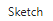
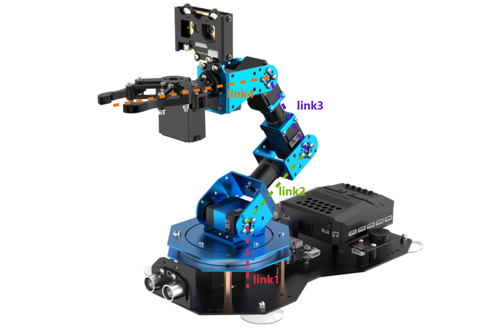
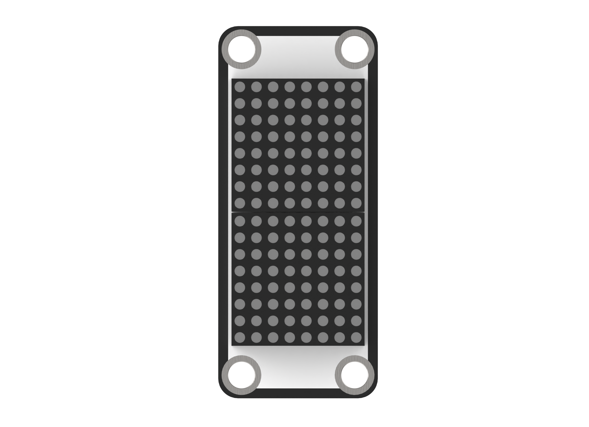
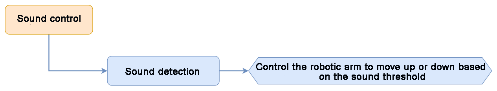
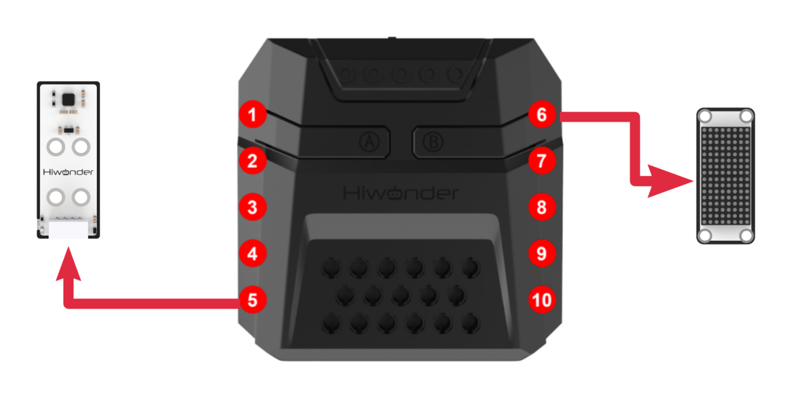
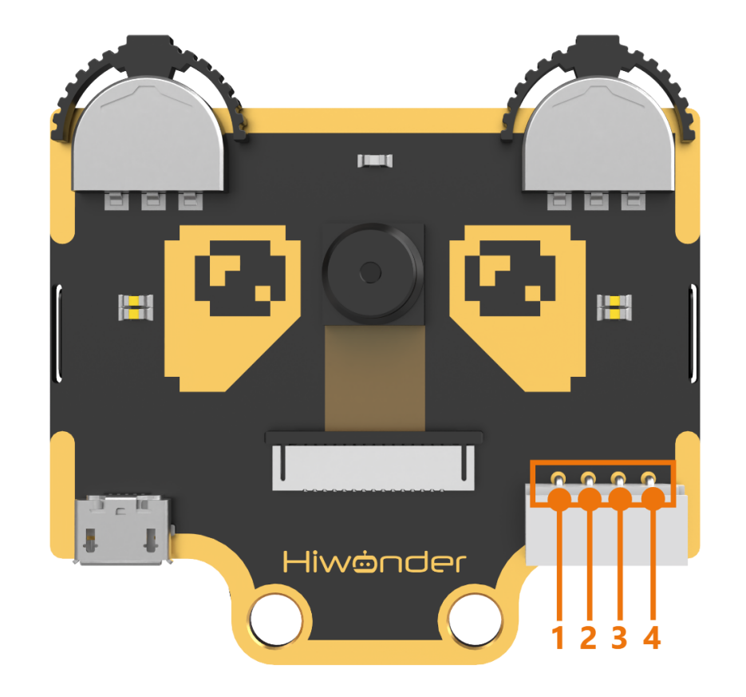
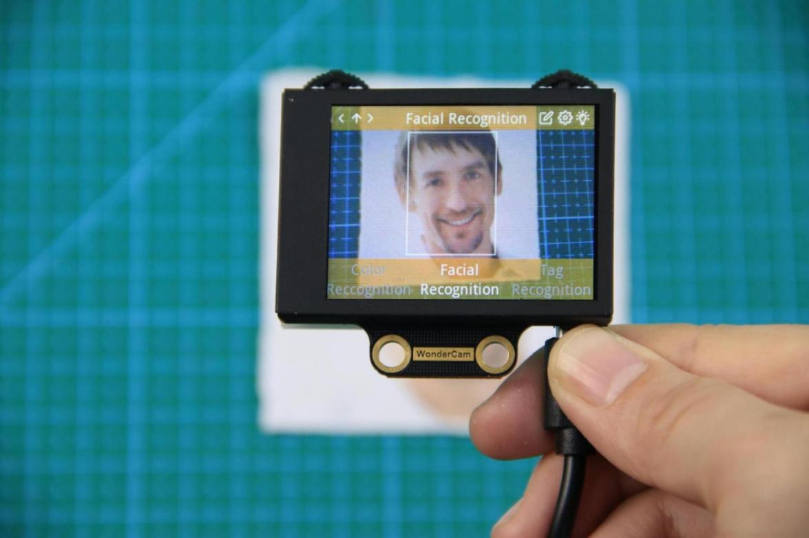
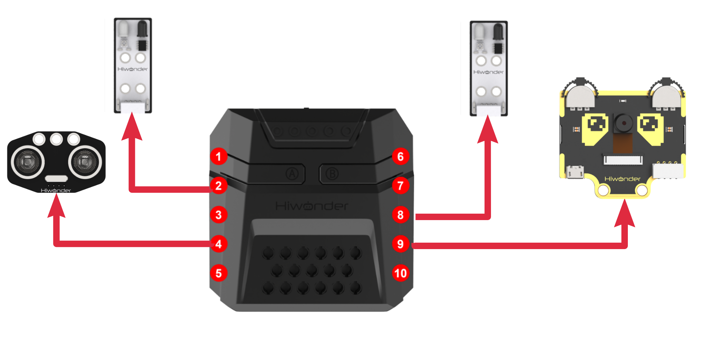
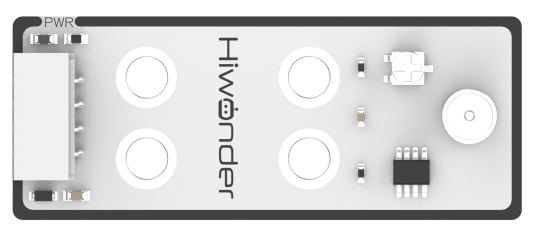

# 6. Arduino Programming Project

<p id="anchor_6_1"></p>

## 6.1 Programming Tool Installation and Overview

### 6.1.1 Arduino IDE Installation and Interface Overview

* **Arduino IDE Installation Guide**

The Arduino IDE is a powerful software designed specifically for Arduino microcontrollers. The installation process is the same across all versions. This section provides instructions using the Windows version (Arduino-2.2.1) as an example:

(1) Locate the Arduino IDE installation package in the same directory as this document and double-click to open it.

To download the latest version, visit the official Arduino website: https://www.arduino.cc/en/software.


(2) Click `I Agree` to proceed with the installation.


(3) Click `Next` to proceed with the installation.


(4) Click `Browse` to select the installation directory, then click `Install` to begin the installation process.


(5) Wait for the software to finish installing.


:::{Note}
If prompted to install chip drivers during the installation process, check the box labeled `Always trust software from Arduino LLC (A)` and then click `Install` to continue.
:::

(6) Once the installation is complete, click `Finish` to exit the installer.


* **Interface Overview**

The main interface of the Arduino IDE is shown in the image below, and it can be divided into five areas:


(1) `Menu Bar`: Responsible for managing settings related to the Arduino IDE.

| **Icon** | **Function** |
|----|----|
|  | Allows you to create or open project files and set preferences for the interface. |
|  | Provides text editing options for the code, such as commenting, indentation, and search |
|  | Options for configuring the entire project, including compiling, running, and adding libraries |
|  | Allows you to select the development board and port, and access board information |
|  | Provides help resources for users, including getting started guides and troubleshooting common issues |

(2) `Toolbar`: A collection of tools related to the project, including compilation, uploading programs, and serial monitoring.

| **Icon** | **Function** |
|----|----|
|  | Verifies whether the program is written correctly. If no errors are found, the project will be compiled. |
|  | Uploads the compiled program to the Arduino controller. |
|  | Some development boards allow real-time debugging through the Arduino IDE. |
|  | Allows you to select different development boards for your project. |
|  | Visualizes data sent to the Arduino serial port in graphical form. |
|  | Displays the data printed to the Arduino's serial port |

(3) `Code editor`: This is the central area where you write and edit your Arduino code (referred to as a Sketch).

(4) `Status bar`: Located at the bottom, the Status Bar shows important information like the current state of the IDE, the board and port selected, and progress during the upload process.

(5) `Console/Output Window`: The Console displays messages related to the process of compiling, uploading, and debugging your code. It provides feedback on the status of your code and any errors that may occur.

| **Icon** | **Function** |
|----|----|
|  | Displays the current project's files |
|  | Adds development board toolkits |
|  | Adds or removes library files from the project |
|  | Allows real-time debugging of the project |
|  | Searches for or replaces code or variables within the project |

### 6.1.2 Arduino IDE Usage Instructions

* **Arduino IDE Interface Settings**

(1) Change language:

① In the Arduino IDE, go to `File` → `Preferences`.

② In the pop-up window, find the `Language` option and choose your preferred language.

③ Click `OK` to apply the changes.

  

(2) Modify Preferences:

① You can also modify the project file path, editor text size, color theme, and other settings by going to `File` → `Preferences`.

② A window will pop up where you can make these adjustments.

  

* **Arduino Program Upload**

[Demo](../_static/source_code/06/Demo.zip)

(1) In this section, we will use an example program that prints the word `hiwonder`. Navigate to the [Demo](../_static/source_code/06/Demo.zip) folder in the same directory as this document, and double-click to open the [Demo.ino](../_static/source_code/06/Demo.zip) example program.


(2) Connect the CoreX controller to the PC.

(3) In the `Select Board` option, choose the corresponding ESP32 board. (For this example, we will use ESP32 Dev Module. The COM port may vary, but you can check the COM port number through your computer's Device Manager. In this case, we'll use COM6 as an example.)


(4) Click  to compile the program. This will check for any syntax errors or issues in the code.


(5) After a successful compilation, click  to upload the program to the Arduino board.


(6) Once the upload is complete, open the `Serial Monitor` by clicking . You should see the message `hiwonder` printed in the serial monitor.


* **Importing Library Files**

To run the program, you need to import the necessary xArm AI library files. You can follow the method below:

(1) In the `Arduino IDE`, go to `Sketch` → `Include Library` → `Add .ZIP Library`.


(2) In the pop-up window, locate the [xArm_AI.zip](../_static/source_code/06/xArm_AI.zip) file (the library file compression package can be found in the [6. Arduino Programming Projects-\>6.1 Programming Tool Installation and Overview_Demo](#anchor_6_1) folder) and click Open.


(3) Once you see the following prompt, it means the library file has been successfully installed.


## 6.2 Motion Control Course

### 6.2.1 Inverse Kinematics Introduction

* **Introduction**

Inverse kinematics is the process of determining the parameters of the joint actuators required to achieve a desired posture.

The inverse kinematics of the robotic arm is an important foundation for its trajectory planning and control. The speed and accuracy of the inverse kinematics solution directly impact the precision of the robotic arm's trajectory planning and control. Therefore, designing a fast and accurate inverse kinematics solving method for a six-degree-of-freedom robotic arm is extremely important.

* **Brief Analysis of Inverse Kinematics**

For the robot arm, the position and orientation of the gripper are given to obtain the rotation angle of each joint. The three-dimensional motion of the robotic arm is more complicated. In order to simplify the model, we remove the rotation joint of the station so that the kinematics analysis can be performed on a two-dimensional plane.

Inverse kinematics analysis generally requires a large number of matrix operations, and the process is complex and computationally expensive, so it is difficult to implement. In order to better meet our needs, we use geometric methods to analyze the robotic arm.


We simplify the model of the robotic arm, remove the base pan/tilt, and the actuator part to get the main body of the robotic arm. From the figure above, you can see the coordinates (x, y) of the end point P of the robotic arm, which ultimately consists of three parts (x1+x2+x3, y1+y2+y3).

Among them θ1, θ2,θ3 in the above figure are the angles of the servo that we need to solve, and α is the angle between the paw and the horizontal plane. From the figure, it is obvious that the top angle of the claw α=θ1+θ2+θ3, based on which we can formulate the following formula:


Among them, x and y are given by the user, and l1, l2, and l3 are the inherent properties of the mechanical structure of the robotic arm.

In order to facilitate the calculation, we will deal with the known part and consider the whole:


Substituting m and n into the existing equation, and then simplifying can get:


Through calculation:


We see that the above formula is the root-finding formula of a quadratic equation in one variable:


Based on this, we can find the angle of θ1, and similarly we can also find θ2. From this we can obtain the angles of the three steering gears, and then control the steering gears according to the angles to realize the control of the coordinate position.

### 6.2.2 Establish Robotic Arm Coordinate System

* **Establishing Coordinate System**

We typically control the robotic arm's movement through action groups. The prerequisite for this implementation is the use of a PC to edit the actions. However, after editing and downloading the actions to the robotic arm, it becomes less flexible if fine adjustments are needed, or if action editing is required without a PC. Therefore, the following introduces the xArm AI's coordinate system and how to control the robotic arm's movement using coordinates.

Since we're dealing with a coordinate system, the first thing to know is the origin of the coordinate system and what the coordinates represent. The origin of xArm AI's coordinate system is based on the bottom of the servo in its base platform, as shown in the diagram below. From the robot's first-person perspective, the positive direction of the X-axis is to the right of the robotic arm, the positive direction of the Y-axis is in front of the robotic arm, and the Z-axis is directed upwards.


After defining the X, Y, and Z axes, we can now define the distance for each unit on the coordinate axes, which allows us to calculate the position of a specific point on the robotic arm within this coordinate system. In this case, we define the unit distance for the coordinate axes as centimeters (cm).

* **Coordinate System Parameter**

After understanding the coordinate system of the robotic arm, let's now discuss some related parameters. First is the coordinate information. The X, Y, and Z coordinates actually refer to the position of the robotic arm's end effector. Here, the end effector refers to the position reached when the end gripper is fully closed.

We will use a coordinate example that will be used in subsequent lessons, as shown in the diagram below:


This is a coordinate instruction for setting the robotic arm's initial position. As you can see, the coordinates (x, y, z) are filled in as (0, 17, 20.5), which means the position of the robotic arm's end effector is 17 cm directly in front of the origin and 20.5 cm high. The pitch angle is set to 0°, meaning the gripper's angle is level with the horizontal plane.


Now that we know the origin, the three axes, and the description of the coordinates of the robotic arm, it is still not enough to determine or control the arm's position. We need to find another standard to determine the specific position and configuration of the robotic arm. The standard we use here is the arm's `link length`.

In most cases, the link length refers to the distance between two servos. However, since the servo for the gripper is somewhat special, the final link length (Link 4) refers to the distance from the servo to the end effector of the robotic arm.



If the link lengths are not defined with the same number of links, then the position and orientation of the robotic arm cannot be determined solely based on the end effector's coordinates and pitch angle. Using the following two diagrams as examples, the end effector's coordinates and pitch angle are the same, but the arm's shape and position can result in different outcomes: (where each colored line corresponds to a different link).

<p style="text-align:center;" class="common_img">


</p>

As seen from the above diagram, to determine the exact position and configuration of the robotic arm, it is necessary to define the link lengths. This is also related to controlling the robotic arm's movement, because once the link lengths are defined, along with the position parameters of the end effector, the solution for the position will be unique.

Having discussed the above parameters, let's now think in reverse: Is it true that once we have the three-axis coordinates of the end effector, the pitch angle of the gripper, and the link lengths, we can obtain a unique solution for the robotic arm's position? The answer is yes.

* **Coordinate Control**

The above content has explained the link lengths and the coordinate information of the robotic arm. Next, we can combine these two to control the robotic arm's movement. Here, we will illustrate this through a few actions, as shown in the diagram below:


First, we need to close the gripper, which is controlled by Servo 1. Then, define the link lengths of the robotic arm.
The first position represents the robotic arm's initial position. After 1 second, it will move to the position we set for the end effector and the pitch angle of the gripper. Since the pitch angle is 0, the gripper will be in a level position.
After another second, the arm will move to the position with X=0, Y=11, Z=3.7, and a pitch angle of -68°.
At this point, our action is considered edited and completed. Of course, we can also try modifying the values to other numbers, but due to the mechanical arm's built-in limit switches, some positions may be unreachable.
Therefore, when editing the robotic arm's movements using coordinates, we also need to consider whether the link lengths and angular positions are reasonable.

### 6.2.3 Introduction to Motion Control Library Files

* **Kinematic Function Overview**

(1) Coordinate Movement within Pitch Angle Range

This function has six parameters:

**Parameter 1**: X-axis coordinate (in centimeters, cm).

**Parameter 2**: Y-axis coordinate (in centimeters, cm).

**Parameter 3**: Z-axis coordinate (in centimeters, cm).

**Parameter 4**: Minimum pitch angle (in degrees, °), range: -120° to 240°.

**Parameter 5**: Maximum pitch angle (in degrees, °), range: -120° to 240°.

**Parameter 6**: Arm movement duration (in milliseconds, ms).

This function enables the robotic arm to move to the specified coordinates within the defined pitch angle range. The kinematic algorithm will traverse each value in the set pitch angle range, calculating whether a solution exists. If a valid solution is found, the arm will move to the target position.


(2) Coordinate Movement at a Specific Pitch Angle

This function has five parameters:

**Parameter 1**: X-axis coordinate (in centimeters, cm).

**Parameter 2**: Y-axis coordinate (in centimeters, cm).

**Parameter 3**: Z-axis coordinate (in centimeters, cm).

**Parameter 4**: Specific pitch angle (in degrees, °), range: -120° to 240°.

**Parameter 5**: Arm movement duration (in milliseconds, ms).

This function allows the robotic arm to move to the specified coordinates at a given pitch angle. The kinematic algorithm will determine whether a solution exists, and if so, the arm will move to the corresponding position.


### 6.2.4 Motion Control Application: Robotic Arm Vertical Motion

* **Project Introduction**

This project will achieve vertical upward and downward movement for the xArm AI robot.

* **Project Logic**


* **Download Program**

[Robotic Arm Vertical Movement Program](../_static/source_code/06/03/Robotic%20Arm%20Vertical%20Movement%20Program.zip)

(1) Open the program file **VerticalMove.ino** located  **Robotic Arm Vertical Movement Program-\>VerticalMove** under the same directory as this document.


(2) After opening the file, select the appropriate development board model, as shown in the image below:


(3) Click **"Compile"** first, then click **"Upload."** After the upload is complete, if the following output appears in the software's lower output window, the program has been successfully downloaded:

```
Done uploading.
```


* **Project Outcome**

The robotic arm will continuously alternate between vertical upward and downward movements.


* **Program Analysis**

[Robotic Arm Vertical Movement Program](../_static/source_code/06/03/Robotic%20Arm%20Vertical%20Movement%20Program.zip)

(1) Library Files Import

Import the `xArmController.h` and `Hiwonder.h` libraries, which provide functions for sensor control, inverse kinematics, and servo control, among others.

{lineno-start=1}

```cpp
#include "xArmController.h"
#include "Hiwonder.h"
```

(2) Hardware Object Creation

Create a hardware serial object and an xArm AI control object. Pass the serial object into the control object to enable communication with the controller.

{lineno-start=3}

```cpp
HardwareSerial xSerial(1); 
xArmController xArm(xSerial);
```

(3) System Initialization

In the initialization function, call `xArm.begin()` to initialize the robotic arm. Then, move servos 1 and 2 to positions 100 and 500, respectively. Finally, move the arm to the coordinates (x=0, y=17, z=20.5) and wait for 1.5 seconds.

{lineno-start=6}

```cpp
void setup() {
  xArm.begin();
  xArm.moveServo(1,100,1000);  //Control servo 1 to move to position 100
  xArm.moveServo(2,500,1000);  //Control servo 2 to move to position 500
  delay(1000);
  xArm.coordinateMove(0,17,20.5,0,1000);  //Control the robotic arm to move to x:0 y:17 z:20.5 with a pitch angle of 0 in 1.5 seconds
  delay(2000);
}
```

(4) Main Loop Control

In the main function, continuously control the robotic arm to move within 1.5 seconds to the coordinates (x=0, y=17, z=16.4) with a pitch angle of 0°. After waiting for another 1.5 seconds, move the arm to the coordinates (x=0, y=17, z=25.8). This cycle will repeat, allowing the robotic arm to perform vertical movements.

{lineno-start=15}

```cpp
void loop() {
  xArm.coordinateMove(0,17,16.4,0,1500);  
  delay(1500);
  xArm.coordinateMove(0,17,25.8,0,1500);  
  delay(1500);
}
```

### 6.2.5 Motion Control Application: Robotic Arm Fixed-Point Motion

* **Project Introduction**

In this section, the robotic arm performs object grasping by calling kinematics functions. It sequentially places the object in four positions: 90 degrees to the left, 45 degrees to the left, 45 degrees to the right, and 90 degrees to the right.

* **Project Logic**


* **Download Program**

[Robotic Arm Fixed-Point Motion Program](../_static/source_code/06/03/Robotic%20Arm%20Fixed-Point%20Motion%20Program.zip)

(1) Open the program file **PointMove.ino** located in the folder **Robotic Arm Fixed-Point Motion Program/PointMove** under the same directory as this document.


(2) After opening the file, select the appropriate development board model, as shown in the image below:


(3) Click "Compile" first, then click "Upload." After the upload is complete, if the following output appears in the software's lower output window, the program has been successfully downloaded:

```
Done uploading.
```


* **Project Outcome**

The robotic arm will repeatedly pick up blocks and place them at four positions: 90° and 45° to the left, and 45° and 90° to the right.


* **Program Analysis**

(1) Library Files Import

Import the `xArmController.h` and `Hiwonder.h` libraries, which provide functions for sensor control, inverse kinematics, and servo control, among others.

{lineno-start=1}

```cpp
#include "xArmController.h"
#include "Hiwonder.h"
```

(2) Hardware Object Creation

Create a hardware serial object and an xArm AI control object. Pass the serial object into the control object to enable communication with the controller.

{lineno-start=4}

```cpp
HardwareSerial xSerial(1); 
xArmController xArm(xSerial);
```

(3) System Initialization

In the initialization function, call `xArm.begin()` to initialize the robotic arm. Then, move servos 1 and 2 to positions 100 and 500, respectively. Finally, move the arm to the coordinates (x=0, y=17, z=20.5) and wait for 1.5 seconds.

{lineno-start=7}

```cpp
void setup() {
  xArm.begin();
  delay(1000);
  xArm.moveServo(1,100,500);  //Move servo 1 to position 100
  delay(500);
  xArm.moveServo(2,500,500);  //Move servo 2 to position 500
  delay(500);
  xArm.coordinateMove(0,17,20.5,0,1000);   
  delay(2000);
}
```

(4) Main Function Control

In the main function, four sub-functions are executed in a loop, each corresponding to the placement of an object at one of the four target angles.

{lineno-start=18}

```cpp
void loop() {
  left_90();  //Place the object to the left after grabbing, rotated 90°
  delay(1000);
  left_45();  //Place the object to the left after grabbing, rotated 45°
  delay(1000);
  right_45();
  delay(1000);
  right_90();
  delay(1000);
}
```

(5) Position Control Example

Taking the placement at 90° to the left as an example:
The `xArm.coordinateMove()` function is called to move the robotic arm to the coordinates (x = 0, y = 17, z = 1.8) with a pitch angle of -69°, positioning it for object pickup. Then, the `xArm.moveServo()` function is used to control servo 1 to grip the object.

After gripping, the arm returns to its initial position at (x = 0, y = 17, z = 20.5). It waits for 0.6 seconds before moving to the target position at 90° to the left. According to the coordinate system of the robotic arm, a negative x-value indicates leftward movement, and with y = 0, the arm will rotate precisely to the 90° left position.

The robotic arm then moves to (x = -19.5, y = 0, z = 2.8) to place the object, and finally returns to its initial posture.

{lineno-start=29}

```cpp
void left_90(){  
  xArm.coordinateMove(0,17,1.2,-71,800);
  delay(1500);
  xArm.moveServo(1,500,500);
  delay(1000);
  xArm.coordinateMove(0,17,20.5,0,800);
  delay(1500);
  xArm.coordinateMove(-17,0,20.5,0,800);
  delay(1500);
  xArm.coordinateMove(-19.5,0,2.8,-60,800);
  delay(1500);
  xArm.moveServo(1,100,500);
  delay(1000);
  xArm.coordinateMove(-17,0,20.5,0,800);
  delay(1500);
  xArm.coordinateMove(0,17,20.5,0,800);
  delay(1500);
}
```

## 6.3 Basic Function Course

### 6.3.1 Dot Matrix Display

* **Project Introduction**

The LED dot matrix module is used to display the set text.

* **Project Logic**


* **Module Instruction**

The LED dot matrix display module features high display brightness, no flickering during display, easy wiring, and can display numbers, text, patterns, and other content.


The module consists of two red 8x8 LED lights and is controlled by the TM640B driver chip, enabling control of the dot matrix display.
**Module Wiring: Connect the dot matrix module to the port No.6 on the CoreX controller.**


* **Download Program**

[Dot Matrix Display Program](../_static/source_code/06/03/Dot%20Matrix%20Display%20Program.zip)

(1) Open the program file **matrix_display.ino** located in the folder **"Dot Matrix Display Program-\>matrix_display"** under the same directory as this document.


(2) After opening the file, select the appropriate development board model, as shown in the image below:


(3) Click "**Compile**" first, then click "**Upload**". After the upload is complete, if the following output appears in the software's lower output window, the program has been successfully downloaded:

```
Done uploading.
```


* **Project Outcome**

The LED matrix will display "**Hi, I AM xArm**".


* **Program Analysis**

[Dot Matrix Display Program](../_static/source_code/06/03/Dot%20Matrix%20Display%20Program.zip)

(1) Library Files Import

Import the `xArmController.h` and `Hiwonder.h` library files, which include functions for sensors, inverse kinematics, servo control, and more.

{lineno-start=1}

```cpp
#include "xArmController.h"
#include "Hiwonder.h"
```

(2) Object Creation and Initialization

Create a hardware serial object, followed by the creation of the `xArm AI control object`, passing the serial object to facilitate communication with the controller. Then, create the matrix module object `WMMatrixLed tm(Port_6_Pin)`, initializing it to interface 6. Additionally, create an array `pic` to store image data, which will be displayed as the `xArm` string on the matrix module.

{lineno-start=4}

```cpp
HardwareSerial xSerial(1); 
xArmController xArm(xSerial); //Create xArm controller object

WMMatrixLed tm(Port_6_Pin);  //Initialize dot matrix module on port 6
uint8_t pic[16] = {0xa,0x4,0xa,0x0,0xe,0x14,0xe,0x0,0x1e,0x8,0x10,0xe,0x10,0xe,0x10,0xe};
```

(3) System Setup

In the initialization function, set the serial port baud rate to 115200. Use the `tm.setBrightness()` function to set the brightness of the matrix module to 8. Initialize the robotic arm using `xArm.begin()`, and then execute the action group 0 once via `xArm.runActionGroup()` to set the arm's initial posture. Finally, add a 2-second delay to allow the action group to complete.

{lineno-start=10}

```cpp
void setup() {
  Serial.begin(115200);
  tm.setBrightness(8);
  xArm.begin();  //Initialize xArm
  xArm.runActionGroup(0,1);  //Run initial pose action group
  delay(2000);
}
```

(3) Main Loop Display

In the main function, call `tm.clearScreen()` to clear the matrix module. After a 2-second delay, use the `tm.drawStr()` function to display the string, with the three parameters being the x-axis coordinate, y-axis coordinate, and the string to display. After displaying the string, call `tm.drawBitmap()` to show the image data, with the four parameters being the image's x-axis coordinate, y-axis coordinate, data length, and the image data array.

{lineno-start=18}

```cpp
void loop() {
  tm.clearScreen();
  delay(2000);
  tm.drawStr(3,8,"Hi");
  delay(1000);
  tm.drawStr(6,8,"I");
  delay(1000);
  tm.drawStr(2,8,"AM");
  delay(1000);
  tm.drawBitmap(0,0,16,pic);
  delay(3000);
}
```

### 6.3.2 RGB Light Flashing

* **Project Introduction**

The RGB light on the CoreX main controller will light up and fade out in sequence, creating a flowing effect like water.

* **Project Logic**


* **Module Instruction**


Based on the principle of red, green, and blue colors, the RGB lights can be mixed to create various colors of light. The CoreX controller has 6 built-in RGB LEDs.

* **Download Program**

[RGB Light Flashing Program](../_static/source_code/06/03/RGB%20Light%20Flashing%20Program.zip)

(1) Open the program file FlowingLight.ino located in the folder **"RGB Light Flashing Program-\>FlowingLight"** under the same directory as this document.


(2) After opening the file, select the appropriate development board model, as shown in the image below:


(3) Click **"Compile"** first, then click **"Upload"**. After the upload is complete, if the following output appears in the software's lower output window, the program has been successfully downloaded:

```
Done uploading.
```


* **Project Outcome**

The RGB light on the CoreX main controller will light up and fade out in sequence with red, green, and blue colors.


* **Program Analysis**

(1) Library Files Import

Import the `xArmController.h` and `Hiwonder.h` library files, which include functions for sensor management, inverse kinematics, servo control, and more.

{lineno-start=1}

```cpp
#include "xArmController.h"
#include "Hiwonder.h"
```

(2) Object Creation

Create a hardware serial object, followed by the creation of the `xArm AI control object`, passing the serial object for communication with the controller. Then, create an RGB light object to control the onboard RGB lights.

{lineno-start=4}

```cpp
HardwareSerial xSerial(1); 
xArmController xArm(xSerial); //Create xArm controller object

RGBLight light;
```

(3) System Initialization

In the initialization function, use `xArm.begin()` to initialize the robotic arm and `light.RGB_init()` to initialize the RGB lights. Call `xArm.coordinateMove()` to move the robotic arm to its initial posture, followed by a 1-second delay to allow the action group to complete.

{lineno-start=9}

```cpp
void setup() {
  xArm.begin();  //Initialize xArm
  light.RGB_init();
  xArm.coordinateMove(0,17,20.5,0,1000);  //Set initial arm posture
  delay(1000);
}
```

(4) RGB Light Control

In the main function, use the `light.colorFill()` function to light up the corresponding RGB lights. The function's four parameters are the RGB light index, R value, G value, and B value. If the RGB light index is 0, all RGB lights will be illuminated. The program cycles through lighting up RGB lights 1 to 6 in different colors, waiting 100ms before turning off each light.

{lineno-start=16}

```cpp
void loop() {
  light.colorFill(1,255,0,0);  //Light up RGB light 1 in red
  delay(100);
  light.colorClear();          //Clear RGB light display
  light.colorFill(2,0,255,0);  //Light up RGB light 2 in green
  delay(100);
  light.colorClear();
  light.colorFill(3,0,0,255);  //Light up RGB light 3 in blue
  delay(100);
  light.colorClear();
  light.colorFill(4,255,0,0);  //Light up RGB light 4 in red
  delay(100);
  light.colorClear();
  light.colorFill(5,0,255,0);  //Light up RGB light 5 in green
  delay(100);
  light.colorClear();
  light.colorFill(6,0,0,255);  //点Light up RGB light 6 in blue
  delay(100);
  light.colorClear();
  delay(100);
}
```

### 6.3.3 Ultrasonic Distance Measurement

* **Project Introduction**

The matrix module displays the distance value detected by the ultrasonic sensor, while the RGB lights change color to visually indicate the proximity, with color variations reflecting the distance.

* **Project Logic**


* **Module Instruction**

* **Ultrasonic Module**

The module uses an I2C communication interface, allowing the distance measured by the ultrasonic sensor to be read via I2C communication.

Additionally, the ultrasonic probe position integrates two RGB LEDs, which not only allow adjustment of the light brightness but also enable the creation of a variety of colors through changes in the red (R), green (G), and blue (B) color channels, as well as their combinations.


During distance measurement, the module will automatically send 8 pulses of 40kHz square waves and then detect if a signal is returned. If a signal is received, a high-level output will be generated. The duration of the high level corresponds to the time it takes for the ultrasonic wave to travel from the transmitter to the receiver.
Module wiring: Connect the ultrasonic module to Port No.4 on the CoreX controller.

* **Dot Matrix Module**

The LED dot matrix module uses an LED display screen that features high brightness, flicker-free display, and easy wiring. It can display numbers, text, patterns, and other content.



The module consists of two red 8x8 LED lights and is controlled by the TM640B driver chip, enabling control of the dot matrix display.
Module Wiring: Connect the dot matrix module to the port No.6 of the CoreX controller.


* **Download Program**

[Ultrasonic Distance Measurement Program](../_static/source_code/06/03/Ultrasonic%20Distance%20Measurement%20Program.zip)

(1) Open the program file **"ultrasonic_ranging.ino"** located in the folder **"Ultrasonic Distance Measurement Program-\>ultrasonic_ranging"** under the same directory as this document.


(2) After opening the file, select the appropriate development board model, as shown in the image below:


(3) Click "**Compile**" first, then click "**Upload**". After the upload is complete, if the following output appears in the software's lower output window, the program has been successfully downloaded:

```
Done uploading.
```


* **Project Outcome**

The ultrasonic distance detected is displayed on the matrix module.
When the distance is greater than 10cm, the RGB light associated with the ultrasonic sensor will turn green. If the distance is less than or equal to 10cm, the light will turn red, and a sound will be played.


* **Program Analysis**

[Ultrasonic Distance Measurement Program](../_static/source_code/06/03/Ultrasonic%20Distance%20Measurement%20Program.zip)

(1) Library Files Import

Import the `xArmController.h` and `Hiwonder.h` library files, which include functions for sensor management, inverse kinematics, and servo control, among others.

{lineno-start=1}

```cpp
#include "xArmController.h"
#include "Hiwonder.h"
```

(2) Object Creation and Variables

Create a hardware serial object, followed by the creation of the `xArm AI` control object, passing the serial object for communication with the controller. Next, create the matrix module object using `WMMatrixLed tm(Port_6_Pin)`, initializing it to interface 6. Then, create objects for the ultrasonic sensor, RGB light, and buzzer, and finally, define a variable to store the distance.

{lineno-start=4}

```cpp
HardwareSerial xSerial(1); 
xArmController xArm(xSerial); //Create xArm controller object

WMMatrixLed tm(Port_6_Pin);  //Initialize dot matrix module on Port 6
UltrasoundSonar ult;  //Create ultrasonic sensor object
RGBLight light;  //Create RGB light object
Buzzer bz;  //Create buzzer object

uint16_t distance = 0;  //Variable to store distance measured by the ultrasonic module

```

(3) System Initialization

In the initialization function, set the serial baud rate to 115200. Initialize the robotic arm using `xArm.begin()`, then initialize the ultrasonic module, matrix module, and buzzer. Finally, run the 0th action group using `xArm.runActionGroup()`, which sets the initial posture of the robotic arm.

{lineno-start=14}

```cpp
void setup() {
  Serial.begin(115200);
  xArm.begin();  //Initialize xArm
  ult.Ultrasound_init();  //Initialize ultrasonic sensor module
  tm.setBrightness(4);  //Set dot matrix brightness to 4
  bz.Buzzer_init();  //Initialize buzzer
  xArm.runActionGroup(0,1);  //Run initial pose
  delay(1000);
}
```

(4) Distance Measurement

In the main function, use `ult.getDistance()` to retrieve the ultrasonic distance and store it in the `distance` variable. Use the `tm.showNum()` function to display the distance on the matrix module. The two parameters for this function are the data to be displayed (of type float) and the number of decimal places to show. In this case, the number of decimal places is set to 0, meaning only the integer part will be displayed.

{lineno-start=24}

```cpp
void loop() {
  distance = round(ult.getDistance());  //Get distance from ultrasonic sensor
  Serial.println(distance);
  tm.showNum((float)distance,0);  //Display distance on dot matrix
```

(5) RGB Light Control Based on Distance

Based on the distance displayed by the ultrasonic sensor, if the distance is greater than 10cm, control the RGB light to show green. If the distance is less than or equal to 10cm, change the light to red and activate the buzzer.

{lineno-start=28}

```cpp
  if(distance > 10){
    light.colorFill(0,0,255,0);  //Set RGB light to green
    ult.setRGB(0,0,255,0);
  }else{
    light.colorFill(0,255,0,0);  //Set RGB light to red
    ult.setRGB(0,255,0,0);
    bz.playTone(1976,500,true);  //Beep the buzzer once
  }
  delay(100);
}
```

### 6.3.4 Button Control

* **Project Introduction**

In this lesson, we will use a button to control the robotic arm and trigger the execution of an action group.

* **Project Logic**


* **Module Instruction**

Onboard buttons are common input components found on embedded systems or development boards, used for user interaction and control. They are typically employed to power on, reset, or trigger specific functions.

* **Download Program**

[Button Control Program](../_static/source_code/06/03/Button%20Control%20Program.zip)

(1) Open the program file **"KeyControl.ino"** located in the folder **"Button Control Program-\>KeyControl"** under the same directory as this document.


(2) After opening the file, select the appropriate development board model, as shown in the image below:


(3) Click "**Compile**" first, then click "**Upload**". After the upload is complete, if the following output appears in the software's lower output window, the program has been successfully downloaded:

```
Done uploading.
```


* **Project Outcome**

Pressing Button A will trigger the robotic arm to execute Action Group 5 once (grasp and move to the right at a 90° angle).
Pressing Button B will trigger the robotic arm to execute Action Group 2 once (grasp and move to the left at a 90° angle).


* **Program Analysis**

[Button Control Program](../_static/source_code/06/03/Button%20Control%20Program.zip)

(1) Library Files Import

Import the `xArmController.h` and `Hiwonder.h` libraries, which provide functionality for sensors, inverse kinematics, servo control, and more.

{lineno-start=1}

```cpp
#include "xArmController.h"
#include "Hiwonder.h"
```

(2) Object Creation

Create a hardware serial object, followed by an xArm AI controller object that uses the serial connection to communicate with the controller. Then, create two button objects corresponding to the onboard Button A and Button B.

{lineno-start=4}

```cpp
HardwareSerial xSerial(1); 
xArmController xArm(xSerial);

Button btn_A;   //Create button objects for A and B
Button btn_B;
```

(3) System Initialization

In the initialization function, initialize the xArm controller and set the serial baud rate to 115200. Initialize both button objects and bind them to their respective pins.

{lineno-start=10}

```cpp
void setup() {
  xArm.begin();
  Serial.begin(115200);
  btn_A.Button_init(Key_A_Pin);  //Initialize buttons A and B
  btn_B.Button_init(Key_B_Pin);
  delay(1000);
}
```

(4) Button Event Handling

In the main function, assign short-press callback events to Buttons A and B. When Button A is pressed, the `on_button_A_clicked()` function is triggered. Similarly, pressing Button B triggers the `on_button_B_clicked()` function.

{lineno-start=18}

```cpp
void loop() {
  btn_A.Clicked(on_button_A_clicked);  //Bind callback functions to buttons A and B
  btn_B.Clicked(on_button_B_clicked);
  while(1);
}
```

(5) Button A Callback Function

In the `on_button_A_clicked()` function, the robotic arm is instructed to execute Action Group 5 once (grasp and move to the right).

{lineno-start=24}

```cpp
void on_button_A_clicked(){
  xArm.runActionGroup(5,1);
}
```

(6) Button B Callback Function

In the `on_button_B_clicked()` function, the robotic arm is instructed to execute Action Group 2 once (grasp and move to the left).

{lineno-start=28}

```cpp
void on_button_B_clicked(){
  xArm.runActionGroup(2,1);
}
```

### 6.3.5 Sound Control

* **Project Introduction**

Control the robotic arm to move up or down based on the detected sound level.

* **Project Logic**



* **Module Instruction**


The onboard sound sensor is a device used to detect the intensity of external sounds. It can read the pin values through the ADC pins to measure the sound level. The main working principle involves the vibration of the microphone diaphragm due to sound, which causes the electrostatic film inside the microphone to vibrate. This results in a change in capacitance, generating a small voltage corresponding to the change, which is then converted into an electrical signal output.

* **Download Program**

[Sound Control Program](../_static/source_code/06/03/Sound%20Control%20Program.zip)

(1) Open the program file "**SoundControl.ino**" located in the folder **"Sound Control Program-\>SoundControl"** under the same directory as this document.


(2) After opening the file, select the appropriate development board model, as shown in the image below:


(3) Click **"Compile"** first, then click **"Upload"**. After the upload is complete, if the following output appears in the software's lower output window, the program has been successfully downloaded:

```
Done uploading.
```


* **Project Outcome**

When the detected sound intensity exceeds 50, the robotic arm will first move upward. Once it reaches its upper limit, it will then move downward.


* **Program Analysis**

[Sound Control Program](../_static/source_code/06/03/Sound%20Control%20Program.zip)

(1) Library Files Import

Import the libraries `xArmController.h` and `Hiwonder.h`, which provide functionality for sensors, inverse kinematics, and servo control.

{lineno-start=1}

```cpp
#include "xArmController.h"
#include "Hiwonder.h"
```

(2) Object Creation and Variables

Create a hardware serial object, then create an xArm AI control object, passing the serial object for communication with the controller. Also, create a sound sensor object, along with two variables: one to store the Z-axis height, and another to track the movement state of the robotic arm.

{lineno-start=4}

```cpp
HardwareSerial xSerial(1); 
xArmController xArm(xSerial); //Create the xArm control object

SoundSensor sound;  //Create a sound sensor object

float z = 20.5;
uint8_t state = 0;
```

(3) System Initialization

In the initialization function, set the serial baud rate to 115200. Then initialize the xArm AI controller and the sound sensor. Use the `xArm.coordinateMove()` function to move the robotic arm to the coordinate position (x=0, y=17, z=20.5).

{lineno-start=12}

```cpp
void setup() {
  Serial.begin(115200);
  xArm.begin();  //Initialize xArm
  sound.begin();  //Initialize the sound sensor
  xArm.coordinateMove(0,17,20.5,0,1000);  //Set initial pose of the robotic arm
  delay(1000);
}
```

(4) Sound-Based Movement Control

In the main function, call `sound.readSound()` to get the sound data and check the value. If the detected sound intensity is greater than 50, determine the movement state of the robotic arm. If the state variable is 0, indicating upward movement, increment the z variable. If z exceeds 25.8, set state to 1, switching to downward movement. If state is 1, decrement z. If z drops below 16.4, set state back to 0.

{lineno-start=20}

```cpp
void loop() {
  if(sound.readSound() > 50){  //Read sound level
    if(state == 0){
      z += 1;
      if(z > 25.8){
        z = 25.8;
        state = 1;
      }
    }else{
      z -= 1;
      if(z < 16.4){
        z = 16.4;
        state = 0;
      }
    }
```

(5) Coordinate Movement Execution

Finally, use the `xArm.coordinateMove()` function to control the robotic arm's movement along the Z-axis.

{lineno-start=35}

```cpp
    xArm.coordinateMove(0,17,z,0,500);  //Control the robotic arm's motion
    delay(500);
  }
}
```

### 6.3.6 Color Recognition

* **Project Introduction**

In this section, the color sensor is used to identify red, green, blue, and yellow objects, and the RGB lights and LED matrix are used to display the results.

* **Project Logic**


* **Module Instruction**

(1) Color sensor


It is a sensor capable of recognizing the color of the measured object, surrounding ambient light intensity, object proximity detection, and non-contact gesture detection, among other functions. The sensor integrates RGB color detection, allowing it to identify various object colors. It also integrates ambient light detection, enabling light intensity measurement under different lighting conditions. With a built-in infrared LED, it can be used for object proximity detection.

Module Wiring: Connect the matrix module to the Port No.5 of the CoreX controller.

(2) Dot Matrix Module

The LED dot matrix module uses an LED display screen that features high brightness, flicker-free display, and easy wiring. It can display numbers, text, patterns, and other content.


The module consists of two red 8x8 LED lights and is controlled by the TM640B driver chip, enabling control of the dot matrix display.
Module Wiring: Connect the dot matrix module to the port No.6 of the CoreX controller.



* **Download Program**

[Color Recognition Program](../_static/source_code/06/03/Color%20Recognition%20Program.zip) 

(1) Open the program file **"color_recognition.ino"** located in the folder **"Color Recognition Program/color_recognition"** under the same directory as this document.


(2) After opening the file, select the appropriate development board model, as shown in the image below:


(3) Click **"Compile"** first, then click **"Upload"**. After the upload is complete, if the following output appears in the software's lower output window, the program has been successfully downloaded:

```
Done uploading.
```


* **Project Outcome**

When red is detected: The RGB light turns red, and the LED matrix displays 'R'.

When green is detected: The RGB light turns green, and the LED matrix displays 'G'.

When blue is detected: The RGB light turns blue, and the LED matrix displays 'B'.

When yellow is detected: The RGB light turns yellow, and the LED matrix displays 'Y'.


* **Program Analysis**

[Color Recognition Program](../_static/source_code/06/03/Color%20Recognition%20Program.zip) 

(1) Library Files Import

Import the `xArmController.h` and `Hiwonder.h` library files, which include functions for sensors, inverse kinematics, and servo control.

{lineno-start=1}

```cpp
#include "xArmController.h"
#include "Hiwonder.h"
```

(2) Object Creation

Create a hardware serial object, then create the `xArm AI control object` and pass the serial object for communication with the controller. Additionally, create an RGB light object to control the RGB light colors and a color sensor object to detect the color of objects.

{lineno-start=4}

```cpp
HardwareSerial xSerial(1); 
xArmController xArm(xSerial);
RGBLight light;
ColorSensor cs;
```

(3) System Initialization

In the initialization function, initialize the `xArm AI control object` and set the serial port baud rate to 115200. Then, initialize the RGB light and color sensor objects. Use the `xArm.runActionGroup()` function to execute action group 0 (the initial pose of the robotic arm).

{lineno-start=15}

```cpp
void setup() {
  xArm.begin();
  Serial.begin(115200);
  light.RGB_init();
  cs.begin();
  delay(1000);
  xArm.runActionGroup(0,1); //Execute action group 0 once
  delay(2000);
  Serial.println("begin");
}
```

(4) Color Detection and Display

In the main function, first use the `light.colorClear()` function to turn off all RGB lights. Then, call `cs.readColor()` to check if any of the four colors—red, green, blue, or yellow—are detected. If a corresponding color is detected, use the `light.colorFill()` function to light up the RGB light in the corresponding color.

{lineno-start=20}

```cpp
void loop() {
  light.colorClear();  //Turn off all RGB lights
  if(cs.readColor() == RED){  //Red color detected
    light.colorFill(0,255,0,0);
    delay(2000);
  }else if(cs.readColor() == GREEN){  //Green color detected
    light.colorFill(0,0,255,0);
    delay(2000);
  }else if(cs.readColor() == BLUE){  //Blue color detected
    light.colorFill(0,0,0,255);
    delay(2000);
  }else if(cs.readColor() == YELLOW){  //Yellow color detected
    light.colorFill(0,255,255,0);
    delay(2000);
  }
}
```

### 6.3.7 Color Sorting

* **Project Introduction**

In this section, the color sensor is used to detect red, green, blue, and yellow objects, and the robotic arm will then pick them up and move them to their corresponding positions.

* **Project Logic**


* **Module Instruction**

(1) Color sensor


It is a sensor capable of recognizing the color of the measured object, surrounding ambient light intensity, object proximity detection, and non-contact gesture detection, among other functions. The sensor integrates RGB color detection, allowing it to identify various object colors. It also integrates ambient light detection, enabling light intensity measurement under different lighting conditions. With a built-in infrared LED, it can be used for object proximity detection.

Module Wiring: Connect the matrix module to the Port No.5 of the CoreX controller.

(2) Dot Matrix Module

The LED dot matrix module uses an LED display screen that features high brightness, flicker-free display, and easy wiring. It can display numbers, text, patterns, and other content.


The module consists of two red 8x8 LED lights and is controlled by the TM640B driver chip, enabling control of the dot matrix display.
Module Wiring: Connect the dot matrix module to the port No.6 of the CoreX controller.


* **Download Program**

[Color Sorting Program](../_static/source_code/06/03/Color%20Sorting%20Program.zip)

(1) Open the program file "**color_sorting.ino**" located in the folder **"Color Sorting Program-\>color_sorting"** under the same directory as this document.


(2) After opening the file, select the appropriate development board model, as shown in the image below:


(3) Click **"Compile"** first, then click **"Upload"**. After the upload is complete, if the following output appears in the software's lower output window, the program has been successfully downloaded:

```
Done uploading.
```


* **Project Outcome**

In this section, the color sensor is used to identify red, green, blue, and yellow blocks, which are then picked up and placed at their corresponding positions.


* **Program Analysis**

[Color Sorting Program](../_static/source_code/06/03/Color%20Sorting%20Program.zip)

(1) Library Files Import

The program begins by importing the `xArmController.h` and `Hiwonder.h` libraries, which provide functionalities for sensors, inverse kinematics, and servo control.

{lineno-start=1}

```cpp
#include "xArmController.h"
#include "Hiwonder.h"
```

(2) Object Creation

A hardware serial port object is created, followed by the creation of an xArm AI control object that takes the serial port as a parameter to enable communication with the controller. An RGB LED object is also initialized to control LED colors. A dot matrix module object is created using `WMMatrixLed tm(Port_6_Pin)`, with the module connected to port 6. Additionally, a color sensor object is initialized for detecting object colors.

{lineno-start=4}

```cpp
HardwareSerial xSerial(1); 
xArmController xArm(xSerial);
RGBLight light;
WMMatrixLed tm(Port_6_Pin);
ColorSensor cs;
```

(3) System Initialization

In the initialization function, the xArm AI control object is first initialized, and the serial port baud rate is set to 115200. The RGB LED and color sensor are then initialized. The robotic arm is moved to the coordinates (x = -18, y = 0, z = 8) using the `xArm.coordinateMove()` function.

{lineno-start=10}

```cpp
void setup() {
  xArm.begin();
  Serial.begin(115200);
  light.RGB_init();
  cs.begin();
  delay(1000);
  xArm.moveServo(1,100,500);  //Move servo 1 to position 100 over 500ms
  delay(1000);
  xArm.coordinateMove(-18,0,8,-32,1000);
  delay(2000);
  Serial.println("begin");
}
```

(4) Red Color Detection and Sorting

In the main function, all RGB LEDs are turned off using `light.colorClear()`, and the dot matrix module is cleared with `tm.clearScreen()`. The identified color is obtained via `cs.readColor()`. If the color is red, the RGB LED is set to red, the letter **"R"** is displayed on the dot matrix, and after a 2-second delay, the robotic arm picks up the block and places it at the 90° position on the left.

{lineno-start=23}

```cpp
void loop() {
  light.colorClear();  //Turn off all RGB lights
  tm.clearScreen();  //Clear the LED matrix screen
  if(cs.readColor() == RED){  //Red color detected
    light.colorFill(0,255,0,0);
    tm.drawStr(6,8,"R");
    delay(2000);
    xArm.moveServo(1,500,500);
    delay(1000);
    xArm.coordinateMove(-17,0,20.5,0,800);
    delay(1500);
    xArm.coordinateMove(-19.5,0,2.8,-60,800);
    delay(1500);
    xArm.moveServo(1,100,500);
    delay(1000);
    xArm.coordinateMove(-17,0,20.5,0,800);
    delay(1500);
    xArm.coordinateMove(-18,0,8,-32,1000);
    delay(2000);
```

(5) Green Color Detection and Sorting

If the color is green, the RGB LED lights up green, the letter "**G**" is shown on the dot matrix, and after a 2-second wait, the robotic arm places the block at the 45° position on the left.

{lineno-start=42}

```cpp
  }else if(cs.readColor() == GREEN){  //Green color detected
    light.colorFill(0,0,255,0);
    tm.drawStr(6,8,"G");
    delay(2000);
    xArm.moveServo(1,500,500);
    delay(1000);
    xArm.coordinateMove(-17,0,20.5,0,800);
    delay(1500);
    xArm.coordinateMove(-12,12,20.5,0,800);
    delay(1500);
    xArm.coordinateMove(-14,14,2.9,-59,800);
    delay(1500);
    xArm.moveServo(1,100,500);
    delay(1000);
    xArm.coordinateMove(-12,12,20.5,0,800);
    delay(1500);
    xArm.coordinateMove(-17,0,20.5,0,800);
    delay(1500);
    xArm.coordinateMove(-18,0,8,-32,1000);
    delay(2000);
```

(6) Blue Color Detection and Sorting

If the color is blue, the RGB LED lights up blue, the letter "**B**" is shown on the dot matrix, and after a 2-second wait, the robotic arm places the block at the 45° position on the right.

{lineno-start=62}

```cpp
  }else if(cs.readColor() == BLUE){  //Blue color detected
    light.colorFill(0,0,0,255);
    tm.drawStr(6,8,"B");
    delay(2000);
    xArm.moveServo(1,500,500);
    delay(1000);
    xArm.coordinateMove(-17,0,20.5,0,800);
    delay(1500);
    xArm.coordinateMove(12,12,20.5,0,800);
    delay(1500);
    xArm.coordinateMove(14,14,2.9,-59,800);
    delay(1500);
    xArm.moveServo(1,100,500);
    delay(1000);
    xArm.coordinateMove(12,12,20.5,0,800);
    delay(1500);
    xArm.coordinateMove(-17,0,20.5,0,1500);
    delay(2000);
    xArm.coordinateMove(-18,0,8,-32,1000);
    delay(2000);
```

(7) Yellow Color Detection and Sorting

If the color is yellow, the RGB LED lights up yellow, the letter "**Y**" is displayed on the dot matrix, and after a 2-second wait, the robotic arm places the block at the 90° position on the right.

{lineno-start=82}

```cpp
  }else if(cs.readColor() == YELLOW){  //Yellow color detected
    light.colorFill(0,255,255,0);
    tm.drawStr(6,8,"Y");
    delay(2000);
    xArm.moveServo(1,500,500);
    delay(1000);
    xArm.coordinateMove(-17,0,20.5,0,800);
    delay(1500);
    xArm.coordinateMove(17,0,20.5,0,1500);
    delay(1500);
    xArm.coordinateMove(19.5,0,2.8,-60,800);
    delay(1500);
    xArm.moveServo(1,100,500);
    delay(1000);
    xArm.coordinateMove(17,0,20.5,0,800);
    delay(1500);
    xArm.coordinateMove(-17,0,20.5,0,1500);
    delay(2000);
    xArm.coordinateMove(-18,0,8,-32,1000);
    delay(2000);
  }
}
```

## 6.4 AI Vision Game Course

### 6.4.1 WonderCam AI Vision Module Introduction & Assembly

* **WonderCam Module Introduction**

WonderCam is an user-friendly AI visual sensor with eight built-in functions: color recognition, face recognition, AprilTag recognition, line following, Numeric recognition, Landmark recognition, image classification, and feature learning.

It eliminates the need for complicated training processes and visual algorithms, allowing you to complete AI training with just one click, making it easy to implement various AI vision creative projects.


WonderCam is equipped with an I2C interface, enabling the seamless integration with various controllers such as micro:bit, Arduino, Raspberry Pi, and more. It can directly output recognition results to the controller without the need to learn complex algorithms, enabling you to create highly creative AI projects with ease.

* **Function Instruction**


* **IIC interface Specification**



| No. | Name |     Function      |
|:---:|:----:|:-----------------:|
|  1  | SCL  |  I2C Clock Line   |
|  2  | SDA  |   I2C Data Line   |
|  3  | GND  |  Power Negative   |
|  4  |  5V  | 5V Power Positive |

* **Module Assembly & Wiring Connection**

Mount WonderCam vision module to servo No.2 bracket using two M4*6 screws.


Connect WonderCam vision module to the No.9 I2C interface of the xArm Al using a 4PIN cable.


* **Operation Guideline**

* **Basic Operation**

(1) The WonderCam visual module has left and right buttons, each of which can be moved left, right, or pressed down. Functionally, the two buttons are divided into a navigation button and a function button. The left button is the navigation joystick, while the right is the function joystick. By pushing the right button to the right, you can switch to the `Face Recognition` function, as shown in the image below:


(2) The function of the buttons on the main interface (the default interface after powering on) is as follows:

**Navigation button:** Moving the navigation button left or right allows you to switch between different menu items.


(3) On the main interface, moving the navigation button left or right switches between function interfaces. The switch is complete when the progress circle disappears. Holding the joystick down allows for quick switching between functions.

**Function button:** Opens the function options and confirms selections in the dialog box. Note: Since different function interfaces correspond to different features, the icons will change accordingly.


(4) On the main interface, moving the function button to the right can control the turning on and off of the fill light.


* **Function Settings**

Certain function settings is configurable. For example, face recognition can configure detection threshold level, NMS threshold etc. The functions can be configured when a setting icon  display on top right screen.

(1) Operation instruction

Press the button corresponding to the gear icon to enter the parameter settings. For example, in face recognition, the gear icon can be found at the top right center. Press the `Function button` down to enter the parameter settings for face recognition.


(2) Configuration settings

Move the Navigation button left or right to select the parameter to be set, then press the button corresponding to the gear icon again to enter the specific parameter settings. Once in the settings, you can use the Navigation button to move left or right to change the parameter options, and long press to change quickly. After completing the settings, press the OK icon to finish and return to the previous menu.


(3) Exiting settings and returning to the main menu:

In the settings interface, press  icon on the Navigation button to bring up the exit dialog box. Follow the prompts and use the Navigation button to select `Yes` or `No`.

`Yes` will save the changed parameters.

`No` will discard the changes and restore the original settings.
After making your selection, press the Function button down to confirm your choice.


* **System settings**

In addition to the function parameters under each feature, there are also system-wide settings, such as system language. This section mainly explains how to set these parameters.

(1) Enter system settings:

On the main interface, move the Navigation button to the right to navigate to the far-right option, which is the `System Settings` option. Then press the gear icon to enter the system settings.


(2) Settings Options

① `Display Brightness`: Used to adjust the brightness of the screen.

② `Fill Light Brightness`: Used to adjust the brightness of the fill light.

③ `Menu Auto-Hide Time`: Used to set the time for the menu to automatically hide. For example, if set to 30, the menu will automatically hide after 30 seconds of inactivity.

④ `I2C Address`: Used to configure the I2C slave address of the WonderCam module. The default address is 0x32.

⑤ `Language`: Used to set the system language, supporting both English and Chinese. After setting, the module will automatically restart to apply the changes.

* **What's the Coordinate System?**

The coordinate system will help you better interpret the output data from the WonderCam visual module in subsequent lessons. The WonderCam module sets the top-left corner of the image as point 0, with the positive X-axis direction extending to the right and the positive Y-axis direction extending downward. The maximum value for the X-axis is 319, and the maximum value for the Y-axis is 239.


### 6.4.2 Introduction to the Vision Module Library Files

* **Basic Functions**

(1) Retrieve Firmware Version

{lineno-start=43}

```cpp
bool WonderCam::firmwareVersion(char* str) {
  readFromAddr(0x0000, (uint8_t*)str, 16);
  return true;
}
```

Reads the firmware version of the WonderCam vision module and stores it in a char array. Returns true if the operation is successful.

(2) Get Current Recognition Mode

{lineno-start=48}

```cpp
int WonderCam::currentFunc(void) {
  char buf;
  readFromAddr(0x0035, (uint8_t*)&buf, 1);
  this-\>current = buf;
  return (int)buf;
}

```

Retrieves the current recognition mode of the vision module. If successful, it returns the index of the active mode. The corresponding mode definitions can be found in the APPLICATION enumeration.

{lineno-start=74}

```cpp
typedef enum {
  APPLICATION_NONE = 0,
  APPLICATION_FACEDETECT,
  APPLICATION_OBJDETECT,
  APPLICATION_CLASSIFICATION,
  APPLICATION_FEATURELEARNING,
  APPLICATION_COLORDETECT,
  APPLICATION_LINEFOLLOW,
  APPLICATION_APRILTAG,
  APPLICATION_QRCODE,
  APPLICATION_BARCODE,
  APPLICATION_NUMBER_REC,
  APPLICATION_LANDMARK_REC,
  APPLICATION_MAX,
} APPLICATION;
```

(3) Set Recognition Mode

{lineno-start=56}

```cpp
bool WonderCam::changeFunc(uint8_t new_func) {
  uint8_t count = 0;
  writeToAddr(0x0035, &new_func, 1);
  delay(50);
  while (true) {
    if (currentFunc() != new_func) {
      delay(50);
    } else {
      return true;
    }
    ++count;
    if (count > 80) {
      return false;
    }
  }
}
```

Updates the recognition mode of the vision module. This function requires the index of the desired mode as a parameter. Returns false if the operation times out.

(4) Control the LED Light

{lineno-start=73}

```cpp
void WonderCam::setLed(bool new_state) {
  byte buf[3] = {0x30, 0x00, 0x00};
  byte ns_b = new_state ? 1 : 0;
  writeToAddr(0x0030, &ns_b, 1);
}
```

Turns the LED light of the vision module on or off. Pass true to turn it on, or false to turn it off.

(5) Refresh Vision Module Data

{lineno-start=65}

```cpp
bool WonderCam::updateResult(void) {
  readFromAddr(0x0035, &current, 1);
  switch (current) {
    case APPLICATION_FACEDETECT: {
        readFromAddr(0x0400, result_summ, 48);
        break;
      };
    case APPLICATION_OBJDETECT: {
        readFromAddr(0x0800, result_summ, 48);
        break;
      }
    case APPLICATION_CLASSIFICATION: {
        readFromAddr(0x0C00, result_summ, 128);
        break;
      }
    case APPLICATION_NUMBER_REC: {
        readFromAddr(0x0D00, result_summ, 128);
        break;
      }
    case APPLICATION_LANDMARK_REC: {
        readFromAddr(0x0D80, result_summ, 128);
        break;
      }
    case APPLICATION_FEATURELEARNING: {
        readFromAddr(0x0E00, result_summ, 64);
        break;
      }
    case APPLICATION_COLORDETECT: {
        readFromAddr(0x1000, result_summ, 48);
        break;
      }
    case APPLICATION_LINEFOLLOW: {
        readFromAddr(0x1400, result_summ, 48);
        break;
      }
    case APPLICATION_APRILTAG: {
        readFromAddr(0x1E00, result_summ, 48);
        break;
      }
    case APPLICATION_QRCODE: {
        readFromAddr(0x1800, result_summ, 48);
        break;
      }
    case APPLICATION_BARCODE: {
        readFromAddr(0x1C00, result_summ, 48);
      }
    default: {
        break;
      }
  }
  return true;
}
```

Updates the data based on the current recognition mode. This function must be called before each recognition task to ensure data is current and accurate.

* **Color Recognition**

(1) Detect Any Learned Color

{lineno-start=64}

```cpp
bool WonderCam::anyColorDetected(void) {
  if (current != APPLICATION_COLORDETECT) {
    return false;
  }
  return result_summ[1] > 0 ? true : false;
}
```

Checks whether the WonderCam vision module has detected any previously learned color. Returns true if any learned color is recognized.

(2) Get Number of Recognized Colors

{lineno-start=72}

```cpp
int WonderCam::numOfColorDetected(void) {
  if (current != APPLICATION_COLORDETECT) {
    return 0;
  }
  return result_summ[1];
}
```

Returns the number of learned colors currently recognized by the vision module. If no colors are detected, it returns 0.

(3) Detect Color by Specific ID

{lineno-start=80}

```cpp
bool WonderCam::colorIdDetected(uint8_t id) {
  if (current != APPLICATION_COLORDETECT) {
    return false;
  }
  int num = result_summ[1];
  for (int i = 2; i < 2 + num; ++i) {
    if (result_summ[i] == id) {
      return true;
    }
  }
  return false;
}
```

Checks whether the vision module has recognized a learned color associated with a specific ID. Returns true if the specified color is detected.

(4) Get Color Data by ID

{lineno-start=94}

```cpp
bool WonderCam::colorId(uint8_t id, WonderCamColorDetectResult *p) {
  memset(p, 0, sizeof(WonderCamColorDetectResult));
  if (current != APPLICATION_COLORDETECT) {
    return false;
  }
  if (!anyColorDetected()) {
    return false;
  }
  int num = result_summ[1];
  for (int i = 2; i < 2 + num; ++i) {
    if (result_summ[i] == id) {
      int r = readFromAddr(0x1000 + 48 + (16 * (i - 2)), (uint8_t*)p, 16);
      return r == 16 ? true : false;
    }
  }
}
```

Retrieves the color data associated with a specified ID and stores it in an object of type WonderCamColorDetectResult.

* **Face Recognition**

(1) Detect Any Face

{lineno-start=80}

```cpp
bool WonderCam::anyFaceDetected() {
  if (current == APPLICATION_FACEDETECT) {
    return result_summ[1] > 0 ? true : false;
  }
  return false;
}
```

Checks whether the WonderCam vision module detects any face. Returns true if a face is recognized.

(2) Get Total Number of Faces

{lineno-start=88}

```cpp
int WonderCam::numOfTotalFaceDetected() {
  if (current == APPLICATION_FACEDETECT) {
    return (int)result_summ[1];
  }
  return 0;
}

```

Returns the total number of faces detected by the vision module. If faces are detected, it returns the count of faces in the current frame; otherwise, it returns 0.

(3) Detect Any Learned Face

{lineno-start=95}

```cpp
bool WonderCam::anyLearnedFaceDetected() {
  if (current == APPLICATION_FACEDETECT) {
    return result_summ[2] > 0 ? true : false;
  }
  return false;
}
```

Checks whether the vision module detects any previously learned (registered) face. Returns true if a learned face is recognized.

(4) Get Number of Learned Faces

{lineno-start=102}

```cpp
int WonderCam::numOfTotalLearnedFaceDetected() {
  if (current == APPLICATION_FACEDETECT) {
    return (int)result_summ[2];
  }
  return 0;
}
```

Returns the total number of learned faces detected in the current frame. Returns 0 if no learned faces are recognized.

(5) Detect Any Unlearned Face

{lineno-start=109}

```cpp
bool WonderCam::anyUnlearnedFaceDetected() {
  if (current == APPLICATION_FACEDETECT) {
    return result_summ[3] > 0 ? true : false;
  }
  return false;
}
```

Checks whether the vision module detects any unlearned (unregistered) face. Returns true if an unlearned face is recognized.

(6) Get Number of Unlearned Faces

{lineno-start=116}

```cpp
int WonderCam::numOfTotalUnlearnedFaceDetected() {
  if (current == APPLICATION_FACEDETECT) {
    return (int)result_summ;
  }
  return 0;
}
```

Returns the total number of unlearned faces detected in the current frame. Returns 0 if none are recognized.

(7) Detect Face by Specific ID

{lineno-start=123}

```cpp
bool WonderCam::faceOfIdDetected(uint8_t id) {
  if (current == APPLICATION_FACEDETECT) {
    for (int i = 4; i < 4 + 29; ++i) {
      if (result_summ[i] == id) {
        return true;
      }
    }
  }
  return false;
}
```

Checks whether the vision module recognizes a learned face with a specific ID. Returns true if the specified face is detected.

(8) Get Face Data by ID

{lineno-start=135}

```cpp
bool WonderCam::getFaceOfId(uint8_t id, WonderCamFaceDetectResult *p) {
  memset(p, 0, sizeof(WonderCamFaceDetectResult));
  if (current != APPLICATION_FACEDETECT) {
    return false;
  }
  for (int i = 4; i < 4 + 29; ++i) {
    if (result_summ[i] == id) {
      uint16_t index = i - 4;
      index = 0x30 + index * 16;
      readFromAddr(0x0400 + index, (uint8_t*)p, 16);
      return true;
    }
  }
  return false;
}
```

Retrieves the data of a learned face with a specific ID and stores it in an object of type WonderCamFaceDetectResult.

(9) Get Face Data by Index

{lineno-start=152}

```cpp
bool WonderCam::getFaceOfIndex(uint8_t index, WonderCamFaceDetectResult *p) {
  memset(p, 0, sizeof(WonderCamFaceDetectResult));
  if (current != APPLICATION_FACEDETECT) {
    return false;
  }
  for (int i = 4; i < 4 + 29; ++i) {
    if (result_summ[i] == 0xFF) {
      --index;
      if (index == 0) {
        uint16_t index_ = i - 4;
        index_ = 0x30 + index_ * 16;
        readFromAddr(0x0400 + index_, (uint8_t*)p, 16);
        return true;
      }
    }
  }
  return false;
}
```

Retrieves the data of an unlearned face based on its index in the current detection result and stores it in an object of type WonderCamFaceDetectResult.

* **Tag Recognition**

(1) Detect Any Tag

{lineno-start=334}

```cpp
bool WonderCam::anyTagDetected(void) {
  if (current != APPLICATION_APRILTAG) {
    return false;
  }
  return result_summ[1] > 0 ? true : false;
}
```

(2) Get Number of Detected Tags

{lineno-start=341}

```cpp
int WonderCam::numOfTotalTagDetected(void) {
  if (current != APPLICATION_APRILTAG) {
    return 0;
  }
  return result_summ[1];
}
```

Returns the total number of tags detected by the vision module. If no tags are detected, it returns 0.

(3) Detect Tag by Specific ID

{lineno-start=348}

```cpp
bool WonderCam::tagIdDetected(uint16_t id) {
  if (current != APPLICATION_APRILTAG) {
    return false;
  }
  int num = result_summ[1];
  for (int i = 2; i < 2 + num; ++i) {
    if (result_summ[i] == id) {
      return true;
    }
  }
  return false;
}
```

Checks whether the vision module recognizes a tag with a specific ID. Returns true if the specified tag is detected.

(4) Get Number of Tags with Specific ID

{lineno-start=361}

```cpp
int WonderCam::numOfTagIdDetected(uint16_t id) {
  int count = 0;
  if (current != APPLICATION_APRILTAG) {
    return 0;
  }
  int num = result_summ[1];
  for (int i = 2; i < 2 +  num; ++i) {
    if (result_summ[i] == id) {
      ++count;
    }
  }
  return count;
}
```

Returns the number of detected tags that match the specified ID.

(5) Get Tag Data by ID

{lineno-start=375}

```cpp
bool WonderCam::tagId(uint16_t id, int index, WonderCamAprilTagResult *p) {
  memset(p, 0, 32);
  if (current != APPLICATION_APRILTAG) {
    return false;
  }
  int num = result_summ[1];
  for (int i = 2; i < 2 + num; ++i) {
    if (result_summ[i] == id) {
      --index;
      if (index == 0) {
        readFromAddr(0x1E00 + 0x30 + 0x32 * (i - 2), (uint8_t*)p, 32);
        return true;
      }
    }
  }
  return false;
}
```

Retrieves the data of a tag with a specific ID and stores it in an object of type WonderCamAprilDetectResult.

* **Vision Line Following**

(1) Detect Any Line

{lineno-start=512}

```cpp
bool WonderCam::anyLineDetected(void) {
  if (current != APPLICATION_LINEFOLLOW) {
    return false;
  }
  return result_summ[1] > 0 ? true : false;
}

```

Checks whether the WonderCam vision module detects any previously learned line. Returns true if a learned line is recognized.

(2) Get Number of Detected Lines

{lineno-start=520}

```cpp
int WonderCam::numOfLineDetected(void) {
  if (current != APPLICATION_LINEFOLLOW) {
    return 0;
  }
  return result_summ[1];
}
```

Returns the total number of learned lines detected by the vision module. If no lines are detected, it returns 0.

(3) Detect Line by Specific ID

{lineno-start=528}

```cpp
bool WonderCam::lineIdDetected(uint8_t id) {
  if (current != APPLICATION_LINEFOLLOW) {
    return false;
  }
  int num = result_summ[1];
  for (int i = 2; i < 2 + num; ++i) {
    if (result_summ[i] == id) {
      return true;
    }
  }
  return false;
}
```

Checks whether the vision module detects a learned line with a specific ID. Returns true if the specified line is recognized.

(4) Get Line Data by ID

{lineno-start=542}

```cpp
bool WonderCam::lineId(uint8_t id, WonderCamLineResult *p) {
  memset(p, 0, sizeof(WonderCamLineResult));
  if (current != APPLICATION_LINEFOLLOW) {
    return false;
  }
  if (!anyLineDetected()) {
    return false;
  }
  int num = result_summ[1];
  for (int i = 2; i < 2 + num; ++i) {
    if (result_summ[i] == id) {
      int r = readFromAddr(0x1400 + 48 + (16 * (i - 2)), (uint8_t*)p, 16);
      if (r != 16) {
        return false;
      }
      p-\>angle = p-\>angle > 90 ? p-\>angle - 180 : p-\>angle;
      p-\>offset = abs(p-\>offset) - 160;
      return true;
    }
  }
}
```

Retrieves the data of a learned line with the specified ID and stores it in an object of type WonderCamLineResult.

* **Number Recognition**

(1) Retrieve Digit with Highest Confidence

{lineno-start=281}

```cpp
int WonderCam::numberWithMaxProb() {
  if (current != APPLICATION_NUMBER_REC) {
    return 0;
  }
  return (int8_t)result_summ[1];
}
```

Returns the digit identified by the WonderCam vision module with the highest confidence level.

(2) Get Confidence of the Recognized Digit

{lineno-start=288}

```cpp
float WonderCam::numberMaxProb() {
  uint16_t prob_u16;
  if (current != APPLICATION_NUMBER_REC) {
    return 0;
  }
  memcpy(&prob_u16, &result_summ[2], 2);
  return ((float)((int)(prob_u16))) / 10000.0;
}
```

Returns the confidence score of the digit currently recognized by the vision module.

(3) Get Confidence Score for a Specific Digit

{lineno-start=297}

```cpp
float WonderCam::numberProbOfId(uint8_t id) {
  uint16_t prob_u16;
  if (current != APPLICATION_NUMBER_REC) {
    return 0;
  }
  memcpy(&prob_u16, &result_summ[16 + (id - 1) * 4], 2);
  return ((float)((int)(prob_u16))) / 10000.0;
}
```

Returns the confidence score associated with a specified digit from the recognition results.

* **Roadsign Recognition**

(1) Retrieve Traffic Sign with Highest Confidence

{lineno-start=256}

```cpp
int WonderCam::landmarkIdWithMaxProb() {
  if (current != APPLICATION_LANDMARK_REC) {
    return 0;
  }
  return (int8_t)result_summ[1];
}
```

Returns the ID of the traffic sign identified by the WonderCam vision module with the highest confidence level.

(2) Get Confidence of Recognized Traffic Sign

{lineno-start=263}

```cpp
float WonderCam::landmarkMaxProb() {
  uint16_t prob_u16;
  if (current != APPLICATION_LANDMARK_REC) {
    return 0;
  }
  memcpy(&prob_u16, &result_summ[2], 2);
  return ((float)((int)(prob_u16))) / 10000.0;
}
```

Returns the confidence score of the traffic sign currently recognized by the vision module.

(3) Get Confidence Score for a Specific Traffic Sign

{lineno-start=272}

```cpp
float WonderCam::landmarkProbOfId(uint8_t id) {
  uint16_t prob_u16;
  if (current != APPLICATION_LANDMARK_REC) {
    return 0;
  }
  memcpy(&prob_u16, &result_summ[16 + (id - 1) * 4], 2);
  return ((float)((int)(prob_u16))) / 10000.0;
}
```

Returns the confidence score for a specific traffic sign from the recognition results of the vision module.

* **Image Classification**

(1) Retrieve Image with Highest Confidence

{lineno-start=230}

```cpp
int WonderCam::classIdOfMaxProb() {
  if (current != APPLICATION_CLASSIFICATION) {
    return 0;
  }
  return (int8_t)result_summ[1];
}
```

Returns the ID of the image identified by the WonderCam vision module with the highest confidence level.

(2) Get Confidence of Recognized Image

{lineno-start=237}

```cpp
float WonderCam::classMaxProb() {
  uint16_t prob_u16;
  if (current != APPLICATION_CLASSIFICATION) {
    return 0;
  }
  memcpy(&prob_u16, &result_summ[2], 2);
  return ((float)((int)(prob_u16))) / 10000.0;
}
```

Returns the confidence score of the image currently recognized by the vision module.

(3) Get Confidence Score for a Specific Image

{lineno-start=246}

```cpp
float WonderCam::classProbOfId(uint8_t id) {
  uint16_t prob_u16;
  if (current != APPLICATION_CLASSIFICATION) {
    return 0;
  }
  memcpy(&prob_u16, &result_summ[16 + (id - 1) * 4], 2);
  return ((float)((int)(prob_u16))) / 10000.0;
}
```

Returns the confidence score for a specific image from the recognition results of the vision module.

* **Feature Learning**

(1) Retrieve ID of Feature Image with Highest Confidence

{lineno-start=308}

```cpp
int WonderCam::featureIdOfMaxProb() {
  if (current != APPLICATION_FEATURELEARNING) {
    return 0;
  }
  return (int8_t)result_summ[1];
}
```

Returns the ID of the feature image recognized by the WonderCam vision module that has the highest confidence level.

(2) Get Confidence Score of Recognized Feature Image

{lineno-start=315}

```cpp
float WonderCam::featureMaxProb() {
  uint16_t prob_u16;
  if (current != APPLICATION_FEATURELEARNING) {
    return 0;
  }
  memcpy(&prob_u16, &result_summ[2], 2);
  return ((float)((int)(prob_u16))) / 10000.0;
}
```

Returns the confidence score of the feature image currently recognized by the vision module.

(3) Get Confidence Score for a Specific Feature Image

{lineno-start=324}

```cpp
float WonderCam::featureProbOfId(uint8_t id) {
  uint16_t prob_u16;
  if (current != APPLICATION_FEATURELEARNING) {
    return 0;
  }
  memcpy(&prob_u16, &result_summ[16 + (id - 1) * 4], 2);
  return ((float)((int)(prob_u16))) / 10000.0;
}
```

Returns the confidence score for a specified feature image in the recognition results of the vision module.

<p id="anchor_6_4_3"></p>

### 6.4.3 Color Recognition

**01 Color Recognition Feature Description**

* **Instructions**

(1) Use bright and high saturated color. Example red, green or blue.

(2) Targeted object color and its background must be distinctive. Example if target object is Yellow, avoid yellow background.

Do not learn White color or Composite color. Ensure environment is bright enough or use Fill Light on WonderCam when required.

Adjusting light condition and the focus angle can help to stabilize and improve the color recognition process in the white frame within the display panel.

* **Introduction to Color Recognition function**

WonderCam recognizes and identifies the various colors in the white frame shown within the display. It provides data such as object position and size etc to perform color recognition, color tracking etc.

* **Color Recognition Operations**

(1) Enter Function

The default start-up function on WonderCam is Color Recognition. If not, push Navigation button on WonderCam to left or right to select to Color Recognition menu.

(2) Learning new color and recognizing new color

To use Color Recognition function, program WonderCam to learn about the color first.

Steps are as follows

Step 1: When in the Color Recognition Menu, push Function button to the left once to enter Learning mode.


Step 2: In Learning mode, a red + sign will be shown in center of display with menu showing "**Color ID:1**", "**Color ID:2**".

Step 3: Focus red + on to the targeted colored object. When target is in focus, a white frame on screen will encapsulate the object.


:::{Reminder}

* Use bright and high saturated color. Example red, green or blue.

* Targeted object color and its background must be distinctive. Example if target object is Yellow, avoid yellow background.

* Do not Learn White color or Composite color. Ensure lighting condition is bright enough or use Fill Light on WonderCam when required.

* Adjusting light condition and the focus angle can help to stabilize and improve the color recognition process in the white frame within the display panel.

:::

Step 4: Push Function button to the left for WonderCam to Learn the color. Wait for Learning successful message display. Push Function button down to OK to complete. If Learning fail, try adjusting lighting condition or change to more distinctive color. Ensure the White frame is stabilized when in focus and push top right button to the left to Learn.


Step 5: When learning is successful and WonderCam detected corresponding color to the ID number it had learned previously, the ID number of the object will be shown on display.


* **Delete Color**

To delete an ID color, enter Color Recognition mode and move to the selected ID by using Navigation button. Select Color ID to delete and push Function button to the right towards Bin icon. Push Function button down to select OK to delete.

* **Color Recognition Function Settings**

In the Color Recognition main menu, press Function button down to enter Settings interface.


Available for configurations are: Color Range and Reset.

(1) Color Range: This controls the White Frame parameter size in detecting the target object color variation. Higher value will enlarge White Frame size and will cover wider range of color variation on the display. Lower value will reduce White Frame size and focus on smaller portion of color. Range value at 20 is optimum in most situation.

(2) Reset. This will reset to factory default value. Do note to Save settings to effective the reset settings.

**02 Color Recognition**

* **Project Introduction**

In this lesson, we use the WonderCam vision module to detect colors and control the robotic arm for sorting based on the detected colors.

:::{Note}
Before color recognition can occur, the WonderCam vision module must first be trained with the corresponding colors. The required training colors are as follows:

ID1: Red

ID2: Green

ID3: Blue

ID4: Yellow
:::

* **Program Logic**


* **Module Instruction**


WonderCam is an user-friendly AI visual sensor with eight built-in functions: color recognition, face recognition, AprilTag recognition, line following, Numeric recognition, Landmark recognition, image classification, and feature learning. It can be used with various controllers like ESP32, micro:bit, Arduino, and Raspberry Pi, enabling you to easily implement a wide range of AI visual creative projects.

**Module Wiring: Connect WonderCam module to the port No.9 on the CoreX controller.**


* **Download Program**

[Color Recognition Program](../_static/source_code/06/04/Color%20Recognition%20Program.zip)

(1) Open the program file "**color_recognition.ino**" located in the folder **"Color Sorting Program-\>color_recognition"** under the same directory as this document.


(2) After opening the file, select the appropriate development board model, as shown in the image below:


(3) Click **"Compile"** first, then click **"Upload"**. After the upload is complete, if the following output appears in the software's lower output window, the program has been successfully downloaded:

```
Done uploading.
```


* **Project Outcome**

When the WonderCam vision module detects any of the colors red, green, blue, or yellow, it will trigger the robotic arm to perform sorting.


* **Program Analysis**

[Color Recognition Program](../_static/source_code/06/04/Color%20Recognition%20Program.zip)

(1) Library Importation

Import the `xArmController.h`, `Hiwonder.h`, and `WonderCam.h` libraries, which provide functionality for sensors, inverse kinematics, servo control, and the WonderCam vision module.

{lineno-start=1}

```cpp
#include "xArmController.h"
#include "Hiwonder.h"
#include "WonderCam.h"
```

(2) Object Creation

① Create a hardware serial port object.

② Instantiate the xArm AI control object using the serial port for communication with the controller.

③ Create objects for the RGB LED, illuminated ultrasonic sensor, buzzer, and the WonderCam vision module.

④ Define a variable named area to store the size of the detected color region.

{lineno-start=5}

```cpp
HardwareSerial xSerial(1); 
xArmController xArm(xSerial);
RGBLight light;
UltrasoundSonar ult;
Buzzer bz;
WonderCam wc;
WonderCamColorDetectResult result;
```

(3) System Initialization

Set the serial port baud rate to 115200.

① Initialize the xArm AI control object.

② Initialize the RGB LED, illuminated ultrasonic sensor, WonderCam vision module, and buzzer.

③ After initialization, turn off the RGB LED of the ultrasonic sensor, disable the supplementary light for the vision module, and switch the recognition mode to color recognition.

④ Finally, command the robotic arm to execute motion group 1 once.

{lineno-start=15}

```cpp
void setup() {
  Serial.begin(115200);
  xArm.begin();  //Initialize xArm
  light.RGB_init();  //Initialize RGB lights
  ult.Ultrasound_init();  //Initialize ultrasonic sensor with RGB lighting
  wc.begin();  //Initialize WonderCam vision module
  bz.Buzzer_init();  //Initialize buzzer
  delay(1000);

  ult.setRGB(0,0,0,0);  //Turn off ultrasonic module's RGB lights
  wc.setLed(false);  //Turn off the fill light of the vision module
  wc.changeFunc(APPLICATION_COLORDETECT);  //Switch vision module to color detection mode
  xArm.runActionGroup(1,1);
  delay(2000);
}
```

(4) Main Function Workflow

① Use `wc.updateResult()` to retrieve the latest data from the WonderCam vision module.

② Iterate through color IDs 1 to 4 using `wc.colorIdDetected()` to check if any color is recognized.

③ If a color is detected, obtain its data with `wc.colorId()` and calculate the target area to filter out false positives.

{lineno-start=31}

```cpp
void loop() {
  wc.updateResult();  // Update information received from the WonderCam module
  for(int i = 1;i <= 4; i++){
    if(wc.colorIdDetected(i)){
      wc.colorId(i,&result);  //Get detected color data
      area = result.w * result.h;  //Calculate target area
```

(5) Color ID 1 - Red Sorting

If the target area exceeds 1000 and the color ID is 1, set the RGB LED to red, sound the buzzer once, and control the robotic arm to sort the object to the left at a 90° position.

{lineno-start=37}

```cpp
      if(area > 1000){
        switch(i){
        case 1:
          light.colorFill(0,255,0,0);  //Set RGB light to red
          bz.playTone(1976,500,true);  //Make the buzzer beep once
          delay(1500);
          xArm.coordinateMove(0,17,1.2,-71,800);  //Move the robotic arm to the specified coordinates
          delay(1600);
          xArm.moveServo(1,500,400);  //Close gripper using servo 1
          delay(800);
          xArm.coordinateMove(0,17,20.5,0,800);  
          delay(1600);
          xArm.runActionGroup(6,1);  //Execute action group 6
          delay(5000);
          xArm.runActionGroup(1,1);
          delay(800);
          break;
```

(6) Color ID 2 - Green Sorting

If the detected color ID is 2, set the RGB LED to green, sound the buzzer once, and command the robotic arm to pick up the object and place it at a left 45° position.

{lineno-start=54}

```cpp
        case 2:
          light.colorFill(0,0,255,0);  //Set RGB light to green
          bz.playTone(1976,500,true);  //Make the buzzer beep once
          delay(1500);
          xArm.coordinateMove(0,17,1.2,-71,800);  //Move the robotic arm to the specified coordinates
          delay(1600);
          xArm.moveServo(1,500,400);  //Close gripper using servo 1
          delay(800);
          xArm.coordinateMove(0,17,20.5,0,800);  
          delay(1600);
          xArm.runActionGroup(7,1);  //Execute action group 7
          delay(5000);
          xArm.runActionGroup(1,1);
          delay(800);
          break;
```

(7) Color ID 3 - Blue Sorting

If the detected color ID is 3, set the RGB LED to blue, sound the buzzer once, and instruct the robotic arm to pick up the object and place it at a right 45° position.

{lineno-start=69}

```cpp
        case 3:
          light.colorFill(0,0,0,255);  //Set RGB light to blue
          bz.playTone(1976,500,true);  //Make the buzzer beep once
          delay(1500);
          xArm.coordinateMove(0,17,1.2,-71,800);  //Move the robotic arm to the specified coordinates
          delay(1600);
          xArm.moveServo(1,500,400);  //Close gripper using servo 1
          delay(800);
          xArm.coordinateMove(0,17,20.5,0,800);  
          delay(1600);
          xArm.runActionGroup(8,1);  //Execute action group 8
          delay(5000);
          xArm.runActionGroup(1,1);
          delay(800);
          break;
```

(8) Color ID 4 - Yellow Sorting

If the detected color ID is 4, set the RGB LED to yellow, sound the buzzer once, and instruct the robotic arm to pick up the object and place it at a right 90° position.

{lineno-start=84}

```cpp
        case 4:
          light.colorFill(0,255,255,0);  //Set RGB light to yellow
          bz.playTone(1976,500,true);  //Make the buzzer beep once
          delay(1500);
          xArm.coordinateMove(0,17,1.2,-71,800);  //Move the robotic arm to the specified coordinates
          delay(1600);
          xArm.moveServo(1,500,400);  //Close gripper using servo 1
          delay(800);
          xArm.coordinateMove(0,17,20.5,0,800);  
          delay(1600);
          xArm.runActionGroup(9,1);  //Execute action group 9
          delay(5000);
          xArm.runActionGroup(1,1);
          delay(800);
          break;
```

(9) No Color Detection

If none of the color IDs 1 through 4 are recognized, all RGB LEDs are turned off.

{lineno-start=103}

```cpp
    }else{
      light.colorClear();  //Turn OFF all RGB lights
    }
```

### 6.4.4 Color Tracking

[01 Color Recognition Feature Description](#anchor_6_4_3)

**02 Color Tracking**

* **Project Introduction**

In this lesson, we will use the WonderCam vision module to detect the color with ID 1 (red) and simultaneously control the robotic arm to track it.

:::{Note}
Before the WonderCam vision module can recognize colors, it needs to first learn the corresponding colors. The colors to be learned are as follows: ID1 - Red, ID2 - Green, ID3 - Blue, ID4 - Yellow.
:::

* **Program Logic**


* **Module Introduction**


WonderCam is an user-friendly AI visual sensor with eight built-in functions: color recognition, face recognition, AprilTag recognition, line following, Numeric recognition, Landmark recognition, image classification, and feature learning. It can be used with various controllers like ESP32, micro:bit, Arduino, and Raspberry Pi, enabling you to easily implement a wide range of AI visual creative projects.

**Module Wiring: Connect WonderCam module to the port No.9 of the CoreX controller.**


* **Download Program**

[Color Tracking Program](../_static/source_code/06/04/Color%20Tracking%20Program.zip)

(1) Open the program file "**color_track.ino**" located in the folder **"Color Tracking Program-\>color_track"** under the same directory as this document.


(2) After opening the file, select the appropriate development board model, as shown in the image below:


(3) Click **"Compile"** first, then click **"Upload"**. After the upload is complete, if the following output appears in the software's lower output window, the program has been successfully downloaded:

```
Done uploading.
```


* **Project Outcome**

When we move the red sponge block in front of the WonderCam vision module, the robot's head will follow the movement of the ball.


* **Program Analysis**

[Color Tracking Program](../_static/source_code/06/04/Color%20Tracking%20Program.zip)

The system imports three core library files - `xArmController.h`, `Hiwonder.h`, and `WonderCam.h`. These libraries integrate the following functional modules:

Multi-sensor interfaces

Inverse kinematics solver

High-precision servo control

WonderCam vision processing system

{lineno-start=1}

```cpp
#include "xArmController.h"
#include "Hiwonder.h"
#include "WonderCam.h"
```

(1) Object Creation

The system initializes a hardware serial interface object, then constructs an xArm AI controller instance with the serial interface injected for control communications. Simultaneously, it instantiates the ultrasonic RGB module and Little Magic Bear computer vision unit objects.

{lineno-start=5}

```cpp
HardwareSerial xSerial(1); 
xArmController xArm(xSerial);

UltrasoundSonar ult;
WonderCam wc;
WonderCamColorDetectResult result;

int16_t x = 500;
int16_t z = 310;
int16_t dx = 0;
int16_t dz = 0;
uint16_t area = 0;
```

(2) System Initialization

In the initialization function, the serial port baud rate is first set to 115200. The xArm AI control object is then initialized, followed by the initialization of the ultrasonic RGB module and WonderCam vision module. Upon completing these initializations, the system performs the following configurations:

① Disables the RGB lighting on the ultrasonic module

② Turns off the fill light of the WonderCam vision module

③ Switches the recognition mode to color detection mode

Finally, the robotic arm is commanded to execute Motion Group #1 once.

{lineno-start=18}

```cpp
void setup() {
  Serial.begin(115200);
  xArm.begin();  //Initialize xArm

  wc.begin();  //Initialize WonderCam vision module
  delay(1000);

  ult.setRGB(0,0,0,0);  //Turn off the RGB light of the ultrasonic module
  wc.setLed(false);  //Turn off the vision module's supplementary light
  wc.changeFunc(APPLICATION_COLORDETECT);  //Switch the vision module's mode to color detection
  xArm.runActionGroup(0,1);
  delay(2000);
}
```

(3) Main Function Processing

In the main function, the latest data from the WonderCam module is received through `wc.updateResult()`, and `wc.colorIdDetected()` is used to determine whether red is detected. If detected, the color data is obtained through `wc.colorId()`, and the target area is calculated to filter out misidentified objects.

{lineno-start=32}

```cpp
void loop() {
  wc.updateResult();  // Update and receive data from WonderCam module
  if(wc.colorIdDetected(1)){ //Check if color 1 is detected
    wc.colorId(1,&result);  //Get the detected color data
    area = result.w * result.h;  //Get the detected color data
```

(4) Servo 6 Control - Horizontal Tracking

If the color area is greater than 1000, the x and y-axis offsets between the color center point and the vision module's center point are calculated. The calculated y-axis offset corresponds to the robotic arm's z-axis.

If the x-axis offset from the screen center is greater than 10:

The movement position of servo #6 is calculated with each position change equal to (x-axis offset / -8)

The servo position is constrained between 0~1000

The `xArm.moveServo()` function is called to control servo #6 to move to the target position.

{lineno-start=37}

```cpp
    if(area > 1000){  
      dx = result.x - 160;
      dz = result.y - 120;

      if(abs(dx) > 10){  //Check if x-axis offset is greater than 10
        x += round(dx / -8);
        if(x > 1000){
          x = 1000;
        }else if(x < 0){
          x = 0;
        }
        xArm.moveServo(6,x,20);  //Control servo 6 to move
        delay(20);
      }
```

(5) Servo 3 Control - Vertical Tracking

If the y-axis offset from the screen center exceeds 5 (which corresponds to the z-axis direction of the robotic arm), the system will:

① Calculate the rotation position of Servo #3, with each adjustment equal to (z-axis offset / -10)

② Constrain the Servo #3 position value within the 0~1000 range

③ Command Servo #3 to rotate to the calculated target position

{lineno-start=52}

```cpp
      if(abs(dz) > 5){  //Check if z-axis offset is greater than 5
        z += round(dz / -10);
        if(z > 1000){
          z = 1000;
        }else if(z < 0){
          z = 0;
        }
        xArm.moveServo(3,z,20);  //Control servo 3 to move
        delay(20);
      }
    }
  }else{
    delay(10);
  }
}
```

* **Function Extension**

This lesson demonstrates color tracking functionality by directly assigning values to the servos. Alternatively, we can also implement color tracking using inverse kinematics. In this approach, we can consider the robotic arm's end effector as performing circular motion while simultaneously moving vertically along the z-axis to follow the target color. The program for this implementation is located at "**xxxx**".

(1) X-Axis Calculation

In the program, the robotic arm's x-axis position is calculated and constrained within the range of -17 to 17. Given a fixed radius, the y-axis coordinate can be derived from the x-axis position.

{lineno-start=49}

```cpp
      if(abs(dx) > 10){  //Check if x-axis offset is greater than 10
        x += (dx / 1100);
        if(x > 17){
          x = 17;
        }else if(x < -17){
          x = -17;
        }
        y = sqrt((radius*radius)-(x*x));
        x_end = x;
        y_end = y;

      }
```

(2) Z-Axis Calculation

For vertical movement, the robotic arm must move along the z-axis. Therefore, we need to calculate the z-coordinate and constrain the height value between 16.4 and 25.8 units.

{lineno-start=62}

```cpp
      if(abs(dz) > 5){  //Check if z-axis offset is greater than 5
        z += (dz / -1200);
        if(z > 25.8){
          z = 25.8;
        }else if(z < 16.4){
          z = 16.4;
        }
        z_end = z;
      }
      state = 1;
    }
    delay(30);
  }
}
```

(3) Position Processing Thread

A new function for processing robotic arm positioning was implemented and placed in a sub-thread for cyclic execution.

{lineno-start=77}

```cpp
void start_main1(){ //Function to handle the movement of the robot arm in motion state 1--The main controller sends movement commands to the robot arm
  if(state == 1){
    xArm.coordinateMove(x_end, y_end, z_end, 0, 500);
    vTaskDelay(500);
    state = 0;
  }
}
```

### 6.4.5 Tag Recognition 

**01 Tag Recognition Feature Description**

* **AprilTag Recognition Feature**

In AprilTag recognition mode, the WonderCam vision module can identify AprilTag markers in the image and display bounding boxes around them on the screen. Through the I2C interface, external control devices can obtain each AprilTag's position data and 3D transformation data to achieve spatial positioning.

AprilTag, as a visual fiducial marker system, is similar to QR codes or barcodes but with reduced complexity to meet real-time requirements. It can quickly detect markers and calculate relative positions. It can be applied to various tasks including AR, robotics, and camera calibration. The tags can be printed directly using a printer, while the AprilTag detection program can calculate precise 3D position, orientation, and ID relative to the camera.


* **Special Considerations for Tag Recognition**

(1) Users do not need to download materials online. Please navigate to the "**AprilTag Label Collection**" in this program directory and use the provided tag materials. (We provide a total of 200 pre-generated tags.)

(2) Maintain an appropriate distance from the tags (the module can detect them as long as bounding boxes appear). If the tags are too far from the Little Magic Bear vision module or appear too small in the frame, detection will fail.

(3) For optimal performance, ensure the area around the tags has a white or plain white background. Dark backgrounds may prevent the Little Magic Bear vision module from recognizing the tags.

* **Tag Recognition Instructions**

(1) Enter Mode

Turn the **\[navigation joystick**\] to the right until the 'Tag Recognition' menu bar appears at the top of the screen.

(2) Tag Recognition Result

When a TAG36H11 AprilTag appears in the image, it will be outlined on the display with a crosshair marked at its center. The WonderCam vision module can simultaneously recognize multiple tags with either the same or different IDs.


Note: Maintain an appropriate distance from the tag (the module can detect it when the bounding box appears). If the tag is too far from the WonderCam vision module or appears too small in the frame, detection will fail.

**02 Tag Recognition**

* **Project Introduction**

The WonderCam vision module identifies tags ID1 through ID4 and controls the robotic arm to perform sorting operations based on the recognition results.

* **Program Logic**


* **Module Introduction**


WonderCam is an user-friendly AI visual sensor with eight built-in functions: color recognition, face recognition, Tag recognition, line following, Numeric recognition, Landmark recognition, image classification, and feature learning. It can be used with various controllers like ESP32, micro:bit, Arduino, and Raspberry Pi, enabling you to easily implement a wide range of AI visual creative projects.

**Module Wiring: Connect WonderCam module to the port No.9 on the CoreX controller.**


* **Download Program**

[Tag Recognition Program](../_static/source_code/06/04/Tag%20Recognition%20Program.zip)

(1) Open the program file "**tag_recognition.ino**" located in the folder **"Tag Recognition Program-\>tag_recognition"** under the same directory as this document.


(2) After opening the file, select the appropriate development board model, as shown in the image below:


(3) Click **"Compile"** first, then click **"Upload."** After the upload is complete, if the following output appears in the software's lower output window, the program has been successfully downloaded:

```
Done uploading.
```


* **Project Outcome**

The WonderCam vision module detects tags ID1, ID2, ID3, and ID4, and subsequently grasps/places them to their designated positions respectively.


* **Program Analysis**

[Tag Recognition Program](../_static/source_code/06/04/Tag%20Recognition%20Program.zip)

(1) Library Files Import

Import the library files `xArmController.h`, `Hiwonder.h`, and `WonderCam.h`, which include functionalities for sensors, inverse kinematics, servo control, and the WonderCam vision module.

{lineno-start=1}

```cpp
#include "xArmController.h"
#include "Hiwonder.h"
#include "WonderCam.h"
```

(2) Object Creation

A hardware serial port object is instantiated, followed by the creation of an xArm AI control object with the serial port passed for controller communication. Concurrently, objects for the RGB light, ultrasonic sensor with illumination, buzzer, and WonderCam vision module are initialized, along with an area variable for storing tag detection areas.

{lineno-start=5}

```cpp
HardwareSerial xSerial(1); 
xArmController xArm(xSerial);
RGBLight light;
UltrasoundSonar ult;
Buzzer bz;
WonderCam wc;
WonderCamAprilTagResult result;

uint16_t area = 0;
```

(3) System Initialization

The initialization function sets the serial port baud rate to 115200, initializes the xArm AI control object, then proceeds to initialize the RGB light, illuminated ultrasonic sensor, Little Magic Bear vision module, and buzzer. Upon completing initialization, it turns off the RGB lighting on the ultrasonic sensor, disables the fill light on the vision module, switches the detection mode to Tag Recognition Mode, and finally commands the robotic arm to execute Motion Group #1 once.

{lineno-start=15}

```cpp
void setup() {
  Serial.begin(115200);
  xArm.begin();  //Initialize xArm
  light.RGB_init();  //Initialize RGB light
  ult.Ultrasound_init();  //Initialize the ultrasonic light sensor
  wc.begin();  //Initialize the WonderCam vision module
  bz.Buzzer_init();  //Initialize the buzzer
  delay(1000);

  ult.setRGB(0,0,0,0);  //Turn off the RGB light on the ultrasonic sensor
  wc.setLed(false);  //Turn off the vision module's supplemental light
  wc.changeFunc(APPLICATION_APRILTAG);  //Switch the vision module mode to AprilTag detection mode
  xArm.runActionGroup(1,1);
  delay(2000);
}
```

(4) Main Function Processing

The main function retrieves the latest data from the WonderCam module via `wc.updateResult()`, then iterates through color IDs 1 to 4 to check for tag detection using `wc.colorIdDetected()`. When a tag is identified, it acquires the tag data through `wc.colorId()` and calculates the target area to filter out false detection.

{lineno-start=31}

```cpp
void loop() {
  wc.updateResult();  // Update the information received from the WonderCam module
  for(int i = 1;i <= 4; i++){
    if(wc.tagIdDetected(i)){
      wc.tagId(i,1,&result);  //Get the detected tag data
      area = result.w * result.h;  //Calculate the target area
```

(5) Tag ID 1 Processing

If the tag area exceeds 1000 and the tag ID is 1, the system will set the RGB light to red, trigger a single buzzer beep, and then command the robotic arm to sort the item to the 90-degree left position.

{lineno-start=37}

```cpp
      if(area > 1000){
        switch(i){
        case 1:
          light.colorFill(0,255,0,0);  //Set RGB light to red
          bz.playTone(1976,500,true);  //Trigger buzzer sound
          delay(1500);
          xArm.coordinateMove(0,17,1.2,-71,800);  //Move the robotic arm to the specified coordinates
          delay(1600);
          xArm.moveServo(1,500,400);  //Control servo 1 to grip
          delay(800);
          xArm.coordinateMove(0,17,20.5,0,800);  
          delay(1600);
          xArm.runActionGroup(6,1);  //Execute action group for robotic arm
          delay(5000);
          xArm.runActionGroup(1,1);
          delay(800);
          break;
```

(6) Tag ID 2 Processing

If the tag ID is 2, the system will set the RGB light to green, emit a short beep from the buzzer, and then command the robotic arm to grasp and place the object at the 45-degree left position.

{lineno-start=54}

```cpp
        case 2:
          light.colorFill(0,0,255,0);  //Set RGB light to green
          bz.playTone(1976,500,true);  //Trigger buzzer sound
          delay(1500);
          xArm.coordinateMove(0,17,1.2,-71,800);  //Move the robotic arm to the corresponding coordinates
          delay(1600);
          xArm.moveServo(1,500,400);  //Control servo 1 to grip
          delay(800);
          xArm.coordinateMove(0,17,20.5,0,800);  
          delay(1600);
          xArm.runActionGroup(7,1);  //Execute action group for robotic arm
          delay(5000);
          xArm.runActionGroup(1,1);
          delay(800);
          break;
```

(7) Tag ID 3 Processing

When tag ID 3 is detected, the system will:

① Illuminate the RGB light in blue

② Activate a single buzzer tone

③ Command the robotic arm to grip the target object and position it at the 45° right location

{lineno-start=69}

```cpp
        case 3:
          light.colorFill(0,0,0,255);  //Set RGB light to blue
          bz.playTone(1976,500,true);  //Trigger buzzer sound
          delay(1500);
          xArm.coordinateMove(0,17,1.2,-71,800);  //Move the robotic arm to the corresponding coordinates
          delay(1600);
          xArm.moveServo(1,500,400);  //Control servo 1 to grip
          delay(800);
          xArm.coordinateMove(0,17,20.5,0,800);  
          delay(1600);
          xArm.runActionGroup(8,1);  //Execute action group for robotic arm
          delay(5000);
          xArm.runActionGroup(1,1);
          delay(800);
          break;
```

(8) Tag ID 4 Processing

If the detected tag ID is 4, the system will:

① Set the RGB light to yellow

② Trigger a 0.5-second buzzer alert

③ Execute robotic arm movement to grasp and position the object at the 90° right location

{lineno-start=84}

```cpp
        case 4:
          light.colorFill(0,255,255,0);  //Set RGB light to yellow
          bz.playTone(1976,500,true);  //Trigger buzzer sound
          delay(1500);
          xArm.coordinateMove(0,17,1.2,-71,800);  //Move the robotic arm to the corresponding coordinates
          delay(1600);
          xArm.moveServo(1,500,400);  //Control servo 1 to grip
          delay(800);
          xArm.coordinateMove(0,17,20.5,0,800);  
          delay(1600);
          xArm.runActionGroup(9,1);  //Execute action group for robotic arm
          delay(5000);
          xArm.runActionGroup(1,1);
          delay(800);
          break;
```

(9) No Tag Detection

If none of the tag IDs (1 through 4) are detected, the system will turn off all RGB lights.

{lineno-start=103}

```cpp
    }else{
      light.colorClear();  //Turn off all RGB lights
    }
```

### 6.4.6 Tag Tracking 

**01 Tag Tracking Feature Description**

**02 Tag Tracking**

* **Project Introduction**

In this lesson, we will use the WonderCam vision module to detect a tag with ID 1 and control the robotic arm to track it.

* **Program Logic**


* **Module Instruction**


WonderCam is an user-friendly AI visual sensor with eight built-in functions: color recognition, face recognition, Tag recognition, line following, Numeric recognition, Landmark recognition, image classification, and feature learning. It can be used with various controllers like ESP32, micro:bit, Arduino, and Raspberry Pi, enabling you to easily implement a wide range of AI visual creative projects.

**Module Wiring: Connect WonderCam module to the port No.9 on the CoreX controller.**


* **Download Program**

[Tag Tracking Program](../_static/source_code/06/04/Tag%20Tracking%20Program.zip)

(1) Open the program file "**tag_track.ino**" located in the folder **"Tag Tracking Program -\> tag_track"** under the same directory as this document.


(2) After opening the file, select the appropriate development board model, as shown in the image below:


(3) Click **"Compile"** first, then click **"Upload."** After the upload is complete, if the following output appears in the software's lower output window, the program has been successfully downloaded:

```
Done uploading.
```


* **Project Outcome**

When the WonderCam vision module detects tag ID 1, it will control the robotic arm to track the tag.


* **Program Analysis**

[Tag Tracking Program](../_static/source_code/06/04/Tag%20Tracking%20Program.zip)

(1) Include Libraries

The libraries `xArmController.h`, `Hiwonder.h`, and `WonderCam.h` are imported. These libraries provide functionalities for sensors, inverse kinematics, servo control, and the Hiwonder vision module.

{lineno-start=1}

```cpp
#include "xArmController.h"
#include "Hiwonder.h"
#include "WonderCam.h"
```

(2) Create Hardware and Module Objects

A hardware serial port object is created, followed by the initialization of an xArm AI control object using the serial port for communication with the controller. Additionally, objects for the RGB ultrasonic sensor and the Hiwonder vision module are initialized.

{lineno-start=5}

```cpp
HardwareSerial xSerial(1); 
xArmController xArm(xSerial);

UltrasoundSonar ult;
WonderCam wc;
WonderCamAprilTagResult result;
```

(3) Initialization

In the `setup()` function, the serial port is initialized with a baud rate of 115200. The xArm AI controller, RGB ultrasonic sensor, and Hiwonder vision module are then initialized. After initialization, the RGB LED of the ultrasonic sensor and the fill light of the vision module are turned off. The vision module is set to tag recognition mode, and the robotic arm is instructed to execute action group No.1 once.

{lineno-start=18}

```cpp
void setup() {
  Serial.begin(115200);
  xArm.begin();  //Initialize xArm

  wc.begin();  //Initialize the WonderCam vision module
  delay(1000);

  ult.setRGB(0,0,0,0);  //Turn off the RGB light of the ultrasonic sensor
  wc.setLed(false);  //Turn off the fill light of the vision module
  wc.changeFunc(APPLICATION_APRILTAG);  //Switch the vision module to AprilTag recognition mode
  xArm.runActionGroup(0,1);
  delay(2000);
}
```

(4) Main Loop Processing

In the `loop()` function, the latest data from the vision module is received using `wc.updateResult()`. The function `wc.tagIdDetected()` checks if a tag is detected. If a tag is found, `wc.tagId()` retrieves the tag data, and the area of the tag is calculated to help filter out false detection.

{lineno-start=32}

```cpp
void loop() {
  wc.updateResult();  // Update and receive information from the WonderCam module
  if(wc.tagIdDetected(1)){ //Check if AprilTag ID 1 is detected
    wc.tagId(1,1,&result);  //Get the detected tag data
    area = result.w * result.h;  //Calculate the target area
```

(5) Horizontal Adjustment (X-Axis – Servo 6)

If the tag area is greater than 1000, the offset between the tag center and the center of the vision module on the X and Y axes is calculated. The Y-axis offset corresponds to the robotic arm's Z-axis movement. If the X-axis offset exceeds 10, the new position for Servo 6 is calculated by adding (X-axis offset / -8) to its current position. The position is then clamped between 0 and 1000. Finally, `xArm.moveServo()` is called to move Servo 6 to the new position.

{lineno-start=37}

```cpp
    if(area > 1000){  
      dx = result.x - 160;
      dz = result.y - 120;

      if(abs(dx) > 10){  //If x-axis offset is greater than 10
        x += round(dx / -8);
        if(x > 1000){
          x = 1000;
        }else if(x < 0){
          x = 0;
        }
        xArm.moveServo(6,x,20);  //Move servo 6
        delay(20);
      }
```

(5) Vertical Adjustment (Z-Axis – Servo 3)

If the Y-axis offset (which maps to the robotic arm's Z-axis) is greater than 5, the new position for Servo 3 is calculated by adding (Z-axis offset / -10) to its current position. This position is also constrained within the range of 0 to 1000. The servo is then moved to the updated position accordingly.

{lineno-start=52}

```cpp
      if(abs(dz) > 5){  //If z-axis offset is greater than 5
        z += round(dz / -10);
        if(z > 1000){
          z = 1000;
        }else if(z < 0){
          z = 0;
        }
        xArm.moveServo(3,z,20);  //Move servo 3
        delay(20);
      }
    }
  }else{
    delay(10);
  }
}
```

* **Function Extension**

In this lesson, we implement tag tracking functionality by directly assigning values to the servos. We can also achieve tag tracking using inverse kinematics. In this approach, the end of the robotic arm is considered to be performing circular motion, while the arm follows the tag's movement along the Z-axis (vertical movement). The program can be found in "**xxxx**".

(1) X-Axis Calculation

In the program, the X-axis of the robotic arm is calculated, with the X-axis coordinate constrained between -17 and 17. Since the radius is fixed, the Y-axis coordinate can be determined based on the X-axis value.

{lineno-start=49}

```cpp
      if(abs(dx) > 10){  //If the x-axis offset is greater than 10
        x += (dx / 1100);
        if(x > 17){
          x = 17;
        }else if(x < -17){
          x = -17;
        }
        y = sqrt((radius*radius)-(x*x));
        x_end = x;
        y_end = y;

      }
```

(2) Vertical Movement on the Z-Axis

For vertical movement, the robotic arm needs to move along the Z-axis. Therefore, the Z-axis coordinate is also calculated, with the height constrained between 16.4 and 25.8.

{lineno-start=62}

```cpp
      if(abs(dz) > 5){  //If the z-axis offset is greater than 5
        z += (dz / -1200);
        if(z > 25.8){
          z = 25.8;
        }else if(z < 16.4){
          z = 16.4;
        }
        z_end = z;
      }
      state = 1;
    }
    delay(30);
  }
}
```

(3) Handling Robotic Arm Position

A function is added to handle the position of the robotic arm, and this function is placed within a sub-thread for continuous cyclic execution.

{lineno-start=77}

```cpp
void start_main1(){ //Handler function for robotic arm motion state 1 — the main controller sends movement commands to the robotic arm
  if(state == 1){
    xArm.coordinateMove(x_end, y_end, z_end, 0, 500);
    vTaskDelay(500);
    state = 0;
  }
}
```

<p id="anchor_6_4_7"></p>

### 6.4.7 Facial Recognition 

**01 Facial Recognition Feature Description**

For this lesson, Face template can be found in the lesson folder.

* **Instructions**

(1) To Learn Facial, point + to center of face for higher accuracy in learning.

(2) Use proper front facing Facial photograph for Face Template.

(3) Ensure environment is bright enough or use Fill Light on WonderCam when required.

* **Introduction to Facial Recognition Function**

Through face detection and facial recognition on the screen display, WonderCam provides data such as Face position and size etc.

* **Facial Recognition Operations**

(1) Enter Function

Push Navigation button to Facial Recognition menu.

(2) Face Detection

Once WonderCam is in Facial Recognition mode, face detection will automatically be activated. When face is detected, a white frame will appear on screen to enclose the detected face.


(3) Learning and Recognizing Face

To recognize specific face, WonderCam need to learn to recognize the face.

① Learn Single Face

Step 1: Push Function button to left to enter Learn mode.

When enter to Learn model, a "**+**" will appear in the middle of screen, menu will show "**Face ID:1**", "**Face ID:2**" etc. The ID is to tag and save different Faces.



Step 2: Point on screen "+" to center of Face. Take note of the pointers given in Instructions.


Step 3: When face is centered, push Function button to the left camera icon to learn the face. When learning is successful, push Function button down once to OK and complete the learning process. If the learning is successful, when camera detected the face, WonderCam will display the corresponding ID on screen.


② Learn Multiple Faces

To learn more faces, when in Learning mode, push Navigation button to the right to to other ID number and repeat earlier process.


③ Recognizing Faces

When learning multiple faces is completed, Wondercam is able to display multiple faces detected in same display frame with their corresponding ID.


④ Delete Face

To delete Face ID that is no longer required. In Face Recognition Learning mode, push Navigation button to the Face ID number targeted to delete. Push Function button to the right toward Bin icon, push Function button down to OK to delete.


* **Facial Recognition Function Settings**

In Facial Recognition main menu, press Function button down toward Gear icon to enter Settings interface.


Available for configurations are: Detecting Threshold, NMS Threshold, Recognition Threshold and Reset.

① Detecting Threshold: To set threshold is recognizing face. Higher value will have higher accuracy rate. However, higher value will also resulted in lower face detection rate.

② NMS Threshold:Non- Maximum Suppression is a computer vision method. Leave it at default value.

③ Recognition Threshold:Settings for specific Face ID. Higher value will have higher accuracy rate. However, higher value may result in unable to recognize or only recognize at specific part or angle of the face.

④ Reset: This will erase all previous recordings and reset to factory default value. Do note to Save settings to effective the reset settings.

**02 Face Recognition**

* **Project Introduction**

In this lesson, we use the WonderCam vision module to detect any face. Once a face is recognized, the dot matrix will display characters and the robotic claw will give a greeting.

* **Program Logic**


* **Module Instruction**


WonderCam is an user-friendly AI visual sensor with eight built-in functions: color recognition, face recognition, Tag recognition, line following, Numeric recognition, Landmark recognition, image classification, and feature learning. It can be used with various controllers like ESP32, micro:bit, Arduino, and Raspberry Pi, enabling you to easily implement a wide range of AI visual creative projects.

**Module Wiring: Connect WonderCam module to the port No.9 on the CoreX controller.**


* **Download Program**

[Face Recognition Program](../_static/source_code/06/04/Face%20Recognition%20Program.zip)

(1) Open the program file "**face_recognition.ino**" located in the folder **"Face Recognition Program-\>face_recognition"** under the same directory as this document.


(2) After opening the file, select the appropriate development board model, as shown in the image below:


(3) Click **"Compile"** first, then click **"Upload."** After the upload is complete, if the following output appears in the software's lower output window, the program has been successfully downloaded:

```
Done uploading.
```


* **Project Outcome**

When the WonderCam vision module detects any face, it will display the `Hello` character on the dot matrix module and control the robotic claw to open and close.


* **Program Analysis**

[Face Recognition Program](../_static/source_code/06/04/Face%20Recognition%20Program.zip)

(1) Import Libraries

Import the necessary libraries: `xArmController.h`, `Hiwonder.h`, and `WonderCam.h`, which include functions for sensors, inverse kinematics, servo control, and the Hiwonder vision module.

{lineno-start=1}

```cpp
#include "xArmController.h"
#include "Hiwonder.h"
#include "WonderCam.h"
```

(2) Create Hardware Objects

Create a hardware serial object and then create the xArm AI control object, passing the serial object to enable communication with the controller. Also, create the Hiwonder vision module object and initialize the dot matrix module to interface 6. Then, create an array to store image data displayed on the dot matrix.

{lineno-start=5}

```cpp
HardwareSerial xSerial(1); 
xArmController xArm(xSerial);

WonderCam wc;
WMMatrixLed wm(Port_6_Pin);

uint8_t pic[] = {0xFE, 0x10, 0xFE, 0x00, 0x3E, 0x2A, 0x3A, 0x00, 0x3E, 0x02, 0x00, 0x3E, 0x02, 0x1C, 0x22, 0x1C};
```

(3) Initialize System

In the initialization function, set the serial baud rate to 115200 and initialize the xArm AI control object. Next, initialize the Hiwonder vision module and the buzzer. After initialization, turn off the RGB lights on the ultrasonic module and the fill light on the Hiwonder vision module, then switch to face recognition mode. Finally, control the robotic arm to execute Action Group 0 once.

{lineno-start=13}

```cpp
void setup() {
  Serial.begin(115200);
  xArm.begin();  //Initialize xArm
  wc.begin();  //Initialize the WonderCam vision module
  delay(1000);

  wc.setLed(false);  //Turn off the vision module's fill light
  wc.changeFunc(APPLICATION_FACEDETECT);  //Switch vision module to face detection mode
  xArm.runActionGroup(0,1);
  delay(2000);
}
```

(4) Main Function

In the main function, use `wc.updateResult()` to receive the latest data from the Hiwonder vision module, and call `wm.clearScreen()` to clear the LED dot matrix display.

{lineno-start=25}

```cpp
void loop() {
  wc.updateResult();  // Update the information received from the WonderCam module
  wm.clearScreen();  //Clear the screen
```

(5) Face Detection and Servo Control

Use `wc.anyFaceDetected()` to check if a face is detected. If a face is detected, use `wm.drawStr()` to display the text `Hello` on the dot matrix and then call `xArm.moveServo()` to control servo 1 to rotate.

{lineno-start=25}

```cpp
void loop() {
  wc.updateResult();  // Update the information received from the WonderCam module
  wm.clearScreen();  //Clear the screen

  if(wc.anyFaceDetected()){
    wm.drawBitmap(0,0,16,pic);
    xArm.moveServo(1,500,500);
    delay(800);
    xArm.moveServo(1,100,500);
    delay(800);
  }
}
```

### 6.4.8 Face Tracking 

[01 Face Tracking Feature Description](#anchor_6_4_7 )

**02 Face Tracking**

* **Project Introduction**

xArm AI utilizes the WonderCam vision module detects faces, while the robotic arm moves in the direction of the detected face.

* **Program Logic**


* **Module Instruction**


WonderCam is an user-friendly AI visual sensor with eight built-in functions: color recognition, face recognition, AprilTag recognition, line following, Numeric recognition, Landmark recognition, image classification, and feature learning. It can be used with various controllers like ESP32, micro:bit, Arduino, and Raspberry Pi, enabling you to easily implement a wide range of AI visual creative projects.

**Module Wiring: Connect WonderCam module to the port No.9 on the CoreX controller.**


* **Download Program**

[Face Tracking Program](../_static/source_code/06/04/Face%20Tracking%20Program.zip)

(1) Open the program file "**face_track.ino**" located in the folder **"Face Tracking Program-\>face_track"** under the same directory as this document.


(2) After opening the file, select the appropriate development board model, as shown in the image below:


(3) Click **"Compile"** first, then click **"Upload."** After the upload is complete, if the following output appears in the software's lower output window, the program has been successfully downloaded:

```
Done uploading.
```


* **Project Outcome**

When moving the face in front of the WonderCam vision module camera, the robotic arm will follow the movement of the face.


* **Program Analysis**

[Face Tracking Program](../_static/source_code/06/04/Face%20Tracking%20Program.zip)

(1) Import Libraries

The `xArmController.h`, `Hiwonder.h`, and `WonderCam.h` libraries are imported. These include functions for sensor interaction, inverse kinematics, servo control, and the WonderCam vision module.

{lineno-start=1}

```cpp
#include "xArmController.h"
#include "Hiwonder.h"
#include "WonderCam.h"
```

(2) Object Creation

A hardware serial port object is created, followed by the instantiation of an xArm AI controller object, passing in the serial object to enable communication with the controller. A WonderCam vision module object is also created.

{lineno-start=5}

```cpp
HardwareSerial xSerial(1); 
xArmController xArm(xSerial);

WonderCam wc;
WonderCamFaceDetectResult result;
```

(3) Initialization

In the initialization function:

① The serial baud rate is set to 115200.

② The xArm AI controller and the WonderCam module are both initialized.

③ After initialization, the WonderCam's fill light is turned off.

④ The recognition mode is switched to face detection.

⑤ Finally, the robotic arm executes Action Group 0 once.

{lineno-start=19}

```cpp
void setup() {
  Serial.begin(115200);
  xArm.begin();  //Initialize xArm
  wc.begin();  //Initialize the WonderCam vision module
  delay(1000);

  wc.setLed(false);  //Turn off the vision module's fill light
  wc.changeFunc(APPLICATION_FACEDETECT);  //Switch the vision module to face detection mode
  xArm.runActionGroup(0,1);
  delay(2000);
}
```

(4) Main Loop – Data Update

In the main loop:

①  `wc.updateResult()` is used to receive the latest data from the WonderCam module.

②  `wc.anyFaceDetected()` checks whether any face has been detected.

{lineno-start=31}

```cpp
void loop() {
  wc.updateResult();  // Update information received from the WonderCam module
  if(wc.anyFaceDetected()){ //If any face is detected
```

(5) Processing Learned Faces

If any face is detected:

①  `wc.anyLearnedFaceDetected()` checks if the detected face matches any of the previously learned faces.

② If a learned face is recognized, the program loops through face IDs 1–8 to find the match and stores the matched ID in the id variable.

③  `wc.getFaceOfId()` is then used to retrieve the position data of the matched face, saving it in the result object.

④ The x and y offset distances from the center of the screen are calculated and stored in the dx and dy variables.

{lineno-start=34}

```cpp
    if(wc.anyLearnedFaceDetected()){//If any previously learned face is detected?
      while(face_index < 5){
        if(wc.faceOfIdDetected(face_index)){  //Iterate through face IDs 1~4
          id = face_index;
          break;
        }
        face_index += 1;
      }
      wc.getFaceOfId(id,&result);  //Get the position data of a learned face
      dx = result.x - 160;
      dz = result.y - 120;
```

(6) Processing Unlearned Faces

If an unlearned face is detected:

① The position data of the first unlearned face is retrieved.

② The x and y offset distances from the screen center are calculated and stored in dx and dy.

{lineno-start=45}

```cpp
    }else if(wc.anyUnlearnedFaceDetected()){  //Get the position data of an unlearned face
      wc.getFaceOfIndex(1,&result);
      dx = result.x - 160;
      dz = result.y - 120;
    }
```

(7) Servo 6 – Horizontal Adjustment (X-Axis)

If the x-axis offset from the center is greater than 10:

① The new position for `Servo 6` is calculated by adjusting it by (x offset / -8) per update.

② The servo's position is clamped between 0 and 1000.

③  `xArm.moveServo()` is called to move Servo 6 to the new position.

{lineno-start=51}

```cpp
    if(abs(dx) > 10){  //Calculate x coordinate
      x += round(dx/-8);
      if(x > 1000){
        x = 1000;
      }else if(x < 0){
        x = 0;
      }
      xArm.moveServo(6,x,200);  //Control servo 6 of the robotic arm to move
      delay(150);
    }
```

(8) Servo 3 – Vertical Adjustment (Z-Axis)

If the z-axis offset from the center is greater than 5:

① The new position for `Servo 3` is calculated by adjusting it by (z offset / -10) per update.

② The position is clamped between 0 and 1000.

③ The servo is then moved to the corresponding position.

{lineno-start=62}

```cpp
    if(abs(dz) > 5){  //Calculate z coordinate
      z += round(dz/-10);
      if(z > 1000){
        z = 1000;
      }else if(z < 0){
        z = 0;
      }
      xArm.moveServo(3,z,200);  //Control servo 3 of the robotic arm to move
      delay(150);
    }
```

(9) No Face Detected – Reset Behavior

If no face is detected:

① The face ID is reset to 1, and the robotic arm returns to its initial posture.

② The x value (horizontal search position) is updated by a step size change, clamped between 200 and 800.

③ Servo 6 is controlled to rotate accordingly, allowing the robotic arm's head to sweep left and right in search of a face.

{lineno-start=72}

```cpp
  }else{
    face_index = 1;
    xArm.moveServo(3,310,500);
    z = 310;
    delay(20);
    x += change;
    if(x > 800){
      x = 800;
      change = 0 - change;
    }else if(x < 200){
      x = 200;
      change = 20;
    }
    xArm.moveServo(6,x,200);
    delay(200);
  }
}
```

* **Function Extension**

This lesson demonstrates face tracking by directly assigning values to the servos. Alternatively, face tracking can also be implemented using `inverse kinematics`. In this approach, the end-effector of the robotic arm is treated as moving along a circular path, while simultaneously tracking vertical movements along the Z-axis. The corresponding program is located in `"xxxx"`.

(1) X-Axis Calculation

The program calculates the X-axis coordinate of the robotic arm and constrains it within the range of -17 to 17. Since the radius of the circular path is fixed, the corresponding Y-axis coordinate can be derived based on the X value.

{lineno-start=63}

```cpp
      if(abs(dx)>10){
        X_position += dx/40;
        if(X_position >17){
          X_position =17;
        }
        if(X_position <-17){
          X_position =-17;
        }

        X_position_execute = X_position;
        Y_position = sqrt(radius *radius - X_position *X_position); //x^2+y^2=r^2 ====== y=(r^2-x^2)^0.5
        Y_position_execute =Y_position;
      }
```

(2) Z-Axis Calculation for Vertical Tracking

To enable vertical movement, the Z-axis coordinate is also calculated and constrained within the range of 16.4 to 25.8. Once all coordinates are computed, the robot's run status is set to 1 to initiate movement.

{lineno-start=77}

```cpp
      if(abs(dz)>5){
        Z_position += dz/-50;
        if(Z_position >25.8){
          Z_position =25.8;
        }
        if(Z_position <16.4){
          Z_position =16.4;
        }

        Z_position_execute =Z_position;

      }

      run_status =1;
```

(3) Behavior When No Face is Detected

When no face is detected:

① The X value is updated by a step size delta_x, and constrained within -17 to 17.

② The Z value is fixed at 20.5, since vertical tracking is not required.

③ The Y coordinate is recalculated using the fixed radius and the updated X value.

④ Finally, the run status is set to 1 to activate movement.

{lineno-start=92}

```cpp
    }else{  //No face detected
      face_index=1;
      X_position +=delta_X;

      if(X_position >17){
        X_position=17;
        delta_X *=-1;    //Reverse direction for the next cycle
      }
      
      if(X_position <-17){
        X_position=-17;
        delta_X *=-1;
      }

      Z_position_execute=20.5;
      X_position_execute = X_position;
      Y_position =sqrt(radius *radius - X_position *X_position); //x^2+y^2=r^2 ====== y=(r^2-x^2)^0.5
      Y_position_execute = Y_position;
      run_status= 1;
    }

  }
 }
```

(4) Position Update Function in a Background Thread

A dedicated function is created to handle robotic arm position updates. This function is continuously executed in a separate thread.

① The robotic arm only moves when run_status is set to 1.

② If the X coordinate is near either end of its range, the movement duration is extended to avoid excessive speed.

③ The `xArm.coordinateMove()` function is then called to control the arm's movement accordingly.

{lineno-start=115}

```cpp
void start_main1(){ //Motion state 1 handler — send movement commands to the robot arm
  if(run_status==1){
    if(abs(X_position_execute)>14){     //Arm is near the edge of the workspace
      run_time=(int)700*Reduction_ratio;
    }else{                              //Arm is near the center of the workspace
      run_time=700;
    }

    xArm.coordinateMove(X_position_execute, Y_position_execute, Z_position_execute, 0, run_time);
    vTaskDelay(run_time);
    run_status=0;
  }
}

```

### 6.4.9 Waste Sorting 

**01 Waste Sorting Feature Description**

* **Important Guidelines for Image Classification**

For best results, maintain a distance of approximately 15–20 cm between the card and the camera. Avoid dim lighting conditions, and use a plain, solid-colored background—preferably white—to ensure optimal image recognition accuracy.

* **Overview of the Image Classification Feature**

The image classification feature utilizes a pre-trained MobileNet model to categorize images based on their visual characteristics. This enables applications such as icon recognition, waste sorting, and more.

The WonderCam vision module comes with a built-in model that supports classification of 12 different cards. It is compatible with the included waste sorting cards, making it easy to test and explore classification capabilities right out of the box.

* **Image Classification Instructions**

(1) Entering Image Classification Mode

Gently push the navigation joystick to the right until the **"Image Classification"** menu appears at the top of the screen.

(2) Running Image Classification

Once the image classification feature is activated, you can begin testing with the 12 included waste-sorting cards. Each card is assigned a unique ID. During operation, the WonderCam vision module will display the ID with the highest confidence score, along with its confidence value.

A confidence score closer to 1.0 indicates a more accurate and reliable recognition result.


Tips for Best Performance:

- Keep the card at an optimal distance of **15–20 cm** from the camera.

- Avoid dim lighting conditions.

- Use a **plain, solid background**—**white** is recommended for best results.

|                          **Image**                           | **Corresponding ID** |                          **Image**                           | **Corresponding ID** |
| :----------------------------------------------------------: | :------------------: | :----------------------------------------------------------: | :------------------: |
|                       White Background                       |          1           |  |          2           |
|  |          3           |  |          4           |
|  |          5           |  |          6           |
|  |          7           |  |          8           |
|  |          9           |  |          10          |
|  |          11          |  |          12          |
|  |          13          |                                                              |                      |

**02 Waste Sorting**

* **Project Introduction**

The WonderCam vision module recognizes the waste sorting cards and sorts them into the designated waste placement areas.

* **Program Logic**


* **Module Introduction**


WonderCam is an user-friendly AI visual sensor with eight built-in functions: color recognition, face recognition, AprilTag recognition, line following, Numeric recognition, Landmark recognition, image classification, and feature learning. It can be used with various controllers like ESP32, micro:bit, Arduino, and Raspberry Pi, enabling you to easily implement a wide range of AI visual creative projects.

**Module Wiring: Connect WonderCam module to the port No.9 on the CoreX controller.**


* **Download Program**

[Waste Sorting Program](../_static/source_code/06/04/Waste%20Sorting%20Program.zip)

(1) Open the program file "**waste_sorting.ino**" located in the folder **"Waste Sorting Program-\> waste_sorting"** under the same directory as this document.


(2) After opening the file, select the appropriate development board model, as shown in the image below:


(3) Click **"Compile"** first, then click **"Upload"**. After the upload is complete, if the following output appears in the software's lower output window, the program has been successfully downloaded:

```
Done uploading.
```


* **Project Outcome**

:::{Note}
If the current firmware on the vision module is the "**Mask Recognition Function**" firmware, please refer to the [**Firmware Burning Method**](../_static/source_code/04/WonderCam%20Firmware%20Flashing%20Tool%20&%20Method.zip)and burn the factory firmware onto the vision module.
:::

The WonderCam vision module detects waste sorting cards, classifies them according to waste type, and controls the robotic arm to grasp and deposit them into their designated waste disposal areas.


* **Brief Program Analysis**

[Waste Sorting Program](../_static/source_code/06/04/Waste%20Sorting%20Program.zip)

(1) Import Libraries

Import the following libraries: `xArmController.h`, `Hiwonder.h`, and `WonderCam.h`. These provide functionality for sensor handling, inverse kinematics, servo control, and support for the WonderCam vision module.

{lineno-start=1}

```cpp
#include "xArmController.h"
#include "Hiwonder.h"
#include "WonderCam.h"
```

(2) Create and Initialize Objects

① Create a hardware serial port object.

② Instantiate the xArm AI control object, passing in the serial port object for communication with the controller.

③ Create objects for the RGB LED, the ultrasonic light module, and the WonderCam vision module.

④ Initialize the LED dot matrix module to use interface number 6.

⑤ Define a variable to store the detected waste card ID and another for the dot matrix image data corresponding to each waste category.

{lineno-start=5}

```cpp
HardwareSerial xSerial(1); 
xArmController xArm(xSerial);
RGBLight light;
UltrasoundSonar ult;
WonderCam wc;
WMMatrixLed tm(Port_6_Pin);

uint8_t id = 0;
uint8_t id_last = 0;
uint8_t count = 0;

uint8_t hazardous_waste[] = {0x0,0x0,0x0,0x0,0x81,0xc3,0x66,0x3c,0x18,0x3c,0x66,0xc3,0x81,0x0,0x0,0x0};
uint8_t recyclable[] = {0x0,0x0,0x0,0x10,0x30,0x50,0x90,0xff,0x91,0x52,0x30,0x10,0x0,0x0,0x0,0x0};
uint8_t food_waste[] = {0x18,0x3c,0x5e,0xff,0xff,0x18,0x3c,0x5a,0x99,0x3c,0x5a,0x18,0x18,0x7e,0x3c,0x18};
uint8_t residual_waste[] = {0x3e,0x6e,0xce,0xce,0x8e,0xe,0xe,0xe,0xe,0xe,0xe,0xe,0xa,0xa,0xa,0xe};
```

(3) Initialization Routine

① Set the serial baud rate to 115200.

② Initialize the xArm AI control object, followed by the initialization of the RGB LED, ultrasonic light module, and WonderCam vision module.

③ Once initialization is complete, turn off the RGB LED of the ultrasonic light module and disable the backlight on the WonderCam vision module.

④ Switch the vision module to image classification mode.

⑤ Command the robotic arm to execute Action Group 1 once.

{lineno-start=21}

```cpp
void setup() {
  Serial.begin(115200);
  xArm.begin();  //Initialize the xArm
  light.RGB_init();  //Initialize the RGB lights
  ult.Ultrasound_init();  //Initialize the ultrasonic module with lighting
  wc.begin();  //Initialize the WonderCam vision module
  delay(1000);
  
  tm.setBrightness(4);
  ult.setRGB(0,0,0,0);  //Turn off the RGB lights on the ultrasonic module
  wc.setLed(false);  //Turn off the fill light of the vision module
  wc.changeFunc(APPLICATION_CLASSIFICATION);  //Switch vision module to image classification mode
  xArm.runActionGroup(1,1);
  delay(2000);
}
```

(4) Main Function Operation

① Call `wc.updateResult()` to retrieve the latest data from the WonderCam vision module.

② Clear the dot matrix image display.

③ Obtain the waste card ID with the highest confidence using `wc.classIdOfMaxProb()` and store it in the variable id.

(5) Count the number of times the same ID is recognized.

{lineno-start=37}

```cpp
void loop() {
  wc.updateResult();  // Update and retrieve data from the WonderCam vision module
  tm.clearScreen();
  id = wc.classIdOfMaxProb();  //Get the class ID with the highest confidence score

  if(id == id_last){
    count += 1;
  }else{
    count = 0;
    id_last = id;
  }
```

(6) Filtering Misrecognitions for Hazardous Waste

If the same waste card is recognized consecutively five times, reset the counter to confirm successful recognition (this helps filter out misidentifications).

If the recognized ID is between 2 and 4 (indicating hazardous waste), set the RGB LED to red and command the robotic arm to sort the item to the left at a 90° position.

{lineno-start=49}

```cpp
  if(count >= 5){  
    count = 0;
    if(id >= 2 && id <= 4){
      light.colorFill(0,255,0,0);
      tm.drawBitmap(0,0,16,hazardous_waste);
      delay(500);
      xArm.coordinateMove(0,17,1.2,-71,800);
      delay(1800);
      xArm.moveServo(1,500,500);
      delay(1300);
      xArm.coordinateMove(0,17,20.5,0,800);
      delay(1600);
      xArm.runActionGroup(6,1);
      delay(5000);
      xArm.runActionGroup(1,1);
      delay(1000);
```

(7) Processing Recyclable Materials

If the recognized ID is between 5 and 7 (indicating recyclable materials), set the RGB LED to green and command the robotic arm to pick up the object and place it to the left at a 45° position.

{lineno-start=65}

```cpp
    }else if(id >= 5 && id <= 7){
      light.colorFill(0,0,255,0);
      tm.drawBitmap(0,0,16,recyclable);
      delay(500);
      xArm.coordinateMove(0,17,1.2,-71,800);
      delay(1800);
      xArm.moveServo(1,500,500);
      delay(1300);
      xArm.coordinateMove(0,17,20.5,0,800);
      delay(1600);
      xArm.runActionGroup(7,1);
      delay(5000);
      xArm.runActionGroup(1,1);
      delay(1000);
```

(8) Kitchen Waste Processing

If the recognized image ID is between 8 and 10, indicating kitchen waste, set the RGB LED to blue, and command the robotic arm to pick up the item and place it at a 45° angle on the right side.

{lineno-start=79}

```cpp
    }else if(id >= 8 && id <= 10){
      light.colorFill(0,0,0,255);
      tm.drawBitmap(0,0,16,food_waste);
      delay(500);
      xArm.coordinateMove(0,17,1.2,-71,800);
      delay(1800);
      xArm.moveServo(1,500,500);
      delay(1300);
      xArm.coordinateMove(0,17,20.5,0,800);
      delay(1600);
      xArm.runActionGroup(8,1);
      delay(5000);
      xArm.runActionGroup(1,1);
      delay(1000);
```

(9) Other Waste Processing

If the recognized image ID is between 11 and 13, indicating other waste, activate the buzzer with a single beep, then command the robotic arm to grasp the item and place it at a 90° angle on the right side.

{lineno-start=93}

```cpp
    }else if(id >= 11 && id <= 13){
      light.colorFill(0,255,255,0);
      tm.drawBitmap(0,0,16,residual_waste);
      delay(500);
      xArm.coordinateMove(0,17,1.2,-71,800);
      delay(1800);
      xArm.moveServo(1,500,500);
      delay(1300);
      xArm.coordinateMove(0,17,20.5,0,800);
      delay(1600);
      xArm.runActionGroup(9,1);
      delay(5000);
      xArm.runActionGroup(1,1);
      delay(1000);
```

(10) No Detection Handling

If label IDs 1–13 are not detected, turn off all RGB lights.

{lineno-start=107}

```cpp
    }else{
      light.colorClear();  //Turn off all RGB lights
      delay(500);
    }
```

### 6.4.10 Mask Recognition

* **Project Introduction**

The WonderCam vision module detects a waste sorting card and prints the icon corresponding to that waste category on the dot matrix display.

* **Program Logic**


* **Module Introduction**


WonderCam is an user-friendly AI visual sensor with eight built-in functions: color recognition, face recognition, AprilTag recognition, line following, Numeric recognition, Landmark recognition, image classification, and feature learning. It can be used with various controllers like ESP32, micro:bit, Arduino, and Raspberry Pi, enabling you to easily implement a wide range of AI visual creative projects.

**Module Wiring: Connect WonderCam module to the port No.9 of the CoreX controller.**


* **Program Download**

[Mask Recognition Program](../_static/source_code/06/04/Mask%20Recognition%20Program.zip)

(1) Open the program file "**mask_recognition.ino**" located in the folder **"Mask Recognition Program-\>mask_recognition"** under the same directory as this document.


(2) After opening the file, select the appropriate development board model, as shown in the image below:


(3) Click **"Compile"** first, then click **"Upload."** After the upload is complete, if the following output appears in the software's lower output window, the program has been successfully downloaded:

```
Done uploading.
```


* **Project Outcome**

:::{Note}
If the current firmware on the vision module is the factory default version, please follow the instructions in the document [Firmware Flashing Guide](../_static/source_code/04/WonderCam%20Firmware%20Flashing%20Tool%20&%20Method.zip),
to flash the **[Mask Detection Firmware](../_static/source_code/06/04/Mask%20Detection%20Firmware.zip)**.
:::

Once the robotic arm is powered on, the vision module will automatically detect whether a human face is present in the frame. If a face is detected, it will then determine whether the person is wearing a mask. The result will be displayed on the dot matrix module.

If  `no face is detected`, a specific pattern  will be displayed on the dot matrix.

If a  `masked face` is detected, a different pattern  will be shown.

If a  `face without a mask` is detected, a warning pattern  will appear.


* **Brief Program Analysis**

[Mask Recognition Program](../_static/source_code/06/04/Mask%20Recognition%20Program.zip)

(1) Library Files Import

Import the libraries `xArmController.h`, `Hiwonder.h`, and `WonderCam.h`. These libraries provide functionalities for sensors, inverse kinematics, servo control, and the WonderCam vision module.

{lineno-start=1}

```cpp
#include "xArmController.h"
#include "Hiwonder.h"
#include "WonderCam.h"
```

(2) Object Creation and Initialization

Create a hardware serial object and then initialize the xArm AI controller using this serial connection to enable communication with the controller. Also, initialize objects for the RGB light, ultrasonic module with lighting, buzzer, and WonderCam vision module. Set the dot matrix display to interface port 6. Define a variable to store the recognized image ID, as well as three dot matrix image patterns for display purposes.

{lineno-start=5}

```cpp
HardwareSerial xSerial(1); 
xArmController xArm(xSerial);

UltrasoundSonar ult;
Buzzer bz;
WonderCam wc;
WMMatrixLed tm(Port_6_Pin);

uint8_t id = 0;
uint8_t id_last = 0;
uint8_t count = 0;

uint8_t pic1[16] = {0x0,0x0,0xc0,0x20,0x10,0x8,0x8,0x8,0x8,0x8,0x8,0x10,0x20,0xc0,0x0,0x0};
uint8_t pic2[16] = {0x0,0x0,0x20,0x40,0x8c,0x82,0x41,0x1,0x1,0x41,0x82,0x8c,0x40,0x20,0x0,0x0};
uint8_t pic3[16] = {0x0,0x0,0x0,0x0,0x0,0x41,0x22,0x14,0x8,0x14,0x22,0x41,0x0,0x0,0x0,0x0};
```

(3) System Setup

In the initialization function:

① Set the serial communication baud rate to 115200.

②  Initialize the xArm AI controller.

③ Initialize the RGB light, ultrasonic module, WonderCam vision module, and buzzer.

④ Turn off the RGB lighting on the ultrasonic module and the fill light on the WonderCam module.

⑤ Switch the WonderCam to `Image Classification` mode.

⑥ Finally, instruct the robotic arm to execute Action Group 0 once.

{lineno-start=21}

```cpp
void setup() {
  Serial.begin(115200);
  xArm.begin();  //Initialize xArm
  ult.Ultrasound_init();  //Initialize ultrasonic module with RGB lighting
  wc.begin();  //Initialize WonderCam vision module
  bz.Buzzer_init();  //Initialize buzzer
  delay(1000);
  
  ult.setRGB(0,0,0,0);  //Turn off RGB light of the ultrasonic module
  wc.setLed(false);  //Turn off the vision module's fill light
  wc.changeFunc(APPLICATION_CLASSIFICATION);  //Switch vision module to image classification mode
  xArm.runActionGroup(0,1);
  delay(2000);
}
```

(4) Main Loop Processing

In the main loop:

① Use `wc.updateResult()` to retrieve the latest data from the WonderCam.

② Clear the current dot matrix display.

③ Get the ID of the image with the highest recognition confidence using `wc.classIdOfMaxProb()` and store it in the variable id.

④ Count how many consecutive times the same ID is detected.

{lineno-start=36}

```cpp
void loop() {
  
  wc.updateResult();  // Update information received from the WonderCam module
  id = wc.classIdOfMaxProb();  //Get the ID with the highest confidence
  
  if(id == id_last){
    count += 1;
  }else{
    count = 0;
    id_last = id;
  }
```

(5) Face Detection - No Face Detected

If the same image ID is recognized five times in a row, reset the counter to confirm successful recognition—this mechanism helps to filter out false positives.
If the recognized ID is 1, indicating no face detected, display Image Pattern 1 on the dot matrix.

{lineno-start=48}

```cpp
  if(count >= 5){  
    count = 0;
    if(id == 1){
      tm.drawBitmap(0,0,16,pic1);
      delay(500);
```

(6) Face Detection - Masked Face

If the recognized ID is 2, indicating a masked face, display Image Pattern 2 on the dot matrix.

{lineno-start=53}

```cpp
    }else if(id == 2){
      tm.drawBitmap(0,0,16,pic2);
      delay(500);
```

(7) Face Detection - Unmasked Face

If the recognized ID is 3, indicating a face without a mask, display Image Pattern 3 on the dot matrix and trigger the buzzer to beep three times as a warning.

{lineno-start=56}

```cpp
    }else if(id == 3){
      tm.drawBitmap(0,0,16,pic3);
      for(int i=0; i<3; i++){
        bz.playTone(1976,250,true);
        delay(300);
      }
    }
  }
}
```

## 6.5 AI Voice Interaction Course

### 6.5.1 Introduction to Voice Interaction Module

* **Introduction and Working Principle**

(1) Introduction


The WonderEcho is an all-in-one voice interaction module built on the CI1302 chip, designed for speech recognition and playback. It supports offline neural network (NN) acceleration and hardware-accelerated voice signal processing, leveraging advanced noise reduction and neural network models to deliver highly accurate recognition results.

The CI1302 chip features a Brain Neural Processing Unit (BNPU), supporting offline NN acceleration and hardware-accelerated speech processing. With a CPU clock speed of up to 220 MHz, it enables far-field voice recognition in offline mode. Additionally, it has 2MB of built-in flash storage, capable of recognizing up to 300 command words.

Thanks to its user-friendly operation and outstanding speech recognition performance, the WonderEcho module is ideal for a wide range of applications, including smart home systems, conversational robots, educational robots, and in-vehicle dispatch terminals.

(2) Working Principle

This module operates in wake word activation mode, requiring users to say a designated wake word to activate the voice interaction module before issuing commands. The default wake word is **"Hello Hiwonder"**. If no voice input is detected within 15 seconds, the module will enter sleep mode and must be reactivated before further use.

Once the CI1302 chip recognizes a voice command, it transmits the corresponding instruction to the IIC chip, which then processes and broadcasts the response. The IIC chip stores the received command and transmits it using the IIC slave protocol.

This module supports customization of both wake words and command words. For instructions on modifying them, please refer to the document "[**5.5.2 Modify Wake-up Word**](#anchor_6_5_2)" under the same directory.

* **Module Assembly & Wiring Connection**

Connect the WonderEcho voice module to Port No.5 on xArm AI using a 4PIN cable.


* **Notice**

(1) Ensure the module is powered with 5V to prevent damage.

(2) Keep the surroundings quiet, as background noise may affect recognition accuracy.

(3) Speak loudly and clearly at a moderate pace. Maintain a distance of approximately 5 meters from the module for optimal performance.

* **Port Instruction**


| **No.** |   **Hardware name**   |                       **Instruction**                        |
| :-----: | :-------------------: | :----------------------------------------------------------: |
|    1    |        Speaker        |             Convert the analog signal into sound             |
|    2    |      Microphone       |             Convert the sound into analog signal             |
|    3    |      RST button       |                         Reset button                         |
|    4    | Blue signal indicator | Signal indicator remains on continuously, and it will blink once while a keyword is detected |
|    5    |  Red power indicator  |        It remains on when the power supply is normal         |
|    6    |       I2C port        | Serve as an I2C slave device, providing power and facilitating communication with the master device |
|    7    |      Type-C port      |  For power supply and firmware update for the CI1302 chip.   |
|    8    |      CI1302 chip      | A high-performance voice recognition chip. It recognizes voice and outputs corresponding signals |
|    9    |       I2C chip        | Transform the commands from the voice recognition chip into commands of the I2C protocol |
|   10    |    Amplifier chip     | Convert digital signals into analog signals to drive the speaker |

[Command Word Broadcasting Protocol List](../_static/source_code/04/Command%20Word%20Broadcasting%20Protocol%20List.zip)

<p id="anchor_6_5_2"></p>

### 6.5.2 Modify Wake-up Word

* **Note**

(1) Ensure the surroundings are quiet, as noise can impact the effectiveness of recognition.

(2) Speak the keywords clearly and at a moderate pace, maintaining a distance of approximately 5 meters from the module.

* **Device Connection**

Connect the module to the computer with a Type-C cable.


* **Modify Wake-up Word**

(1) Wake up the module by saying **"Hello Hiwonder."** When the module responds with **"I'm here,"** it indicates that the module is in recognition mode.

(2) Say the command "Learn wake-up word" to the voice interaction module. If the module responds with "Please speak the wake-up word to be learned in a quiet environment," it means the module has entered wake-up word learning mode.

(3) Say the desired wake-up word to the module. It is recommended to choose a short word. For example, set **"Hiwonder"** as the wake-up word.

(4) Once the module successfully recognizes the word, it will announce "Learning successful," confirming that the wake-up word has been successfully modified. You can now use "Hiwonder" to activate the module.

:::{Note}

The default wake-up word, **"Hello Hiwonder"**, in the factory firmware is the primary wake-up word and cannot be modified or deleted via voice. The custom wake-up word set by the user can only exist alongside the default wake-up word, meaning only one custom wake-up word can be active in addition to the default.

:::

### 6.5.3 Voice Control

* **Project Introduction**

In this section, users give a specific voice command to xArm AI, and the robot executes the corresponding action to pick up the blocks.

* **Program Logic**


* **Module Instruction**


WonderEcho voice module is based on the CI1302 chip for voice recognition and broadcasting. It supports offline NN acceleration and speech signal processing hardware acceleration. Through deep noise reduction and neural network models, it analyzes and produces recognition results.

**Module Wiring: Connect WonderCam module to the port No.5 of the CoreX controller.**


* **Download Program**

[Voice Control Program](../_static/source_code/06/05/Voice%20Control%20Program.zip)

(1) Open the program file "**asr_control.ino**" located in the folder **"Voice Control Program-\>asr_control"** under the same directory as this document.


(2) After opening the file, select the appropriate development board model, as shown in the image below:


(3) Click "**Compile**" first, then click "**Upload**". After the upload is complete, if the following output appears in the software's lower output window, the program has been successfully downloaded:

```
Done uploading.
```


* **Project Outcome**

To activate the voice recognition module, simply say `Hello Hiwonder`. You can then use any command phrases listed in the table below. Upon recognition, xArm AI will grab the color block and place it at the corresponding position. The following phrases can be used multiple times.

| **Command Phrase** |  **ID**   |
|:------------------:|:---------:|
|      SORT-RED      | 105(0x69) |
|     SORT-GREEN     | 106(0x6A) |
|     SORT-BLUE      | 107(0x6B) |
|    SORT-YELLOW     | 124(0x7C) |


* **Program Analysis**

[Voice Control Program](../_static/source_code/06/05/Voice%20Control%20Program.zip)

(1) Import Libraries

Include the `xArmController.h` and `Hiwonder.h` libraries, which provide functionality for sensors, inverse kinematics, and servo control.

{lineno-start=1}

```cpp
#include "xArmController.h"
#include "Hiwonder.h"
```

(2) Object Initialization

Create a hardware serial port object, then initialize an xArm AI controller object using the serial port for communication with the controller. The dot matrix module is initialized on port 6. Create the WonderEcho (voice interaction) and RGB LED objects to handle voice command recognition and LED color control. A variable is also defined to store the recognized voice command ID.

{lineno-start=4}

```cpp
HardwareSerial xSerial(1); 
xArmController xArm(xSerial);  //Create an xArm control object
WMMatrixLed WMMatrix_Led(Port_6_Pin);    //Create a dot matrix display object and bind it to port 6
WonderEcho WonderEcho_module;  //Create a voice interaction module object
RGBLight RGB;                  //Create an RGB light module object for the CoreX controller

unsigned int Glossary_ID_recognization; //ID of the recognized vocabulary entry
```

(3) Setup Function 

Initialize the xArm AI controller, clear any display on the dot matrix module, and initialize the WonderEcho module and RGB LEDs. Finally, instruct the robotic arm to execute Action Group 0 once.

{lineno-start=12}

```cpp
void setup() {
  Glossary_ID_recognization=0;
  xArm.begin();
  WMMatrix_Led.clearScreen(); //Clear the dot matrix screen
  WonderEcho_module.begin();  //Initialize the voice interaction module via I2C bus
  RGB.RGB_init();             //Initialize the RGB light module
  xArm.runActionGroup(0, 1);       //Run action group 0 once
  delay(2000);
}
```

(4) Main Loop

Check whether any action group is currently running using `xArm.actionFinish()`. If no action is in progress, proceed with the following steps:

① Turn off all RGB LEDs

② Clear the dot matrix display

③ Retrieve the recognized command ID from the WonderEcho module and store it in the variable `Glossary_ID_recognization`.

{lineno-start=22}

```cpp
void loop() {
  if(xArm.actionFinish()==0){ //If the servo control board is not currently running an action group
    RGB.colorClear(); //Turn off the RGB lights
    WMMatrix_Led.clearScreen(); //Clear the dot matrix screen
    Glossary_ID_recognization = WonderEcho_module.rec_recognition();//Read the recognized vocabulary ID from the voice interaction module
```

(5) Voice Command Handling - Red Sorting (ID: 105)

If the recognized ID is 105, it corresponds to the command **"Sort Red"**. Display the letter **"R"** on the dot matrix, set the RGB LED to red, and execute Action Group 2 once.

{lineno-start=28}

```cpp
    if(Glossary_ID_recognization==105){ //Command: Sort Red
      WMMatrix_Led.drawStr(7, 0, "R");
      RGB.colorFill(0,255,0,0); //0: all RGB lights, 255,0,0: red color
      delay(1000);
      xArm.runActionGroup(2, 1);       //Run action group 2 once
```

(6) Voice Command Handling - Green Sorting (ID: 106)

If the ID is 106 ("Sort Green"), display "G" on the dot matrix, set the RGB LED to green, and execute Action Group 3 once.

{lineno-start=33}

```cpp
    }else if(Glossary_ID_recognization==106){ //Command: Sort Green
      WMMatrix_Led.drawStr(7, 0, "G");
      RGB.colorFill(0,0,255,0); //0: all RGB lights, 0,255,0: green color
      delay(1000);
      xArm.runActionGroup(3, 1);       //Run action group 3 once
```

(7) Voice Command Handling - Blue Sorting (ID: 107)

If the ID is 107 ("Sort Blue"), display "B" on the dot matrix, set the RGB LED to blue, and execute Action Group 4 once.

{lineno-start=38}

```cpp
    }else if(Glossary_ID_recognization==107){ //Command: Sort Blue
      WMMatrix_Led.drawStr(7, 0, "B");
      RGB.colorFill(0,0,0,255); //0: all RGB lights, 0,0,255: blue color
      delay(1000);
      xArm.runActionGroup(4, 1);       //Run action group 4 once
```

(8) Voice Command Handling - Yellow Sorting (ID: 108)

If the ID is 108 ("Sort Yellow"), display "Y" on the dot matrix, set the RGB LED to yellow, and execute Action Group 5 once.

{lineno-start=43}

```cpp
    }else if(Glossary_ID_recognization==124){ //Command: Sort Yellow
      WMMatrix_Led.drawStr(7, 0, "B");
      RGB.colorFill(0,255,255,0); //0: all RGB lights, 255,255,0: yellow color
      delay(1000);
      xArm.runActionGroup(5, 1);       //Run action group 5 once
    }
```

(9) Command Filtering During Execution

If the robotic arm is currently executing an action group, still retrieve a recognition result from the WonderEcho module. This is to clear any previously stored command in the module's register, which could otherwise be mistakenly recognized as a new command during the next cycle.

{lineno-start=49}

```cpp
  }else{
    Glossary_ID_recognization=WonderEcho_module.rec_recognition();//Read the recognized vocabulary ID from the voice interaction module
    /* From the beginning of this loop when we first read from the voice recognition module,
       until the start of the next loop when we read it again, the user may speak multiple
       voice commands. However, only the first valid command should be executed—any subsequent
       ones should be ignored.

       In practice, the first command is read at the start of this loop, while later commands
       are stored in a register that gets continuously overwritten. As a result, the last command
       might be picked up at the start of the next loop and incorrectly executed.

       To prevent this, we read the recognized ID again at the end of this loop to "consume" any
       leftover command ID. This ensures that the reading at the start of the next loop is real-time
       and not affected by previous input.
    */
  }
}
```

### 6.5.4 Voice Broadcasting

* **Project Introduction**

In this lesson, we will use the voice interaction module to broadcast phrases.

* **Program Logic**


* **Module Instruction**


WonderEcho voice module is based on the CI1302 chip for voice recognition and broadcasting. It supports offline NN acceleration and speech signal processing hardware acceleration. Through deep noise reduction and neural network models, it analyzes and produces recognition results.


* **Download Program**

[Voice Broadcast Program](../_static/source_code/06/05/Voice%20Broadcast%20Program.zip)

(1) Open the program file "**voice_broadcast.ino**" located in the folder **"Voice Broadcast Program-\> voice_broadcast"** under the same directory as this document.


(2) After opening the file, select the appropriate development board model, as shown in the image below:


(3) Click **"Compile"** first, then click **"Upload."** After the upload is complete, if the following output appears in the software's lower output window, the program has been successfully downloaded:

```
Done uploading.
```


* **Project Outcome**

The voice interaction module will continuously broadcast phrases in the order shown below:

| **Broadcast Phrase** | **ID**  |
|:--------------------:|:-------:|
|   Recyclable Waste   | 1(0x01) |
|    Kitchen Waste     | 2(0x01) |
|   Hazardous Waste    | 3(0x01) |
|     Other Waste      | 4(0x01) |
|    Obstacle Ahead    | 5(0x01) |

:::{Note}
* The phrase IDs for broadcast are `not interchangeable` with the IDs for command phrases.

* Broadcast phrases used for responses to recognized command phrases can also be triggered through code.
:::


* **Program Analysis**

[Voice Broadcast Program](../_static/source_code/06/05/Voice%20Broadcast%20Program.zip)

(1) Library Import

The libraries `xArmController.h` and `Hiwonder.h` are imported, which include functions for sensors, inverse kinematics, and servo control.

{lineno-start=1}

```cpp
#include "xArmController.h"
#include "Hiwonder.h"
```

(2) Object Creation

A hardware serial object is created, followed by the creation of an xArm AI control object, which is initialized with the serial object for communication with the controller. A WonderEcho object is also created to facilitate communication with the voice interaction module for broadcasting phrases.

{lineno-start=4}

```cpp
HardwareSerial xSerial(1); 
xArmController xArm(xSerial);  //Create the xArm control object
WonderEcho WonderEcho_module;  //Create the voice interaction module object
```

(3) System Initialization

In the initialization function, the xArm AI control object is initialized, and the voice interaction module is also set up. Finally, the robotic arm is instructed to perform the 0th action group once.

{lineno-start=8}

```cpp
void setup() {
  xArm.begin();
  WonderEcho_module.begin();  //Initialize the voice module and bind it to the I2C bus
  xArm.runActionGroup(0, 1);       //Run action group 0 once (initial pose)
  delay(2000);
}
```

(3) Main Function Broadcasting

In the main function, the `wonderEcho_module.speak()` function is called to control the voice interaction module and broadcast the desired phrase. This function takes two parameters:

 `Parameter 1` specifies whether the phrase is a command or a broadcast message. 0x00 is used for broadcasting command phrases, and 0xFF is used for broadcasting messages.

 `Parameter 2` indicates the ID of the phrase to be broadcast. For the list of IDs, refer to  [Command Word Broadcasting Protocol List](../_static/source_code/04/Command%20Word%20Broadcasting%20Protocol%20List.zip)

{lineno-start=15}

```cpp
void loop() {
  //Vocabulary types: 0xFF - voice message; 0x00 - command keyword
  WonderEcho_module.speak(0xFF, 0x01); //Voice response: Recyclable waste
  delay(2000);
  WonderEcho_module.speak(0xFF, 0x02); //Voice response: Kitchen waste
  delay(2000);
  WonderEcho_module.speak(0xFF, 0x03); //Voice response: Hazardous waste
  delay(2000);
  WonderEcho_module.speak(0xFF, 0x04); //Voice response: Other waste
  delay(2000);
  WonderEcho_module.speak(0xFF, 0x05); //Voice response: Obstacle ahead
  delay(2000);
}
```

### 6.5.5 Voice-Controlled Visual Sorting

* **Project Introduction**

In this lesson, we will control the robotic arm to activate the corresponding recognition functions by speaking the relevant command phrases to the voice interaction module.

* **Program Logic**


* **Module Instruction**

(1) WonderCam Vision Module


WonderCam is an easy-to-use AI vision sensor with 8 built-in functions: color recognition, face recognition, label classification, visual line tracking, digit recognition, road sign recognition, image classification, and feature learning.

Module Wiring:

Connect the module to the 9th interface of the xArm AI.

(2) WonderEcho Voice Interaction Module


WonderEcho voice module is based on the CI1302 chip for voice recognition and broadcasting. It supports offline NN acceleration and speech signal processing hardware acceleration. Through deep noise reduction and neural network models, it analyzes and produces recognition results.

**Module Wiring: Connect WonderCam module to the port No.5 of the CoreX controller.**


* **Download Program**

[Voice-Controlled Visual Sorting Program](../_static/source_code/06/05/Voice-Controlled%20Visual%20Sorting%20Program.zip)

(1) Open the program file "**asr_vision.ino**" located in the folder **"Voice-Controlled Visual Sorting Program/asr_vision"** under the same directory as this document.


(2) After opening the file, select the appropriate development board model, as shown in the image below:


(3) Click **"Compile"** first, then click **"Upload."** After the upload is complete, if the following output appears in the software's lower output window, the program has been successfully downloaded:

```
Done uploading.
```


* **Project Outcome**

After powering on the robotic arm, say the wake-up phrase `Hello Hiwonder` to activate the voice interaction module. Then, say any of the following keywords from the table below, and the robotic arm will automatically cycle through the corresponding visual actions. These keywords can be repeated multiple times.

|    **Voice Command**    | **Command ID (Hex)** |
|:-----------------------:|:--------------------:|
| START-LABEL-RECOGNITION |       99(0x63)       |
|   START-WASTE-SORTING   |      100(0x64)       |
| START-COLOR-RECOGNITION |      101(0x65)       |


* **Program Analysis**

[Voice-Controlled Visual Sorting Program](../_static/source_code/06/05/Voice-Controlled%20Visual%20Sorting%20Program.zip)

(1) Library Import

Import the library files `xArmController.h`, `WonderCam.h`, and `Hiwonder.h`, which contain functions for sensor control, inverse kinematics, the WonderCam visual module, and servo control.

{lineno-start=1}

```cpp
#include "xArmController.h"
#include "WonderCam.h"
#include "Hiwonder.h"
#include <Arduino.h>
```

(2) Object Creation

Create a hardware serial object, then create an `xArm AI control object` and pass the serial object to it for communication with the controller. Initialize the dot matrix module on port 6, and create objects for `WonderEcho`, `RGB Lights`, `Buzzer`, and `Ultrasonic Lights` for keyword recognition and controlling RGB light color changes. Finally, define variables to store the keyword IDs and variables to store waste classification results.

{lineno-start=6}

```cpp
HardwareSerial xSerial(1); 
xArmController xArm(xSerial);  //Create xArm control object
WMMatrixLed WMMatrix_Led(Port_6_Pin);    //Create matrix display object, bound to the IO port 6
WonderEcho WonderEcho_module;  //Create voice interaction module object
RGBLight RGB;                  //Create CoreX main control RGB light module object
WonderCam WonderCam_module;    //Create WonderCam vision module object
Buzzer Buzzer_module;          //Create buzzer module object
UltrasoundSonar UltrasoundSonar_module;
```

(3) System Initialization

In the initialization function, first, set the serial baud rate to `115200` for data output. Initialize the `xArm AI control object`, then clear the image displayed on the dot matrix module. Initialize the voice interaction module, RGB lights, buzzer, and ultrasonic lights, while turning off the RGB lights on the ultrasonic lights module. Next, initialize the `WonderCam visual module`, turn off its auxiliary light, and control the robotic arm to execute action group 0 once. Finally, start a sub-thread using the `startMain()` function, which takes two parameters: `parameter 1` is the function name to run in the sub-thread; `parameter 2` is the stack space to allocate.

{lineno-start=21}

```cpp
void setup() {
  Serial.begin(115200);
  xArm.begin();
  WMMatrix_Led.clearScreen(); //Clear the screen

  WonderEcho_module.begin();  //Bind the voice interaction module to the IIC bus
  RGB.RGB_init();             //Initialize the RGB light implementation
  RGB.colorFill(0,0,0,0);     //Turn off the lights
  Buzzer_module.Buzzer_init();//Initialize the buzzer implementation

  UltrasoundSonar_module.Ultrasound_init();  //Bind the ultrasonic module to the IIC bus
  UltrasoundSonar_module.setRGB(0, 0, 0, 0); //Turn off the ultrasonic module's front RGB light

  WonderCam_module.begin();   //Bind the WonderCam vision module to the IIC bus
  WonderCam_module.setLed(0); //Turn off the built-in light of the WonderCam vision module

  xArm.runActionGroup(0, 1);  //Initialize the arm to pose 0
  delay(2000);
  startMain(start_main_1,2048);
}
```

(4) Main Function

In the main function, call `xArm.actionFinish()` to check if any action group is currently running. The following code block will only be executed if no action group is running. First, obtain the recognition result from the voice interaction module. If the keyword ID is greater than 0, store the keyword ID in `Glossary_ID_execute`. Then, check the ID, and if the recognized keyword is "START-LABEL-RECOGNITION," "START-WASTE-SORTING," or "START-COLOR-RECOGNITION," control the robotic arm to execute action group 1 once.

{lineno-start=42}

```cpp
void loop() {   
  if(xArm.actionFinish()==0){//If the current servo control board is not running any action group
    Glossary_ID_recognization=WonderEcho_module.rec_recognition();
    if(Glossary_ID_recognization > 0){ //When no valid voice term is detected, the function returns 0
      Glossary_ID_execute=Glossary_ID_recognization; 
      //Convert the valid recognized term to an execution term and hand it over to another thread for execution
      if(Glossary_ID_execute==99||Glossary_ID_execute==100||Glossary_ID_execute==101){
        xArm.runActionGroup(1, 1);  //Run the arm's initialization pose 1
      }
    }
  } 
  delay(100);
}
```

(5) Waste Sorting Sub-thread

In the `start_main_1` sub-thread, continuously check if any action group is currently running. If an action group is running, skip the current loop. If no action group is running, and the keyword "START-WASTE-SORTING" is recognized, switch the `WonderCam visual module` to image classification mode. Update and retrieve the visual module's recognition data, then obtain the image ID with the highest confidence.

{lineno-start=56}

```cpp
void start_main_1(){
  vTaskDelay(2000);
  while(1){     
    if(xArm.actionFinish()==0){//If the current servo control board is not running any action group

      if(Glossary_ID_execute==99||Glossary_ID_execute==100||Glossary_ID_execute==101){

        if(Glossary_ID_execute==100){        //Term: Start garbage classification
          WonderCam_module.changeFunc(APPLICATION_CLASSIFICATION);
          WonderCam_module.updateResult();
          result_classification_thisround=WonderCam_module.classIdOfMaxProb(); //Get the ID with the highest image classification confidence
          
```

(6) Waste Category Processing

Process the recognized ID by counting occurrences. If the same ID is detected 5 times consecutively, it indicates the image has been recognized. This step helps handle misidentified images. When images with IDs 2-4 (indicating hazardous waste) are detected, control the voice interaction module to announce "Hazardous waste," and the robotic arm will sort the item to the left at a 90° position. Similarly, when recyclable, kitchen waste, or other waste images are recognized, they will also be announced and sorted accordingly.

{lineno-start=68}

```cpp
          if(result_classification_thisround==result_classification_lastround){
            num++;
            Serial.println(num);
            if(num==5){
              num=0;
              if(2 <= result_classification_thisround && result_classification_thisround <= 4){
                WonderEcho_module.speak(0xFF , 0x03);  //Term: Hazardous Waste
                xArm.coordinateMove(0,17,1.2,-71,800);  //Arm moves down to the target position
                vTaskDelay(1600);
                xArm.moveServo(1,500,400);  //Control servo 1 to grab
                vTaskDelay(800);
                xArm.coordinateMove(0,17,20.5,0,800);  
                vTaskDelay(1600);
                xArm.runActionGroup(6,1);  //Run the action group for the arm to turn left 90 degrees for placing
                vTaskDelay(5500);
                xArm.runActionGroup(1,1);  //Reset the arm to prepare for the next detection and grab
                vTaskDelay(800);
```

(7) Color Recognition Processing

When the keyword "Start color recognition" is detected, switch the `WonderCam visual module` to color recognition mode. Check if color ID 1 (red) is recognized. If red is detected, wait for 200ms, retrieve the `WonderCam` data again, and check if the color is still red. This step is used to filter misrecognition. If red is confirmed, control the RGB light to turn red, trigger the buzzer, and control the robotic arm to sort the item to the left at a 90° position. Similarly, if green, blue, or yellow is recognized, the corresponding light will turn on, and the robotic arm will sort the item to the appropriate position.

{lineno-start=130}

```cpp
        }else if(Glossary_ID_execute==101){  //Term: Enable Color Detection
          WonderCam_module.changeFunc(APPLICATION_COLORDETECT);
          WonderCam_module.updateResult();
          if(WonderCam_module.colorIdDetected(1)){
            vTaskDelay(200);
            WonderCam_module.updateResult();
            if(WonderCam_module.colorIdDetected(1)){
              RGB.colorFill(0,255,0,0);  //Turn on red light
              Buzzer_module.playTone(1976, 500, 0);
              //Play tone B6, with a 1/2 beat, in the background
              xArm.coordinateMove(0,17,1.2,-71,800);  //Arm moves down to the target position
              vTaskDelay(1600);
              xArm.moveServo(1,500,400);  //Control servo 1 to grab
              vTaskDelay(800);
              xArm.coordinateMove(0,17,20.5,0,800);  
              vTaskDelay(1600);
              xArm.runActionGroup(6,1);  //Run the action group for the arm to turn left 90 degrees for placing
              vTaskDelay(5500);
              xArm.runActionGroup(1,1);  //Reset the arm to prepare for the next detection and grab
              vTaskDelay(800);

            }
```

(8) Label Recognition Processing

When the keyword **"Start label recognition"** is detected, switch the `WonderCam visual module` to label recognition mode. Check if label ID 1 is recognized. If the label is detected, wait for 200ms, retrieve the `WonderCam` data again, and check if the recognized color matches label ID 1. If recognized successfully, control the dot matrix module to display the number "1," trigger the buzzer, and control the robotic arm to sort the item to the left at a 90° position. Similarly, when label IDs 1, 2, or 3 are recognized, the corresponding ID will be displayed on the dot matrix, and the robotic arm will sort the item accordingly.

{lineno-start=213}

```cpp
        }else{                              //Command: Enable tag recognition
          WonderCam_module.changeFunc(APPLICATION_APRILTAG);
          WonderCam_module.updateResult();
          if(WonderCam_module.tagIdDetected(1)){
            vTaskDelay(200);
            WonderCam_module.updateResult();
            if(WonderCam_module.tagIdDetected(1)){
              WMMatrix_Led.showNum(4,(float) 1);
              Buzzer_module.playTone(1976, 500, 0);
              //Play tone B6, duration 1/2, background play
              xArm.coordinateMove(0,17,1.2,-71,800);  //Move the arm to the target position
              vTaskDelay(1600);
              xArm.moveServo(1,500,400);  //Control servo 1 to grip
              vTaskDelay(800);
              xArm.coordinateMove(0,17,20.5,0,800);  
              vTaskDelay(1600);
              xArm.runActionGroup(6,1);  //Run action group to rotate arm left 90 degrees for placement
              vTaskDelay(5500);
              xArm.runActionGroup(1,1);  //Reset arm, prepare for next round of detection and gripping
              vTaskDelay(800);
            }
```

### 6.5.6 Adaptive Grasping & Broadcasting

* **Project Introduction**

In this section, user can place the object to be grasped at any distance directly in front of the ultrasonic module. XArm AI will then execute the corresponding action based on the distance between the object and the sensor. Additionally, the voice interaction module will play the corresponding phrase to provide a prompt or notification.

* **Program Logic**


* **Module Instruction**

(1) Ultrasonic Module


The module uses an I2C communication interface, allowing the distance measured by the ultrasonic sensor to be read via I2C communication.

Additionally, the ultrasonic probe position integrates two RGB LEDs, which not only allow adjustment of the light brightness but also enable the creation of a variety of colors through changes in the red (R), green (G), and blue (B) color channels, as well as their combinations.

**Module wiring: Connect the dot matrix module to Port No.4 of the CoreX controller.**

(2) WonderEcho AI Voice Module


The WonderEcho is an all-in-one voice interaction module built on the CI1302 chip, designed for speech recognition and playback. It supports offline neural network (NN) acceleration and hardware-accelerated voice signal processing, leveraging advanced noise reduction and neural network models to deliver highly accurate recognition results.

The CI1302 chip features a Brain Neural Processing Unit (BNPU), supporting offline NN acceleration and hardware-accelerated speech processing. With a CPU clock speed of up to 220 MHz, it enables far-field voice recognition in offline mode. Additionally, it has 2MB of built-in flash storage, capable of recognizing up to 300 command words.

**Module Wiring: Connect WonderEcho voice module to the port No.5 of the CoreX controller.**


* **Download Program**

[Adaptive Grasping & Broadcasting Programs](../_static/source_code/06/05/Adaptive%20Grasping%20&%20Broadcasting%20Programs.zip)

(1) Open the program file "**ultrasonic_broadcast.ino**" located in the folder **"Adaptive Grasping & Broadcasting Programs-\>ultrasonic_broadcast"** under the same directory as this document.


(2) After opening the file, select the appropriate development board model, as shown in the image below:


(3) Click **"Compile"** first, then click **"Upload."** After the upload is complete, if the following output appears in the software's lower output window, the program has been successfully downloaded:

```
Done uploading.
```


* **Project Outcome**

After the robotic arm is powered on, the ultrasonic module continuously detects the distance between the xArm AI and the object to be grasped in front of it.

If the object is within the recognition range, the RGB light will turn green. The robotic arm will use inverse kinematics to grasp and place the object, while the voice module plays **"Detect object ahead, grabbing."** After placement, the voice module will play "Grabbing end."

If the object is within a smaller range than the grasping range, the RGB light will turn red, and the buzzer will sound repeatedly.

If the object is beyond the grasping range, the RGB light will turn blue, and the voice module will play "Detect object ahead, out of reach, cannot grab" once.

| **Command Phrase** | **ID** | **Phrase Type** |
|:------------------:|:------:|:---------------:|
| DETECT-OBJECT-AHEAD-GRABBING | 16(0X10) | Broadcasting (0xFF) |
| DETECT-OBJECT-AHEAD-OUT-OF-REACH-CANNOT-GRAB | 17(0X11) | Broadcasting (0xFF) |
| GRABBING-END | 18(0X12) | Broadcasting (0xFF) |


* **Program Analysis**

(1) Import the necessary libraries

`xArmController.h` and `Hiwonder.h`, which include functions for sensor control, inverse kinematics, the WonderCam visual module, and servo control.

{lineno-start=1}

```cpp
#include "xArmController.h"
#include "Hiwonder.h"
#include <Arduino.h>
```

(2) Object Creation

Create a hardware serial object, followed by an `xArm AI control object`. Pass the serial object to the control object for communication with the controller. Initialize the dot matrix module on port 6. Then, create objects for `WonderEcho`, `RGB Lights`, `Ultrasonic Lights`, and `Buzzer` to handle keyword recognition and control RGB light color changes. Finally, define variables to store the keyword IDs and robotic arm grasping-related variables.

{lineno-start=5}

```cpp
HardwareSerial xSerial(1); 
xArmController xArm(xSerial);  //Create xArm controller object
WMMatrixLed WMMatrix_Led(Port_6_Pin);    //Create matrix display object, bind to IO port 6 peripheral
WonderEcho WonderEcho_module;  //Create voice interaction module object
RGBLight RGB;                  //Create CoreX main RGB light module object
UltrasoundSonar UltrasoundSonar_module;  //Create ultrasonic sonar module object
Buzzer Buzzer_module;          //Create buzzer object

unsigned int Glossary_ID_recognization = 0; //Recognition term ID
bool measure_switch=0;         //Ultrasonic measurement function switch
bool hyperdistance_Voice_switch=0;       //If the object exceeds the grippable range, this switch will activate, announcing a voice prompt to the user. 0: No voice prompt, 1: Voice prompt
float distance=0;              //Distance measured by the ultrasonic sensor to the obstacle (in cm)
float distance_pinchable_min=3;  //Minimum distance for the robotic arm to grip
float distance_pinchable_max=17;  //Maximum distance for the robotic arm to grip
float distance_this_round=0.0;    //Distance measured by the ultrasonic module in the current round
float distance_last_round=0.0;    //Distance measured by the ultrasonic module in the last round
float Object_size_waitforclamp=4;  //Size of the object to be clamped (dimensions of the sponge block to be gripped)
float length=8.5;  //Distance from the Y-axis origin of the robotic arm (directly below servo 1) to the front of the ultrasonic sensor (also along the Y-axis)
```

(3) System Initialization

In the initialization function, set the serial baud rate to `115200` for data output. Initialize the `xArm AI control object`, clear the dot matrix display, and initialize the voice interaction module, RGB lights, buzzer, and ultrasonic lights. Then, command the robotic arm to execute action group 0 once. Finally, start a sub-thread using the `startMain()` function to control the robotic arm's grasping actions.

{lineno-start=24}

```cpp
void setup() {
  Serial.begin(115200);
  xArm.begin();
  WMMatrix_Led.clearScreen(); //Clear screen
  WonderEcho_module.begin();  //Bind the voice interaction module to the I2C bus
  RGB.RGB_init();             //Initialize RGB light implementation
  Buzzer_module.Buzzer_init();
  UltrasoundSonar_module.Ultrasound_init();  //Bind the ultrasonic sonar module to the I2C bus
  delay(100);
  xArm.runActionGroup(0, 1);
  delay(2000);
  startMain(start_main_1,2048);
}
```

(4) Main Function

In the main function, set the variable controlling ultrasonic measurement to `1` (indicating that distance measurement is enabled). In the loop, if the current mode is set to measurement, call `UltrasoundSonar_module.getDistance()` to obtain ultrasonic data and store it in the distance variable. The dot matrix will display the measured distance. If the distance is within the grasping range, set the ultrasonic lights and the controller's RGB light to green.

{lineno-start=38}

```cpp
void loop() {   
  measure_switch=1;
  delay(500);
  while(1){
    if(measure_switch==1){
      distance=(float)UltrasoundSonar_module.getDistance();
      Serial.printf("distance:%f\r\n",distance);
      WMMatrix_Led.showNum(distance,1); //Display data with only one decimal place
      if(distance > distance_pinchable_min && distance < distance_pinchable_max){ //If the obstacle is within the robot's arm grasping range
        UltrasoundSonar_module.setRGB(0,0,255,0);  //0: All RGB lights, 0,255,0: Green RGB color mix
        RGB.colorFill(0,0,255,0); //0: All RGB lights, 0,255,0: Green RGB color mix
        //The ultrasonic module emits the same light as the RGB light
```

(5) Distance Range Processing

If the distance exceeds the arm's grasping range, set the ultrasonic lights and the controller's RGB light to blue. If the distance is less than the grasping range, set the ultrasonic lights and RGB light to red and trigger the buzzer.

{lineno-start=50}

```cpp
      }else if(distance >= distance_pinchable_max){  //If the obstacle is outside the robot's arm grasping range
        if(distance !=(float)500){ //500 is invalid measurement data
          RGB.colorFill(0,0,0,255); //0: All RGB lights, 0,0,255: Blue RGB color mix
          UltrasoundSonar_module.setRGB(0,0,0,255);  
        }
      }else{  //If the obstacle is too close to the arm, it is not safe to clamp to avoid collision with the base
        RGB.colorFill(0,255,0,0);               //0: All RGB lights, 255,0,0: Red RGB color mix       
        UltrasoundSonar_module.setRGB(0,255,0,0);
        Buzzer_module.playTone(1976,500,true);  //Play a beep sound from the buzzer
      }
    }
    delay(300);
  }
}
```

(6) Robotic Arm Control Thread

In the robotic arm control thread, clear the dot matrix display and set the RGB lights to blue. In the loop, store the current distance value in `distance_this_round` and print it via the serial port. Then, check if the ultrasonic distance is smaller than the maximum grasping range. If it is, reset the "out of grasp range" announcement status to unreported.

{lineno-start=45}

```cpp
void start_main_1(){
  WMMatrix_Led.clearScreen(); //Clear screen
  RGB.colorFill(0,0,0,255);
  vTaskDelay(1000);
  while(1){
    
    distance_this_round=distance;
    Serial.println(distance_this_round);
    if(distance_this_round < distance_pinchable_max){
      hyperdistance_Voice_switch=0;
    }  
```

(7) Object Detection and Grasping

If the last detected distance equals the current distance, it indicates that the object has stopped moving. At this point, set the `measure_switch` variable to `0` to disable ultrasonic distance measurement. Check if the current distance is within the grasping range. If it is, the voice interaction module will announce "Object detected ahead, grasping in progress." The robotic arm will then move above the object. The `y-coordinate` is calculated based on the current distance, the distance from the arm's origin to the ultrasonic sensor, and the object's size. Finally, the robotic arm will grasp and sort the object, and once completed, the voice module will announce "Grasping finished."

{lineno-start=77}

```cpp
    if(distance_last_round==distance_this_round){ 
      // (Equivalent to filtering) If the distance to the obstacle has not changed for 2 consecutive rounds, it means:
      // 1. The obstacle is not stable and is still moving
      // 2. The data is unreliable
      measure_switch=0; //No need to measure distance while the robotic arm is grabbing the obstacle
      
      //If the obstacle is within the robot's arm grasping range
      if(distance_this_round > distance_pinchable_min && distance_this_round < distance_pinchable_max){ 
        
        WonderEcho_module.speak(0XFF,0X10); //Phrase: "Object detected ahead, grasping"
        //The robotic arm moves down to the position of the obstacle
        xArm.coordinateMoveInRange(0, (distance_this_round + length + Object_size_waitforclamp/2),2,-90,90,2000);
        vTaskDelay(2200);
        xArm.moveServo(1, 500, 500);               //Close the robotic claw
        vTaskDelay(1200);
        xArm.coordinateMove(0, 17, 20.5, 3, 1400);  //Raise and reset the robotic arm
        vTaskDelay(1800);
        xArm.runActionGroup(8, 1);                 //Move the obstacle to the specified position and reset the arm
        vTaskDelay(4800);
        WonderEcho_module.speak(0XFF,0X12);        //Phrase: "Grabbing completed"
        vTaskDelay(1000);
```

(8) Out of Range Handling

If the current distance is out of grasp range (less than 40), and the "out of grasp range" announcement has not been made yet, the voice interaction module will announce "Object detected ahead, but too far to grasp." After the announcement, set the "out of grasp range" status to `1`.

{lineno-start=99}

```cpp
      }else if(distance_this_round >= distance_pinchable_max){  //If the obstacle is too far for the arm to grasp
        if(distance < 40){
          if(hyperdistance_Voice_switch==0){
            WonderEcho_module.speak(0XFF,0X11); //Phrase: "Object detected ahead, too far to grab"
            hyperdistance_Voice_switch= 1; 
            vTaskDelay(3500);
          }
        }
        vTaskDelay(200);
```

(9) Reset and Measurement Continuation

If the detected distance is too close, the robotic arm will wait for `200ms`. After the arm finishes its movement, re-enable the ultrasonic distance measurement to detect the new distance, and update the current distance to the last value detected by the ultrasonic sensor.

{lineno-start=109}

```cpp
      }else{  //If the obstacle is too close to the robotic arm, it is not suitable for grasping to avoid the claw colliding with the base
        vTaskDelay(200);

      }
      measure_switch=1; //After the robotic arm completes grasping the obstacle, start measuring again, waiting for a new obstacle to be placed
    }
    vTaskDelay(800);
    distance_last_round=distance_this_round;
  }

}
```

## 6.6 Secondary Development Course

### 6.6.1 Touch Control

* **Project Introduction**

In this section, the number of touches on the touch sensor will determine the execution of action groups by the xArm AI.

* **Program Logic**


* **Module Instruction**


The touch sensor is a capacitive sensing-based sensor that detects human touch or metal through its gold-plated contact surface.
When no human or metal comes into contact with the metal surface, the signal output is a high level. When a human or metal touches the metal surface, the signal output becomes a low level.

**Wiring Connection: The touch sensor is connected to the 8th port of CoreX controller.**


* **Download Program**

[Touch Control Program](../_static/source_code/06/06/Touch%20Control%20Program.zip)

(1) Open the program file "**TouchControl.ino**" located in the folder "**Touch Control Program-\>TouchControl**" under the same directory as this document.


(2) After opening the file, select the appropriate development board model, as shown in the image below:


(3) Click "Compile" first, then click "Upload." After the upload is complete, if the following output appears in the software's lower output window, the program has been successfully downloaded:

```
Done uploading.
```


* **Project Outcome**

After the robotic arm is powered on, the following actions will occur based on touch sensor inputs:

Single-click the touch sensor: The CoreX box's RGB light turns red, and Action Group No.2 is executed.

Double-click the touch sensor: The CoreX box's RGB light turns green, and Action Group No.3 is executed.

Triple-click the touch sensor: The CoreX box's RGB light turns blue, and Action Group No.4 is executed.

Quadruple-click the touch sensor: The CoreX box's RGB light turns yellow, and Action Group No.5 is executed.


* **Program Analysis**

[Touch Control Program](../_static/source_code/06/06/Touch%20Control%20Program.zip)

(1) Library Files Import

Import the `xArmController.h` and `Hiwonder.h` library files, which include functions for sensor control, inverse kinematics, and servo control.

{lineno-start=1}

```cpp
#include "xArmController.h"
#include "Hiwonder.h"
```

(2) Object Creation

Create a hardware serial object, followed by the creation of the `xArm AI control object`, passing the serial object to enable communication with the controller. Then, create an `RGB Light` class and a `Button` class object named touch, which will act as the touch sensor module object. (The touch sensor functions similarly to a button, toggling the pin's high and low voltage levels based on touch, thereby performing logic similar to a button press.)

{lineno-start=4}

```cpp
HardwareSerial xSerial(1); 
xArmController xArm(xSerial);

Button touch;
RGBLight light;
uint8_t count = 0;
uint8_t count_last = 0;
uint8_t state = 0;
```

(3) Main Function Initialization

Upon powering on the robotic arm, the initialization function is executed. This includes initializing the `xArm AI control object`, setting up the touch sensor on `IO port 8`, initializing the `RGB Light` object, and calling the `xArm.runActionGroup` function to execute action group 0 once, moving the arm to its initial position.

Finally, the `on_clicked` function is bound to the touch sensor object's button press event. This function will be explained in more detail later in the text.

{lineno-start=13}

```cpp
void setup() {
  Serial.begin(115200);
  xArm.begin();  //Initialize xArm
  touch.Button_init(Port_8_Pin);  //Initialize touch sensor interface to port 8
  light.RGB_init();  //Initialize RGB light
  delay(1000);
  xArm.runActionGroup(0,1);
  touch.Clicked(on_clicked);  //Bind touch callback function
}
```

(4) Main Loop Logic

In the `loop()` function, each iteration starts by calling the `actionFinish` function to check if the robotic arm is idle. If the return value is `0`, it means the arm is executing an action group. To avoid interrupting the current action, the internal logic of this loop is skipped, and the next iteration begins immediately.

If the return value is `1`, indicating the arm is idle, the internal logic is executed:

① First, turn off all the RGB lights.

② Next, compare the previous click trigger count (`count_last`) with the current click trigger count (`count`). If they are not equal, it means the user has started pressing the touch sensor. The program then enters a loop:

* Inside this loop, it will only exit when the previous and current click trigger counts match (i.e., if the trigger counts are the same for two consecutive iterations, it indicates that the user has completed the touch sequence; otherwise, the program assumes the user has not finished the sequence).

* If the counts do not match, the current click trigger count is assigned to the previous click trigger count, and the program will pause for 1.5 seconds (to give the user time for consecutive touches). Then, the next iteration begins.

:::{Note}
The assignment of the previous and current click trigger count variables is handled in the `on_clicked` function, which will be explained in detail later.
:::

{lineno-start=23}

```cpp
void loop() {
  if(!xArm.actionFinish()){  //If no action group is currently running
    light.colorClear();
    while(!(count_last == count)){  //Wait for 1.5 seconds to get the button press count
      count_last = count;
      delay(1500);
      Serial.println(count);
    }
```

(5) Touch Completion Processing

When the user completes the touch, the loop mentioned earlier will exit. The program then evaluates two conditions:

① It checks whether the "pending trigger" flag (`state`) has been set.

② It compares the previous and current click trigger counts to see if they are equal.

The logic behind the first condition is as follows: the `on_clicked` method is triggered only when the touch sensor is pressed. If the sensor hasn't been pressed, the click trigger count will remain at 0, which can still pass through the previous loop without triggering any logic. This condition ensures that unnecessary logic is not executed when the touch sensor isn't activated, thus conserving program resources.

The logic behind the second condition is that the `on_clicked` method and the main function run concurrently. Therefore, the user may change the current click trigger count within `on_clicked` at any point during the execution of the main loop. Without this check, the program may encounter an issue where the sensor hasn't been clicked before reaching this point, and the program might execute logic based on incomplete or incorrect trigger count data.

After passing the conditions, the program proceeds with the internal logic. It first clears the previous click trigger count (`count_last`), and then based on the current click trigger count, it calls the `xArm.runActionGroup` function to execute a corresponding action group. The `light.colorFill` function is also called to display the appropriate color on the RGB light.

At the end of the loop, the "pending trigger" flag (`state`) and the current click trigger count (`count`) are reset.

{lineno-start=31}

```cpp
    if(state == 1 && (count_last == count)){
      count_last = 0;
      if(count == 1){
        light.colorFill(0,255,0,0);
        xArm.runActionGroup(2,1);
      }else if(count == 2){
        light.colorFill(0,0,255,0);
        xArm.runActionGroup(3,1);
      }else if(count == 3){
        light.colorFill(0,0,0,255);
        xArm.runActionGroup(4,1);
      }else if(count == 4){
        light.colorFill(0,255,255,0);
        xArm.runActionGroup(5,1);
      }
      state = 0;
      count = 0;
    }
```

(6) Processing Function: on_clicked

Within the Hiwonder library, there is a thread that monitors the button press status, executing different logic depending on which button is pressed. We use the `on_clicked` method to define custom behavior for when the button (touch sensor) is pressed. By calling the `Clicked` method on the button (touch sensor) object touch, we bind this logic to the press event.

The method works as follows: it first checks if the "pending trigger" flag (`state`) is set to 0. If not, the flag is set. Additionally, each time the function is called, the current click trigger count is incremented, but is capped at a maximum of 4.

{lineno-start=53}

```cpp
void on_clicked(){
  if(state == 0){
    state = 1;
  }
  if(state == 1){
    if(count < 4){
      count += 1;
    }
  }
}
```

### 6.6.2 Dual Infrared Detection & Sorting Control

* **Project Introduction**

In this section, use infrared obstacle-avoidance sensors (installed on both sides) and an ultrasonic module working together to achieve multi-directional detection and sorting of target objects for gripping.

* **Program Logic**


* **Module Instruction**

(1) Infrared Obstacle Avoidance Module


This is a sensor used to detect obstacles in front. The sensor consists of an infrared emitter and an infrared receiver. When the sensor encounters an obstacle, the infrared light is reflected back and received by the receiver. If the infrared receiver does not detect the infrared light, the signal output pin (OUT) will output a high-level signal. When the infrared light is received, the signal output pin (OUT) will output a low-level signal.

The sensor has a small potentiometer that allows adjustment of the detection distance by rotating it. When the potentiometer is adjusted such that the LED1 on the sensor is at the critical point between being off and on, the sensor's detection range is maximized.

**Module wiring: Connect the infrared obstacle avoidance sensor module to the 2th and 8th ports of the CoreX controller.**

(2) Ultrasonic Module


The module uses an I2C communication interface, allowing the distance measured by the ultrasonic sensor to be read via I2C communication.

Additionally, the ultrasonic probe position integrates two RGB LEDs, which not only allow adjustment of the light brightness but also enable the creation of a variety of colors through changes in the red (R), green (G), and blue (B) color channels, as well as their combinations.

**Module wiring: Connect the ultrasonic module to Port 4th of the CoreX controller.**



* **Download Program**

[Dual Infrared Detection & Sorting Control Program](../_static/source_code/06/06/Dual%20Infrared%20Detection%20&%20Sorting%20Control%20Program.zip)

(1) Open the program file "**MultiProbe.ino**" located in the folder "**Dual Infrared Detection & Sorting Control Program -\>MultiProbe**" under the same directory as this document.


(2) After opening the file, select the appropriate development board model, as shown in the image below:


(3) Click **"Compile"** first, then click **"Upload."** After the upload is complete, if the following output appears in the software's lower output window, the program has been successfully downloaded:

```
Done uploading.
```


* **Project Outcome**

After powering on the robotic arm, it will continuously check the ultrasonic sensor facing the front of the arm and the two infrared obstacle avoidance sensors on each side to detect any objects to be picked up. Users can place objects in three areas:

(1) In front of the "dashed line box" on the map,

(2) Between the "red box on the left" and the infrared obstacle avoidance sensor,

(3) Between the "yellow box on the right" and the infrared obstacle avoidance sensor.

If an object is detected, the robotic arm will rotate and lower itself to reach the object. The vision module will then perform color recognition to identify the color of the object to be picked up and move it to the designated location.

This process can be repeated as needed.


* **Program Analysis**

[Dual Infrared Detection & Sorting Control Program](../_static/source_code/06/06/Dual%20Infrared%20Detection%20&%20Sorting%20Control%20Program.zip)

(1) Library Import

Import the `xArmController.h` and `Hiwonder.h` library files, which include functionalities for sensors, inverse kinematics, servo control, and communication with the WonderCam vision module.

{lineno-start=1}

```cpp
#include "xArmController.h"
#include "Hiwonder.h"
#include "WonderCam.h"
```

(2) Object Creation

A hardware serial port object is created. Then, an xArm AI control object is created, passing the serial port object to enable communication with the controller. The following objects are created:

① Two infrared obstacle avoidance sensors (created as array elements),

② An ultrasonic module object,

③ A vision module object,

④ An RGB light object,

⑤ A buzzer object.

{lineno-start=5}

```cpp
HardwareSerial xSerial(1); 
xArmController xArm(xSerial);

InfraredSensor ir[2];
RGBLight light;
UltrasoundSonar ult;
Buzzer bz;
WonderCam wc;
WonderCamColorDetectResult result;

uint16_t area = 0;
uint8_t state = 0;
```

(3) Initialization

Upon powering on the robotic arm, the initialization function is executed. The xArm AI control object, RGB light object, buzzer object, WonderCam vision module, and ultrasonic module are all initialized. The first infrared sensor object is initialized to port 2, and the second infrared sensor object is initialized to port 8. The vision module's fill light is turned on, and the mode is switched to `Color Recognition`. The robotic arm performs the 0th action group once, moving to its initial posture. The RGB light and the RGB light on the ultrasonic module are turned off.

{lineno-start=19}

```cpp
void setup() {
  Serial.begin(115200);
  xArm.begin();  //Initialize xArm
  wc.begin();
  ult.Ultrasound_init();
  ir[0].InfraredSensor_init(Port_2_Pin);
  ir[1].InfraredSensor_init(Port_8_Pin);
  light.RGB_init();  //Initialize RGB light
  bz.Buzzer_init();
  delay(1000);

  xArm.runActionGroup(0,1);
  wc.setLed(true);
  wc.changeFunc(APPLICATION_COLORDETECT);
  ult.setRGB(0,0,0,0);
  light.colorClear();
  delay(2000);
}
```

(4) Main Loop Logic

In each cycle of the `loop()` function, the system first checks whether an obstacle is detected in front of the robotic arm. The ultrasonic module's `getDistance()` function is called to obtain the distance to the nearest obstacle. If the distance is less than 6 cm, an obstacle is detected, and the flag state is set to 1. The program then executes the logic branch for "forward grab."

If no obstacle is detected in front, the program proceeds to check both the left and right infrared obstacle avoidance sensors to see if either detects an obstacle. The `getIRValue()` function is called for both infrared sensor objects to read the sensor's output pin voltage. If a low voltage is detected (as explained in "Module Description"), an obstacle is detected, and the program executes either the left or right grab logic (state set to 2 for left or state set to 3 for right).

{lineno-start=38}

```cpp
void loop() {
  if(ult.getDistance() <= 6){
    ult.setRGB(0,255,255,255);
    state = 1;
  }else if(ir[0].getIRValue()){
    state = 2;
  }else if(ir[1].getIRValue()){
    state = 3;
  }
```

(5) General Logic for Grabbing (Left, Right, Forward)

The logic for handling grabs in all three directions is quite similar. Here is a general explanation:

The logic for grabbing in all three directions is based on the "AI Vision Play Course / Color Recognition" example. In the color recognition example, the vision module on the robotic arm views the target object from above the front. In this routine, the vision module views the object from three different directions. Thus, the implementation is slightly different.

For Left Grab (as an example): Once the left side is confirmed to have an object to grab, the robotic arm uses the `xArm.coordinateMove()` function to rotate and tilt the arm so the vision module can view the object from above.

{lineno-start=48}

```cpp
  if(state != 0){
    if(state == 1){
      xArm.coordinateMove(0,11,3.7,-68,500);
    }else if(state == 2){
      xArm.coordinateMove(8,0,3.7,-62,500);
    }else if(state == 3){
      xArm.coordinateMove(-8,0,3.7,-62,500);
    }
```

The `colorIdDetected()` function is then called twice to confirm the object's color. Once confirmed, the `xArm.coordinateMove()` function moves the robotic arm down to the object, and the `xArm.moveServo()` function controls the servo to rotate to position 500 (gripping the object). Finally, the `xArm.coordinateMove()` function is called again to lift the robotic arm (in the current orientation).

:::{Note}
In this example, the area for placing objects to be picked up on the left and right sides is not within the red or yellow boxes, but rather in the space between the boxes and the sensors. Therefore, the inverse kinematics parameters used for leftward rotation and downward movement are different from those used in previous examples.
:::

The subsequent handling logic follows the same pattern as the "Color Recognition" example, which will not be elaborated here.

### 6.6.3 Light Sensing Control

* **Project Introduction**

In this lesson, we detect light intensity using a light sensor and map it to the red-blue intensity ratio of an RGB light.

* **Program Logic**


* **Module Instruction**

(1) Light Sensor



This sensor primarily comprises a QT523C (photoresistor) and an LM358 chip (voltage comparator). During operation, the sensor converts light signals to electrical signals using the QT523C, then transforms these signals into a voltage ranging from 0 to 5V, which is received by a data collector after A/D conversion. The higher the ambient light intensity, the lower the output voltage.

The sensor utilizes the LM358 chip to design a voltage comparator. A threshold can be manually set by turning the small potentiometer when in use. When the ambient brightness exceeds the set threshold, LED1 on the sensor lights up and the OUT signal outputs a low-level signal. When the brightness is below the threshold, LED1 remains off and the OUT signal outputs a high-level signal.

Module Wiring: Connect the sensor module to port 1 of the xArm AI.

(2) Ultrasonic Module


This module uses an IIC communication interface and can read distance measurements from the ultrasonic sensor via IIC. Additionally, the ultrasonic probe integrates two RGB LEDs, which not only support brightness adjustment but also can produce colorful lighting effects through changes and combinations of the red (R), green (G), and blue (B) channels.

Module Wiring: Connect the dot matrix module to port 4 of the xArm AI.


* **Program Download**

[Light Sensing Control Program](../_static/source_code/06/06/Light%20Sensing%20Control%20Program.zip)

(1) Open the program file "**xArm.ino**" located in the folder "**Light Sensing Control Program-\>xArm**" under the same directory as this document.


(2) After opening the file, select the appropriate development board model, as shown in the image below:


(3) Click **"Compile"** first, then click **"Upload."** After the upload is complete, if the following output appears in the software's lower output window, the program has been successfully downloaded:

```
Done uploading.
```


* **Project Outcome**

Once the robotic arm is powered on, the RGB lights automatically adjust the ratio of red to blue light intensity based on the ambient light detected by the photosensitive sensor.

In brighter environments, the red light intensity will increase, while in darker environments, the blue light intensity will be more prominent.


* **Program Analysis**

[Light Sensing Control Program](../_static/source_code/06/06/Light%20Sensing%20Control%20Program.zip)

(1) Include the required libraries

Import the `xArmController.h` and `Hiwonder.h` libraries. These contain functions for sensor integration, inverse kinematics, servo control, and communication with the Hiwonder Vision Module.

{lineno-start=1}

```cpp
#include "xArmController.h"
#include "Hiwonder.h"
```

(2) Initialize hardware and components

Create a hardware serial object, then instantiate the xArm AI controller, passing the serial object to enable communication.
Initialize the dot matrix display on Port 6, and create objects for the light sensor and the RGB ultrasonic module to read ambient light levels and control the RGB LEDs.
Set the maximum light intensity value: `light_intensity_max = 255`.

:::{Note}
The light sensor outputs varying voltages based on ambient light. For detailed working principles, refer to Section 3: *Module Description*.
By reading the voltage level at the sensor's output pin via the CoreX controller's ADC, the ambient light intensity can be estimated.
The ESP32 on the CoreX board features 8-bit ADC resolution, returning values from 0 (0V) to 255 (3.3V).
:::

{lineno-start=4}

```cpp
HardwareSerial xSerial(1); 
xArmController xArm(xSerial);  //Create xArm control object
WMMatrixLed WMMatrix_Led(Port_6_Pin); //Create dot matrix module object (and bind it to IO port 6)
UltrasoundSonar Ultrasound_Sonar; //Create the ultrasonic sonar sensor module object
RGBLight RGB;//Create the CoreX main RGB module object
LightSensor Light_Sensor; //Create light sensor module object
unsigned short int Light_intensity_NOW=0; //Current light intensity
unsigned short int Light_intensity_MAX=255; //Maximum light intensity
```

(3) Power on and initialize

When the robotic arm is powered on, the initialization function is executed. This sets up the xArm AI controller, the RGB ultrasonic module, and the RGB LEDs.
The light sensor is initialized on Port 1.
Action Group 0 is executed once to move the arm to its default position.
The dot matrix display is cleared using the `clearScreen()` function.

{lineno-start=13}

```cpp
void setup() {
  xArm.begin();
  Ultrasound_Sonar.Ultrasound_init(); //Bind the ultrasonic sensor module to the I2C bus
  RGB.RGB_init(); //Initialize RGB light to work
  Light_Sensor.LightSensor_init(Port_1_Pin); //Initialize device and bind it to interface port 1
  WMMatrix_Led.clearScreen();  //Clear the screen
  xArm.runActionGroup(0, 1); //Run action group 0 once
  delay(1000);
}
```

(4) Main loop behavior

At the start of each loop cycle, the light sensor's `read()` function retrieves the current light level (as a voltage level).
This value is displayed on the dot matrix at position 1 using `showNum()`.

The RGB LEDs are then controlled using the `setRGB()` method (from the ultrasonic module) and the `colorFill()` function.

① Red intensity is determined by `light_intensity_now`.

②Blue intensity is calculated as `light_intensity_max - light_intensity_now`.

③ Green intensity remains fixed at 0.

Result:

① In bright environments, the RGB light appears more red.

② In dark environments, the RGB light shifts toward blue.

{lineno-start=23}

```cpp
void loop() {
  Light_intensity_NOW=Light_Sensor.read();
  WMMatrix_Led.showNum( 1, (float)Light_intensity_NOW,0); //Display current light intensity
  Ultrasound_Sonar.setRGB(0, Light_intensity_NOW, 0, Light_intensity_MAX - Light_intensity_NOW); //0: all lights
  RGB.colorFill(0, Light_intensity_NOW, 0, Light_intensity_MAX - Light_intensity_NOW);
  delay(200);
}
```

### 6.6.4 Acceleration Control

* **Project Introduction**

This lesson introduces how to use an accelerometer to detect the tilt direction of the module and trigger corresponding actions.

* **Project Logic**


* **Module Instruction**

(1) Accelerometer Module


The sensor is built around the MPU6050 chip, which combines a 3-axis MEMS gyroscope, a 3-axis MEMS accelerometer, and an onboard Digital Motion Processor (DMP) for advanced motion processing. The sensor uses three 16-bit ADCs for both the gyroscope and accelerometer to convert measured analog signals into digital output. To accurately track both fast and slow movements, the measurement ranges are user-configurable. The gyroscope supports ±250/±500/±1000/±2000°/s (dps), and the accelerometer supports ±2/±4/±8/±16g.

Module Wiring: Connect the accelerometer module to port 5 of the xArm AI.

(2) Dot Matrix Module


The LED dot matrix module is a display unit that features high brightness, no flickering during display, and easy wiring, and it can show numbers, text, and patterns. This module consists of two red 8x8 LED matrices and is controlled by the TM640B driver chip, which enables control of the dot matrix display.

Module Wiring: Connect the dot matrix module to port 6 of the xArm AI.


* **Program Download**

[Acceleration Control Program](../_static/source_code/06/06/Acceleration%20Control%20Program.zip)

(1) Open the program file "**xArm.ino**" located in the folder **"Acceleration Control Program-\>xArm"** under the same directory as this document.


(2) After opening the file, select the appropriate development board model, as shown in the image below:


(3) Click "Compile" first, then click "Upload." After the upload is complete, if the following output appears in the software's lower output window, the program has been successfully downloaded:

```
Done uploading.
```


* **Project Outcome**

After powering on the robotic arm, tilt the accelerometer sensor forward by a certain angle to enter the gripping phase. The robotic arm will move forward and downward to pick up the object. Then, tilt the sensor to the left or right to enter the placing phase. The robotic arm will rotate 90° in the corresponding direction to place the object. This process can be repeated in a loop.


* **Brief Analysis of Program**

[Acceleration Control Program](../_static/source_code/06/06/Acceleration%20Control%20Program.zip)

(1) Import Libraries

Import the libraries `xArmController.h`, `Hiwonder.h`, and `Arduino.h`., which provide functions for working with sensors, inverse kinematics, servo control, and serial communication.

{lineno-start=1}

```cpp
#include "xArmController.h"
#include "Hiwonder.h"
#include <Arduino.h>
```

(2) Object Creation

Create a hardware serial port object, then create an xArm AI control object and pass the serial port object to communicate with the robotic arm's controller. Initialize the LED matrix module on Port 6, and create an accelerometer sensor object to read data such as Euler angles and acceleration.

{lineno-start=5}

```cpp
HardwareSerial xSerial(1); 
xArmController xArm(xSerial);  //Create xArm control object
WMMatrixLed WMMatrix_Led(Port_6_Pin);  //Create dot matrix module object
AccelerationSensor Acceleration_Sensor; //Create acceleration sensor module object
float angle_x=0.0; //Pitch angle
float angle_y=0.0; //Roll angle
float angle_y_last=0.0; //Last round data (roll angle)
float ForwardClamp_angle_x_Threshold=30.0; //If pitch angle exceeds this threshold, trigger forward clamping
float LayRight_angle_y_Threshold=-30.0; //If roll angle exceeds this threshold, trigger placing to the right
float LayLeft_angle_y_Threshold=30.0; //If roll angle exceeds this threshold, trigger placing to the left
unsigned short int num=0; //Cumulative count
bool PickUp_state=0; //Pickup state
```

(3) System Initialization

After powering on the robotic arm, it first runs the initialization function. This function initializes both the xArm AI control object and the accelerometer sensor module. The current orientation of the sensor is saved as the initial reference pose, which will be used to compare with real-time posture data in order to calculate any tilt angles later on. After that, the image displayed on the LED matrix is cleared.

Next, the robotic arm performs Action Group 0 once and moves to its initial position.

{lineno-start=18}

```cpp
void setup() {
  Serial.begin(9600);
  xArm.begin(); //Initialize xArm working thread
  Acceleration_Sensor.begin(); //Initialize acceleration sensor working data and bind it to the I2C bus

  WMMatrix_Led.clearScreen(); //Clear the screen
  xArm.runActionGroup(0, 1);  //Run action group 0 once
  delay(1000);
}
```

(4) Main Function Processing

In the main function's loop, the `xArm.actionFinish` function is called at the start of each iteration to check if the robotic arm is idle. If the return value is 0, it means the robotic arm is currently executing an action group. To avoid interrupting the ongoing action, the internal logic of this loop is skipped, and the next iteration starts immediately.

If the function returns 1, it means the robotic arm is idle and ready to perform the next operation. The internal logic begins by clearing the LED matrix screen. Then, the program calls `Acceleration_Sensor.updateData` to read tilt angle data from the sensor's X and Y direction registers. These values are stored in variables `angle_x` and `angle_y`.

{lineno-start=28}

```cpp
void loop() {
  if(xArm.actionFinish()==0){
    WMMatrix_Led.clearScreen(); //Clear the screen
    Acceleration_Sensor.updateData(); //The acceleration sensor starts measuring data for the new round
    angle_X=Acceleration_Sensor.getAngle(X);
    angle_y=Acceleration_Sensor.getAngle(Y);
```

(5) Pickup State Processing

Next, the current working state `PickUp_state` is checked. When `PickUp_state = 0`, it indicates that the robotic arm is in the "ready to pick up" state. When `PickUp_state = 1`, it means the robotic arm is in the "ready to place" state.

Explanation to the handling logic for the "ready to pick up" state.

The program first checks whether the current tilt angle on the X-axis `angle_X` exceeds the predefined threshold `ForwardClamp_angle_x_Threshold` (30°) for triggering the forward pick-up action. If it does, the counter num is incremented, otherwise, num is reset.

If the X-axis tilt angle exceeds the threshold for three consecutive readings, this eliminates interference caused by occasional measurement noise, confirming that the accelerometer module has tilted forward sufficiently. Then, `PickUp_state` is set to 1, and the next loop enters the "ready to place" state. The string "GO" is printed at position (0, 0) of the dot matrix display.

Then, the program calls `xArm.coordinateMove` to move the robotic arm down toward the object. After reaching the position, `xArm.moveServo` is used to move Servo 1 to position 500, which closes the robotic gripper to grab the object. The arm then lifts up by calling `coordinateMove` again.

{lineno-start=36}

```cpp
    if(PickUp_state==0){  //Pickup state 0: Preparation for clamping phase

      if(angle_x > ForwardClamp_angle_x_Threshold){ //If pitch angle reaches threshold, trigger forward clamping
        num++;
        if(num > 3){  //Perform the logic only if the measured data exceeds the threshold for several consecutive measurements to avoid false triggers caused by measurement errors
            num=0;
            PickUp_state=1;
            WMMatrix_Led.drawStr(0, 0, "Go");
            xArm.coordinateMove(0, 17, 1.2, -71, 500); //Arm descends
            delay(800);
            xArm.moveServo( 1, 500, 400); //Gripper clamps
            delay(800);            
            xArm.coordinateMove(0, 17, 20.5, 0, 500); //Arm resets
            delay(800);            
        }
      }else{   //If the threshold is not triggered, reset the count and start again
        num=0;
      }
```

(6) Placement State Processing

Next, the robotic arm enters the "waiting for placement" state. Here is the explanation of the logic for this part. In this stage, the robotic arm determines the placement logic based on the Y-axis tilt angle. The logic for both directions is highly similar, so only take leftward placement as an example:

The program first checks if the current Y-axis tilt angle `angle_y` exceeds the preset threshold for triggering the forward-left placement action, `LayLeft_angle_y_Threshold`(30). If true, it then checks if the Y-axis tilt angle in the previous round was also greater than the preset threshold for the forward-left placement action.

If both the current and previous tilt angles are above the preset threshold, it indicates that the module has just rotated into a position that triggers the left placement. The counter num is then reset to zero for subsequent counting, otherwise, the num is reset.

If the X-axis tilt angle exceeds the threshold for three consecutive readings, this eliminates interference caused by occasional measurement noise, confirming that the accelerometer module has tilted leftward sufficiently. Then, `PickUp_state` is set to 0, and the next loop backs to the "waiting pickup" state. The string "L" is printed at position (5, 0) of the dot matrix display.

Finally, Action Group 6 runs once again to make the robotic arm rotate 90° to the left to place the object. Then the arm returns to its initial position.

{lineno-start=56}

```cpp
    }else{  //Pickup state 1: Preparation for placing phase
      if(angle_y > LayLeft_angle_y_Threshold){
        if(angle_y_last <= LayLeft_angle_y_Threshold){ //If the sensor just started tilting left, reset the count
          num=0;
        }else{  //If the sensor had already tilted left, continue counting
          num++;
        }

        if(num > 3){
          num=0;
          PickUp_state=0;
          WMMatrix_Led.drawStr(5, 0, "L");
          xArm.runActionGroup(6, 1);  //Arm places the object down to the left
        }
      }

      else if(angle_y < LayRight_angle_y_Threshold){
        if(angle_y_last >= LayRight_angle_y_Threshold){ //If the sensor just started tilting right, reset the count
          num=0;
        }else{  //If the sensor had already tilted right, continue counting
          num++;
        }

        if(num > 3){
          num=0;
          PickUp_state=0;
          WMMatrix_Led.drawStr(5, 0, "R");
          xArm.runActionGroup(9, 1);  //Arm places the object down to the right
        }     

      }

      angle_y_last = angle_y;

    }
    
    delay(50);
  }
}
```

### 6.6.5 Temperature and Humidity Display

* **Project Introduction**

This lesson explains how to continuously read data from a temperature and humidity sensor and display it on the matrix screen.

* **Project Logic**


* **Module Instruction**

(1) Temperature and Humidity Sensor Module


The AHT10 is a high-precision, low-power digital temperature and humidity sensor widely used in applications such as environmental monitoring, smart homes, and agricultural greenhouses. It uses an IIC communication interface, enabling real-time temperature and humidity measurements and outputting data as digital signals.

Key features of this sensor include:

① High Precision: Temperature measurement accuracy: ±0.5°C. Humidity measurement accuracy ±3% RH.

② Wide Measurement Range: Temperature range: -40°C to 85°C. Humidity range: 0% to 100% RH.

Module Wiring: Connect the temperature and humidity sensor module to port 5 of the xArm AI.

(2) Dot Matrix Module


The LED dot matrix module is a display unit that features high brightness, no flickering during display, and easy wiring, and it can show numbers, text, and patterns. This module consists of two red 8x8 LED matrices and is controlled by the TM640B driver chip, which enables control of the dot matrix display.

**Module Wiring: Connect the dot matrix module to port 6 of the xArm AI.**


* **Program Download**

[Temperature and Humidity Display Program](../_static/source_code/06/06/Temperature%20and%20Humidity%20Display%20Program.zip)

Open the program file located in the same directory as this document:  `Temperature and Humidity Display Program-\>xArm-\>xArm.ino`


(1) Select the development board model when you open the program, and the specific model is shown in the figure below.


(2) Click **"Compile"** and then click **"Upload".** When the upload is completed, the program download is completed if the following interface appears in the output box below the software.

```
Done uploading.
```


* **Project Outcome**

After powering on the robotic arm, it continuously reads the temperature and humidity data and displays it on the matrix screen. The RGB light on the Corex box will turn red when printing temperature data, and the RGB light on the Corex box will turn blue when printing humidity data.

The above process may be performed repeatedly.


* **Program Analysis**

[Temperature and Humidity Display Program](../_static/source_code/06/06/Temperature%20and%20Humidity%20Display%20Program.zip)

(1) Library Import

Import the libraries `xArmController.h` and `Hiwonder.h`, which provide functions for working with sensors, inverse kinematics, servo control, and WonderCam vision module communication.

{lineno-start=1}

```cpp
#include "xArmController.h"
#include "Hiwonder.h"
```

(2) Object Creation

Create a hardware serial port object, then create an xArm AI control object and pass the serial port object to communicate with the robotic arm's controller. Initialize the LED matrix module on Port 6 and create a temperature and humidity sensor object and RGB LED module object to control the RGB light colors and read temperature and humidity data.

{lineno-start=4}

```cpp
HardwareSerial xSerial(1); 
xArmController xArm(xSerial);  //Create xArm control object
WMMatrixLed WMMatrix_Led(Port_6_Pin);  //Create matrix display module object
AHTSensor AHT10; //Create temperature and humidity sensor module object
RGBLight RGB;  //Create CoreX main control RGB light module object
float temperature=0.0; //Temperature
float humidness=0.0; //Humidity
```

(3) System Initialization

After powering on the robotic arm, it first runs the initialization function, which initializes the xArm AI controller, the temperature and humidity sensor, and the RGB LED module. Next, the image display on the LED matrix is cleared, and the robotic arm executes action group 0 once to move to its initial position.

{lineno-start=13}

```cpp
void setup() {
  xArm.begin(); //Initialize the robotic arm's working thread
  RGB.RGB_init(); //Initialize RGB lights
  AHT10.begin(); //Initialize the temperature and humidity sensor

  WMMatrix_Led.clearScreen(); //Clear the display screen
  xArm.runActionGroup(0, 1);  //Run action group 0 once
  delay(1000);
}
```

(4) Main Loop - Temperature and Humidity Display

In the `loop()` function, the program first calls the `AHT10.getTemperature()` function to read the temperature data. Then, it uses the `RGB.colorFill()` function to turn the RGB light red, indicating that temperature is being displayed. The temperature reading is shown on the LED matrix using the `showNum()` method.

Next, the `AHT10.getHumidity` function of the temperature and humidity sensor is called to read the humidity data. Then, control the RGB LED to turn blue as an indicator for humidity display. Finally, call the `showNum` function of the matrix object to display the humidity data on the LED matrix.

{lineno-start=23}

```cpp
void loop() {
  temperature=AHT10.getTemperature(); //Get temperature data from the sensor
  RGB.colorFill(0,255,0,0);  //0: All lights, 255,0,0: Red color setting
  WMMatrix_Led.showNum(temperature,2); //Display temperature data, showing up to 2 decimal places (the decimal point also counts as a digit)
  printf("tem:%f\r\n",temperature);
  delay(2000);


  humidness=AHT10.getHumidity();      //Get humidity data from the sensor
  RGB.colorFill(0,0,0,255); //0: All lights, 0,0,255: Blue color setting
  WMMatrix_Led.showNum(humidness,2);
  printf("hum:%f\r\n",humidness);
  delay(2000);
}
```

### 6.6.6 Temperature and Humidity Display and Fan Control

* **Project Introduction**

This lesson explains how to continuously read the temperature sensor data in a loop, display it on the matrix screen, and automatically turn on the fan if the temperature is too high.

* **Project Logic**


* **Module Instruction**

(1) Temperature and Humidity Sensor Module


The AHT10 is a high-precision, low-power digital temperature and humidity sensor widely used in applications such as environmental monitoring, smart homes, and agricultural greenhouses. It uses an IIC communication interface, enabling real-time temperature and humidity measurements and outputting data as digital signals.

Key features of this sensor include:

① High Precision: Temperature measurement accuracy: ±0.5°C. Humidity measurement accuracy ±3% RH.

② Wide Measurement Range: Temperature range: -40°C to 85°C. Humidity range: 0% to 100% RH.

Module Wiring: Connect the temperature and humidity sensor module to port 5 of the xArm AI.

* **Fan Sensor Module**


This fan module doesn't require an external motor driver, and its speed is adjustable. It uses two-directional PWM signals to control the fan's rotation direction, while the speed is set by adjusting the PWM duty cycle.

Module Wiring: Connect the fan sensor module to port 8 of the xArm AI.


* **Download Program**

[Temperature and Humidity Display and Fan Control Program](../_static/source_code/06/06/Temperature%20and%20Humidity%20Display%20and%20Fan%20Control%20Program.zip)

Open the program file located in the same directory as this document:  `Temperature and Humidity Display and Fan Control Program-\>xArm-\>xArm.ino`


(1) Select the development board model when you open the program, and the specific model is shown in the figure below.


(2) Click **"Compile"** and then click **"Upload"**. When the upload is completed, the program download is completed if the following interface appears in the output box below the software.

```
Done uploading.
```


* **Project Outcome**

After powering on the robotic arm, it continuously reads the temperature data and displays it on the LED matrix. When the temperature exceeds 31°C, the fan will automatically turn on.

The above process may be performed repeatedly.


* **Program Analysis**

[Temperature and Humidity Display and Fan Control Program](../_static/source_code/06/06/Temperature%20and%20Humidity%20Display%20and%20Fan%20Control%20Program.zip)

(1) Library Import

Import the libraries `xArmController.h` and `Hiwonder.h`, which provide functions for working with sensors, inverse kinematics, servo control, and WonderCam vision module communication.

{lineno-start=1}

```cpp
#include "xArmController.h"
#include "Hiwonder.h"
```

(2) Object Creation

Create a hardware serial port object, then create an xArm AI control object and pass the serial port object to communicate with the robotic arm's controller. Initialize the LED matrix module on Port 6, and create a temperature and humidity sensor object to read temperature and humidity data.

{lineno-start=4}

```cpp
HardwareSerial xSerial(1); 
xArmController xArm(xSerial);  //Create xArm control object
WMMatrixLed WMMatrix_Led(Port_6_Pin);  //Create matrix display module object
AHTSensor AHT10; //Create temperature and humidity sensor module object
FanSensor Fan; //Create IIC fan module object
float temperature=0.0; //Temperature
float humidness=0.0; //Humidity
```

(3) System Initialization

After powering on the robotic arm, it first runs the initialization function, which initializes the xArm AI controller object, the temperature and humidity sensor object, and Fan sensor object, and moves to its initial position. The program calls the `clearScreen` function of the LED matrix object to clear previous display and then runs action group 0 once using the `xArm.runActionGroup` function.

{lineno-start=13}

```cpp
void setup() {
  xArm.begin(); //Initialize the robotic arm's working thread
  AHT10.begin(); //Initialize temperature and humidity sensor
  Fan.FanModule_init(Port_8_Pin); //Bind the fan to the specified I/O port

  WMMatrix_Led.clearScreen(); //Clear the display screen
  xArm.runActionGroup(0, 1);  //Run action group 0 once
  delay(1000);
}
```

(4) Main Loop with Fan Control

In the `loop()` function, the program first calls the `AHT10.getTemperature` function to read the temperature data. Then, it uses the `WMMatrix_Led.showNum` function to display the temperature data on the LED matrix.

Next, evaluate the temperature data. If it exceeds 31°C, call the `Fan.setSpeed` function to set the fan speed to 80% of its maximum speed to turn the fan on, that is 80% duty cycle. If the temperature is below or equal to 31°C, set the fan speed to 0% of its maximum speed to turn the fan off, that is 0% duty cycle.

{lineno-start=23}

```cpp
void loop() {
  temperature=AHT10.getTemperature(); //Get temperature data from the sensor
  WMMatrix_Led.showNum(1,temperature,2); //Display temperature data at position 1, showing up to 2 decimal places (the decimal point also counts as a digit)
  if(temperature>=31.0){
    Fan.setSpeed(80); //Turn on the fan at speed 80
  }else{
    Fan.setSpeed(0);  //Turn off the fan
  }
  delay(2000);

}
```

### 6.6.7 Face Recognition and Fan Tracking

* **Project Introduction**

This lesson introduces how to detect the human face and control the end effector of the robotic arm to move to follow the movement of the face through the vision module. Additionally, upon detecting a face, the fan will be turned on.

* **Project Logic**


* **Module Instruction**

(1) WonderCam Vision Module


This fan module doesn't require an external motor driver, and its speed is adjustable. It uses two-directional PWM signals to control the fan's rotation direction, while the speed is set by adjusting the PWM duty cycle.

Module Wiring: Connect the WonderCam vision module to port 9 of the xArm AI.

(2) Fan Sensor Module


This is a fan module that does not require an additional motor driver board, and its speed is adjustable. The fan sensor controls the rotation direction of the fan by using PWM pulse waveforms in two directions, and can also adjust the duty cycle of PWM pulse width to set the fan speed.

Module Wiring: Connect the fan sensor module to port 8 of the xArm AI.


* **Download Program**

[Face Recognition and Fan Tracking Program](../_static/source_code/06/06/Face%20Recognition%20and%20Fan%20Tracking%20Program.zip)

Open the program file located in the same directory as this document: `Face Recognition and Fan Tracking Program-\>xArm-\>xArm.ino`


(1) Select the development board model when you open the program, and the specific model is shown in the figure below.


(2) Click "**Compile**" and then click "**Upload**". When the upload is completed, the program download is completed if the following interface appears in the output box below the software.

```
Done uploading.
```


* **Project Outcome**

After powering on the robotic arm, its end effector will track any detected face captured by the vision module and turn on the fan. When the target is lost, the arm returns to its initial position and pitch angle, turns off the fan, and begins scanning within a 180-degree range in front of it to search for the target.


* **Program Analysis**

[Face Recognition and Fan Tracking Program](../_static/source_code/06/06/Face%20Recognition%20and%20Fan%20Tracking%20Program.zip)

(1) Library Import

Import the libraries `xArmController.h` and `Hiwonder.h`, which provide functions for working with sensors, inverse kinematics, servo control, and WonderCam vision module communication.

{lineno-start=1}

```cpp
#include "xArmController.h"
#include "Hiwonder.h"
#include "WonderCam.h"
```

(2) Object Creation

Create a hardware serial port object, then create an xArm AI control object and pass the serial port object to communicate with the robotic arm's controller. Initialize the LED matrix module on Port 6, and create a fan sensor object and WonderCam vision module object to control the fan and process image data.

:::{Note}
The variables `X_position` and `Z_position` represent the initial position values of servo 6 and servo 3, which correspond to the positions of the two servos when the arm is in its initial posture. The initial posture corresponds to the position in action group 1. User can open this action group file using the upper-level control software to view it.

Servo 3 is responsible for moving the end of the robotic arm up and down along the Z-axis of the arm's coordinate system. Servo 6 controls the movement of the end of the arm left and right along the X-axis.
:::

{lineno-start=5}

```cpp
HardwareSerial xSerial(1); 
xArmController xArm(xSerial);  //Create xArm control object
WMMatrixLed WMMatrix_Led(Port_6_Pin);  //Create matrix display module object
FanSensor Fan; //Create fan module object
WonderCam cam; //Create WonderCam vision module object
WonderCamFaceDetectResult face_data;//Store face detection box data from the vision module
int X_position=500; //Position value of servo 6 (controls the robotic arm's movement on the X-axis)
int Z_position=310; //Position value of servo 3 (controls the robotic arm's movement on the Z-axis)
short int X_position_delta=20; //Change in position value of servo 6 (used when no face is detected, for automatic scanning of the surroundings)
unsigned short int face_index=1; //Used to iterate through learned face IDs (maximum of 5 faces)
int middlepoint_x=160; //X-coordinate of the center point of the image from the vision module
int middlepoint_y=120; //Y-coordinate of the center point of the image from the vision module
int dx=0; //Difference in X-axis between the face detection box center and the image center
int dy=0; //Difference in Y-axis between the face detection box center and the image center
bool face_detect_stutus =false;
```

(3) System Initialization

After the robotic arm is powered on, the system first runs the initialization function to initialize the xArm AI controller object and the WonderCam vision module. The vision module's fill light is turned off, and its operating mode is switched to `Face Recognition`. Then, the LED matrix is cleared to remove previous images.

Next, the robotic arm performs Action Group 0 once and moves to its initial position.

{lineno-start=22}

```cpp
void setup() {
  xArm.begin(); //Initialize the robotic arm's working thread
  Fan.FanModule_init(Port_8_Pin); //Bind the fan to the specified I/O port
  cam.begin(); //Bind the WonderCam vision module to the I2C bus
  cam.setLed(false); //Turn off the vision module's auto-start light
  cam.changeFunc(APPLICATION_FACEDETECT); //Switch to face detection functionality

  WMMatrix_Led.clearScreen(); //Clear the display screen
  xArm.runActionGroup(0, 1);  //Run action group 0 once
  delay(1000);
}
```

(4) Main Loop - Face Detection

In the `loop()` function, each cycle begins by calling the `cam.updateResult` function to retrieve the latest recognition result from the vision module.

Then, the `cam.anyFaceDetected` function is called to check whether any face is currently detected. If the function returns True, it means a face has been successfully recognized.

{lineno-start=34}

```cpp
void loop() {
  cam.updateResult(); //Get the latest recognition result from the vision module
  if(cam.anyFaceDetected()==1){ //A face is detected
```

(5) Face Processing and Tracking

Once a face is detected, it is necessary to check whether the face has already been learned by the vision module so that different methods can be used later to obtain face recognition data. Call the `cam.anyLearnedFaceDetected` function to check whether the face has been learned by the vision module. If it returns True, this means the face has been learned. Proceed to match the face's ID:

In the loop, continuously call the `cam.faceOfIdDetected` function to check whether the face corresponding to the given ID has been recognized. The ID of the recognized, learned face is matched by iterating through the available IDs.

Once a match is found, the `cam.getFaceOfId` function is used to obtain the face detection box data for the matched ID.

:::{Note}
The number of loop iterations can be adjusted based on the number of faces already learned by the vision module.
:::

Assuming the face has not been learned yet, and the previous logic does not apply, the following logic will take effect:

Call the `cam.anyUnlearnedFaceDetected` function, and if it returns True, this indicates that an unlearned face has been detected. Next, call the `cam.getFaceOfIndex` function to obtain the recognition box data for the first unlearned face detected.

By the above steps, the nature of the detected face is confirmed and the corresponding data is obtained. Next, the logic for calculating and tracking the target image data will be executed.

First, the program calculates the X and Y coordinates of the center point of the detected face's bounding box, which is represented by `face_data.x` and `face_data.y` in the two-dimensional coordinate system of the vision module's image. It then compares these values with the X and Y coordinates of the center of the image frame to calculate the differences dx and dy.

Next, the program checks whether the absolute value of the difference dx on the X-axis falls within an acceptable range. If it exceeds this range, the robotic arm needs to be adjusted accordingly. Otherwise, no movement is needed along the X-axis.

The adjustment method works as follows:

The difference dx on the X-axis is converted into a servo position offset for moving the robotic arm's end-effector along that axis. This is done by scaling dx using a fixed ratio of -8, and then dividing dx by -10 to calculate the offset. The resulting offset is then added to the current position value of the corresponding servo. Finally, the `xArm.moveServo` function is called to move the servo motor to the new position.

The adjustment process for the Z-axis follows a similar logic and is not detailed here.

This part of the program only runs when the condition "**Face Target Detected**" is met, and the `setSpeed` function of the fan sensor object is called to turn on the fan. The fan speed is set to 80% of the maximum, which corresponds to a duty cycle of 80%.

:::{Note}

* The center coordinates of the image are (160, 120).

* The program continuously compares the difference between the detected face's center and the image center, and uses a control algorithm to minimize this difference to zero, allowing the robotic arm's end effector to follow the target face smoothly.

* Since each adjustment involves a relatively large change, the values of dx and dy do not need to reach zero. It is sufficient for them to stay within a small range near zero to avoid minor uncorrectable errors that could cause the robotic arm to shake or jitter back and forth.

* The ratio used to convert dx and dy into position values of the two servos are based on measured value, and users can customize these values according to their needs. The magnitude of the ratio affects the tracking speed of the robotic arm—larger values make it respond faster, while smaller values slow it down. The sign of the ratio determines the tracking direction, with positive and negative values moving the arm in opposite directions.
  :::

{lineno-start=36}

```cpp
  if(cam.anyFaceDetected()==1){ //A face is detected

    face_detect_stutus=true;

    if(cam.anyLearnedFaceDetected()==1){  //A learned face is detected
      for(face_index = 1;face_index <= 5;face_index ++){ //Iterate through the face IDs stored in the module to match the detected face
        if(cam.faceOfIdDetected(face_index)==1){ //Match successful
          break; //Exit the loop
        }
      }
      cam.getFaceOfId(face_index, &face_data); //Get the face detection box data
      printf("x:%hd,y:%hd\r\n",face_data.x,face_data.y);
      dx=face_data.x - middlepoint_x; //Difference in X-axis between the face detection box center and the image center
      dy=face_data.y - middlepoint_y; //Difference in Y-axis between the face detection box center and the image center

    }else if(cam.anyUnlearnedFaceDetected()==1){  //An unlearned face is detected
      cam.getFaceOfIndex(1, &face_data);
      dx=face_data.x - middlepoint_x; 
      dy=face_data.y - middlepoint_y;  
    }

    Fan.setSpeed(80); //Turn on the fan, set speed to 80

    if(abs(dx)>10){
      X_position +=(int)(dx/-10);
      X_position = X_position>800? 800:X_position; //Limit the maximum value of X to 800
      X_position = X_position<200? 200:X_position; //Limit the minimum value of X to 200
      xArm.moveServo(6, X_position, 200); //Control servo 6 to move in the X direction

      delay(150);
    }
    
    if(abs(dy)>5){
      Z_position+=(int)(dy/-8);
      Z_position>1000? 1000:Z_position; //Limit the maximum value of Z to 1000
      Z_position<0? 0:Z_position; //Limit the minimum value of Z to 0
      xArm.moveServo(3, Z_position, 200); //Control servo 3 to move in the Z direction
      delay(150);
    } 
```

(6) No Face Detection - Search Mode

This process forms the logic for calculating the target's image data and enabling the tracking behavior. At the end, the program pauses briefly before completing the current loop cycle.

About the logics mentioned above, the program starts by calling the function `cam.anyFaceDetected`, which uses the vision module to check whether any face is currently detected. If a face is detected, the program runs the logic described above to follow the target. If no face is detected in the current camera frame, the program executes the following face searching logic.

First, the face ID is reset to 1. Then the program calls the `xArm.moveServo` function to rotate Servo 3, which controls the robotic arm's movement along the Z-axis to a position value of 310. This moves the end of the robotic arm back to its initial height along the Z-axis.

Next, a fixed value called `X_position_delta` is added to the current position value of Servo 6, which controls movement along the X-axis. The program then calls the `xArm.moveServo` function again to send this new position value to the servo, causing the robotic arm's end effector to sweep left and right along the X-axis to search for a face.

This part of the program only runs when the condition of "**No Face Target Detected**" is met, and the `Fan.setSpeed` function is called to set the fan speed to 0 percent of its maximum speed, which means the fan is turned off with a 0 percent duty cycle.

:::{Note}
Each time the robotic arm reaches one end of the search range, where Servo 6's position value is between 200 and 800, the value of `X_position_delta` is reversed in sign. This allows the servo to drive the arm in the opposite direction when the next loop cycle begins.
:::

{lineno-start=78}

```cpp
  }else{ //No face detected
    face_index=1;
    if(face_detect_stutus==true){
      face_detect_stutus=false;
      Z_position=310;
      xArm.moveServo(3, Z_position, 250); //Control servo 3 to move in the Z direction
      delay(200);
    }
    X_position+=X_position_delta;
    if(X_position>800){
      X_position = 800;
      X_position_delta=-1*X_position_delta; //The robot arm has reached the end of one side, from the next cycle, the robot arm will rotate in the opposite direction, same for the rest
    }
    if(X_position<200){
      X_position=200;
      X_position_delta=-1*X_position_delta;
    }
    Fan.setSpeed(0); //Turn off the fan
    xArm.moveServo(6, X_position, 350); //Control servo 6 to move in the X direction
    delay(300);
  }
```