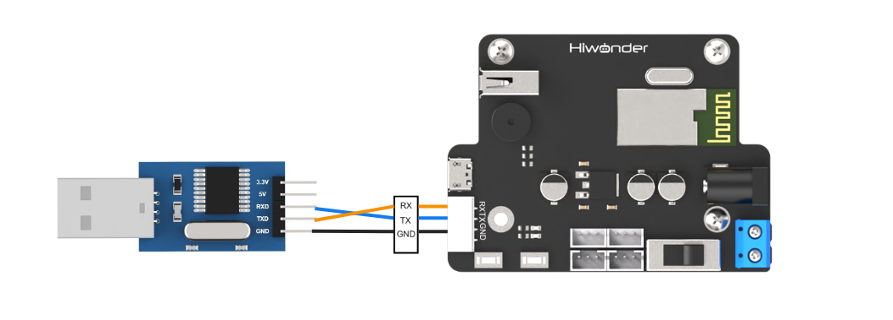

# 7. Serial Communication Course

## 7.1 Principles of Master-Slave Device Communication

This section provides a detailed overview of the master-slave relationship in xArm AI's communication with various devices, including STM32, 51 microcontrollers, Arduino, and Raspberry Pi. It explains how xArm AI functions as a slave device and how other devices act as masters to control it.

Throughout this chapter, xArm AI operates as a slave device, exchanging information with other devices via UART serial communication.

### 7.1.1 Master-Slave Relationship

In a master-slave control system, xArm AI operates as the slave device, while other microcontrollers, such as STM32 or Arduino, function as the master.

* **Functions of xArm AI as a Slave**

(1) Receiving and Parsing Signals from the Master

xArm AI listens for serial signals. When data is received via UART, it parses the data according to the communication protocol and executes the corresponding functions based on the received instructions.

(2) Executing Commands Based on Received Data

Once the signal is parsed, xArm AI performs the appropriate actions, such as executing motion sequences or controlling servos.

(3) Data Packaging and Response

When a read command is received, xArm AI retrieves the requested data, packages it according to the communication protocol, and transmits it back to the master device.

* **Other Devices as the Master**

(1) Command Packaging and Transmission

The master device must package control commands and data into a structured data packet according to the communication protocol before sending them to xArm AI.

(2) Control and Coordination

The master device is responsible for managing system-wide coordination, ensuring seamless communication and operation between xArm AI and other devices while avoiding conflicts.

(3) Data Reception

When retrieving xArm AI's status, the master device must receive the response after sending a read command. It should verify the integrity and accuracy of the received data, then parse the data packet to extract useful information.

### 7.1.2 Hardware Connection

Example: Connecting xArm AI to a PC
Connect the TXD, RXD, and GND pins of the USB adapter to the RX, TX, and GND pins on the controller using DuPont wires. Then, plug the USB adapter into the computer to establish the connection.

:::{Note}
The power supply for the master device and xArm AI can be different, but they must share a common ground to ensure stable communication levels.
:::

### 7.1.3 Data Transmission Format

The default UART serial data transmission format for xArm AI is:

| **Parameter** | **Value** |
| :-----------: | :-------: |
|   Baud rate   |   9600    |
|   Data bit    |     8     |
|  Parity bit   |   None    |
|   Stop bit    |     1     |

### 7.1.4 Communication Protocol

The command packet consists of the following fields:

| **Header** | **Data Length** | **Command** | **Parameters** |
| :--------: | :-------------: | :---------: | :------------: |
| 0x55 0x55  |     Length      |     Cmd     | Prm 1 ~ Prm N  |

(1) Header: Two consecutive bytes of 0x55 indicate the start of a data packet.

(2) Data Length: This field represents the total length of the packet excluding the header. It is calculated as:
**Length = Number of Parameters (N) + 2**
(The additional 2 bytes account for the command and the data length field itself.)

(3) Command: A byte that specifies the control operation to be executed.

(4) Parameters: Additional control information required by the command.

## 7.2 PC Serial Port Control

### 7.2.1 Implementation Principles

(1) After connecting xArm AI to a PC via a TTL serial interface for serial communication, xArm AI is controlled through the serial port, and its default UART data transmission format is:

| Baud rate  | 9600 |
| :--------: | :--: |
|  Data bit  |  8   |
| Parity bit | None |
|  Stop bit  |  1   |

Communication protocol:

Below, we explain the format of the protocol command packet. The format is as follows:

|  Header   | Data Length | Command |  Parameters   |
| :-------: | :---------: | :-----: | :-----------: |
| 0x55 0x55 |   Length    |   Cmd   | Prm 1 ~ Prm N |

Header: Two consecutive bytes of 0x55 indicate the start of a data packet.

Data Length: This field represents the total length of the packet excluding the header. It is calculated as:  

**Length = Number of Parameters (N) + 2**  

(The additional 2 bytes account for the command and the data length field itself.)

Command: A byte that specifies the control operation to be executed.

Parameters: Additional control information required by the command.

### 7.2.2 Preparation

* **Hardware Preparation**

Connect the TXD, RXD, and GND pins of the USB adapter to the RX, TX, and GND pins on the controller using DuPont wires. Then, plug the USB adapter into the computer to establish the connection.

:::{Note}

The power supply for the master device and xArm AI can be different, but they must share a common ground to ensure stable communication levels.

:::

* **Software Preparation**

(1) In the same directory as this document, locate the serial tool within the “[Serial Debug Assistant Tool]().”

(2) After launching the tool, ensure that the serial transmission settings are configured as follows:

**Baud rate:** 9600

**Parity:** NONE

**Data bits:** 8

**Stop bits:** 1

**Hexadecimal sending:** Enabled

The configuration should match the image shown below.

### 7.2.3 Function Realization

* **User-Initiated Data Transmission**

To control xArm AI, send the following protocol command:

(1) Command Name: CMD_SERVO_MOVE

Description: Controls the movement of one or more servos.

Command Value: 0x03

Parameters:

Parameter 1: Number of servos to control.

Parameter 2: Lower eight bits of the duration.

Parameter 3: Upper eight bits of the duration.

Parameter 4: Servo ID.

Parameter 5: Lower eight bits of the target angle.

Parameter 6: Upper eight bits of the target angle.

Additional Parameters: For each additional servo, use the same three-parameter format as Parameters 4–6.

Example: The hexadecimal command 55 55 08 03 01 E8 03 01 20 03 instructs servo number 1 to move to position 800 within 1000 ms.

(2) Command: CMD_ACTION_GROUP_RUN

Description: Executes an action group that has been previously downloaded to the control board.

Command Value: 0x06

Parameters:

Parameter 1: Action group number to run.

Parameter 2: Lower eight bits of the number of repetitions.

Parameter 3: Upper eight bits of the number of repetitions.

Note:Set the repetition count to 0 for continuous looping.

Example: The command 55 55 05 06 02 01 00 instructs the system to run action group 2 once.

(3) Command: CMD_ACTION_GROUP_STOP

Description: Stops the currently running action group.

Command Value: 0x07

Command Value: 0x07

Example: The command 55 55 02 07 stops the action group.

(4) Command: CMD_ACTION_GROUP_SPEED

Description : Adjusts the speed of an action group as a percentage. For instance, to run action group 1 at double its original speed, set the percentage value to 200 (i.e., 200%). If the action group number is 0xFF, the speed of all downloaded action groups will be adjusted.

Command Value: 0x0B

Parameters:

Parameter 1 : Action group number to adjust.

Parameter 2 : Lower eight bits of the speed percentage.

Parameter 3 : Upper eight bits of the speed percentage.

Example: The command 55 55 05 0B 08 32 00 sets action group 8 to operate at 50% speed.

(5) Command: CMD_GET_BATTERY_VOLTAGE

Description: Retrieves the control board’s battery voltage in millivolts (mV).

Command Value: 0x0F

Parameters: None

Response Parameters:

Parameter 1: Lower eight bits of the voltage.

Parameter 2: Upper eight bits of the voltage.

Example: Sending 55 55 02 0F will request the battery voltage. A typical response might be 55 55 04 0F 4C 1D, corresponding to 7500 mV.

(6) Command: CMD_MULT_SERVO_UNLOAD

Description: Disables power to multiple servos, effectively unloading their torque so that they can be moved manually.

Command Value: 0x14

Parameters:

Parameter 1: Number of servos to unload.

Parameter 2: Servo 1 ID.

Parameter 3: Servo 2 ID.

Parameter n: Servo n ID (for additional servos).

Example: The command 55 55 09 14 06 01 02 03 04 05 06 unloads the specified servos, allowing manual adjustment.

(7) Command: CMD_MULT_SERVO_POS_READ

Description:Reads the angular position values of multiple servos.

Command Value:0x15

Parameters:

Parameter 1: Number of servos to read.

Parameter 2: Servo 1 ID.

Parameter 3: Servo 2 ID.

Parameter n: Servo n ID (for additional servos).

Response Parameters:

Parameter 1: Number of servos read.

Parameter 2: Servo ID.

Parameter 3: Lower eight bits of the angle position.

Parameter 4: Upper eight bits of the angle position.

Additional Response Parameters: Follow the same format (Servo ID, lower eight bits, upper eight bits) for each subsequent servo.

Example: The command 55 55 09 14 06 01 02 03 04 05 06 is sent to read the positions of the specified servos.

* **Controller-Initiated Data Responses**

During operation, when the state of xArm AI changes, it proactively sends data to the user via the serial port.

(1) Command: CMD_ACTION_GROUP_RUN

Description: When the user sends a command to execute an action group, the controller immediately responds with a data packet identical to the one received.

Command Value: 0x06

Response Parameters:

Parameter 1: Action group ID

Parameter 2: Low byte of the number of executions

Parameter 3: High byte of the number of executions

Example: If the received command is 55 55 05 06 02 01 00, the controller will immediately send back 55 55 05 06 02 01 00.

(2) Command: CMD_ACTION_GROUP_STOP

Description: This response is sent when an actively running action group is forcibly stopped.

Command Value: 0x07

Response Parameters: None

Example: When an action group is stopped, the controller sends 55 55 02 07.

(3) Command: CMD_ACTION_GROUP_COMPLETE

Description: This response is sent when an action group completes its execution naturally.

Command Value: 0x08

Response Parameters:

Parameter 1: Action group ID

Parameter 2: Low byte of the number of executions

Parameter 3: High byte of the number of executions

Example: Once an action group finishes executing, the controller immediately sends 55 55 05 08 02 01 00.

